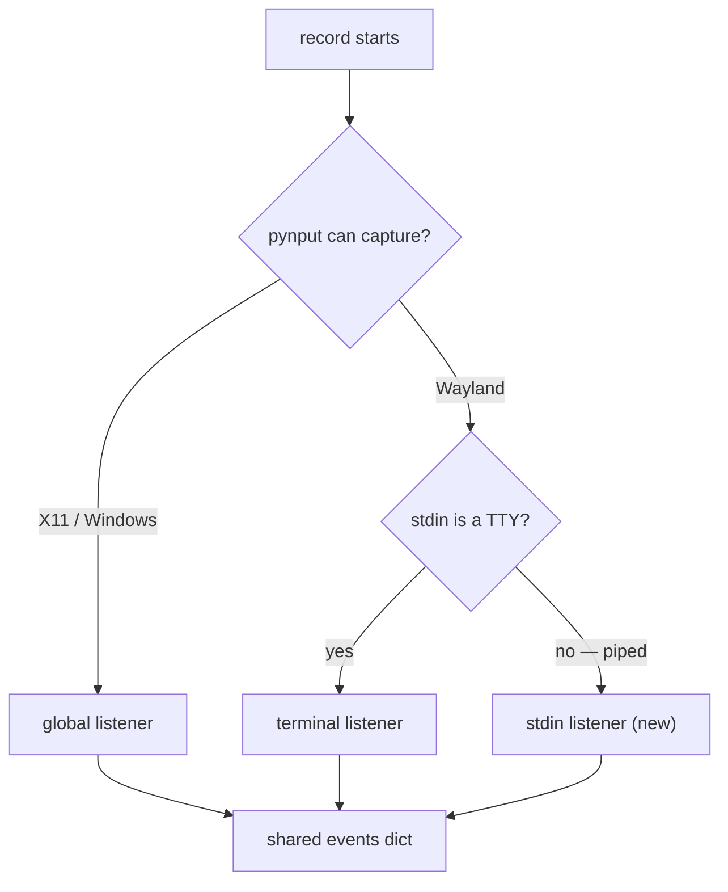

# Producing evidence

Structure and mechanics live in `SKILL.md` and `mechanics.md`. This is the
craft: what to draw, what to photograph, and how to get it.

## Diagrams

GitHub renders Mermaid inside a PR body from a ` ```mermaid ` fence. Prefer it
to a committed image: no hosting, no commit-pinning, no stale-cache problem,
and the source diffs when the design changes.

Pick the form from the question the reader is asking:

| Reader's question                                   | Form                            |
| --------------------------------------------------- | ------------------------------- |
| Which path does this take, and why three?           | `flowchart` with decision nodes |
| Who talks to whom, in what order, across processes? | `sequenceDiagram`               |
| What states can this be in, and what moves it?      | `stateDiagram-v2`               |
| What is the shape of this data / these modules?     | `flowchart` or `erDiagram`      |

A dispatch diagram earns its place when the alternative is three paragraphs of
"on X it does A, but on Y that fails, so it falls back to B":

````markdown

````

Rules that keep them readable:

- **Five to eight nodes.** Past that, split into two diagrams or cut detail.
- **Quote every label** (`A["text"]`). Unquoted labels break on parentheses,
  slashes, and colons — all common in module and flag names.
- **Mark what the PR adds** — `(new)` in the node text is enough. A diagram
  showing the whole system without saying which box you built makes the
  reviewer diff it mentally.
- **Do not draw the file tree.** That is the Files tab.

## Screenshots

**Crop to the component.** A raw screen grab includes whatever else was open —
editors, terminals, other browser tabs. Beyond being noisy, that leaks work
context into a public PR. Always crop, and look at the cropped result before
committing it.

**Upscale small crops.** A 350px-wide panel from a 1600x900 grab is unreadable
inline on GitHub. Resize 2x with LANCZOS.

**One state per shot, each under a heading that names it.** "Missing files,
repo not on the Hub — Download & Open disabled" tells the reviewer what to look
for; "screenshot 2" does not.

**Say how it was captured**, in one line, so a reviewer can reproduce it — and
if the evidence used synthesized fixtures rather than real data, say that too.
It tells them the shot is reproducible and that nothing of the user's was
touched.

### Capturing the GUI

`scripts/gui/screenshot_gui.py` wraps the whole sequence — start a GUI server,
drive it over CDP, capture with ffmpeg's x11grab:

```python
from screenshot_gui import GuiScreenshotSession

with GuiScreenshotSession(output_path=Path("shots/thing.png")) as s:
    s.eval("switchTab('run')")
    s.wait_until("document.getElementById('run-ctrl-next') !== null")
    s.eval("document.getElementById('run-ctrl-next').scrollIntoView({block:'center'})")
```

It captures via x11grab rather than CDP `captureScreenshot` on purpose: once a
cross-origin iframe attaches (MeshCat, embedded viewers), Chrome's debugger
auto-attaches to the new target and the parent socket wedges, so every later
CDP call times out. Reading the X server sidesteps it, at the cost of needing a
real display.

For smooth video, use Playwright's `record_video_dir` **with** the OOPIF-disable
flags; without them the recording stutters.

Commit the rendered artefact (PNG, GIF, transcript) under
`src/lerobot/gui/docs/shots/`. Do not commit the one-off capture script.

### Non-visual evidence

A change with no UI still owes proof. In rough order of preference: a captured
before/after transcript of the failing command; a rendered artefact the change
produces; a small throwaway dataset viewable in the GUI viewer. A table of
inputs to observed outputs beats a paragraph asserting the outputs.

## Anti-patterns

- A feature PR touching the UI with no image at all.
- A screenshot of a state produced by hand-injecting fixture state into the
  frontend, presented as though the backend produced it.
- One screenshot carrying six claims, none of them labelled.
- A diagram redrawing the module tree instead of explaining the decision.
- Images pinned to a branch rather than a commit — they silently keep serving
  the first version GitHub's proxy ever cached (see `mechanics.md`).
