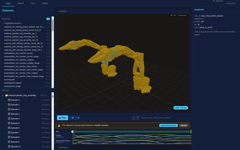
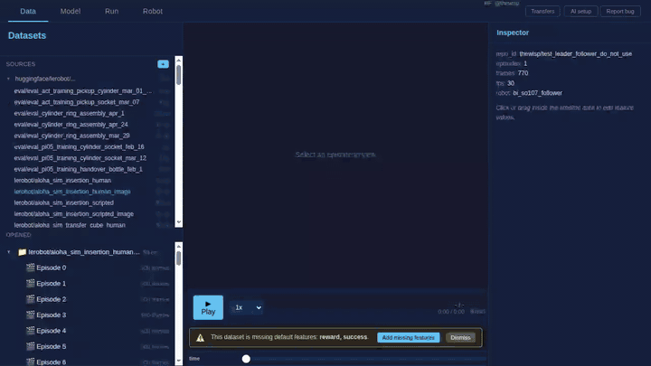
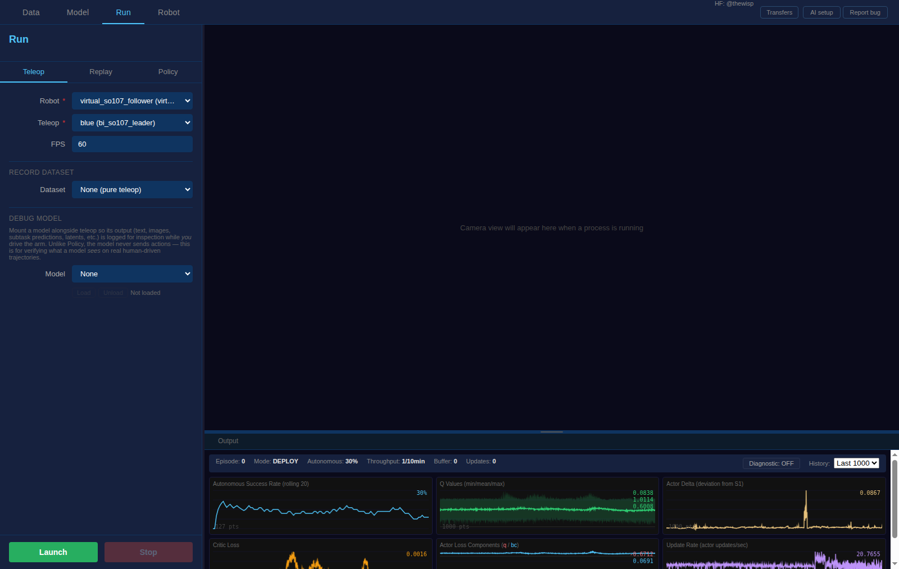
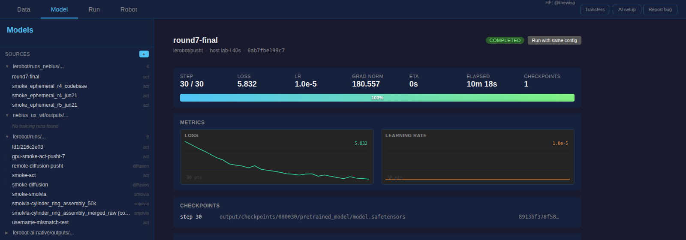

<p align="center">
  
</p>

<div align="center">

[](https://www.python.org/downloads/)
[](https://github.com/huggingface/lerobot/blob/main/LICENSE)
[](https://github.com/huggingface/lerobot)

</div>

<!-- <h3 align="center">Lerobot Studio</h3> -->

This repository tracks Hugging Face [LeRobot](https://github.com/huggingface/lerobot)
and adds three things on top of it:

1. **A browser GUI** for reviewing, editing, and recording robot datasets — and
   for launching training runs, including on ephemeral cloud GPUs.
2. **An MCP server** so any AI tool you already use (Claude Code, Codex, Cursor,
   Claude Desktop, …) can browse your datasets, leave durable comments, and drive
   the GUI — using _your_ AI subscription, no extra API key.
3. **New policies** — a hierarchical dual-system VLA (**HVLA**) and online RL
   fine-tuning via an **RL Token** (**RLT**).

Everything upstream LeRobot does — `LeRobotDataset`, the policy zoo, hardware
drivers, `lerobot-train` / `lerobot-record` / `lerobot-teleoperate` — still works
exactly as documented. This README focuses on what's _different_. For the core
library, see the [upstream documentation](https://huggingface.co/docs/lerobot/index).

<p align="center">
  
  <br/>
  <sub><i>▶ Features walkthrough</i></sub>
</p>

<p align="center">
  <i>📺 More walkthroughs:</i>
  <a href="https://media.githubusercontent.com/media/TheWisp/lerobot/d4cceff59d41dfa0d64621088d48cfdb55e60a0e/demo/assets/training_dashboard.mp4">live training dashboard</a>
</p>

---

## Key additions over upstream

| Area                         | What's new                                                                                                                                                                 | Where                                                                      |
| ---------------------------- | -------------------------------------------------------------------------------------------------------------------------------------------------------------------------- | -------------------------------------------------------------------------- |
| **GUI**                      | Browser tool to play / trim / delete / record dataset episodes, manage robot profiles, and launch training. LAN-discoverable via mDNS (`lerobot.local`).                   | [`src/lerobot/gui`](src/lerobot/gui/README.md)                             |
| **MCP / AI-native**          | Bring-your-own-AI-tool control over LeRobot via the Model Context Protocol. Scoped bearer tokens, a shared comment sidecar, and bridge tools that steer your open GUI tab. | [`src/lerobot/mcp`](src/lerobot/mcp/README.md)                             |
| **HVLA policy**              | Dual-system VLA: a slow VLM (S2) supplies scene understanding; a fast action policy (S1) generates action chunks conditioned on S2's latent.                               | [`src/lerobot/policies/hvla`](src/lerobot/policies/hvla/README.md)         |
| **RLT**                      | Online RL fine-tuning of a _frozen_ HVLA S1 policy using a lightweight TD3 actor-critic over a learned "RL token".                                                         | [`src/lerobot/policies/hvla/rlt`](src/lerobot/policies/hvla/rlt/README.md) |
| **Ephemeral cloud training** | Launch a training run on an auto-managed cloud GPU (Nebius) from the GUI; the VM is torn down on completion with a hard TTL backstop.                                      | [`src/lerobot/gui/training`](src/lerobot/gui/training)                     |

Also extended: higher-rate bimanual SO-107 teleop with predictive control, Quest VR
and scripted end-effector teleoperators, Cartesian IK, latency instrumentation, and a
broader policy set (`act_vlm`, `groot`, `sarm`, `wall_x`, `xvla`, `pi05`, …).

---

## Installation

This fork installs from source (it carries extra dependencies — GUI, MCP, cloud —
behind optional extras) and uses [`uv`](https://docs.astral.sh/uv/).

```bash
git clone https://github.com/TheWisp/lerobot.git
cd lerobot

uv sync --extra gui --extra mcp        # GUI + AI-native server
# add --extra nebius                    for ephemeral cloud training
# add --extra dataset                   for video decoding in the MCP tools
# uv sync --extra all                   for everything
```

Run any LeRobot command through `uv run` (e.g. `uv run lerobot-info`).

---

## The GUI

A browser-based tool for reviewing and editing robot training datasets, managing
robot/teleop profiles, and launching training.

```bash
uv run lerobot-gui --port 8000
```

Open <http://127.0.0.1:8000/>, enter a Hub repo ID (e.g. `lerobot/pusht`) or a
local dataset path, then:

- **Play** episodes across all cameras with timeline scrubbing
- **Trim** episodes to keep only the useful frames (→ save)
- **Label** episodes with tags or reward / quality columns
- **Record** new episodes by teleoperation
- **Train** policies locally or on cloud GPUs
- **Run** a trained policy on the robot

<p align="center">
  
</p>

### Open it from another device

Bind to the network and the GUI advertises itself over mDNS, so a laptop, tablet,
or phone on the same LAN can reach it without knowing the host's IP:

```bash
uv run lerobot-gui --host 0.0.0.0
```

```
LeRobot host service ready:
  mDNS (no IP needed): http://lerobot.local:8000/
  LAN:                 http://192.168.1.61:8000/
  Local:               http://localhost:8000/
```

> [!WARNING]
> Binding to the network has no authentication — anyone on the LAN with the URL
> can drive your robot. Fine for a lab/home network; not for untrusted WiFi.

Full details, keyboard shortcuts, and caveats: **[GUI README](src/lerobot/gui/README.md)**.

---

## AI-native control (MCP)

Connect the AI tool you already use to LeRobot via the
[Model Context Protocol](https://modelcontextprotocol.io). The AI browses your
datasets, leaves comments that survive across sessions and tools, and drives the
GUI tab you have open — all powered by **your** existing AI subscription. No
separate API key, no "LeRobot AI account".

The GUI process mounts the MCP endpoint automatically at `/mcp`, so one command
serves the GUI, the AI-setup page, and the MCP transport on a single port:

```bash
uv run lerobot-gui --host 0.0.0.0 --port 8000
```

Each user, on their own device, issues a scoped token from `lerobot.local/ai_setup`
and registers it with one line, e.g. for Claude Code:

```bash
claude mcp add lerobot \
  --transport http \
  --url http://lerobot.local:8000/mcp \
  --token sk-lr-XXXXXXXX
```

Then, from your AI tool:

> _"What lerobot datasets do I have? Show me the last frame of episodes 0–9 of
> `<dataset>`, tag the ones that look successful, and open the first failure in my
> GUI."_

Tokens carry one of four nested scopes — `read` ⊂ `comment` ⊂ `edit` ⊂ `operate`
— so you grant exactly as much authority (up to and including starting hardware
runs) as the situation warrants. The full tool surface, scope model, and design
rationale are in the **[MCP README](src/lerobot/mcp/README.md)**.

<p align="center">
  
</p>

---

## Policies

### HVLA — Hierarchical VLA

A dual-system VLA for bimanual control, inspired by
[Helix](https://www.figure.ai/news/helix),
[OpenHelix](https://arxiv.org/abs/2505.03912), and
[Dual Process VLA](https://arxiv.org/abs/2410.15549).

```
S2 (slow, ~4–15 Hz)            shared memory          S1 (fast, ~22–30 Hz)
 4 cams → SigLIP                ┌──────────┐           2–4 cams → DINOv2/ResNet
 task text → Gemma 2B  ──latent→│ [2048]   │←─ read ── state + latent + age
 mean-pool → [2048]             │ + age(s) │           → ACT / flow-matching
 (VLM, no action expert)        └──────────┘           → action chunk (14-DOF)
```

S2 (a VLM) provides scene understanding at low rate; S1 generates action chunks at
high rate conditioned on S2's latent plus a learned _age_ embedding that accounts
for how stale the latent is. S1 can also run standalone (`--zero-s2`).
See the **[HVLA README](src/lerobot/policies/hvla/README.md)**.

### RLT — RL Token for online fine-tuning

Online RL fine-tuning of a **frozen** HVLA S1 policy using a lightweight actor-critic,
based on [Xu et al., "RL Token"](https://pi.website/research/rlt). An RL-token encoder
compresses S1's observation context into a single bottleneck vector; a TD3 actor refines
S1's reference action chunk while a BC regularizer keeps it close to S1's output. Only
the actor and critic (~2M params) train. See the
**[RLT README](src/lerobot/policies/hvla/rlt/README.md)**.

<p align="center">
  
</p>

The full upstream policy zoo (ACT, Diffusion, π0 / π0.5, SmolVLA, TDMPC, VQ-BeT,
SAC, …) is intact under [`src/lerobot/policies`](src/lerobot/policies).

---

## Ephemeral cloud training

From the GUI's training tab you can launch a run on an auto-managed cloud GPU
(Nebius) instead of local hardware. The provider spins up a VM with the training
image, streams logs and live metrics to the dashboard, pulls the trained
checkpoint back to your machine, and tears the VM down when the run reaches a
terminal state — with a cloud-init `poweroff` timer as a hard-TTL backstop so a
forgotten run can't bill indefinitely. Credentials are a single server-held
service-account key, configured once via the Nebius-connection form. See
[`src/lerobot/gui/training`](src/lerobot/gui/training).

<p align="center">
  
  <br>
  <sub><i>A cloud run's dashboard — live metrics and the retrieved checkpoint, after the VM is gone.</i></sub>
</p>

---

## Relationship to upstream

This is a fork of [huggingface/lerobot](https://github.com/huggingface/lerobot)
and periodically tracks it. The core library — dataset format, training/eval
scripts, policy base classes, hardware abstraction — is upstream's; the GUI, MCP
server, HVLA/RLT policies, and cloud-training path are additions here. For
installing the base library, the dataset format, and the standard tutorials,
follow the [upstream docs](https://huggingface.co/docs/lerobot/index).

## Citation

This fork builds directly on Hugging Face LeRobot — please cite the upstream
project:

```bibtex
@misc{cadene2024lerobot,
    author = {Cadene, Remi and Alibert, Simon and Soare, Alexander and Gallouedec, Quentin and Zouitine, Adil and Palma, Steven and Kooijmans, Pepijn and Aractingi, Michel and Shukor, Mustafa and Aubakirova, Dana and Russi, Martino and Capuano, Francesco and Pascal, Caroline and Choghari, Jade and Moss, Jess and Wolf, Thomas},
    title = {LeRobot: State-of-the-art Machine Learning for Real-World Robotics in Pytorch},
    howpublished = "\url{https://github.com/huggingface/lerobot}",
    year = {2024}
}
```

<details>
<summary><b>ICLR 2026 Paper</b></summary>

```bibtex
@inproceedings{cadenelerobot,
  title={LeRobot: An Open-Source Library for End-to-End Robot Learning},
  author={Cadene, Remi and Alibert, Simon and Capuano, Francesco and Aractingi, Michel and Zouitine, Adil and Kooijmans, Pepijn and Choghari, Jade and Russi, Martino and Pascal, Caroline and Palma, Steven and Shukor, Mustafa and Moss, Jess and Soare, Alexander and Aubakirova, Dana and Lhoest, Quentin and Gallou\'edec, Quentin and Wolf, Thomas},
  booktitle={The Fourteenth International Conference on Learning Representations},
  year={2026},
  url={https://arxiv.org/abs/2602.22818}
}
```

</details>

The HVLA and RLT policies draw on Helix / OpenHelix / Dual-Process VLA and
[Xu et al., "RL Token"](https://pi.website/research/rlt) respectively — see each
policy's README for the specific references.

## Contribute

Contributions to the upstream library are welcome via
[huggingface/lerobot](https://github.com/huggingface/lerobot); see its
[CONTRIBUTING.md](https://github.com/huggingface/lerobot/blob/main/CONTRIBUTING.md).
For the additions in this fork (GUI, MCP, HVLA/RLT), the relevant READMEs above
include contributor notes — the MCP README in particular documents how to add a
new tool, scope it, and prove it works.

<div align="center">
<sub>Core library built by the <a href="https://huggingface.co/lerobot">LeRobot</a> team at <a href="https://huggingface.co">Hugging Face</a> with ❤️</sub>
</div>
