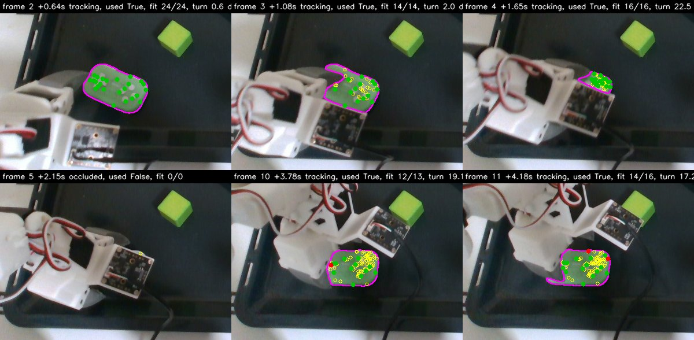
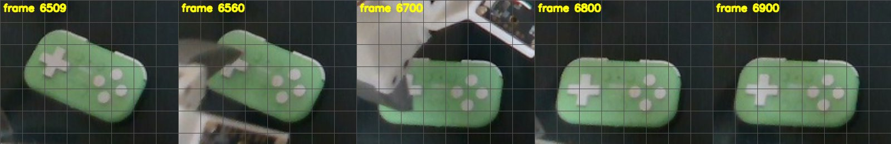
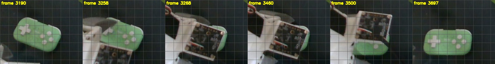

<!-- Captured evidence for one change: what was observed, not what was designed.
     Design documents live beside the code they describe. -->

# Evidence: how the act's views of a covered object went wrong, and a rule that tells

Captured 2026-10-09 on `proto/show-and-servo` at `c2f8bedd4`. Rig: SO-107 left arm (`white_left`), RealSense
`152222071508` at 848x480, demo `pick_place` (stack the gamepad on the cube). Five acts, from their own recordings
under `~/.cache/huggingface/lerobot/demos/pick_place/acts/`:

| Act               | Groups view during the act | Result                                               |
| ----------------- | -------------------------- | ---------------------------------------------------- |
| `20261008_202326` | not running                | stacked                                              |
| `20261008_205446` | not running                | stacked                                              |
| `20261009_183745` | running, no objects        | grasp missed                                         |
| `20261009_203511` | running, objects outlined  | grasp refused: "grasp would go 9 mm below the table" |
| `20261009_211100` | finished by the new switch | stacked                                              |

## How each number was taken

Every tracker view an act recorded (`frames/NNNNNN.npz`) holds `transported`: the pre-grasp target that view
implies, as a pose in the arm's base frame. It is comparable across the act's re-find of the object. While nothing
has touched the object, every view should imply the target the act started from; the difference is the view's error.
"Untouched until" is the moment the gripper first reached the object, read from the act's steps and the arm's log.

The predicted error of a view is computed from its own fit points alone: their pixels (`fit_uv`, inliers) lifted to
3D with the frame's depth, the least-squares rigid fit's covariance for unit noise on each point
(`inv(sum J_i^T J_i)`, `J_i = [-[q_i]x | I]`, `q_i` the point less the points' centroid), carried to the object's
middle (the first frame's mask and depth). It is millimetres of error at the middle per millimetre of noise on the
points.

## 1. A view of a covered gamepad can be far off and still be followed

18:37, the view the grasp was planned from (1.65 s): the wrist camera board covers all but a corner; the 16 fit
points (green) sit in that corner.

| t (s) | step                         | tracks | matches | fit points | spread of fit points, mm | target off        |
| ----- | ---------------------------- | ------ | ------- | ---------- | ------------------------ | ----------------- |
| -1.22 | pre-grasp 1                  | 25     | 25      | 25         | 22.3 x 8.6 x 2.1         | 0.0 mm, 0.0 deg   |
| 0.64  | pre-grasp 1                  | 25     | 24      | 24         | 21.7 x 8.7 x 1.8         | 0.3 mm, 0.4 deg   |
| 1.08  | pre-grasp 2                  | 50     | 39      | 14         | 13.5 x 10.5 x 2.1        | 1.2 mm, 1.3 deg   |
| 1.65  | measuring how the demo holds | 75     | 42      | 16         | 6.9 x 6.0 x 0.9          | 29.8 mm, 21.9 deg |

The grasp was planned from the 1.65 s view (the plan's pre-grasp lies 0.4 mm from that view's): 18 mm higher and
tilted about 21 degrees against the target the arm had walked to. The tilted fingers turned the gamepad and closed on
nothing; before the act (left two) and after the grasp (right three):

20:35, while the arm waited over the gamepad (untouched until 12.9 s):

| t (s) | step                                 | fit points | spread, mm       | target off        |
| ----- | ------------------------------------ | ---------- | ---------------- | ----------------- |
| -0.00 | pre-grasp 2                          | 25         | 19.7 x 8.5 x 1.8 | 0.0 mm, 0.0 deg   |
| 6.56  | measuring how the demo holds         | 12         | 8.5 x 2.3 x 0.9  | 13.2 mm, 13.8 deg |
| 10.66 | measuring how the demo holds         | 16         | 9.1 x 3.8 x 1.5  | 11.1 mm, 15.9 deg |
| 11.83 | measuring how the demo holds         | 16         | 9.0 x 2.3 x 1.2  | 13.0 mm, 13.8 deg |
| 12.34 | measuring how the demo holds         | 35         | 10.8 x 4.3 x 1.1 | 11.3 mm, 16.8 deg |
| 12.83 | waiting for the object to hold still | 34         | 10.6 x 4.2 x 1.2 | 7.6 mm, 20.4 deg  |

Every one of these views was followed.

Partly covered views can also be good. Two that were within 2 mm, with the share of the tracker's tracks each saw:

| Act               | t (s) | tracks | matches | share seen | fit points | target off      |
| ----------------- | ----- | ------ | ------- | ---------- | ---------- | --------------- |
| `20261009_183745` | 1.08  | 50     | 39      | 78%        | 14         | 1.2 mm, 1.3 deg |
| `20261008_205446` | 1.54  | 50     | 41      | 82%        | 13         | 1.6 mm, 3.4 deg |

The tracker seeds new tracks as an act goes on: the 20:35 act went from 25 to 124.

## 2. Following them moved the arm into the gamepad

20:35, the arm's tip over the act (`arm.npz`, `tip_obs`):

| Stretch     | What the act did                         | Tip travelled | Lowest tip z |
| ----------- | ---------------------------------------- | ------------- | ------------ |
| 2.5-12.9 s  | measuring how the demo holds the gamepad | 0.0 mm        | -11.2 mm     |
| 12.9-15.5 s | waiting for the object to hold still     | 70.5 mm       | -16.1 mm     |

The 50 targets the wait gave the arm spread 57.5 x 20.3 x 136.1 mm. Before the act (frame 3190) and after the arm
parked (3697), with the wait in between; no grasp was made:

## 3. A view's own fit points say whether it can place the object

Every view of an untouched gamepad in the five acts, sorted by its predicted error:

| Act               | t (s)                     | fit points | predicted error per mm of noise | target off              |
| ----------------- | ------------------------- | ---------- | ------------------------------- | ----------------------- |
| all five          | 21 views before any cover | 23-25      | 0.35-0.38                       | 0.0-1.9 mm, 0.0-1.6 deg |
| `20261008_202326` | 2.04                      | 20         | 0.40                            | 3.8 mm, 2.0 deg         |
| `20261008_205446` | 1.13                      | 20         | 0.43                            | 2.0 mm, 1.8 deg         |
| `20261009_183745` | 1.08                      | 14         | 0.60                            | 1.2 mm, 1.3 deg         |
| `20261008_202326` | 2.31                      | 12         | 0.63                            | 4.9 mm, 2.4 deg         |
| `20261008_205446` | 1.54                      | 13         | 0.78                            | 1.6 mm, 3.4 deg         |
| `20261009_203511` | 12.34                     | 35         | 1.20                            | 11.3 mm, 16.8 deg       |
| `20261008_205446` | 2.23                      | 16         | 1.22                            | 1.5 mm, 3.4 deg         |
| `20261009_203511` | 12.83                     | 34         | 1.25                            | 7.6 mm, 20.4 deg        |
| `20261008_205446` | 2.00                      | 16         | 1.28                            | 9.2 mm, 5.0 deg         |
| `20261009_183745` | 1.65                      | 16         | 1.34                            | 29.8 mm, 21.9 deg       |
| `20261008_205446` | 1.76                      | 15         | 1.36                            | 9.8 mm, 11.4 deg        |
| `20261008_202326` | 2.58                      | 14         | 1.46                            | 6.3 mm, 2.9 deg         |
| `20261009_203511` | 10.66                     | 16         | 2.14                            | 11.1 mm, 15.9 deg       |
| `20261009_203511` | 11.83                     | 16         | 3.05                            | 13.0 mm, 13.8 deg       |
| `20261009_203511` | 6.56                      | 12         | 3.85                            | 13.2 mm, 13.8 deg       |
| `20261009_203511` | 11.14                     | 13         | 4.44                            | 3.1 mm, 2.0 deg         |

Up to 0.78 every view was within 4.9 mm and 3.4 degrees; from 1.20 all but two were 6.3 to 29.8 mm and 2.9 to 21.9
degrees off. Of the two, the 11.14 s view is the first after the act's re-find, which placed the object by another
method; the 2.23 s view was close by chance. The fit points' count does not separate them: the 12.34 s view had 35.

The narrower in-plane spread of the fit points separates the same views, in a narrow window: every view 5 degrees or
more off had at most 6.0 mm; the partly covered views within 4 mm and 3.4 degrees had 7.0 mm or more; a fully seen
gamepad has 8.4 to 11.0 mm, so a threshold of 9 mm rejects even full views. The threshold would also move with the
object's size; the predicted error carries the size, and the lever to the middle, in itself.

## 4. Replaying the rule over the five acts

The rule: a view replaces the object's pose only when its predicted error is at most 1.0 per mm of noise (inside the
0.78-1.20 gap above); otherwise the pose holds. Against what the act did, which followed every view it trusted:

| Act               | Worst target error while untouched, act | same, with the rule | Grasp planned from, act | same, with the rule | Arm target while waiting, act | with the rule |
| ----------------- | --------------------------------------- | ------------------- | ----------------------- | ------------------- | ----------------------------- | ------------- |
| `20261009_183745` | 29.8 mm, 21.9 deg                       | 1.2 mm, 1.3 deg     | 29.8 mm, 21.9 deg off   | 1.2 mm, 1.3 deg off | (no wait)                     |               |
| `20261009_203511` | 13.2 mm, 13.8 deg                       | 0.0 mm, 0.0 deg     | 12.0 mm, 32.9 deg off   | 0.0 mm, 0.0 deg off | moved 57.5 x 20.3 x 136.1 mm  | held still    |
| `20261009_211100` | 1.2 mm, 1.3 deg                         | 1.2 mm, 1.3 deg     | 1.0 mm, 1.2 deg off     | the same view       | (no wait)                     |               |
| `20261008_205446` | 9.8 mm, 11.4 deg                        | 2.0 mm, 1.8 deg     |                         |                     | moved 5.0 x 0.9 x 4.2 mm      | held still    |
| `20261008_202326` | 6.3 mm, 2.9 deg                         | 4.9 mm, 2.4 deg     |                         |                     | (no wait)                     |               |

In `20261008_202326` the rule takes the 2.31 s view, predicted 0.63, which was 4.9 mm off: above the act's 3 mm reach
tolerance. Where the threshold falls depends on the noise on the points, which is not measured here.

The same replay with the spread rule at 6.1 mm or 7.0 mm gives the same table except in `20261008_202326`, where it
also turns the 2.31 s view away (worst 3.8 mm, 2.0 deg); at 9.0 mm no view of the 20:35 act passes.

## 5. The groups view and the act's tracker

| Act               | Groups view | Median time between tracker views | Tracker time per view |
| ----------------- | ----------- | --------------------------------- | --------------------- |
| `20261008_202326` | off         | 0.20 s                            | 147 ms                |
| `20261008_205446` | off         | 0.18 s                            | 161 ms                |
| `20261009_183745` | on          | 0.40 s                            | 223 ms                |
| `20261009_203511` | on          | 0.48 s                            | 278 ms                |
| `20261009_211100` | off         | 0.20 s                            | 154 ms                |

In the 21:11 act the tracker reported the gamepad occluded at the first view after the wrist covered it, and the
grasp was planned from the view before (1.0 mm, 1.2 deg off).

## 6. The demo's cube pose

The demo's object tracks (`objects.npz`) are exactly the identity at each object's click frame (gamepad frame 0,
cube frame 57). The act reads the cube's demo pose at 13.0 s (frame 294) because the demo marks a pose there. At
frame 294 the cube's track differs from its click frame by 5.8 degrees: a 5.2 degree tilt of its vertical and a 2.4
degree turn about it, with its centre 1.1 mm away. Over every frame the cube was seen before the carried gamepad came
over it (0-14.1 s) the tilt's median is 4.7 degrees. A replay of the demo recording through the point groups
(`benchmarks/group_live.py`, the gamepad and the cube clicked on the first frame) puts the cube at frame 294 0.6
degrees of tilt from frame 0.

The same replay, for the gamepad: its own points were hidden from frame 200 (8.8 s) for 291 frames, through the grasp
and the carry. For 277 of those frames the group that carried it was the tray's, for the other 14 a group that lived
only briefly. When its points were seen again after the place, they put it 85.0 mm from where its group had carried
it.

## 7. Views that place a still cube still jump its pose

Taken 2026-10-10 on `proto/show-and-servo` at `325aced6a`, from two acts whose cube nothing moved before the place:
`20261010_005521` (00:55) and `20261010_092029` (09:20, the operator's). Each act records every frame of the cube's
track (`target_track` in `act.json`); the frames trusted under the rule are the views that replaced the act's pose of
the cube. For each such view against the one before, the motion between them (newer times the inverse of older,
camera frame) is applied to the cube's middle (the point groups' pose of it at their first frame, the median of its
mask) and to a point 45 mm above it along the table's normal (where the place's fingertip is, the held gamepad's
height).

| Act               | Views that re-pinned it | Jump at its middle, mm       | 45 mm above it, mm           | Turn, degrees                |
| ----------------- | ----------------------- | ---------------------------- | ---------------------------- | ---------------------------- |
| `20261010_005521` | 39                      | median 0.2, p90 0.4, max 0.5 | median 1.1, p90 2.4, max 3.4 | median 1.4, p90 3.3, max 4.3 |
| `20261010_092029` | 42                      | median 0.3, p90 0.4, max 0.6 | median 1.3, p90 2.4, max 3.9 | median 1.7, p90 3.2, max 4.6 |

The rule pins the middle (half a millimetre at most); the turn it leaves free reaches the fingertip.

## 8. Steady poses held a run of turned views, and the carry refused a place in reach

Taken 2026-10-10 on `proto/show-and-servo` at `02feb5fb0`, from act `20261010_111545` (11:15; steady poses and the
point groups on), which stopped after its grasp: "place is out of reach as the object lies now (5 mm short)". Its
carry planning was replayed offline: the act's own `_plan_act` with the `white_left` arm's kinematics narrowed to its
servos' calibrated ranges (`calibration/robots/so107_follower/white_left.json`) as the jog builds them, the jog's
workspace box, from the joints the arm stood at after the grasp (the last sample of `arm.npz`), at the landing turn
the act's start had taken (350°), on the cube as each view of its track that the rule trusted had it
(`target_track`). Steady poses were replayed with `core.steady_pin` on the same views, carried by the point groups'
frames of the cube (`groups.frames.cube`); the cube's points were its surface on the demo's frame of it, since the
record kept no key points of the tracker's. "Turned" is the view's turn from the act's find, base frame.

| The cube as                                                                 | Views | Turned              | The carry at 350°                          |
| --------------------------------------------------------------------------- | ----- | ------------------- | ------------------------------------------ |
| the act's find                                                              | 1     | 0                   | plans, the place within 0.5 mm             |
| views at +8.8 to +12.5 s and +15.5 to +16.7 s                               | 31    | 2.6-7.6°, mostly y  | 30 plan (0.3-2.5 mm); one 3.9 mm short     |
| views at +12.7 to +15.3 s: the grasp lifting, the track grown from 25 to 50 | 19    | 5.0-12.2°, mostly x | all refused, 4-35 mm short                 |
| the steady pose: all 50 views joined one pin                                | -     | 5.6° at the end     | refused from +13.9 s on, 5.4 mm at the end |

The act planned its carry after +16.35 s, when its step became "checking the grasp": on the steady pose, 5.4 mm short,
the act's "5 mm". The newest view then planned within 0.5 mm. Ranked again over every turn from the same joints, the
steady pose at the end plans at 0° (48 turns reach), and the turned views at +12.7, +13.6, +15.2 and +15.3 s plan at
35°, 30°, 0° and 5°.
