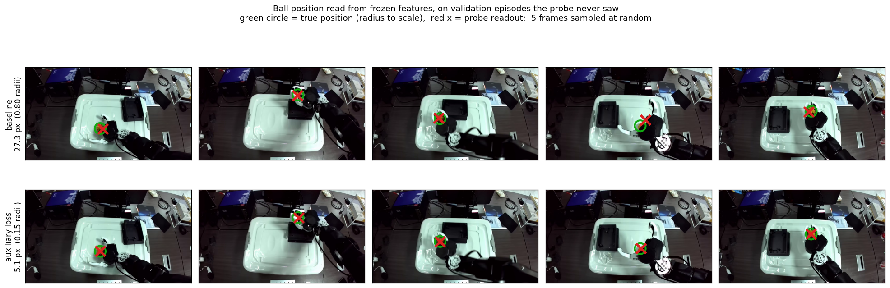

# What the auxiliary loss did to the representation

A linear probe over frozen patch features, reading the ball's position out of
each checkpoint. Green marks the true position from the saved mask, drawn at
the ball's real radius; the red cross is the probe's readout.

| checkpoint               | held-out error | in ball radii | vs guessing the mean |
| ------------------------ | -------------- | ------------- | -------------------- |
| baseline `37f6ba8aef48`  | 27.3 px        | 0.80          | 84%                  |
| auxiliary `cfe6190b3146` | 5.1 px         | 0.15          | 97%                  |

Guessing the training mean scores 169.6 px. The ball's radius is ~34 px at
1280 wide.

## Protocol, because the number depends on it

Fit on 1037 frames drawn from training episodes, read out on 179 frames from
the 36 validation episodes. **The split is by episode** — no frame from a
validation episode appears in the fit. The backbone and projection are frozen;
only the probe trains, with weight decay and early stopping on a split carved
out of the training episodes. Identical frames, steps and seed for both
checkpoints, so the only difference is the representation.

An earlier measurement of the same baseline reported 132.5 px. That probe was
fitted on 45 densely-sampled episodes, so it was the PROBE that generalised
badly, not the representation that was worse. Episode diversity in the probe's
own training set moves this number by 5x, which is worth knowing before
quoting it: a probe result characterises a representation only as far as the
probe itself generalises.

## What it does and does not show

The baseline already locates the ball to within one radius. It is not blind to
the object, and any claim that the auxiliary loss taught it something it had no
access to is wrong. What the auxiliary loss did is sharpen an existing signal
by about 5x, and remove the train/held-out gap that every other measurement of
this policy shows.

It says nothing about whether the action head uses the sharper signal. On the
rig the same checkpoint had the best horizontal grasp error of the variants
tried and still missed, by hovering above the ball — the auxiliary supervised
(x, y) in a top-down view, which carries no height information.
