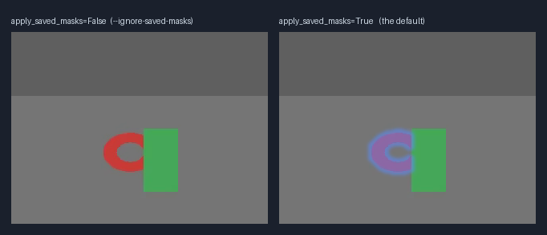
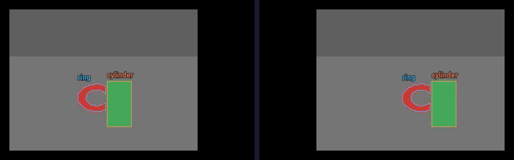
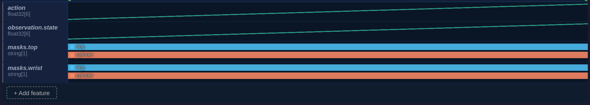
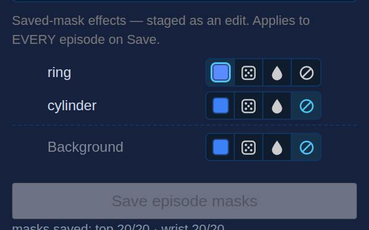
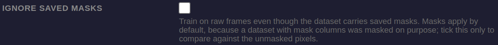

# Saved masks — captured states

Every shot below was taken from a running GUI against this branch's source,
driven through the frontend's own entry points.

## The dataset behind these shots

Masking **writes** to a dataset, so none of the real recordings could be used:
these come from a synthetic two-episode dataset created for the purpose. Its
frames are a grey table carrying a red ring and a green cylinder; the segmenter
is a colour key rather than SAM3, which makes the masks land exactly on the
drawn objects and keeps the capture reproducible without a GPU. Everything
after segmentation — the storage format, the compositing, the panel, the
training flag — is the real code path: the masks were written through
`generate_episode_masks`, the same function the Save button calls.

## What is stored

One `string` column per camera, holding COCO RLE, with the vocabulary and the
per-label treatments as feature metadata:

```json
"masks.top": {
  "dtype": "string", "shape": [1], "names": null,
  "mask_encoding": "coco_rle",
  "mask_size": [240, 320],
  "mask_labels": ["ring", "cylinder"],
  "mask_treatments": {
    "ring": {"key": "tint", "params": {"color": [90, 140, 255]}},
    "cylinder": {"key": "none"}
  },
  "mask_background": {"key": "none", "params": {}},
  "mask_model": "sam3_track", "mask_resolution": null, "mask_multi_instance": true
}
```

Note the key: the columns sit outside `observation.`, because
`dataset_to_policy_features` types every non-image `observation.*` feature as
policy STATE — a mask column there is declared a model input and then dropped
by the reader, so the checkpoint records an input the model never received.
Datasets written under the old name are refused rather than read as unmasked;
`datasets/mask_migrate.py` renames them, verified on a copy of a 1,777-frame
dataset from the rig.

## What it costs to store

Measured on the largest masked dataset on the training rig
(`0803_20260803_174402_labeling_merged_split_mask`): 274 episodes, 47,803
frames, two cameras, 13 labels between them. Column sizes are parquet's own
compressed column-chunk sizes, not string lengths.

|                                   | mask column | that camera's video | share     |
| --------------------------------- | ----------- | ------------------- | --------- |
| `right_wrist` (7 labels, 600x960) | 109.7 MiB   | 671 MiB             | 16.3%     |
| `top_l` (6 labels, 720x1280)      | 201.4 MiB   | 1,224 MiB           | 16.5%     |
| both                              | 311.2 MiB   | 1,895 MiB           | **16.4%** |

Per frame that is 6,825 B across the two columns, about **525 B per label per
frame**. The mask columns are **98.4%** of the parquet (316.1 MiB), so they
dominate the tabular data completely.

Note which video the share is against. Only two of this dataset's four cameras
are masked; against all 4,111 MiB of video the masks are 7.6%, but that number
is an artifact of the unmasked cameras and would not survive masking them. The
honest figure is the 16.4% above — the cost against the footage the masks
actually describe.

The cost is linear in labels × cameras × frames. Parquet's own codec gets only
1.6× on the RLE, because RLE is already a compressed form.

### Headroom, if it is ever needed

Two directions were measured on that dataset rather than assumed.

**Packing all labels into one label-indexed map is not a win here.** It is the
obvious idea — COCO panoptic and OME-NGFF `image-label` both do it — but on
this data it is _larger_, and lossy:

|               | per-label RLE, as stored | one deflated label map |       |
| ------------- | ------------------------ | ---------------------- | ----- |
| `right_wrist` | 4,320 B/frame            | 5,539 B/frame          | 0.78x |
| `top_l`       | 6,819 B/frame            | 8,814 B/frame          | 0.77x |

and the labels overlap, which a single label map cannot represent: 89 of 111
sampled `right_wrist` frames have overlapping labels, covering 32% of the
labelled pixels. "robot arm" over "white tray" is the normal case, not an
error.

**Storing at a lower resolution does work.** RLE length tracks boundary
length, so it halves with linear resolution, and the loss is boundary
precision on upsample:

|               | full res      | 1/2                         | 1/4                         |
| ------------- | ------------- | --------------------------- | --------------------------- |
| `right_wrist` | 4,234 B/frame | 2,074 B (2.04x), IoU 0.9868 | 1,014 B (4.18x), IoU 0.9738 |
| `top_l`       | 6,536 B/frame | 3,144 B (2.08x), IoU 0.9840 | 1,509 B (4.33x), IoU 0.9675 |

`mask_size` is already per-column, so storing at a reduced resolution needs no
format change — only a decision about what to write. It records whatever
resolution the producer ran at, which on this dataset equals each camera's
frame size; nothing writes anything smaller today.

## What the model is fed

The claim the rest of the branch exists for. Both panels come from
`LeRobotDataset` itself — the object a trainer iterates — read twice, once with
`apply_saved_masks=False` and once with the default:



The ring carries `tint` and is recoloured; the cylinder carries `none` and is
identical in both. The treatment is applied per label, not to the frame.

## Where the masks are, in the data view

Stored masks draw over the frame, per camera, labelled and coloured to match
their lanes:



Note that the ring is drawn raw here, not tinted, while the training composite
above shows it blue. That is correct for this branch: the frame endpoint serves
the stored pixels, and the mask layer draws the boundary over them. Serving a
composited still is part of the bandwidth-profile rewrite on
`feat/hvla-resize-integration` and arrives with it. Until then the data view
shows where a mask is, and `04-what-training-sees.png` is what shows the effect.

Each mask column gets one lane per object, beside the other features:



Lane colour is positional — the index in `mask_labels` — and comes from the
same palette the overlay uses, so a lane and the boundary drawn for that
object are the same colour. The colour carries no other meaning.

## Changing an effect

Treatments are edited in the Overlays panel. The note states the scope, because
the treatments are dataset metadata rather than an episode's:



Changing one does not write: it stages an edit. That is checked on disk rather
than inferred from the display. With a treatment moved from `none` to `blur`
and the edit pending:

```console
$ jq '.features["masks.top"].mask_treatments' meta/info.json
{"ring": {"key": "tint", "params": {"color": [90,140,255]}},
 "cylinder": {"key": "none"}}                      # unchanged

$ GET /api/edits
{"edits": [{"edit_type": "mask_treatments", "episode_index": -1,
            "params": {"treatments": {"ring": {"key": "tint", ...},
                                      "cylinder": {"key": "blur", "params": {}}}, ...}}]}
```

`episode_index: -1` because treatments are dataset-wide. `masks/status` reports
the _effective_ recipe — the stored one with pending edits applied — which is
why it answers `blur` while the file still says `none`.

## Training on raw frames instead

The default is to apply saved masks, because a dataset carrying mask columns
was masked on purpose. The escape hatch is offered in the training form, under
the advanced block:



## The schema gate

The first save on a dataset adds a dataset-wide feature, and is refused until
confirmed. The GUI renders this refusal as a native `window.confirm`, which the
screenshot tooling cannot photograph — so it is recorded here at the layer that
decides it:

```console
$ POST /api/process/episode-masks     # a dataset with no masks feature
{"detail": {"code": "adopt_masks_feature",
            "message": "Saving masks adds a dataset-wide feature (values are per frame).
                        Confirm to adopt it; afterwards saves only rewrite the episode in view.",
            "features": ["masks.top"], "labels": ["ring"]}}
HTTP 409

$ POST /api/process/episode-masks     # an episode that already has masks
{"detail": {"code": "masks_exist",
            "coverage": {"masks.top": 20}, "frames": 20,
            "message": "Episode 0 already has saved masks. Overwrite them with the
                        current settings?"}}
HTTP 409
```

Neither call wrote anything.

## Not captured

The live SAM3 overlay — seeding masks interactively, and the Save button
becoming eligible — needs the segmentation worker on a GPU. These captures use
a colour-key segmenter instead, so the seeding UI is not shown here. What
depends on it is the _production_ of masks; everything this branch adds is
downstream of that and is shown above.
