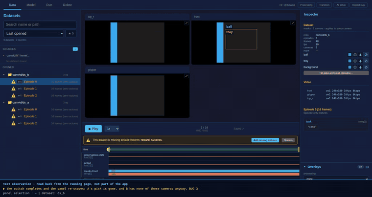

<!-- Captured evidence for a change. NOT a design document -- see
     src/lerobot/gui/docs/ for those. -->

# Evidence: a dataset switch re-scopes the overlay panel

Two datasets are open in the tree, each with three episodes. **A** has four
cameras and stores masks for `left_wrist` only; **B** is a different dataset
with three different cameras, masked on `front`. Two datasets that disagree
about their cameras are what makes "which one is the panel scoped to"
answerable from the picture.

Clicking an episode of **B** is how a dataset is switched in use. The switch
completes -- it used to throw out of the last statement of its handler, in
silence -- and the panel drops A's pick rather than carrying it into a dataset
that has none of those cameras. B's fill then goes out with `front`, B's own
masked camera. The strip along the bottom is instrumentation and says so on
screen; it ends by stating the page errors raised over the whole run, which is
zero.
