<!-- Captured evidence for one change: what was observed, not what was designed.
     Design documents live beside the code they describe. -->

# Evidence: the fill-gaps dialog offers every camera

## Every state the dialog can be in

The dialog's OK button and its camera note are a function of three things: how
many cameras the dataset declares, how many are still ticked, and how many
labels are ticked. The time estimate depends on a fourth, whether the live
preview has measured a rate. One shot per state, with the state read back out
of the running page beside it.

The session behind the first five has the overlay panel narrowed to two of the
three cameras, so "every camera lit" is visibly not inherited from it. A dataset
that declares no cameras is not among these: it cannot carry a mask column, so
the pass is not offered for it at all.

| state                 | shot                                     | OK      | what it shows                                                                                                                                                                                                    |
| --------------------- | ---------------------------------------- | ------- | ---------------------------------------------------------------------------------------------------------------------------------------------------------------------------------------------------------------- |
| as it opens           | `states/1-as-it-opens.png`               | offered | every camera lit; the label seen in 2/2 episodes is ticked for you, the one seen in 0/2 is not                                                                                                                   |
| no label ticked       | `states/2-no-label-ticked.png`           | refused | "Tick at least one label" — the cameras are fine, the labels are not                                                                                                                                             |
| every camera unticked | `states/3-every-camera-unticked.png`     | refused | "pick at least one camera", in the warning colour, because it is the operator's to fix                                                                                                                           |
| narrowed              | `states/4-narrowed-and-expanded.png`     | offered | `top` kept, the other two dimmed — and that is what the job is given; **What it changes** opened, which is where the rules live                                                                                  |
| with a measured rate  | `states/5-with-a-measured-estimate.png`  | offered | the estimate replaces the explanation of why there is none                                                                                                                                                       |
| no masks stored yet   | `states/6-first-pass-from-the-panel.png` | offered | the other way in: no vocabulary to draw labels from, so they come from the panel, and both the button and the heading say **Segment** rather than fill — a column is what a camera needs before it can have gaps |

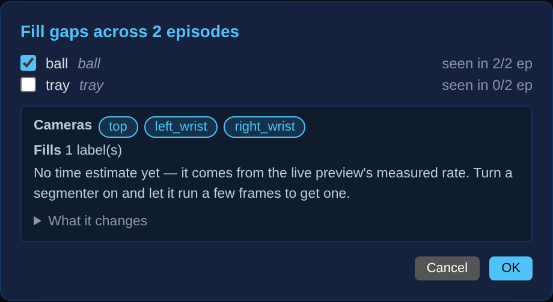

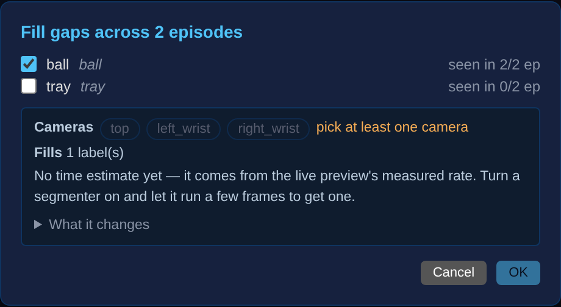

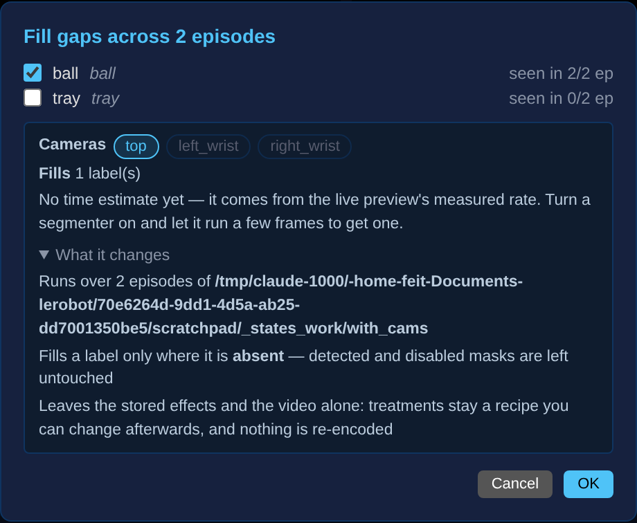

Printed by the run that took the first shot, showing the panel's narrower set is
not what the dialog offers:

```
PANEL:  ['observation.images.left_wrist', 'observation.images.right_wrist']
DIALOG: ['top', 'left_wrist', 'right_wrist']
```

## Narrowing, against a real server

Every row in the table below runs every camera, which cannot tell "the job ran
what the dialog showed" from "the job ran everything". This run unticks one
camera of four and leaves three, on a throwaway copy of a real dataset that
started with no masks at all.

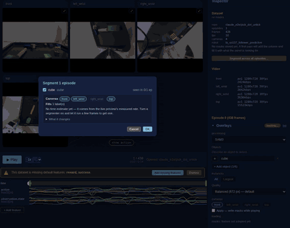

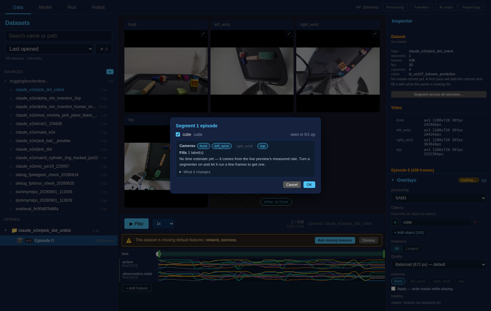

|                                 |                                                            |
| ------------------------------- | ---------------------------------------------------------- |
| dialog opened with              | `front`, `left_wrist`, `right_wrist`, `top` — all four lit |
| after unticking                 | lit `front`, `left_wrist`, `top`; dimmed `right_wrist`     |
| request carried                 | `front`, `left_wrist`, `top`                               |
| job                             | complete, 438/438 frames, coverage on those three          |
| mask columns on disk afterwards | `masks.front`, `masks.left_wrist`, `masks.top`             |
| `masks.right_wrist`             | **does not exist**                                         |

The last row is the point. The unticked camera did not get an empty column or a
column of "looked, found nothing" — it was never written at all, so the pass
provably did not run it.

## End to end, on real datasets

Seven datasets from this machine's cache, copied to a throwaway directory so the runs could write. Each row is one unattended drive of the real product against a live server running this branch plus #218 and #219 (#218 was a per-server shared-memory namespace when these ran and is now a one-server-per-host lock; neither shape touches the paths shown): real SAM3, real ffmpeg, the real dialog, the real job. Nothing is mocked and nothing is typed into the page by hand; every state in the table is read back from the page or the API by the run that recorded it.

Per dataset, in order:

1. **Transport.** SAM3 on, a label named, **Play pressed while the model is still loading**, the badge goes live, **Pause**, **Play** again (now the composited stream), **Pause**. "pause stops" means the playhead did not move after each Pause, the button read Play, and the transport's own invariant checks fired zero times.
2. **Fill gaps.** The dialog opens with **every camera of the dataset on** (including cameras that have no mask column yet), OK is pressed, the job runs to completion on the copy.
3. **After.** A fresh tab opens the episode, which now plays with the saved masks composited, and Pause stops it.

"masks before/after" are per-camera counts of frames carrying a mask, from `/masks/status`, read after the server's post-job dataset reload.

| dataset                                                                                                                                                       | episode 0 mask cells, before → after the fill                                                                                                                                                                                                                                 | transport                                                                                                                                                  | fill gaps                                                                                                                                                                                                     | after                                                                                                                 |
| ------------------------------------------------------------------------------------------------------------------------------------------------------------- | ----------------------------------------------------------------------------------------------------------------------------------------------------------------------------------------------------------------------------------------------------------------------------- | ---------------------------------------------------------------------------------------------------------------------------------------------------------- | ------------------------------------------------------------------------------------------------------------------------------------------------------------------------------------------------------------- | --------------------------------------------------------------------------------------------------------------------- |
| **`eval_smolvla_pick_place_black_king_jan_14`**<br>3 camera(s): top, left_wrist, right_wrist<br>1 episode(s), episode 0 = 662 frames<br>label **chess board** | before:<br>`top` 586 never written · 76 mask<br>`left_wrist` 586 never written · 76 mask<br>`right_wrist` no column<br>after:<br>`top` 662 mask<br>`left_wrist` 662 mask<br>`right_wrist` 662 mask                                                                            | badge at Play: _loading…_<br>Pause stops ✅ · 2nd Play streams ✅ · invariant violations 0 ✅<br>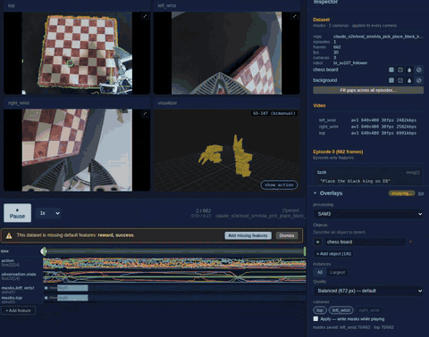 | every camera on ✅ · labels: chess board<br>job complete · 1/1 episodes<br>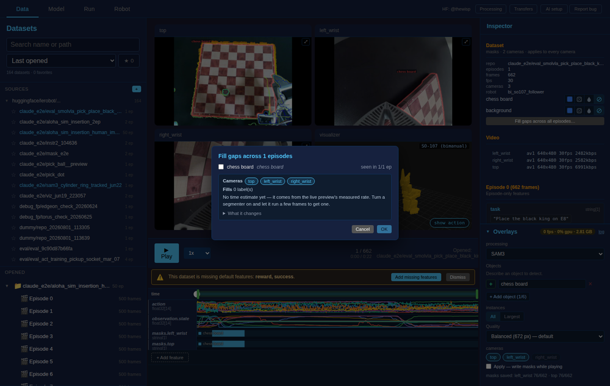<br>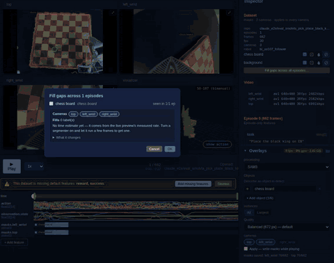 | saved masks composited ✅ · Pause ✅<br>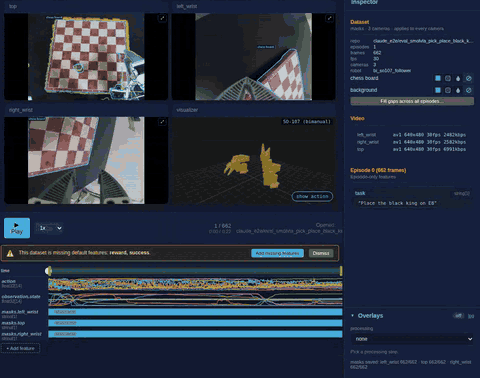                     |
| **`pick_dot`**<br>4 camera(s): front, left_wrist, right_wrist, top<br>1 episode(s), episode 0 = 438 frames<br>label **cube**                                  | before:<br>`front` no column<br>`left_wrist` no column<br>`right_wrist` no column<br>`top` no column<br>after:<br>`front` 438 mask<br>`left_wrist` 438 mask<br>`right_wrist` 437 mask · 1 looked, none<br>`top` 438 mask                                                      | badge at Play: _loading…_<br>Pause stops ✅ · 2nd Play streams ✅ · invariant violations 0 ✅<br>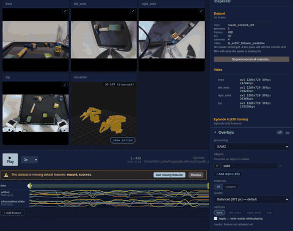                                  | every camera on ✅ · labels: cube<br>job complete · 1/1 episodes<br>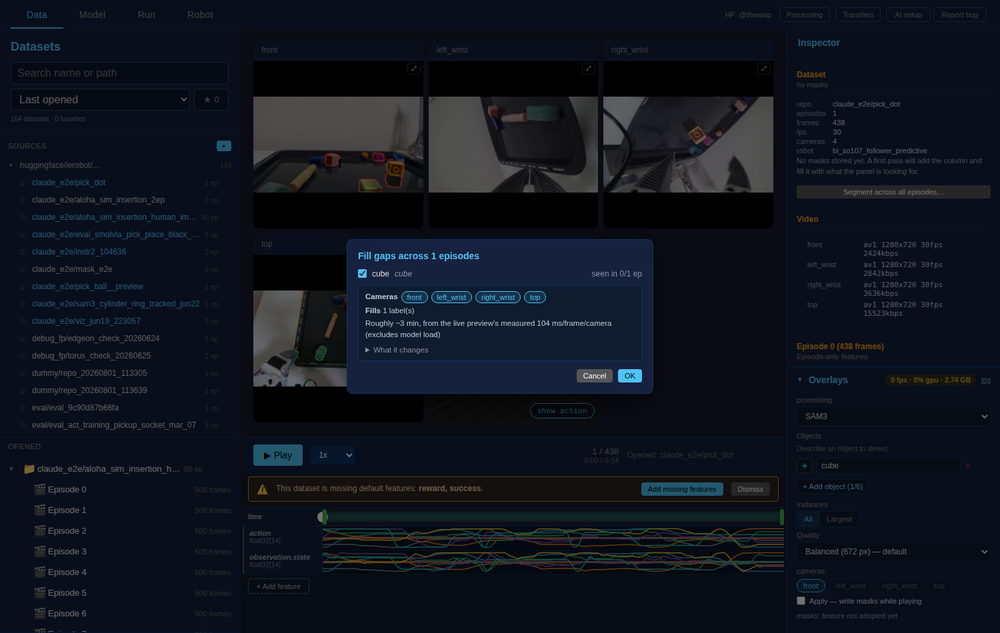<br>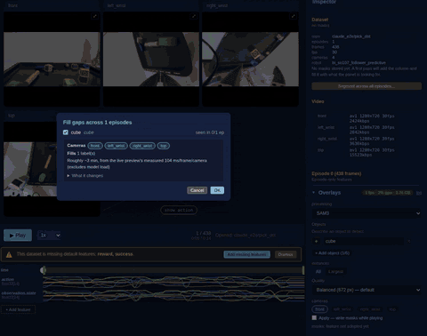                                                                          | saved masks composited ✅ · Pause ✅<br>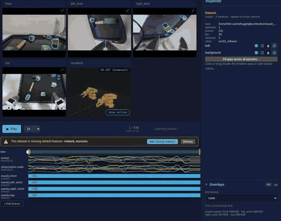                                                      |
| **`pick_ball__preview`**<br>2 camera(s): top, wrist<br>1 episode(s), episode 0 = 241 frames<br>label **ball**                                                 | before:<br>`top` no column<br>`wrist` no column<br>after:<br>`top` 241 mask<br>`wrist` 70 looked, none · 171 mask                                                                                                                                                             | badge at Play: _loading…_<br>Pause stops ✅ · 2nd Play streams ✅ · invariant violations 0 ✅<br>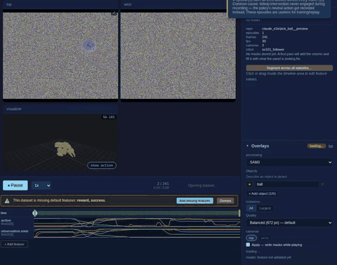                        | every camera on ✅ · labels: ball<br>job complete · 1/1 episodes<br>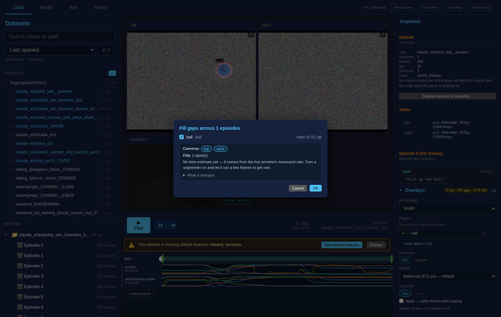<br>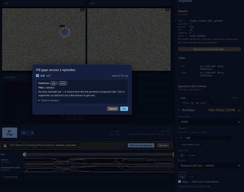                                                      | saved masks composited ✅ · Pause ✅<br>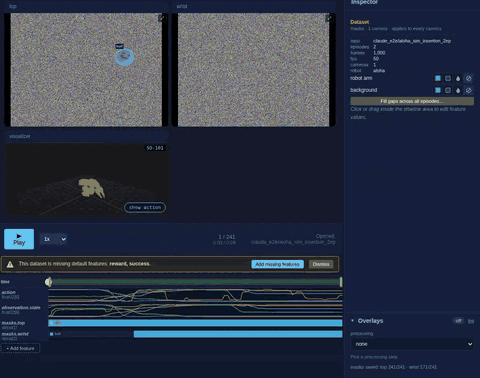                                            |
| **`aloha_sim_insertion_2ep`**<br>1 camera(s): top<br>2 episode(s), episode 0 = 500 frames<br>label **robot arm**                                              | before:<br>`top` no column<br>after:<br>`top` 500 mask                                                                                                                                                                                                                        | badge at Play: _off_<br>Pause stops ✅ · 2nd Play streams ✅ · invariant violations 0 ✅<br>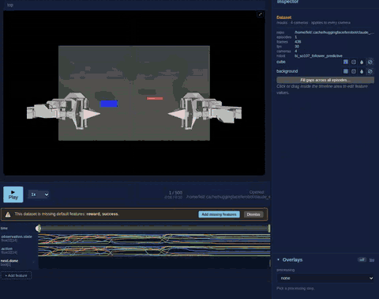                        | every camera on ✅ · labels: robot arm<br>job complete · 2/2 episodes<br>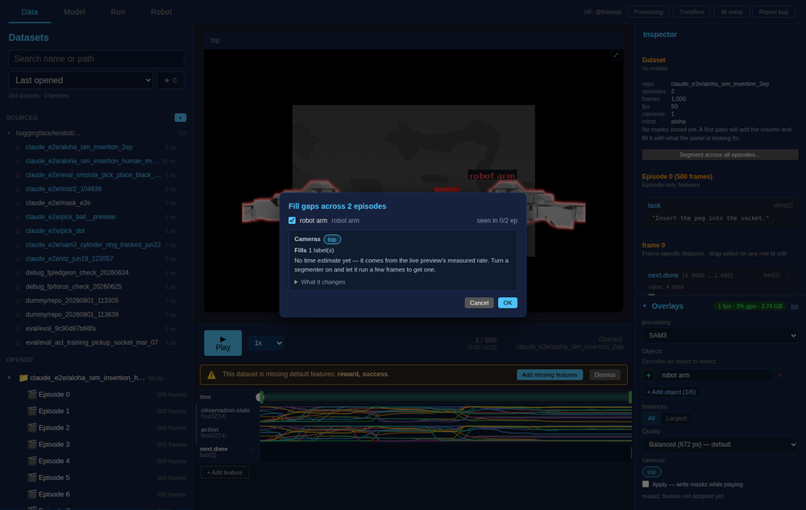<br>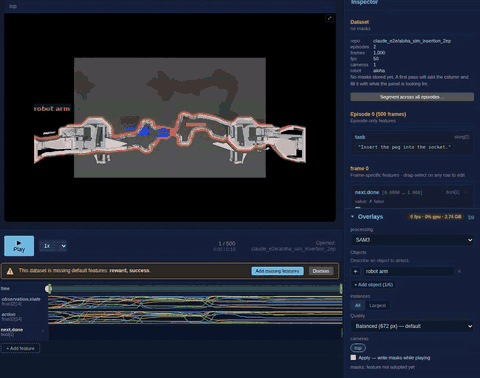                                       | saved masks composited ✅ · Pause ✅<br>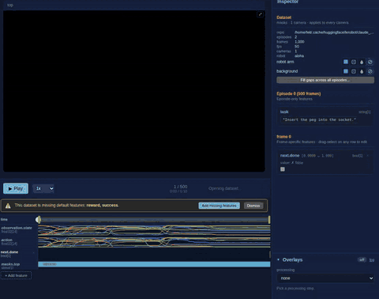                                       |
| **`instr2_104636`**<br>4 camera(s): front, left_wrist, right_wrist, top<br>2 episode(s), episode 0 = 374 frames<br>label **cube**                             | before:<br>`front` 374 mask<br>`left_wrist` 125 looked, none · 249 mask<br>`right_wrist` 293 mask · 81 looked, none<br>`top` 374 mask<br>after:<br>`front` 374 mask<br>`left_wrist` 125 looked, none · 249 mask<br>`right_wrist` 293 mask · 81 looked, none<br>`top` 374 mask | badge at Play: _loading…_<br>Pause stops ✅ · 2nd Play streams ✅ · invariant violations 0 ✅<br>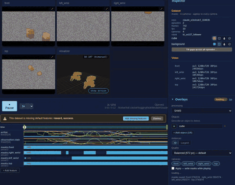                             | every camera on ✅ · labels: cube<br>job complete · 2/2 episodes<br>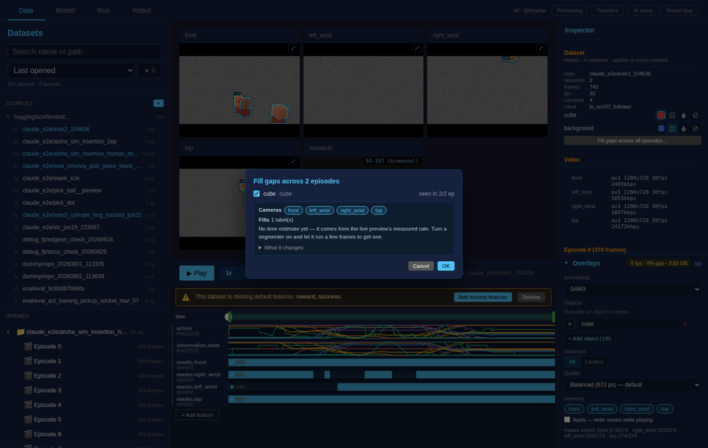<br>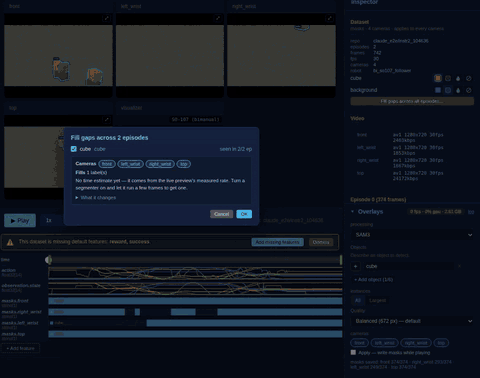                                                                | saved masks composited ✅ · Pause ✅<br>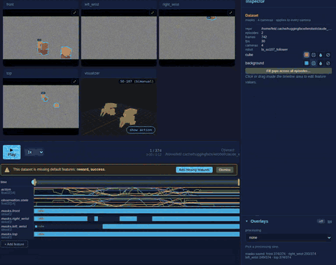                                                 |
| **`viz_jun19_223057`**<br>1 camera(s): view<br>2 episode(s), episode 0 = 100 frames<br>label **wooden dowel**                                                 | before:<br>`view` 100 looked, none<br>after:<br>`view` 100 looked, none                                                                                                                                                                                                       | badge at Play: _loading…_<br>Pause stops ✅ · 2nd Play streams ✅ · invariant violations 0 ✅<br>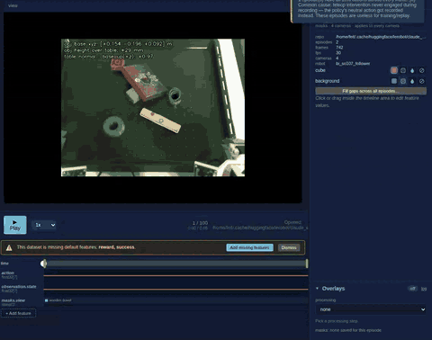                          | every camera on ✅ · labels: wooden dowel<br>job complete · 2/2 episodes<br>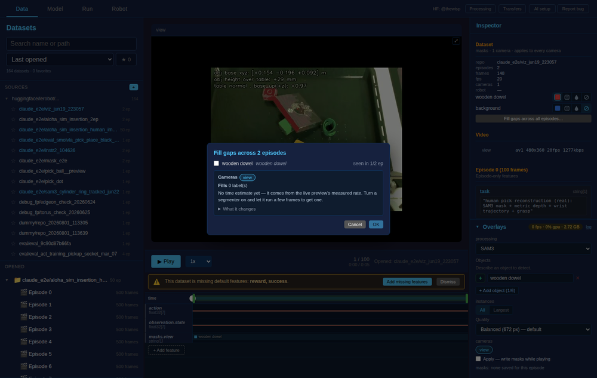<br>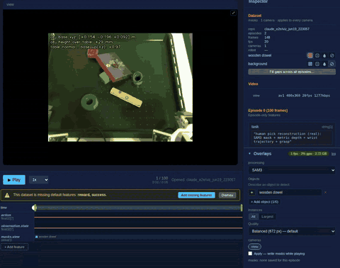                                                  | no masks in episode 0, nothing to composite (expected) · Pause ✅<br>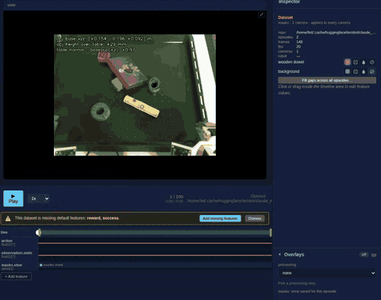                 |
| **`sam3_cylinder_ring_tracked_jun22`**<br>1 camera(s): tracked<br>1 episode(s), episode 0 = 173 frames<br>label **cylinder**                                  | before:<br>`tracked` no column<br>after:<br>`tracked` 173 looked, none                                                                                                                                                                                                        | badge at Play: _loading…_<br>Pause stops ✅ · 2nd Play streams ✅ · invariant violations 0 ✅<br>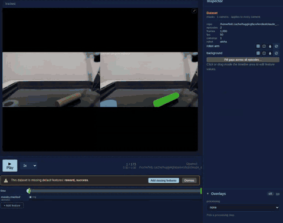          | every camera on ✅ · labels: ring<br>job complete · 1/1 episodes<br>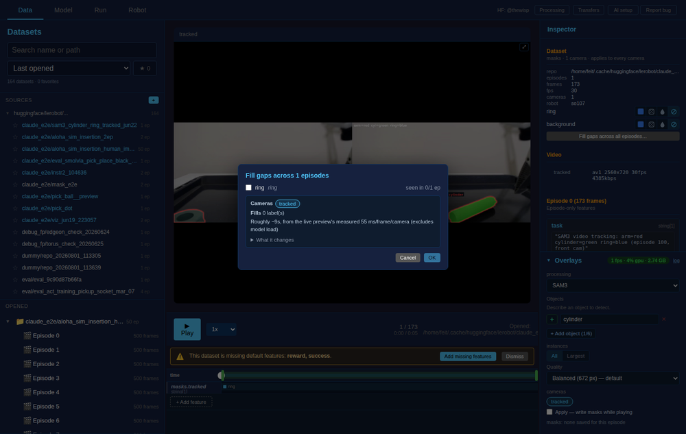<br>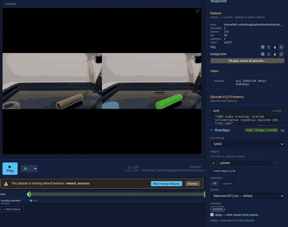                          | no masks in episode 0, nothing to composite (expected) · Pause ✅<br>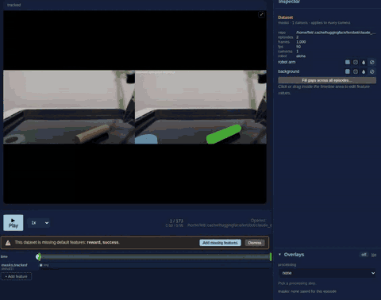 |

Notes on the rows:

- **`instr2_104636`** and **`viz_jun19_223057`**: nothing was written, by the rule. Every cell already held a mask or a `[]` ("segmented, nothing found" from an earlier pass; in `instr2` the wrist cameras look away from the cubes in exactly those frames). The fill re-segmented and found nothing there either, and the counts are unchanged in the copy and in the original.
- **`sam3_cylinder_ring_tracked_jun22`**: the panel label was _cylinder_, but the dialog offers the dataset's vocabulary once one exists (_ring_, from an earlier drive on the same copy that found nothing). The pass ran _ring_ again, found nothing, and the page said so ("Saved, but nothing was found"). A new label reaches a dataset that already has a vocabulary through Apply-while-play, not this dialog.
- **`aloha_sim_insertion_2ep`**: the first two episodes of `lerobot/aloha_sim_insertion_human_image`, cut with `delete_episodes` so the fill runs in minutes rather than the hour the 50-episode set would take.
- **`pick_ball__preview`**: the row is the re-drive on the build with the reader-attach guard. The first drive, on the build before it, had the second Play refused with `409 worker does not produce ['top']; its cameras: []` and fell back to stills with the toast naming that reason — which is what exposed the attach race fixed in #219:

  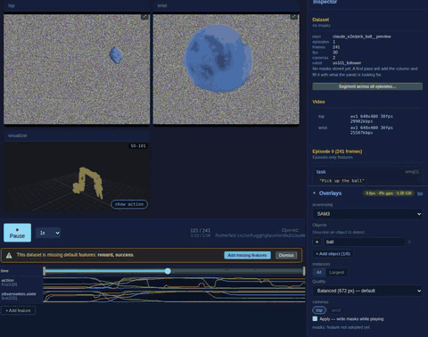
