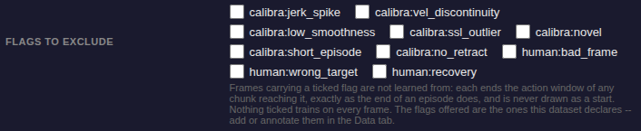
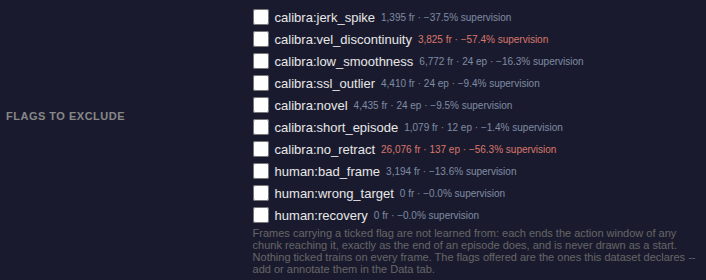

# What a quality flag costs, in the training form

Captured on the HVLA Flow S1 recipe with
`GPU/0803_20260803_174402_labeling_merged_split_224` selected — 47,803 frames
across 274 episodes, chunk size 50, so 2,054,500 supervised action positions.
Both shots are the same field of the same form, on servers started from the two
revisions.

## 1. Before — the picker names the flags

`3ebaae726`, unmodified. Ten labels, no indication of what any of them removes.

## 2. After — each flag carries what excluding it costs

The two figures that make the case sit four rows apart:

| flag                        | frames | share of frames | supervision lost |
| --------------------------- | -----: | --------------: | ---------------: |
| `calibra:vel_discontinuity` |  3,825 |            8.0% |            47.4% |
| `human:bad_frame`           |  3,194 |            6.7% |            10.1% |

Nearly the same number of frames, nearly five times the cost. The first is
spread across 241 of the 274 episodes and the second is concentrated in 54, and
a frame count cannot tell them apart.

Per-episode flags carry their episode count as well, because excluding one
removes the demonstration whole rather than punching holes in episodes that are
kept: `calibra:no_retract` reads `26,076 fr · 137 ep · −55.3% supervision`.

Red marks a flag past 40% of the run's supervision. `human:wrong_target` and
`human:recovery` are declared by the dataset but carried by no frame, and read
`0 fr`.

## 3. The figure follows the form's chunk length

The same picker after editing the form's chunk length from 50 to 100, with
nothing else touched. Every figure is a share of the supervision that length
defines, so it has to move with it:

| flag                        | at 50 | at 100 |
| --------------------------- | ----: | -----: |
| `calibra:vel_discontinuity` | 47.4% |  57.4% |
| `calibra:jerk_spike`        | 26.4% |  37.5% |
| `human:bad_frame`           | 10.1% |  13.6% |

The colour follows the figure rather than the label: `calibra:jerk_spike` rises
from 26.4% to 37.5% and stays grey, both being under the 40% threshold, while
`calibra:vel_discontinuity` is red at both.

Before this, the request carried no chunk length at all and the server's default
of 50 answered every call — so the first of these two columns was shown whatever
the form said, for every policy.
