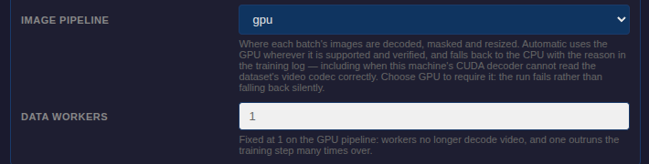
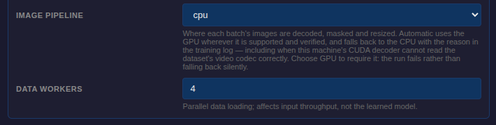

# Image pipeline control — captured states

The `--data-path` selector and the worker count beside it, as the training form
renders them, captured from a running GUI against this branch's source.

The control is `advanced`, so it is not offered until that block is opened —
the transition is worth showing rather than assuming:

|                       | `auto` (default)           | `gpu`                           | back to `cpu`                    |
| --------------------- | -------------------------- | ------------------------------- | -------------------------------- |
|                       |  |  |  |
| Data workers shown    | 4                          | 1                               | 4                                |
| submitted by the form | 4                          | 1                               | 4                                |

`auto` uses the GPU path where it is supported and verified and falls back with
the reason logged; `gpu` requires it and stops the run instead of falling back;
`cpu` never probes.

The worker count is fixed at 1 on the GPU pipeline, where the workers no longer
decode video and one outruns the training step many times over. `auto` leaves it
editable, because the path is not decided until the run probes the dataset and
freezing on a guess would misreport what happens. Leaving `gpu` gives the chosen
count back rather than keeping the 1.

The submitted row is not read off the picture. Each capture interrogates the
form's own `FormData` for what the run would receive, because the two can
disagree: an earlier version of the freeze used `disabled`, which a `FormData`
omits, so the box read 1 and submitted nothing.

## Not shown

The run-detail stat, which needs a completed run to exist: it records which path
was used and, when `auto` fell back, why.

## Reproducing

`scripts/gui/screenshot_gui.py` boots a GUI on a free port and drives it over
CDP. The form lives under the **Model** tab via `trainingShowStartForm()`. One
session captures one shot — it photographs at exit — so each state needs its own
run.

Pin `PYTHONPATH` to the checkout under test: the venv's editable install
otherwise resolves `lerobot` to whatever branch the main checkout is on, and the
screenshots then show that form instead of this one.

These shots supersede an earlier set taken before the worker count was frozen.
That set showed `gpu` selected beside an editable worker box, which is no longer
what the form does — a screenshot of behaviour that no longer exists reads as
proof of it, so they were replaced rather than kept alongside.
