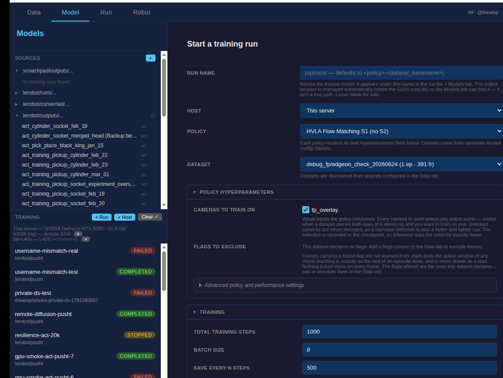
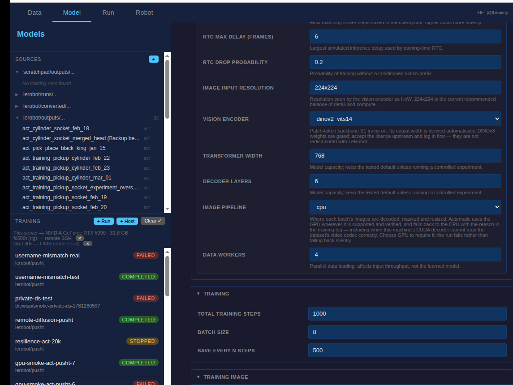

# Image pipeline control — captured states

The `--data-path` selector as the training form renders it, captured from a
running GUI against this branch's source. Every state of the control, and the
transition that reveals it.

The field is `advanced`, so it sits inside the policy form's collapsed
`Advanced policy and performance settings` block; the first shot is the closed state, the rest are the open one
with each value selected.

|                                        | State                  | What it shows                                                                                                                                                                                                           |
| -------------------------------------- | ---------------------- | ----------------------------------------------------------------------------------------------------------------------------------------------------------------------------------------------------------------------- |
|  | **Advanced collapsed** | The default form. The control is not offered until the block is opened, which is the transition below.                                                                                                                  |
|             | **`auto` (default)**   | Opening that block reveals `Image pipeline`, defaulted to `auto`. The description states the fallback contract: the GPU path is used where supported _and verified_, otherwise the CPU path with the reason in the log. |
|              | **`gpu`**              | Requires the GPU path. The run fails rather than falling back, so a benchmark cannot silently measure the other path.                                                                                                   |
|                | **`cpu`**              | Forces the data-loader path. Never probes, never falls back.                                                                                                                                                            |

## The run stat

A second surface is not in these shots because it needs a completed run: the run
detail shows an `Image pipeline` stat reading `GPU` or `CPU`, with `(fell back)`
appended when `auto` wanted the GPU path and could not have it, and the reason
on hover. It is rendered from `progress.data_path` / `progress.data_path_reason`
in `training.js`.

## Reproducing

`scripts/gui/screenshot_gui.py` boots a GUI on a free port and drives it over
CDP. The capture must pin `PYTHONPATH` to the checkout under test: the venv's
editable install otherwise resolves `lerobot` to whatever branch the main
checkout is on, and the screenshots then show that form instead of this one.
The captures here assert `state_position_std_floor` is absent from the rendered
form, which is how that mistake is caught rather than shipped.
