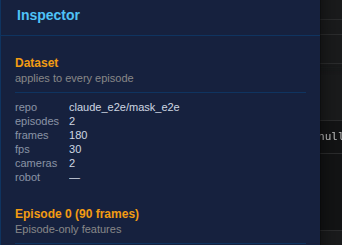

# The Inspector's dataset scope section

Captured from a running GUI on this branch, with an episode selected — which is
the state the section exists for. Before it, the dataset's facts lived only in
the Inspector's empty state, so selecting an episode replaced them and what
dataset you were looking at left the screen.

The panel reads top-down by scope: **Dataset** ("applies to every episode"),
then **Episode 0**, then the frame. The section is first because it is the
broadest, and it is the one always present.

`robot` reads `—` because this dataset declares no robot type. It is shown
rather than hidden: an absent value is a fact about the dataset too, and a row
that disappears makes the panel's shape depend on its contents.
