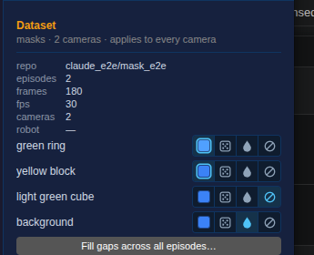
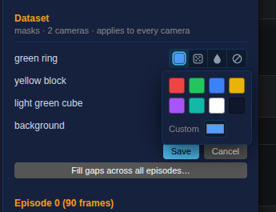
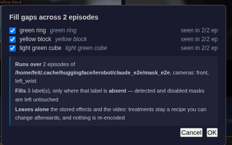
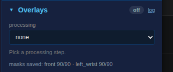
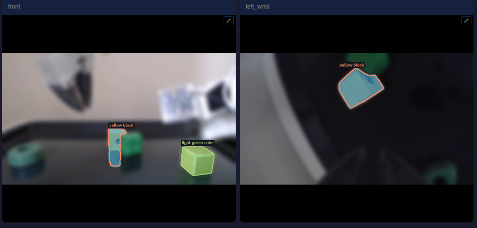

# Adding masks: the two mechanisms, and what a save may not change

Captured from a running GUI against a two-episode dataset whose recipe was set
up first — `green ring` tinted, `yellow block` tinted, `light green cube` left
alone, and the **background blurred** — because the defect these shots exist for
is a save quietly resetting that background.

The segmentation is real SAM3 over 2 episodes × 90 frames × 2 cameras.

## 1 — the dataset tier owns the recipe, and hosts the one dataset-wide action

The treatments and the background are edited here, and this is where the design
puts the whole-dataset path: _"It lives in the Inspector's dataset panel, so the
positional rule holds with no label."_ The background reads `blur` **after** a
full segmentation pass — which is the fix.

The control is a flat row of exclusive buttons rather than a dropdown, because
the choice is exclusive and because `tint` carries a colour a `<select>` can
neither show nor pick. Selected above: tint, tint, none, blur.

The tint button _is_ the swatch — it shows the colour and opens the picker.
Choosing one stages the change and Save writes it, verified end to end: the
colour picked is the colour stored.

## 2 — the filler confirms before it runs

It is the only dataset-wide way to add masks, so it is also the confirmation for
one: what it runs over, with which cameras, that it fills only where a label is
**absent**, and that it leaves the stored effects and the video alone. OK is
unavailable until a label is ticked. `light green cube` is unticked because it
is seen in only 1 of 2 episodes — a label local to one episode is not ticked by
default.

## 3 — the overlay panel has no write

It is the live query and has no scope of its own, so the two buttons it had
grown are gone. What remains is the read: how much of this episode already
carries masks.

## 4 — one label style, and no stacking

Both layers that can name a region now size it the same way — a fraction of the
frame rather than of the tile — so a name does not change size when the
segmenter is toggled over the same frame, and a pill that would cover another
slides clear. The blurred background is the stored treatment being composited:
the masked objects are sharp, everything else is not.

## The flow, end to end

[`filler-flow.mp4`](filler-flow.mp4) — opening the filler, unticking to show OK
go unavailable, ticking back, confirming, and the job running to completion.
