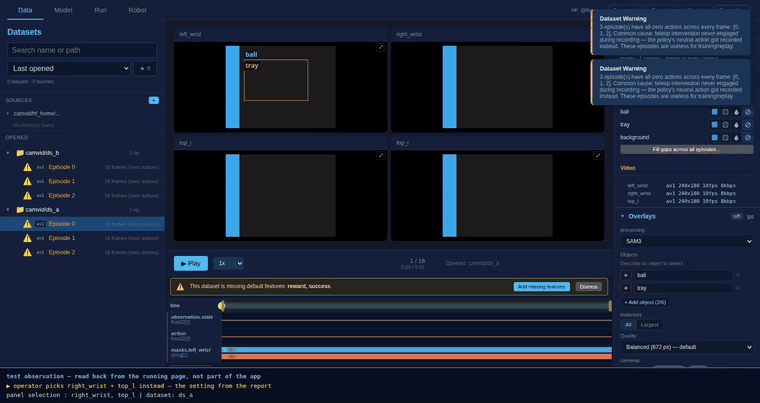
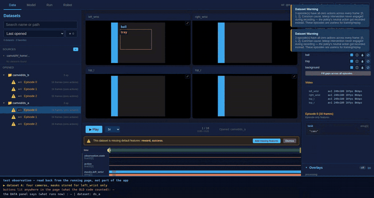

<!-- Captured evidence for a change. NOT a design document -- see
     src/lerobot/gui/docs/ for those. -->

# Evidence: Fill gaps runs the cameras the dialog shows

Four cameras, with masks stored for `left_wrist` only. The strip along the
bottom is instrumentation and says so on screen; each line is read back live
from the running page, and the request line is the body of the intercepted
`POST /api/process/episode-masks`.

## With the segmenter switched off

The operator picks `right_wrist` and `top_l`, clicks a different **episode** of
the same dataset -- the pick survives, because an episode switch is not a
dataset switch -- and then switches the segmenter **off**. A dataset-wide fill
does not need it, and that is the state the defect needed: with no model the
panel renders no camera buttons, so counting the highlighted ones on screen
found none and treated none as "run everything". The dialog names the pick and
the request carries the same two.

## With the segmenter left on, after visiting the Run tab

The second way in. Both tabs put the same kind of camera button into one page,
and the Run tab's stay there once it has been visited. Counting them answered
with the union of both, and the segmenter being ON in the Data tab did not
prevent it. `teleop_wrist` belongs to the live stream and is not a camera of the
open dataset at all; it is absent from the request.

[7-cameras-full.mp4](7-cameras-full.mp4) is the first run uncut, at full
resolution.
