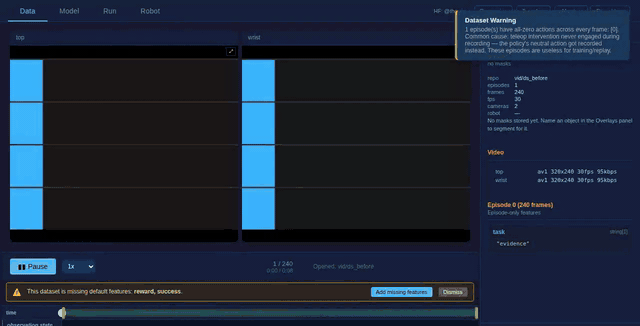
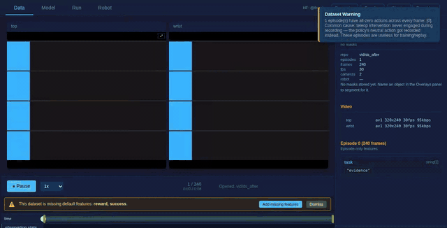

<!-- Captured evidence for a change. NOT a design document -- see
     src/lerobot/gui/docs/ for those. -->

# Evidence: the overlay preview moves the playhead

Both recordings are the same moment of the same episode -- the preview's own
clock at frame 60 of 150 -- so the code is the only difference between them.

|        | picture at | frame counter | timeline |
| ------ | ---------- | ------------- | -------- |
| before | frame 60   | `1 / 150`     | `0%`     |
| after  | frame 60   | `61 / 150`    | `40.3%`  |

## Before

The tiles advance. The counter stays on `1 / 150`, the clock on `0:00`, and the
scrubber never leaves the left edge. The panel's own check notices and says so,
once per distinct violation: _"Overlay preview is out of sync -- the playhead (0)
is not tracking the stream (5)"_, then 19, 34, 49, 65, 80, 94, 109. That stack of
toasts is what "playback is broken as it shows overlay out of sync" was.

## After

Same picture, and the counter, the clock and the scrubber move with it. No
violation is raised.

The `.gif` is what renders inline; the `.mp4` beside each is the same run at full
resolution and seekable. Both are kept out of LFS on purpose -- GitHub serves an
LFS object as `application/octet-stream` with `nosniff`, so an embedded one is a
blank box. 25 fps, no dropped frames (`nb_frames` 208 over 8.32 s), recorded with
the compositor-throttle flags this repository's recording recipe lists.

The stills [1-playhead-before.png](1-playhead-before.png) and
[2-playhead-after.png](2-playhead-after.png) are single frames of the same two
runs.
