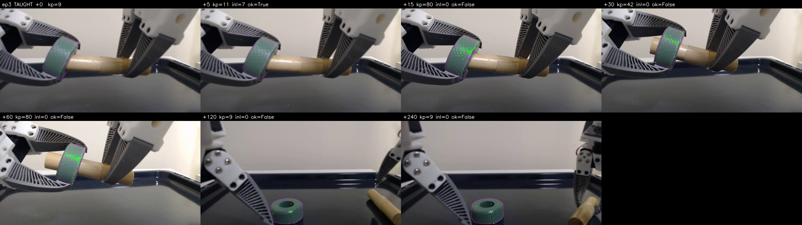
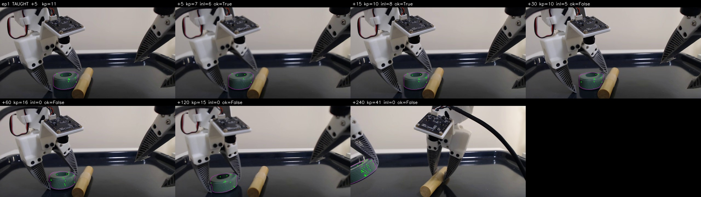

# M0 — input-quality gate on real video

`thewisp/intervention_cylinder_ring_assembly`, 34 episodes, 30 fps. No robot, no servo,
no motion. M0 asks only whether the measurements the servo depends on are trustworthy
enough to be worth servoing on.

```bash
PYTHONPATH=src <python-with-transformers> benchmarks/showservo_m0.py \
    --repo-id thewisp/intervention_cylinder_ring_assembly \
    --camera front --episodes 8 --concept "green ring" \
    --binder dino --dino-model facebook/dinov3-vits16-pretrain-lvd1689m
```

> **This supersedes the first pass of these numbers, which was wrong.** That pass used a
> centre-of-frame ROI as a stand-in for designation and the `top` camera as its
> substrate. Both are invalid, in opposite directions, and the two corrections are the
> most important content here. Every number below is over a real SAM3 designation of the
> ring, on the `front` camera.

## Two invalidated substrates

**The centre-of-frame ROI made the tracker look far worse than it is and the binder far
better.** It is mostly static table, so tracked points survived forever (deflating
nothing, inflating the apparent decay of the object points that were there) while
binding matched background to background and certified out to 2 s. Reported half-life
was ~10 frames; the real figure over the designated object is ~45.

**The `top` stream is not raw video.** 4–7% of every `top` frame is thin, saturated
debug-vision chrome — per-frame concept contours and boxes composited into the recording
— against ~0.0% on `front`. It is redrawn each frame and follows the arm, which is
exactly the structure SIFT locks onto and KLT then loses. `top` is measured below only
where it is informative about occlusion; it is not a substrate for feature quality.

## Designation is not the weak link

SAM3 with the prompt `green ring` holds the object across grasp, occlusion by the
fingers, and a large scale change — mask area stays within ±20% while the ring goes from
a filling-the-frame close-up to a distant blob on the tray.



It fails by _absence_, not by drifting: 45 of ~430 queried frames on `front` returned no
mask at all (the ring out of frame or fully hidden), and 106 on `top`, where the gripper
occludes it from above far more often. Those are counted as bind failures below and
reported separately, never folded into a binder verdict.

## Tracker point survival (KLT + forward-backward gate)

Seeded from corners inside the designated mask, so this row is a property of the tracker
alone and does not move when the binder tier changes.

| frames            |    5 |   10 |   20 |   40 |   80 |  150 |
| ----------------- | ---: | ---: | ---: | ---: | ---: | ---: |
| seconds           |  0.2 |  0.3 |  0.7 |  1.3 |  2.7 |  5.0 |
| surviving (front) | 0.82 | 0.74 | 0.70 | 0.56 | 0.22 | 0.07 |
| surviving (top)   | 0.70 | 0.66 | 0.58 | 0.36 | 0.15 | 0.00 |

**Half-life is about 45 frames — 1.5 s**, not the third of a second first reported. 30
points seed a team on `front`, against the ~8/team §4 assumes.

That is comfortable enough for a stage, but the cliff between 1.3 s and 2.7 s is the
grasp: the fingers close over the seeded points. Replenishment and re-bind still have to
be continuous rather than once-per-stage — the conclusion survives, its urgency does not.

## Bind inlier rate vs. frames since teaching (same episode)

Same designation, same frames, three descriptor tiers. `certified` is the fraction of
episodes whose bind cleared the gate; `inliers` is the mean.

| offset (frames)    |    0 |   5 |   15 |  30 |  60 | 120 | 240 |
| ------------------ | ---: | --: | ---: | --: | --: | --: | --: |
| seconds            |  0.0 | 0.2 |  0.5 | 1.0 | 2.0 | 4.0 | 8.0 |
| **SIFT** certified | 100% | 38% |  38% | 12% | 12% |  0% |  0% |
| SIFT inliers       | 28.6 | 4.4 |  4.9 | 2.2 | 1.5 | 0.5 | 0.0 |
| **DINOv2-S** cert. | 100% | 88% | 100% | 62% | 38% | 25% |  0% |
| DINOv2-S inliers   |  607 |  87 |   81 |  59 |  41 |  36 | 4.1 |
| **DINOv3-S** cert. | 100% | 88% | 100% | 75% | 62% | 25% | 25% |
| DINOv3-S inliers   |  453 | 150 |  135 |  86 |  82 |  44 | 4.5 |

**SIFT is not viable on this object and the failure is not about motion.** In the
episode below the ring is essentially stationary for two seconds while the arm moves
overhead, and SIFT still goes from 11 inliers to 0:



The cause is visible in the frames: the ring's only texture is a fine repetitive weave.
Whether it resolves at all depends on scale and focus (9 keypoints in one frame, 80 two
frames later on the same object), and where it does resolve it is self-similar, so the
mutual-match ratio test has nothing to lock onto. Detected keypoint counts on a 20 000 px
designated region ranged 5–80 across frames. A tier whose descriptors only exist where a
detector fires cannot be the default for objects chosen by a user rather than by us.

Dense patch features have no such failure mode — every masked patch is a descriptor —
and DINOv3-S is clearly the better of the two, roughly doubling inliers at every offset
past 0.2 s and holding a 0.70 inlier ratio where DINOv2-S holds 0.42.

## Bind across episodes — the one that decides the premise

A card is taught once and must bind to a re-placed scene. Entering episode 0 and each
other episode at the same 15% phase mark:

| tier     | certified | inliers |
| -------- | --------: | ------: |
| SIFT     |       0/6 |       0 |
| DINOv2-S |       0/6 |     5–7 |
| DINOv3-S |       1/6 |    3–12 |

Read alone this says cross-episode binding does not work. It is the wrong reading, and
the in-house counter-example says so: the fewshot work reached 54/92 inliers and 0.80
transported-mask IoU on episode 3 vs episode 12 of this same dataset. The difference is
**which frames get compared** — that measurement used a curated pair, this one enters at
an arbitrary phase.

Binding every phase against every phase separates the two:

| pair (front) | SIFT | DINOv2-S |  DINOv3-S |
| ------------ | ---: | -------: | --------: |
| ep3 vs ep12  | 0/24 |     1/24 |  **8/24** |
| ep0 vs ep1   | 0/56 |     2/56 | **32/56** |
| ep0 vs ep5   | 0/56 |     0/56 |  **9/56** |
| best inliers |    3 |       24 |    **42** |

Two conclusions, both actionable:

1. **Cross-episode binding works, and DINOv3 is what makes it work** — 32/56 certified
   against DINOv2's 2/56 on the same frame pairs, with the same designation. This is a
   far larger gap than the in-episode curve suggests, and it is the tier decision.
2. **It is view-limited, not descriptor-limited.** Successes cluster in blocks of the
   phase matrix rather than spreading along its diagonal: episodes drift out of phase
   with each other, so equal-phase frames are not equal-view frames. Entering a stage at
   one nominal moment and binding once is the wrong runtime shape. Binding must be
   attempted until it certifies — which is what the REBIND rung already exists for — or
   the card must carry several taught views.

## What this changes

1. **DINOv3 patches are the tier the design should bind with.** SIFT stays as the no-GPU
   path for textured objects, and remains this bench's default so it runs without a GPU,
   but it is not the tier the design should be measured on.
2. **The retry ladder is now on the critical path, not a robustness afterthought.**
   Cross-episode binding certifies on a minority of entry views; the ladder is the
   mechanism that turns that into a success.
3. **The tracker's seeds are an unresolved design question.** Survival is measured from
   corners because that is what KLT follows, but a dense binder's inliers land on a patch
   grid. Feeding grid centres to KLT is not obviously sound, and `BindResult.seed_points`
   currently transports unmatched taught points through a 2D similarity — a planar
   assumption already removed from the servo. Both need settling together.
4. The sim bench should be re-read knowing the real tracker half-life is ~1.5 s: its
   convergence in ~12 frames was well inside that, so it never tested the regime that
   matters.
