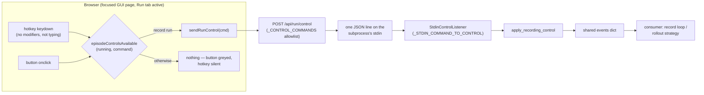

# Run controls: design, and how to add a command

How a human intervenes in a GUI-launched run — buttons, hotkeys, and the
control channel that carries both. This is the system-level reference the
control-channel PR introduces; `lerobot/utils/keyboard_input.py` holds the
mechanism, this document holds the design and the recipe.

## The one path

Buttons and hotkeys are the same command taking two doors into the same
function. Nothing clicks a widget on behalf of a key; both call
`sendRunControl()`, and both are gated by the same predicate — that shared
predicate, not widget state, is what keeps a disabled button and a dead
hotkey consistent.

The stdin channel is one of three interchangeable backends behind the same
`(listener, events)` contract — `pynput` (X11 global grab), the terminal
reader (TTY), and stdin (piped subprocess). GUI-launched runs set
`LEROBOT_KEYBOARD_LISTENER=0` so stdin is the single source of truth; every
backend converges on the same events dict, so the record loop never knows
which door a command came through.

## Adding a command — the recipe

One vocabulary, four touch points. A parity test
(`tests/gui/test_run.py::test_control_vocabulary_parity`-family) pins the two
vocabulary ends equal, so forgetting one side fails CI.

1. **Vocabulary** (`lerobot/utils/keyboard_input.py`): add
   `"<command>": "<control-name>"` to `_STDIN_COMMAND_TO_CONTROL`, and teach
   `apply_recording_control` (or a subscribing consumer) what that control
   does to the events dict.
2. **Endpoint** (`lerobot/gui/api/run.py`): add the command to
   `_CONTROL_COMMANDS`.
3. **Frontend** (`lerobot/gui/static/run.js`): a button calling
   `sendRunControl('<command>')`, an entry in the `_bindRunControlHotkeys`
   key map, and — non-negotiable — the same gating predicate on both. If the
   command only makes sense for a specific run kind, extend the predicate,
   never just the render condition.
4. **Consumer**: whatever reads the events dict acts on it. New consumers
   subscribe through a supported hook; do **not** monkeypatch
   `listener.on_press` — that attribute exists only on the pynput backend,
   and that anti-pattern is precisely what stranded the RLT reward keys.

Worked example (the pending RLT migration): add `reward_success` /
`reward_abort` to both vocabularies; give the composite listener a
`subscribe(control_name, callback)` hook; `s1_process` subscribes instead of
wrapping `on_press`; frontend adds two buttons + keys gated on
`command === 'hvla'`. Per-run-kind gating means a key can safely mean
different things in different run kinds.

## UX semantics

- **Focus-scoped**: hotkeys fire only while the GUI page has browser focus,
  the Run tab is active, and no input/textarea/select is being edited.
  Modifier chords are ignored (browser shortcuts never collide). An operator
  looking at the robot with an unfocused browser presses a dead key — that is
  the accepted trade for retiring the global X11 grab (see the RLT/X11
  regression note in `TODO.md`).
- **Discoverability**: buttons carry their hotkey in the label
  (`Next episode (N)`), relabeled per phase so the label always says what the
  press will do _right now_.
- **Customization**: none yet. Bindings are hardcoded in the single frontend
  key map; a customization layer, if ever added, belongs in that map and
  nowhere else.

## Why GUI runs suppress the local keyboard (the double-fire hazard)

On X11, the pynput backend is a **global grab**: it sees every keypress on
the desktop regardless of window focus, and character keys fall through to
their `.char` — so `n` and `r` reach it from anywhere. Two consequences
before this design:

- Typing `n` in an editor, a terminal, anything, while a GUI record ran,
  skipped an episode. The grab does not care what you were doing.
- With browser hotkeys added, a focused-browser `N` would deliver the same
  command **twice**: once through the browser → stdin channel, once through
  the global grab — two `exit_early`s, skipping two phases (or two
  `rerecord_episode`s, discarding a take you wanted).

The suppression mechanism: `_launch_subprocess` (`gui/api/run.py`) sets
`LEROBOT_KEYBOARD_LISTENER=0` in the subprocess environment;
`keyboard_input.keyboard_listener_disabled()` reads it and backend selection
skips pynput/terminal entirely, logging
`Keyboard listener disabled via LEROBOT_KEYBOARD_LISTENER=0 — control
arrives via the stdin channel only.` The flag is **subprocess-scoped**: a
terminal-launched `lerobot-record` in another shell keeps its own keyboard
backends untouched.

The invariant this buys: **each deployment mode has exactly one live source
for a given key.** GUI run → browser page (focus-scoped) only. Terminal run →
pynput or TTY reader only (stdin channel no-ops on a TTY). The composite
listener may hold both a keyboard backend and the stdin listener, but their
activation conditions are mutually exclusive, so a key can never double-fire.

How this is tested: `tests/utils/test_keyboard_input.py` pins backend
selection under the kill switch ("suppresses local capture but not the stdin
channel") and the stdin-only dispatch; the field evidence is the first log
line of any GUI-launched record on this X11 workstation, which states the
suppression explicitly.

## Known gaps (tracked in `TODO.md`)

GUI-launched runs currently carry only episode flow (`exit_early`,
`rerecord_episode`, `stop_recording`). Stranded on the retired keyboard path,
to be migrated via the recipe above:

| Keys              | Consumer                 | Effect                                                                   |
| ----------------- | ------------------------ | ------------------------------------------------------------------------ |
| `R` / `LEFT`      | RLT (`s1_process`)       | mark episode SUCCESS / ABORT (X11 regression — worked via pynput before) |
| `SPACE`           | `so_leader` intervention | toggle human intervention during policy runs                             |
| `1`-`9` / `SPACE` | HVLA S2 standalone       | inject captured subtask latent / return to live S2                       |
