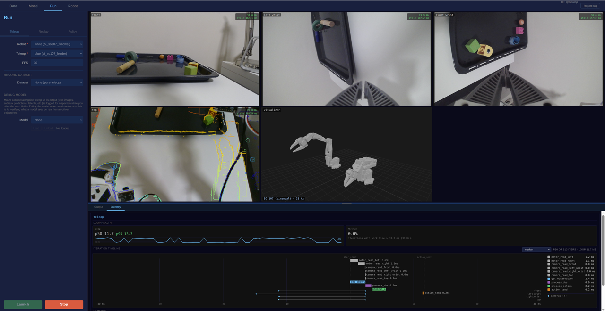
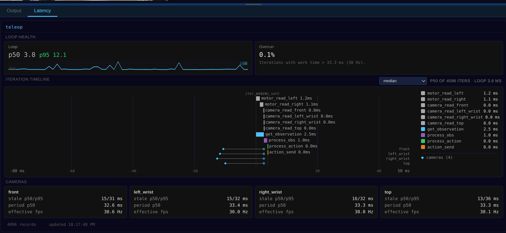

# LeRobot GUI

Browser-based tool for reviewing and editing robot training datasets.


## Installation

The GUI lives behind the `gui` extra. It pulls in FastAPI/uvicorn, the
`python-multipart` form parser, mDNS (`zeroconf`), and the MCP server the
GUI mounts at runtime:

```bash
pip install "lerobot[gui]"          # end users
# or, from a checkout:
uv sync --extra gui                 # dev (add --extra training/--extra nebius as needed)
```

If you see `RuntimeError: Form data requires "python-multipart"` or
`ModuleNotFoundError: No module named 'mcp'`, your environment predates these
dependencies — re-run the install above to pick them up.

## TLDR

```bash
uv run python -m lerobot.gui --port 8000   # or: python -m lerobot.gui --port 8000
```

Open http://127.0.0.1:8000/, enter a repo ID (e.g. `lerobot/pusht`) or local path, then:

- **Play** episodes across all cameras with timeline scrubbing
- **Delete** episodes you don't want (mark → save)
- **Trim** episodes to keep only the useful frames (drag handles → save)
- **Visualize** any episode in Rerun via right-click

All edits are non-destructive until you hit **Save Changes**.

## Usage

```bash
python -m lerobot.gui [--host HOST] [--port PORT] [--cache-size SIZE]
```

| Argument       | Default     | Description                                          |
| -------------- | ----------- | ---------------------------------------------------- |
| `--host`       | `127.0.0.1` | Bind address. Use `0.0.0.0` for network access.      |
| `--port`       | `8000`      | TCP port.                                            |
| `--cache-size` | `1GB`       | In-memory frame cache budget (`500MB`, `1GB`, etc.). |

## Connect from another device on the LAN

Useful when the robot host is a beefy desktop and you want to control it from
a laptop, phone, or tablet — common when the robot moves around and the
operator can't be tethered to the robot host's keyboard.

```bash
python -m lerobot.gui --host 0.0.0.0
```

`--host 0.0.0.0` makes the server listen on every network interface, and
also enables mDNS (multicast DNS) advertising of `lerobot.local`. On
startup the banner spells out every URL the host is reachable at:

```
LeRobot host service ready:
  mDNS (no IP needed): http://lerobot.local:8000/
  LAN:                 http://192.168.1.61:8000/
  Local:               http://localhost:8000/
```

From any device on the same LAN (macOS, Windows 10+, Linux with avahi,
iOS, Android — all modern browsers resolve `.local` natively) open
`http://lerobot.local:8000/` — no IP-typing needed.

If a second robot host appears on the same LAN, mDNS auto-suffixes the
name (`lerobot-2.local`, `lerobot-3.local`, …); the chosen name is
printed in the banner.

**Caveats:**

- Bind-to-network has no authentication. Anyone on the same LAN with the
  URL can drive your robot. Lab / home WiFi: fine. Untrusted networks
  (conference WiFi, public hotspots): don't.
- Some corporate networks block multicast. If `lerobot.local` doesn't
  resolve, fall back to the raw LAN URL (`http://<ip>:8000/`) from the
  banner. The raw URL always works.
- mDNS requires the optional `zeroconf` package, included in
  `pip install lerobot[gui]`. Without it, only the raw LAN URL works.

## Dataset Playback

- Enter a HuggingFace repo ID or absolute local path to open a dataset.
- Episodes are listed in the sidebar; click one to load it.
- Multi-camera views auto-arrange in a responsive grid (1–3 columns depending on camera count).
- Playback controls: play/pause, speed (0.25x–2x), timeline scrubber with hover preview.
- Frames are decoded once per index across all cameras and served as JPEG with an LRU cache and background prefetch.

### Keyboard Shortcuts

| Key                   | Action                  |
| --------------------- | ----------------------- |
| `Space`               | Play / pause            |
| `←` / `→`             | Previous / next frame   |
| `Shift+←` / `Shift+→` | Jump 10 frames          |
| `↑` / `↓`             | Previous / next episode |
| `Home` / `End`        | First / last frame      |
| `Delete`              | Toggle episode deletion |
| `r`                   | Reset trim              |

## Episode Deletion

1. Select an episode and press `Delete` (or right-click → Delete Episode).
2. The episode shows strikethrough in the sidebar.
3. Press `Delete` again or right-click → Restore to undo.
4. Click **Save Changes** to apply — removes metadata and parquet rows without re-encoding video.

## Episode Trimming

1. Drag the green trim handles on the timeline to set the keep region.
2. Red-tinted zones show frames that will be cut.
3. The trim info bar shows the kept range (e.g. `Keep: frames 12–85 (74 of 100)`).
4. Right-click → Clear Trim to undo before saving.
5. Click **Save Changes** to apply — re-encodes only the trimmed segment using a streaming video encoder.

## Rerun Integration

Right-click any episode → **Open in Rerun** to launch the [Rerun](https://rerun.io/) visualizer for that episode. This spawns a separate process independent of the web server.

## URDF State Visualization

Render the robot's URDF live from a connected robot or replay it from dataset
frames, with an optional action-overlay ghost and an end-effector trajectory tube.

<p align="center">
  
</p>

## Latency Monitoring

For teleop / record / HVLA loops, the GUI surfaces a multi-track timeline with
per-stage spans (per-arm motor reads, per-camera sub-spans), a loop-health card
with p50/p95 and overrun ratio, and a per-camera staleness footer.

<p align="center">
  
</p>

## MCP Endpoint

The server also mounts a [Model Context Protocol](https://modelcontextprotocol.io/)
app at `/mcp`, letting AI agents read datasets through the same host. It starts
automatically; the startup banner prints the mount point and token store path:

```
MCP HTTP transport mounted at /mcp (token store: ~/.cache/huggingface/lerobot/_mcp_tokens.sqlite)
```

See [`../mcp/README.md`](../mcp/README.md) for the available tools and how to
connect an agent.
