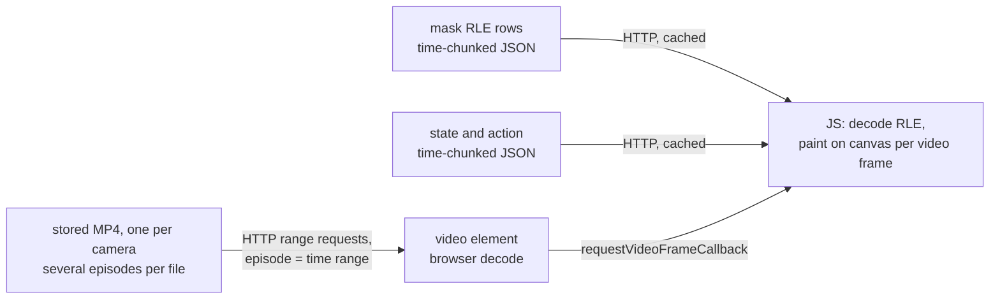
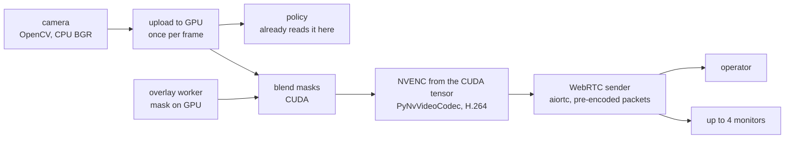

# Camera video pipelines

Two pipelines carry camera pixels to the browser: a static one for stored
episodes (Data tab) and a live one for runs (Run and Robot tabs). The
blueprint is Fei's, 2026-09-06; this document restates it in the
codebase's terms, says what already exists, where the blueprint's
hardware assumptions differ from the machines we have, what is still
unverified, and in what order to build. It supersedes
`camera_video_transport.md`, which is sealed and keeps the measurements
this document reuses.

## Requirement

Stored data is played by several clients at once, each at a different
place. A run is dedicated to one operator, because it holds the GPU and
the robot; in the extreme a few more clients may watch the same run, so
one encode serves all of them. Latency on the live path is the physical
latency of camera and network plus as little processing as possible.

## Static path: serve the source, the client builds the view

The design of this path now lives in
[dataset_playback.md](dataset_playback.md); this section keeps the facts
and measurements it rests on.

What exists today:

- A dataset's videos are MP4 files per camera holding several episodes
  each; an episode is a time range in one file, recorded in the episodes
  metadata. In `thewisp/intervention_cylinder_ring_assembly` (34
  episodes) a file holds one to seven episodes, and the multi-episode
  files carry the index at the front while the single-episode first file
  carries it at the end (`ffprobe`, 2026-09-06). A browser seeks either
  with range requests; an index at the end costs one extra request.
- The codec depends on how the dataset was recorded and is stored in
  `meta/info.json`. The default is AV1 (`libsvtav1`, `yuv420p`, a keyframe
  every two frames, `crf 30`); `vcodec=auto` prefers, in order,
  VideoToolbox H.264 or HEVC on a Mac and NVENC H.264 or HEVC on Linux
  (`configs/video.py`). Headless Chromium 151 decodes AV1 main and H.264
  and reports both smooth; it does not decode HEVC (`codec_probe3.py`,
  2026-09-06). It reported no hardware acceleration in headless mode; the
  operator's own browser was not probed.
- Masks are stored as COCO run-length rows per camera and frame in the
  dataset's edit store (`gui/api/_edits_core.py`), and `static/masks.js`
  already decodes them in JavaScript and paints them on a canvas. The
  Data tab on `main` paints them over still images.
- Per-frame state and action are served by the features endpoints in
  `gui/api/datasets.py`.

What is built instead, and why, is in
[dataset_playback.md](dataset_playback.md): the stored bitrate exceeds
the link (below), so the page pulls windows transcoded to a ladder, with
the archive's own samples as the ladder's top rung.

Measured with the prototype (`static_playback.py`, `static_playback.html`,
`scripts/gui/eval_static_playback.py`; headless Chromium 151; 2026-09-06):

- On this machine, `thewisp/intervention_cylinder_ring_assembly`, episode 5,
  four 1280x720 AV1 cameras: page ready in 0.09 s; first frame 18–19 ms
  after play; seeks presented in 6–40 ms; 41 media range requests over
  12 s of play, each 1.6–2 ms; the decoder dropped 3–4 of about 340
  frames per camera; no masks stored.
- Over Tailscale to the rig (round trip 237 ms; a 5 MB range from the file
  endpoint ran at 3.1–4.2 Mbit/s), the rig's labelled dataset, episode 242,
  four cameras at 960x600 and 1280x720: manifest 0.25 s, features 0.37 s,
  masks 3.2 s for 1.96 MB gzipped; page ready after 13.8 s; seeks
  presented after 1.0–4.8 s; in 8 s of wall time at 1x the cameras
  advanced 0.9–4.6 s of media, so playback could not keep up. The reason is
  the stored bitrate: 5.8–6.3 Mbit/s per camera for that dataset and 20
  Mbit/s per camera for the local one (file size over `ffprobe` duration),
  against a 3–4 Mbit/s link. Mask paint took 1.2–4.6 ms median per frame,
  9.3 ms at most, on every frame of the two masked cameras.
- Masks are not small. On the rig's labelled dataset (274 episodes, 47,803
  frames, two mask features) the mask columns are 326 MB, 7.0% of the
  dataset; per episode 0.8–4.9 MB of RLE text, median 1.75 MB; the largest
  episode gzips to 1.97 MB, which is the 3.2 s above. Another labelled
  dataset was 8.3%; one with small masks 0.1%.

What the numbers say: direct play of the stored file needs the link to
carry the stored bitrate, which the LAN does and the Tailscale link does
not, so the transcoded profiles stay for remote use and direct play is
the `full` profile. Masks and features are cheap on the LAN and masks
alone take seconds over the link, so masks are fetched by time range
ahead of the playhead rather than an episode at a time.

### A streamable dataset: what already exists

- `StreamingLeRobotDataset` (`datasets/streaming_dataset.py`) trains from
  the Hub without a download: parquet rows through `datasets` streaming,
  video frames decoded from the file's URL by range with PyAV or
  torchcodec. It is the training-side streamable dataset; nothing on the
  browser side uses it.
- Hugging Face's `lerobot-dataset-visualizer` reads a dataset's parquet in
  the browser with hyparquet over HTTP range requests, by row range, and
  plays the MP4 files directly. That is the browser-side precedent for
  this path.
- The format is already addressable by episode: the recording writer and
  the aggregate writer emit one parquet row group per episode
  (`io_utils.write_table_one_row_group_per_episode`), so an episode's rows
  are one byte range. The mask and feature edit path rewrites the file
  with pandas' default writer, which collapses it to one row group: the
  rig's labelled dataset has one row group for all 47,803 rows. Keeping
  the per-episode (or finer) row groups through that path is the one
  format change; time-range fetches of masks then need no server-side
  decoding, either read directly by the browser or sliced by row group on
  the server.

## Live path: composite on the GPU, encode once, fan out

What exists today:

- Cameras are read with OpenCV's `VideoCapture`; the rig's B0495 delivers
  YUYV and OpenCV converts to BGR on the CPU
  (`cameras/opencv/camera_opencv.py`). The run subprocess owns the
  cameras during a run.
- The policy path uploads each frame to the GPU once per step and does
  the float conversion there (`policies/utils.py`). So the frame is on
  the GPU inside the run subprocess, as the blueprint assumes.
- The overlay worker runs the mask model on CUDA in its own process,
  hands an RGBA overlay back through CPU shared memory, and the GUI
  blends it in NumPy before piping to ffmpeg (`gui/process_worker.py`,
  `gui/api/overlays.py`).
- Both machines have ffmpeg's `h264_nvenc`, PyAV 15.1 with `h264_nvenc`,
  and PyNvVideoCodec (2.2.2 here, 2.2.0 on the rig), which is already a
  declared dependency for the training decoder and exposes an encoder
  that takes CUDA memory. Neither machine has GStreamer's NVIDIA plugin.
  Neither has aiortc; it installs with pip.
- Chromium 151 exposes `playoutDelayHint` and `jitterBufferTarget` on
  `RTCRtpReceiver` (`codec_probe3.py`).

Where the blueprint and the 5090 differ:

- `NVMM` and `nvv4l2h264enc` are Jetson names: a unified memory and a
  GStreamer element that exist only there. On a desktop GPU the camera
  frame is in host memory and one upload per frame is unavoidable. The
  policy path already pays it, so the blueprint's single-source process
  holds if the view reuses that upload rather than making a second one.
- The desktop equivalent of "encode from the frame buffer" is
  PyNvVideoCodec's encoder on the CUDA tensor, not GStreamer. Its
  latency from a tensor is unmeasured; ffmpeg's `h264_nvenc` from host
  memory measured 1.1 ms median as a raw H.264 stream
  (`camera_video_transport.md`, A10).
- aiortc's public API takes raw frames and encodes them itself. Feeding
  it packets that NVENC already produced needs a small encoder shim that
  only packetizes; that shim is also where one encode is copied to every
  peer.

What to build:

- One process holds the GPU frame, blends the mask, and encodes. Which
  process is the open choice below.
- A WebRTC endpoint on the GUI server: signalling over the existing HTTP,
  aiortc with the packetizing shim, the same packets to every peer,
  capped at five.
- The page plays the track in a `<video>` element with the receive buffer
  set to its minimum, and shows the numbers beside it from the newest
  report.

Open, with what decides it:

- **Which process encodes.** The run subprocess has the frame on the GPU
  but is the control loop; the GUI has the WebRTC peer but not the
  frame. Either the run subprocess encodes on a side CUDA stream and
  hands packets, a few kilobytes each, to the GUI over the existing
  shared-memory channel; or the GPU frame crosses to the GUI through a
  CUDA IPC handle. The first keeps only bytes crossing processes; the
  second keeps the loop untouched. Decided by measuring what the encode
  costs the loop.
- **Where the mask is blended.** The worker has the mask on the GPU; the
  frame is in another process. Either the worker blends and encodes too,
  or the mask crosses as a bitmap. Follows from the previous point.
- **Robot tab preview.** Same pipeline with no policy and no mask; the
  GUI owns the cameras then, so the encoder lives in the GUI.

## Numbers

Targets from the blueprint, not measured here: live processing under
50 ms end to end, the CUDA blend about 1 ms, the canvas paint under
2 ms.

Measured (see `camera_video_transport.md` for method and date):
`h264_nvenc` raw H.264 from host memory 1.1 ms median with a tail to
160 ms; the fragmented-MP4 container adds one frame period, which is
why the live path avoids it; Tailscale round trip to the rig 237 ms on
2026-09-06.

## Build order

1. Static path: serve the stored file and the chunked masks and
   features; paint over the `<video>` from `requestVideoFrameCallback`.
   Verify AV1 playback in the operator's browser on day one.
2. Live path, one viewer: PyNvVideoCodec encoder from a CUDA tensor,
   latency measured; aiortc with the packetizing shim; picture age
   measured in the browser from a capture time carried in the stream.
3. Live path, masks on the GPU, then fan-out to monitors, then the
   Robot tab.
