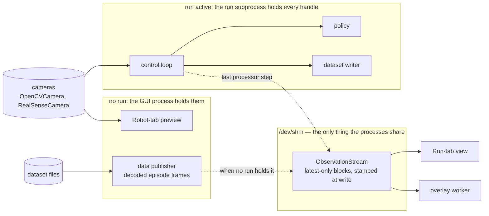
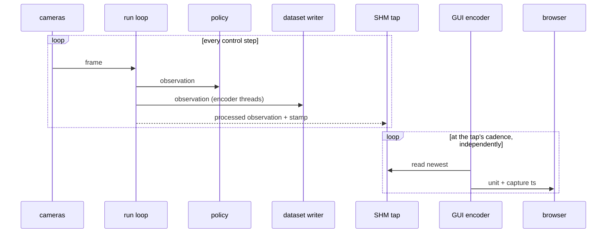
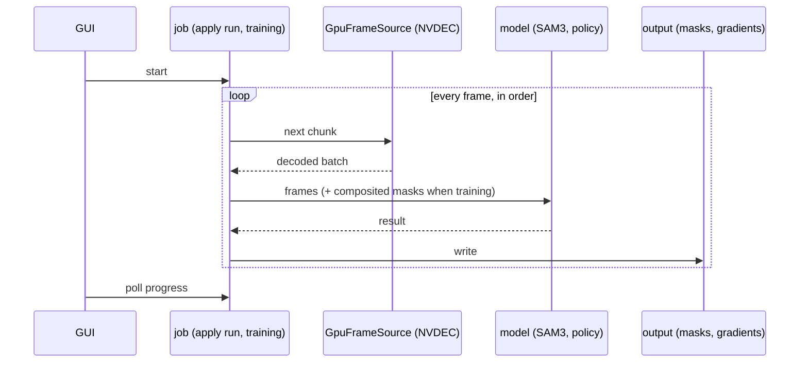
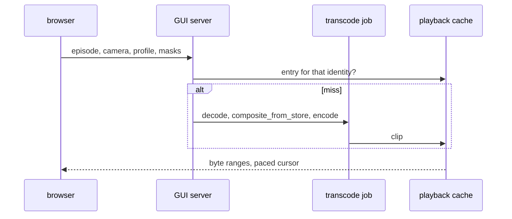
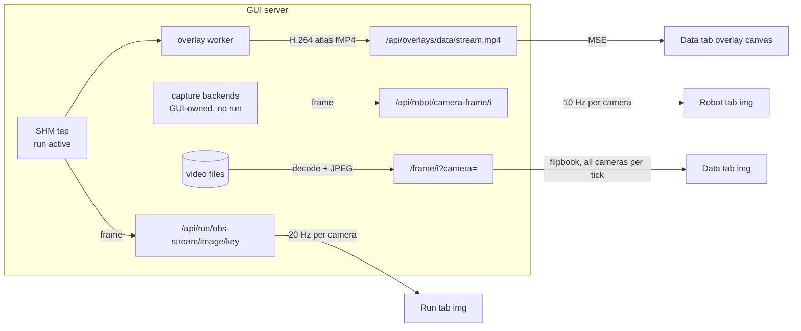
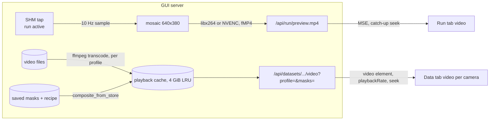
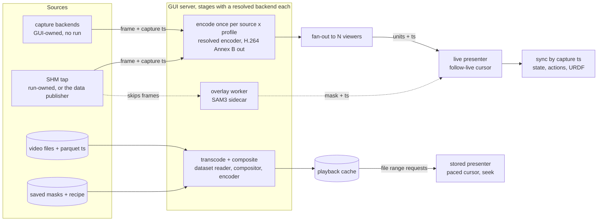
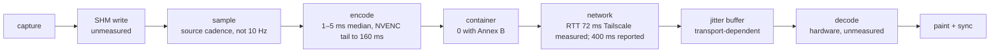

# Camera video transport

How camera pixels reach the browser, for the three surfaces that show them:
the Data tab (stored episodes), the Run tab (live teleop and inference) and
the Robot tab (camera preview). This is a design under review, not a
description of shipped behaviour; the "where we are" sections describe what
exists, everything after them is proposed.

Client is a desktop browser on an arbitrary laptop. Server is the GUI host,
which usually has a capable GPU (both current rigs carry an RTX 5090) but may
not — a Mac, or a box with no GPU at all, must still work with every stage on
its software floor — and, until the robot host and GUI server are split
further, sits next to the robot. Phone and tablet clients are out of scope
for now.

## Requirements

Three surfaces, three sources. What differs between them is the source and
the clock, not the pixels.

**Data tab** — the source is stored video plus per-frame timestamps in
parquet. The codec is whatever the recorder chose: SVT-AV1 by default, H.264
or HEVC when configured, a hardware encoder (`h264_nvenc`, `hevc_nvenc`,
VideoToolbox, VA-API, QSV) when `vcodec=auto` finds one; older datasets store
per-frame images instead of video. Offline: an upfront delay is acceptable if
playback is then smooth. Playing the video with the stored masks composited
in at 2x is a goal; faster is nice to have. Must scrub (random access to a
frame). Masks are part of the picture, in three distinct modes (see the
vocabulary below).

**Run tab** — the source is the running process's latest frame, published
through shared memory (`ObservationStreamReader.read_image` returns the pixels
and their capture time). Wall clock, 1:1. Latency-sensitive, teleop most of
all: the network already costs the operator hundreds of milliseconds, so the
pipeline may not add a budget of its own. Video must stay in step with the
state and action readouts and the URDF view shown beside it, or the operator
sees a robot that moves before its picture does. Overlays (SAM3, saliency) are
computed on the side; they must skip frames, never hold the video back.

**Robot tab** — the source is the device itself (an `OpenCVCamera` or
`RealSenseCamera` handle the GUI process opens when no run is active and
releases before one starts). A preview: latency matters
less, but it should be the same path as the Run tab so there is one thing to
maintain and one thing that can break.

Common to all three: one desktop browser client, a link that may be a LAN,
Tailscale or worse, and a server GPU that should do the heavy work.

## Every reader of the cameras and of the files

Two origins: the cameras, and the files the recorder wrote from them. Every
consumer of camera pixels reads one of the two, and what separates the
consumers is when they run, how fast they must keep up and whether a dropped
frame is allowed — not which tab they belong to. The viewer is one row in
that list; the rows that matter more are the ones that must never drop.

### Who holds the cameras

Capture is `OpenCVCamera` (any UVC device, through V4L2 on Linux: the Arducam
wrists and the ZED-M top camera on the OpenArm2 rig — the ZED's side-by-side
frame is halved by `split_stereo_frame` — and the wrist and front cameras on
the SO-107 bench) or `RealSenseCamera` (librealsense: the SO-107 bench's top
camera). `zmq` and `reachy2` are network cameras behind the same interface. A
device handle belongs to one process at a time, and which process that is
depends on whether a run is active:



- **A run is active.** The run subprocess opens every camera. Its loop reads
  them and feeds the policy and the dataset writer in-process, in order; the
  last step of the observation processor copies the processed observation
  into the SHM blocks (`ObservationStreamWriterStep`), under a contract that
  no policy, control, safety or recording path may depend on that copy
  succeeding. The GUI never touches the device: the Run tab and the overlay
  worker read the tap, and `/api/robot/detect-cameras` refuses to open
  previews while the run is alive.
- **No run is active.** The GUI process opens the devices itself for the
  Robot-tab previews (`_preview_cameras` in `gui/api/robot.py`) and releases
  them before a run starts. For the Data tab's overlay preview it starts a
  _data publisher_ that writes decoded episode frames into the same SHM
  blocks, so the overlay worker has one input in both cases; the publisher
  refuses to start while a run owns the stream.

So the SHM block is not a fourth source. It is the loop's copy of the
cameras, stamped, with a second writer — decoded files — when no loop is
running. Earlier drafts drew "SHM" and "V4L2 / RealSense" side by side as if
they were peers; they are the same cameras under two owners, and the
presenter must not be able to tell which one it is watching.

### The consumers

| Consumer                      | Reads                   | Runs         | Keeps up by              | May drop | Decoder                                      | Segmenter           | Compositor                                   | Encoder                                                 |
| ----------------------------- | ----------------------- | ------------ | ------------------------ | -------- | -------------------------------------------- | ------------------- | -------------------------------------------- | ------------------------------------------------------- |
| Policy inference              | cameras, in the loop    | during a run | real time                | never    | capture backend                              | —                   | —                                            | —                                                       |
| Dataset writer                | cameras, in the loop    | during a run | real-time encode threads | never    | capture backend                              | —                   | —                                            | `VideoEncodingManager` (PyAV; SVT-AV1, H.264, HEVC, hw) |
| Run-tab view                  | tap                     | during a run | newest wins              | yes      | —                                            | —                   | —                                            | ffmpeg H.264 mosaic (branch); JPEG per poll (`main`)    |
| Overlay preview, live         | tap                     | during a run | skips                    | yes      | —                                            | SAM3 overlay worker | —                                            | ffmpeg H.264 atlas                                      |
| Robot-tab preview             | cameras, GUI process    | no run       | newest wins              | yes      | capture backend                              | —                   | —                                            | JPEG per poll                                           |
| Training loader               | files, saved masks      | job          | throughput               | never    | torchcodec (CPU) or `GpuFrameSource` (NVDEC) | —                   | `GpuMaskComposite` or `composite_from_store` | —                                                       |
| Apply run (mask pass)         | files                   | job          | lock-step                | never    | `GpuFrameSource` (NVDEC), CPU read fallback  | SAM3 process worker | —                                            | masks: `mask_store.write_episode`                       |
| Playback, plain or composited | files, saved masks      | view         | paced, buffered, seeks   | no       | ffmpeg                                       | —                   | `composite_from_store`                       | ffmpeg H.264 into the playback cache                    |
| Overlay preview, stored       | files → publisher → tap | view         | skips                    | yes      | torchcodec (GUI)                             | SAM3 overlay worker | —                                            | ffmpeg H.264 atlas                                      |
| Hub transfer, merge, export   | files as bytes          | job          | —                        | —        | none                                         | —                   | —                                            | none                                                    |

The three mask modes the UI names are three of these rows, and the earlier
draft was wrong to set them apart as vocabulary: **overlay preview** (the
live and stored rows — approximate, skips, never written), the **apply run**
(a job-class reader of the files exactly like training, down to decoding
through training's `GpuFrameSource`; its product is the saved masks) and
**composited playback** (a view-class reader like plain playback, which reads
what the apply run wrote and recomputes nothing). The distinction that
survives is the class of the row — real time, job, or view — because that is
what decides whether a frame may be dropped and who waits for whom.

### Three sequences

The rows fall into three shapes at run time.

**During a run.** The loop is the only critical path. The GUI's encoder reads
the tap at its own cadence and nothing in the loop waits for it.



**A job.** The apply run and a training run have the same shape: read every
frame in order through the GPU decoder, run the model, write the product.
Nothing waits on a viewer; the GUI polls progress.



**A view.** Playback asks for a clip by identity (episode, camera, profile,
recipe fingerprint); the cache answers or a transcode fills it; the browser
paces itself. A second viewer of the same identity costs a cache read.



### What is shared, what is duplicated

Shared today, by design:

- _The compositor._ One definition, two backends — `composite_from_store` on
  the CPU, `GpuMaskComposite` batched on the device (4.6–7.3 ms per 720p
  frame on the CPU against about 0.2 ms batched, per its module note) —
  pinned equal on real rows by
  `tests/datasets/test_gpu_composite_equivalence.py`. The playback clip calls
  the CPU definition at display scale (5–18 ms per frame, commit 8f040758c),
  so a recipe renders the same in the training batch, the playback clip and
  the apply run. A third compositor written for the view would be exactly the
  drift the equivalence test exists to catch.
- _The GPU decoder._ `GpuFrameSource` serves training and the apply run;
  `_MaskFramePrefetch` decodes chunks ahead of the sequential tracker.
- _The dataset reader._ `LeRobotDataset` over `decode_video_frames`
  (torchcodec, PyAV fallback) is the CPU training loader, the apply run's
  fallback and the Data-tab frame endpoint.
- _The tap._ `ObservationStream` has two writers (the loop, the data
  publisher) and two readers (the Run-tab view, the overlay worker), never
  more than one writer at a time.
- _The stereo split._ `split_stereo_frame` is called by the live camera and by
  the offline dataset transform, and its module states the rule this section
  generalises: only the naming and the split are shared; the lifecycles are
  not — one owns a V4L2 handle, the other decodes video files.

Duplicated today:

- _Encoders._ Five ways pixels become bytes: PyAV in the recorder, three
  ffmpeg command builders in the GUI (`_preview_encoder_command` for the Run
  tab, `_stream_encoder_command` for the overlay atlas, `_transcode_episode*`
  for the Data tab), and JPEG behind every polling endpoint. Each has its own
  flag set, latency profile and bug surface. The "encode once per source ×
  profile" component proposed below replaces the three ffmpeg builders and
  the JPEG endpoints. The recorder stays separate on purpose: it must not
  drop, and a queue shared with a consumer that may drop is a queue that
  eventually drops the wrong frame.
- _Stored decoders._ Three: torchcodec in the dataset reader, NVDEC in the
  jobs, ffmpeg in the transcodes — the last exists only because the transcode
  wants a pipe rather than frames. The stored adapter proposed below decodes
  through the dataset reader and feeds the shared compositor and encoder; it
  is a consolidation, not a new component.

Separate on purpose:

- _Two SAM3 processes._ The overlay worker (skips frames, reads the tap) and
  the process worker (lock-step, reads files) load the same weights and are
  arbitrated by the aux-GPU slot. They cannot share a queue: one consumer may
  drop and the other may not. What they can share is the model call and the
  mask codec, and they do.

The rule from `stereo.py` is the rule for the whole table: share the
operation, never the lifecycle. A consumer that must not drop and one that
may can share a function, a model and a file format; they cannot share a
queue, a thread or a device handle.

### Where the legs collide, and the rule for each

- _The encoder budget._ The recorder encodes every camera in real time in its
  own threads — SVT-AV1 on the CPU on the rig today, NVENC when `vcodec=auto`
  finds it. The branch's preview encoders are libx264 pinned to one thread
  per viewer, on the same CPU. Moving previews to NVENC frees the CPU but
  spends sessions: three recorded cameras on NVENC plus three preview
  cameras at one profile is six of the eight. The budget is written down per
  deployment and the view is the leg that yields.
- _The decode engines._ Two job-class readers use NVDEC today, training and
  the apply run, both through `GpuFrameSource`, with nothing arbitrating
  between them beyond the aux-GPU slot the apply run holds. Playback
  transcodes and the frame endpoint decode in software, so the view is not a
  third contender — a reason not to move it to NVDEC without a measured need,
  and if it moves, it yields to the jobs.
- _The clock._ Dataset timestamps are episode-relative (frame index over
  fps); SHM stamps are wall clock at write. Each is the right clock for its
  side, and the view's job is to carry the source's stamp rather than
  re-stamp at encode time. On the live side the blocks of one loop iteration
  are written together, and the image block's stamp is the join key for
  state and action.
- _The process boundary._ The loop and the GUI are separate processes; the
  tap is the only thing they share. Nothing in this design adds a second
  channel into the run process.

The industry comparison below has to be read with this in mind: Foxglove and
Rerun specify the view leg and nothing else.

## Where we are: `main`

Every surface polls JPEG stills over HTTP.



What it costs, measured:

- Data tab, 3 cameras at 30 fps: 324 KB per tick, 78 Mbit/s sustained. No
  remote link carries that; playback stalls and skips (commit a4b0db5c3).
- Run tab over Tailscale: each 20 Hz request pays the round trip; the
  cache-busted JPEG polling was the reason the low-bandwidth preview was built
  (commit e0a76d076).

One thing on `main` is already the shape proposed below: the Data-tab overlay
preview streams a server-composited H.264 atlas as fragmented MP4 over MSE
(`overlays.py` `_stream_encoder_command`, `overlay_stream.js`), lock-step with
the overlay worker, latest-wins. It is the only path that does not poll.

## Where we are: `feat/camera-video-transport`

Two separate implementations, one per surface.



Run tab: one H.264 stream per viewer, a fixed 640x380 mosaic of the cameras
at 10 fps, encoded by a per-viewer ffmpeg. Measured over Tailscale
(RTT 72.2 ms): 1.18 Mbit/s, first frame after 498 ms, source-to-display age
about 0.4 s median and 0.60 s p95, not accumulating (commit e0a76d076).

Data tab: each camera is a `<video>` playing a transcoded clip (`low` 640 px
at 500 kbit/s, `medium` 1280 px at 1500 kbit/s, `full` = remux without
re-encode), scrubbing and `playbackRate` come from the element. Saved masks
are composited into the clip on the server when asked for, keyed by recipe
fingerprint and profile. Measured: 6.7 KB per frame at `medium`, 1.61 Mbit/s,
48x less than the JPEG flipbook; a `full` remux prepares in 0.06 s against
0.44 s for `medium` (commit a4b0db5c3).

What is wrong with it as an end state, and what the redesign must fix:

- The Run path carries no timestamps. The browser shows the newest decoded
  picture and the URDF tile polls state at 30 Hz; nothing aligns them.
- The live source is sampled at 10 fps into a mosaic whose layouts are written
  for one rig (`_PREVIEW_MOSAIC_RECT_OPTIONS`). The cadence alone puts a
  100 ms period between samples.
- Each viewer owns an encoder. Two operators watching is two encodes.
- The Robot tab is untouched and still polls.
- MSE is a buffered player. Staying at the live edge is a catch-up heuristic
  (`end - currentTime > 0.6 → seek`), which is a seam the operator can see.

## Measurements that shape the design

**Codec compute is not the cost.** Per-frame latency from frame-in to the
encoded unit out, idle RTX 5090, 150 frames per row, medians (script
`enc_latency2.py`; full table with p95/max in the appendix):

- libx264, fMP4 container: 102.5 ms at 640x380@10, 35.4 ms at 30 fps, 38.0 ms
  at 720p30 — one frame period each time. The MP4 muxer holds a packet until
  the next one arrives to write its duration.
- libx264, raw Annex B (`-f h264 -flush_packets 1`): 2.3 / 2.2 / 4.6 ms.
- h264_nvenc, fMP4, default settings: 300.8 / 101.0 / 101.6 ms — three frame
  periods: NVENC's default two-frame output delay plus the muxer hold.
- h264_nvenc, fMP4, `-delay 0`: 101.1 / 34.6 / 35.5 ms — one period.
- h264_nvenc, Annex B, `-delay 0`: 1.1 / 1.2 / 2.1 ms median; p95 up to about
  101 ms and max about 150–163 ms, so NVENC has a tail the software encoder
  does not.

The latency in the current live path is therefore sampling cadence (one
period), the container (one period), NVENC's default delay (two periods when
enabled), and the player's buffer — each of them a design choice, none of them
codec work.

**Browser capabilities depend on the origin, not the browser.** Probed with
headless Chromium 151 (`codec_probe2.py`): over plain `http://` on the LAN IP
or the Tailscale IP, `isSecureContext` is false and `VideoDecoder` (WebCodecs)
and `WebTransport` are undefined; MSE, `requestVideoFrameCallback`,
`RTCPeerConnection` and `WebSocket` are available. On `localhost` everything
is available. The GUI is reached over plain http today, so any design that
decodes in JavaScript needs HTTPS first (Tailscale can issue a certificate for
the machine's `ts.net` name).

**GPU inventory.** RTX 5090: three NVENC engines (9th generation), two NVDEC
engines; GeForce drivers ≥ 550.54.14 allow eight concurrent NVENC sessions.
ffmpeg on both rigs exposes `h264_nvenc`, `hevc_nvenc`, `av1_nvenc` and CUDA
hwaccel decode.

## What the industry does

Robotics visualisers converged on one wire format for live video: a stream
of **timestamped, encoded access units**, decoded in the browser.

- Foxglove `CompressedVideo`: H.264 Annex B, one frame per message, its
  timestamp beside it, SPS/PPS repeated with every keyframe, no B-frames.
  Decoded with WebCodecs.
- Rerun `VideoStream` (0.24+): H.264 Annex B samples with presentation
  timestamps, same constraints, same decoder.
- Teleoperation products default to **WebRTC**: the browser's own jitter
  buffer and hardware decoder, RTP timestamps, no container, works on insecure
  origins. Latency is bounded by the jitter buffer, which the sender controls
  through pacing and keyframe policy.
- **MSE** is the right tool for stored media and acceptable for live with a
  catch-up policy; it is buffered by design.
- **WebCodecs** is the lowest-latency browser decoder and the simplest to
  synchronise (you hand it a unit with a timestamp and get a frame with the
  same timestamp back), but requires a secure context.

The shared idea, independent of transport: the frame's capture timestamp
travels with its bytes, and the receiver synchronises on it. That is what
the current live path lacks.

Those are observation tools; they say nothing about the policy or the
recorder. The all-in-one precedent is ROS 2: one image topic, and each
consumer subscribes with its own quality of service — the recorder reliable
and complete, the visualiser best-effort with a history depth of one — while
`image_transport` plugins (compressed, ffmpeg) put the viewer's compression
in the subscriber's path, never the publisher's. That is the SHM tap by
another name, and the reason the view's encoder lives in the GUI process.

## Proposed architecture

One frame model, three source adapters, two cursor policies, one presenter.



**Frame model.** Every unit that leaves the server carries the capture
timestamp of the frame it encodes: for live frames the SHM stamp, for stored
frames the parquet timestamp. Nothing downstream is allowed to invent a time.

**Source adapters.** One per source, each producing (pixels, capture ts) at
the source's own cadence: the capture backend for the Robot tab (the GUI
holds the handle, no run active), the SHM reader for the Run tab (the run
holds the handle), the dataset reader for the Data tab. The first two are the
same cameras under two owners, which is why both must produce the same shape:
the presenter cannot tell which it is watching. Adapters own nothing else.

**Encode once, fan out.** A live source is encoded once per (source,
profile) into H.264 Annex B access units, and the units are fanned out to
every viewer of that profile. Viewers cost bandwidth, not encoder time. Which
encoder produces the units is resolved per host (below); the low-latency
flags each one needs (`-delay 0` on NVENC, `-tune zerolatency` on libx264)
live inside the stage and are not visible past it. The stored case does not
go through the live encoder at all: it is a transcode whose product is a file
in the playback cache, exactly as on the branch today.

**Cursor policies.** Live surfaces run a _follow-live_ cursor: present the
newest decoded frame, drop anything older, never buffer ahead of the newest
unit. Stored surfaces run a _paced_ cursor: rate × wall clock, seekable,
buffered ahead as much as it likes. These are the only two, and a surface
picks one.

**Presenter.** One client component that decodes units, keeps the last
presented capture timestamp, and paints. Overlays are separate streams keyed
by the same timestamps and painted over the frame whose timestamp they
match — or not at all, if they are late. State, actions and the URDF pose are
read at the presented frame's timestamp, not at "now".

**Profiles.** `low`, `medium`, `full` remain the quality vocabulary for both
live and stored, chosen by the viewer. A profile is part of a stream's or a
cache entry's identity, never something a job consults. A profile is a
resolution and a bitrate; it is never an encoder preset, so the same profile
means the same picture on every host.

**Backend resolution.** Each stage that can be accelerated — encode, decode,
composite, segment — has one interface, a reference implementation that runs
anywhere, and accelerated backends resolved once per host and logged. This
is the pattern the codebase already uses three times, and the transport
adopts it rather than inventing a fourth: `resolve_vcodec` walks
`HW_VIDEO_CODECS` (VideoToolbox, NVENC, VA-API, QSV) and falls to
`libsvtav1`; the training `data_path` knob is `auto`, `cpu` or `gpu`, where
`auto` checks facts (a CUDA device, a decodable codec, a dataset it can
composite, this dataset's own frames verified against the CPU decoder) and
`gpu` refuses rather than silently training on the other path — "a wrong
measurement rather than a slow one"; the apply run's `_gpu_frame_sources`
returns the CPU read with the reason logged. The encoder stage gets the same
three-way knob with the same semantics, replacing the `LEROBOT_PREVIEW_ENCODER`
override on the branch. The compositor already has the property that makes
resolution safe: the CPU definition is the reference and the GPU one is
pinned equal to it, so a host without a GPU produces the same pixels, later.

### Invariants

- Processing never consults viewer settings. An apply run, a transcode or a
  composite produces the same artefact whatever the viewer has selected.
- Quality is part of the identity. Two profiles are two streams or two cache
  entries; a recipe change is a new fingerprint and a new entry, never an
  invalidation.
- One clock. Every frame carries its capture timestamp end to end; anything
  shown beside a frame is looked up by that timestamp.
- Live never buffers ahead of the newest frame. If the link falls behind, the
  picture jumps forward; it does not lag further and further.
- Overlays skip, never stall. A late overlay is dropped; the video underneath
  does not wait.
- One encode per source and profile, regardless of the number of viewers.
- No backend is visible past its stage. The wire format is H.264 Annex B
  whichever encoder produced it; the presenter, the profiles and the cache
  identity carry no backend name; the only place a backend's name appears is
  the log line that says it was chosen.

### Latency budget, teleop

Where the time goes between the camera and the operator's eye, with the
measured terms filled in and the rest named as unmeasured.



The two terms the redesign controls are sampling (run the encoder at the
source's cadence, not a 10 Hz resample) and the container plus player buffer
(Annex B into a decoder that presents immediately). Both are measured at one
frame period each on the branch; together they are the pipeline's own budget
over the network's.

### Accelerators, and the floor without them

Both rigs carry an RTX 5090, and the design uses it: NVENC for the live
encoders, NVDEC for the jobs, CUDA for training's composite, the SAM3
sidecars. None of that is a requirement. Every stage has a floor that runs
on any host, and the point of the class model above is that a slower backend
degrades each class along the axis its consumers already accept:

- _Real time_ degrades in frame rate, never in lag. The live cursor presents
  the newest frame and never buffers ahead, so a software encoder that cannot
  keep the source's cadence produces fewer units per second, not a picture
  that falls further behind. The branch's measurement is the warning of what
  a leak looks like: libx264 into fragmented MP4 cost 102 ms per frame at
  10 fps because the muxer waited for the next frame — container behaviour
  surfacing as latency — against 2.3 ms for the same encoder into Annex B.
- _Jobs_ degrade in wall time, never in output. The apply run on the CPU read
  and training on the data-loader path produce the same masks and the same
  batches; the equivalence test is what makes that a fact rather than a hope.
- _Views_ degrade in the delay before first play — the cache fill takes
  longer — and not in playback, which is paced by the browser from a file.

What the accelerators are today, with the floor for each:

- **Live encode.** NVENC, three engines and eight sessions on the 5090: two
  sources (Run, Robot preview) at two or three profiles fit with room, and an
  inference run that records on NVENC spends one session per camera. Floor:
  libx264, one thread per stream, 2.3 ms median at 640x380 and 4.6 ms at
  720p30 into Annex B on the rig's CPU. VideoToolbox on a Mac is the first
  entry in `HW_VIDEO_CODECS` and is unmeasured; the same benchmark script
  (`enc_latency2.py`) runs there unchanged.
- **Stored decode and composite.** The jobs use NVDEC through
  `GpuFrameSource` and CUDA through `GpuMaskComposite`. The Data tab does not:
  its transcode is the dataset reader (torchcodec, PyAV where torchcodec has
  no wheel), `composite_from_store` at display scale (5–18 ms per frame, commit
  8f040758c; 7.8 → 1.9 ms per frame with the composite thread pool on a
  24-core box, per the note in `gui/api/datasets.py`) and the resolved
  encoder. Moving the
  view onto NVDEC or CUDA is an optimisation against that baseline, taken
  only with a measured need, and it yields to the jobs.
- **Segmentation.** SAM3 in both workers runs wherever torch puts it; on a
  host without CUDA that is MPS or the CPU, at a speed nobody has measured.
  The overlay preview is best-effort by construction and drops to whatever
  rate the model sustains; the apply run takes longer and stays exact.
- **The client** decodes H.264 in hardware in every browser on every platform
  and paints. That universality is a reason H.264 is the wire format: AV1
  decode in Safari depends on the machine's hardware, so playing a stored AV1
  file directly is never the only path.

Encoder contention under a fully loaded policy, with the recorder encoding at
the same time, has not been measured and is the first measurement to make on
the rig.

Blockers on a Mac that are not this design's, named so "assuming there isn't
another blocker" has a list: `ObservationStream` sweeps stale segments through
`/dev/shm` paths (`multiprocessing.shared_memory` itself works on macOS, the
sweep does not); camera discovery is V4L2 (`_linux_video_capture_candidates`),
and OpenCV opens devices through AVFoundation there; librealsense on macOS is
partial; PyNvVideoCodec is absent, which the `auto` knobs already handle.

When the robot host and the GUI server are split, the encode stage moves to
the robot host (the frames and their timestamps originate there) and the GUI
server relays units. Nothing else in the diagram changes, which is the reason
to carry timestamps with the bytes now.

## Open decisions

The forks that need a choice, with what is known about each.

1. **Live transport.** Three candidates. _WebRTC_: browser jitter buffer and
   hardware decode, works on plain http, needs a server-side implementation
   (aiortc or a small native relay) — the most moving parts. _MSE with
   in-browser remux_: keep MSE, feed it Annex B remuxed to fMP4 in JavaScript
   (jmuxer-style), which removes the muxer's one-period hold but keeps a
   buffered player and the catch-up seam. _WebCodecs over WebSocket_: simplest
   sync story and lowest latency, but needs HTTPS. Recommendation: measure
   WebRTC and WebCodecs-over-HTTPS side by side with the same source before
   choosing; the numbers above say either can beat the branch by two frame
   periods, and the difference is operational (certificates vs a relay).
2. **Per-camera streams or a mosaic.** A mosaic is one decode and one layout
   problem; per-camera streams cost more sessions but let the client lay out,
   pick and enlarge, and do not need per-rig layout tables. Recommendation:
   per-camera, since the session budget allows it and the layout tables are
   the part of the branch that does not generalise.
3. **Stored AV1: play directly or transcode.** Chrome and Firefox decode AV1;
   the `full` profile is already a remux. If the browser plays the source
   container directly, the Data tab needs no transcode for `full` and the
   cache holds only lower profiles and composites. Unverified: seek
   behaviour with `g=2` AV1 in the browser and hardware decode availability on
   the laptops in use.
4. **How `auto` picks a profile.** A manual selector exists on the branch; an
   RTT or throughput probe could pick for the user. Not decided.

## How to iterate

Put the design next to the code and review it there: this file, in a draft
PR on `feat/camera-video-transport`, with line comments as the medium. A
GitHub Discussion is a fine place for the broader thread, but the decisions
have to end up in this file, and a PR review is where a diagram or a number
gets challenged at the line it appears on.

Order of work, each a PR small enough to read:

1. Timestamps end to end on the existing branch path — carry the capture
   stamp in the fMP4 stream and read state at the presented frame's time. No
   transport change; it makes the sync claim testable.
2. The live transport spike: WebRTC and WebCodecs-over-HTTPS, same source,
   same profile, source-to-display age measured the way e0a76d076 measured it.
   Pick one.
3. Per-camera streams, encode-once fan-out, NVENC Annex B with `-delay 0`.
   Delete the mosaic layout tables.
4. Robot tab onto the same path.
5. Stored AV1 direct-play experiment for `full`.

## Appendix: encoder latency table

Frame-in to unit-out, idle RTX 5090, 150 frames, `enc_latency2.py`.

```
encoder     shape    size@fps       bitrate   median   p95     max
libx264     mp4      640x380@10     1200k    102.5   103.0   103.2
libx264     mp4      640x380@30     1200k     35.4    68.7   102.3
libx264     mp4      1280x720@30    1500k     38.0    39.0    71.5
libx264     annexb   640x380@10     1200k      2.3     2.7    20.1
libx264     annexb   640x380@30     1200k      2.2    35.4    36.2
libx264     annexb   1280x720@30    1500k      4.6     5.4    66.7
h264_nvenc  mp4      640x380@10     1200k    300.8   301.4   301.6
h264_nvenc  mp4      640x380@30     1200k    101.0   167.5   201.2
h264_nvenc  mp4      1280x720@30    1500k    101.6   135.4   168.4
h264_nvenc  mp4 -delay 0  640x380@10  1200k  101.1   101.5   160.7
h264_nvenc  mp4 -delay 0  640x380@30  1200k   34.6   101.5   165.5
h264_nvenc  mp4 -delay 0  1280x720@30 1500k   35.5    69.4   167.4
h264_nvenc  annexb   640x380@10     1200k      1.1     1.3   159.1
h264_nvenc  annexb   640x380@30     1200k      1.2   101.0   163.2
h264_nvenc  annexb   1280x720@30    1500k      2.1    35.5   150.4
```

`mp4` is the branch's `_preview_encoder_command` shape (fragment per frame,
zero-latency tuning). `annexb` is `-f h264 -flush_packets 1`. Milliseconds.
