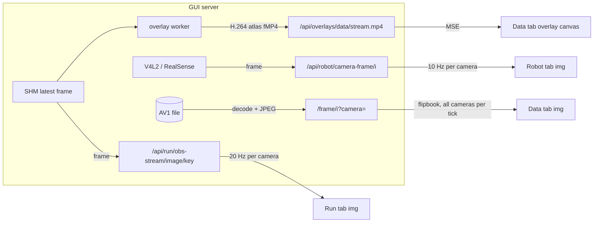
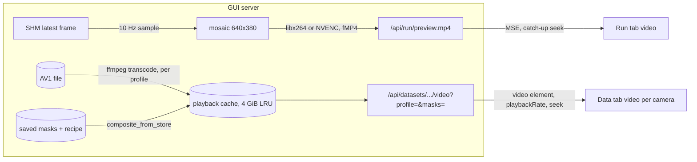
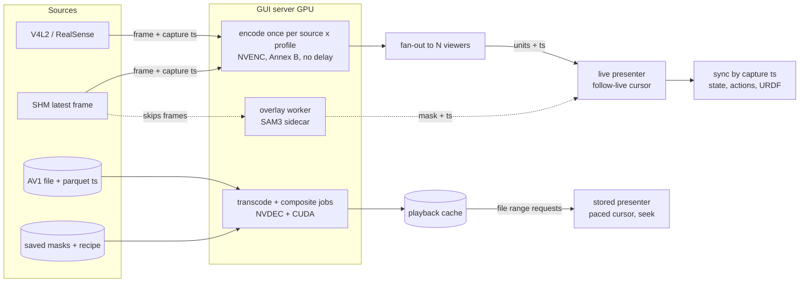
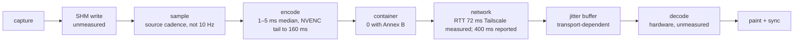

# Camera video transport

How camera pixels reach the browser, for the three surfaces that show them:
the Data tab (stored episodes), the Run tab (live teleop and inference) and
the Robot tab (camera preview). This is a design under review, not a
description of shipped behaviour; the "where we are" sections describe what
exists, everything after them is proposed.

Client is a desktop browser on an arbitrary laptop. Server is the GUI host,
which has a capable GPU (both current rigs carry an RTX 5090) and, until the
robot host and GUI server are split further, sits next to the robot. Phone and
tablet clients are out of scope for now.

## Requirements

Three surfaces, three sources. What differs between them is the source and
the clock, not the pixels.

**Data tab** — the source is a stored AV1 file plus per-frame timestamps in
parquet. Offline: an upfront delay is acceptable if playback is then smooth.
Must play at 2x and faster, and scrub (random access to a frame). Masks are
part of the picture, in three distinct modes (see the vocabulary below).

**Run tab** — the source is the running process's latest frame, published
through shared memory (`ObservationStreamReader.read_image` returns the pixels
and their capture time). Wall clock, 1:1. Latency-sensitive, teleop most of
all: the network already costs the operator hundreds of milliseconds, so the
pipeline may not add a budget of its own. Video must stay in step with the
state and action readouts and the URDF view shown beside it, or the operator
sees a robot that moves before its picture does. Overlays (SAM3, saliency) are
computed on the side; they must skip frames, never hold the video back.

**Robot tab** — the source is the device itself (a V4L2 or RealSense handle
the GUI owns and releases before a run starts). A preview: latency matters
less, but it should be the same path as the Run tab so there is one thing to
maintain and one thing that can break.

Common to all three: one desktop browser client, a link that may be a LAN,
Tailscale or worse, and a server GPU that should do the heavy work.

### Vocabulary: the three mask modes

These are easy to conflate and the design depends on keeping them apart.

- **Overlay preview** — the segmenter runs live on the frames being shown and
  the result is painted over them. Approximate by design (it drops frames
  under load), never written anywhere. A view.
- **Apply run** — the segmenter runs in lock-step over every frame of an
  episode and the masks are saved into the dataset ("apply while play"). Exact
  by design: the playhead waits for each frame. A processing job that happens
  to show its progress; the product is the saved masks, not the picture.
- **Composited playback** — the saved masks and the saved recipe (treatments,
  background) are rendered into the video the viewer plays. Exact, because it
  reads the stored artefact; nothing is recomputed. A view of the apply run's
  output.

So composited playback is the _read_ of the artefact the apply run _writes_.
The apply run is the only one of the three that is a job; the other two are
ways of looking.

## Where we are: `main`

Every surface polls JPEG stills over HTTP.



What it costs, measured:

- Data tab, 3 cameras at 30 fps: 324 KB per tick, 78 Mbit/s sustained. No
  remote link carries that; playback stalls and skips (commit a4b0db5c3).
- Run tab over Tailscale: each 20 Hz request pays the round trip; the
  cache-busted JPEG polling was the reason the low-bandwidth preview was built
  (commit e0a76d076).

One thing on `main` is already the shape proposed below: the Data-tab overlay
preview streams a server-composited H.264 atlas as fragmented MP4 over MSE
(`overlays.py` `_stream_encoder_command`, `overlay_stream.js`), lock-step with
the overlay worker, latest-wins. It is the only path that does not poll.

## Where we are: `feat/camera-video-transport`

Two separate implementations, one per surface.



Run tab: one H.264 stream per viewer, a fixed 640x380 mosaic of the cameras
at 10 fps, encoded by a per-viewer ffmpeg. Measured over Tailscale
(RTT 72.2 ms): 1.18 Mbit/s, first frame after 498 ms, source-to-display age
about 0.4 s median and 0.60 s p95, not accumulating (commit e0a76d076).

Data tab: each camera is a `<video>` playing a transcoded clip (`low` 640 px
at 500 kbit/s, `medium` 1280 px at 1500 kbit/s, `full` = remux without
re-encode), scrubbing and `playbackRate` come from the element. Saved masks
are composited into the clip on the server when asked for, keyed by recipe
fingerprint and profile. Measured: 6.7 KB per frame at `medium`, 1.61 Mbit/s,
48x less than the JPEG flipbook; a `full` remux prepares in 0.06 s against
0.44 s for `medium` (commit a4b0db5c3).

What is wrong with it as an end state, and what the redesign must fix:

- The Run path carries no timestamps. The browser shows the newest decoded
  picture and the URDF tile polls state at 30 Hz; nothing aligns them.
- The live source is sampled at 10 fps into a mosaic whose layouts are written
  for one rig (`_PREVIEW_MOSAIC_RECT_OPTIONS`). The cadence alone puts a
  100 ms period between samples.
- Each viewer owns an encoder. Two operators watching is two encodes.
- The Robot tab is untouched and still polls.
- MSE is a buffered player. Staying at the live edge is a catch-up heuristic
  (`end - currentTime > 0.6 → seek`), which is a seam the operator can see.

## Measurements that shape the design

**Codec compute is not the cost.** Per-frame latency from frame-in to the
encoded unit out, idle RTX 5090, 150 frames per row, medians (script
`enc_latency2.py`; full table with p95/max in the appendix):

- libx264, fMP4 container: 102.5 ms at 640x380@10, 35.4 ms at 30 fps, 38.0 ms
  at 720p30 — one frame period each time. The MP4 muxer holds a packet until
  the next one arrives to write its duration.
- libx264, raw Annex B (`-f h264 -flush_packets 1`): 2.3 / 2.2 / 4.6 ms.
- h264_nvenc, fMP4, default settings: 300.8 / 101.0 / 101.6 ms — three frame
  periods: NVENC's default two-frame output delay plus the muxer hold.
- h264_nvenc, fMP4, `-delay 0`: 101.1 / 34.6 / 35.5 ms — one period.
- h264_nvenc, Annex B, `-delay 0`: 1.1 / 1.2 / 2.1 ms median; p95 up to about
  101 ms and max about 150–163 ms, so NVENC has a tail the software encoder
  does not.

The latency in the current live path is therefore sampling cadence (one
period), the container (one period), NVENC's default delay (two periods when
enabled), and the player's buffer — each of them a design choice, none of them
codec work.

**Browser capabilities depend on the origin, not the browser.** Probed with
headless Chromium 151 (`codec_probe2.py`): over plain `http://` on the LAN IP
or the Tailscale IP, `isSecureContext` is false and `VideoDecoder` (WebCodecs)
and `WebTransport` are undefined; MSE, `requestVideoFrameCallback`,
`RTCPeerConnection` and `WebSocket` are available. On `localhost` everything
is available. The GUI is reached over plain http today, so any design that
decodes in JavaScript needs HTTPS first (Tailscale can issue a certificate for
the machine's `ts.net` name).

**GPU inventory.** RTX 5090: three NVENC engines (9th generation), two NVDEC
engines; GeForce drivers ≥ 550.54.14 allow eight concurrent NVENC sessions.
ffmpeg on both rigs exposes `h264_nvenc`, `hevc_nvenc`, `av1_nvenc` and CUDA
hwaccel decode.

## What the industry does

Robotics visualisers converged on one wire format for live video: a stream
of **timestamped, encoded access units**, decoded in the browser.

- Foxglove `CompressedVideo`: H.264 Annex B, one frame per message, its
  timestamp beside it, SPS/PPS repeated with every keyframe, no B-frames.
  Decoded with WebCodecs.
- Rerun `VideoStream` (0.24+): H.264 Annex B samples with presentation
  timestamps, same constraints, same decoder.
- Teleoperation products default to **WebRTC**: the browser's own jitter
  buffer and hardware decoder, RTP timestamps, no container, works on insecure
  origins. Latency is bounded by the jitter buffer, which the sender controls
  through pacing and keyframe policy.
- **MSE** is the right tool for stored media and acceptable for live with a
  catch-up policy; it is buffered by design.
- **WebCodecs** is the lowest-latency browser decoder and the simplest to
  synchronise (you hand it a unit with a timestamp and get a frame with the
  same timestamp back), but requires a secure context.

The shared idea, independent of transport: the frame's capture timestamp
travels with its bytes, and the receiver synchronises on it. That is what
the current live path lacks.

## Proposed architecture

One frame model, three source adapters, two cursor policies, one presenter.



**Frame model.** Every unit that leaves the server carries the capture
timestamp of the frame it encodes: for live frames the SHM stamp, for stored
frames the parquet timestamp. Nothing downstream is allowed to invent a time.

**Source adapters.** One per source, each producing (pixels, capture ts) at
the source's own cadence: the device reader for the Robot tab, the SHM reader
for the Run tab, the decoder for the Data tab. Adapters own nothing else.

**Encode once, fan out.** A live source is encoded once per (source,
profile), on NVENC in Annex B with `-delay 0`, and the units are fanned out
to every viewer of that profile. Viewers cost bandwidth, not GPU. The stored
case does not go through the live encoder at all: it is a transcode job whose
product is a file in the playback cache, exactly as on the branch today.

**Cursor policies.** Live surfaces run a _follow-live_ cursor: present the
newest decoded frame, drop anything older, never buffer ahead of the newest
unit. Stored surfaces run a _paced_ cursor: rate × wall clock, seekable,
buffered ahead as much as it likes. These are the only two, and a surface
picks one.

**Presenter.** One client component that decodes units, keeps the last
presented capture timestamp, and paints. Overlays are separate streams keyed
by the same timestamps and painted over the frame whose timestamp they
match — or not at all, if they are late. State, actions and the URDF pose are
read at the presented frame's timestamp, not at "now".

**Profiles.** `low`, `medium`, `full` remain the quality vocabulary for both
live and stored, chosen by the viewer. A profile is part of a stream's or a
cache entry's identity, never something a job consults.

### Invariants

- Processing never consults viewer settings. An apply run, a transcode or a
  composite produces the same artefact whatever the viewer has selected.
- Quality is part of the identity. Two profiles are two streams or two cache
  entries; a recipe change is a new fingerprint and a new entry, never an
  invalidation.
- One clock. Every frame carries its capture timestamp end to end; anything
  shown beside a frame is looked up by that timestamp.
- Live never buffers ahead of the newest frame. If the link falls behind, the
  picture jumps forward; it does not lag further and further.
- Overlays skip, never stall. A late overlay is dropped; the video underneath
  does not wait.
- One encode per source and profile, regardless of the number of viewers.

### Latency budget, teleop

Where the time goes between the camera and the operator's eye, with the
measured terms filled in and the rest named as unmeasured.



The two terms the redesign controls are sampling (run the encoder at the
source's cadence, not a 10 Hz resample) and the container plus player buffer
(Annex B into a decoder that presents immediately). Both are measured at one
frame period each on the branch; together they are the pipeline's own budget
over the network's.

### The GPU's role

- **NVENC** encodes every live stream. Three engines and eight sessions cover
  two sources (Run, Robot preview) at two or three profiles with room to
  spare; an inference run that also encodes video for a recorder is one more
  session.
- **NVDEC + CUDA** serve the Data tab: decode the AV1 source, composite the
  saved masks, re-encode into the cache. This is a job, and today it runs on
  the decode pool through ffmpeg; moving the composite to CUDA is an
  optimisation with a measured baseline (5–18 ms per frame on CPU, 1.9 ms
  with threads) to beat.
- **The SAM3 sidecar** shares the GPU with the encoders; the overlay pipeline
  is designed to drop frames under contention, so encoding is not affected
  except by memory. Encoder contention under a fully loaded policy has not
  been measured and is the first measurement to make on the rig.
- **The client** decodes in hardware through the browser and paints. Compositing
  an overlay onto a canvas is trivial work; a laptop is enough.

When the robot host and the GUI server are split, the encode stage moves to
the robot host (the frames and their timestamps originate there) and the GUI
server relays units. Nothing else in the diagram changes, which is the reason
to carry timestamps with the bytes now.

## Open decisions

The forks that need a choice, with what is known about each.

1. **Live transport.** Three candidates. _WebRTC_: browser jitter buffer and
   hardware decode, works on plain http, needs a server-side implementation
   (aiortc or a small native relay) — the most moving parts. _MSE with
   in-browser remux_: keep MSE, feed it Annex B remuxed to fMP4 in JavaScript
   (jmuxer-style), which removes the muxer's one-period hold but keeps a
   buffered player and the catch-up seam. _WebCodecs over WebSocket_: simplest
   sync story and lowest latency, but needs HTTPS. Recommendation: measure
   WebRTC and WebCodecs-over-HTTPS side by side with the same source before
   choosing; the numbers above say either can beat the branch by two frame
   periods, and the difference is operational (certificates vs a relay).
2. **Per-camera streams or a mosaic.** A mosaic is one decode and one layout
   problem; per-camera streams cost more sessions but let the client lay out,
   pick and enlarge, and do not need per-rig layout tables. Recommendation:
   per-camera, since the session budget allows it and the layout tables are
   the part of the branch that does not generalise.
3. **Stored AV1: play directly or transcode.** Chrome and Firefox decode AV1;
   the `full` profile is already a remux. If the browser plays the source
   container directly, the Data tab needs no transcode for `full` and the
   cache holds only lower profiles and composites. Unverified: seek
   behaviour with `g=2` AV1 in the browser and hardware decode availability on
   the laptops in use.
4. **How `auto` picks a profile.** A manual selector exists on the branch; an
   RTT or throughput probe could pick for the user. Not decided.

## How to iterate

Put the design next to the code and review it there: this file, in a draft
PR on `feat/camera-video-transport`, with line comments as the medium. A
GitHub Discussion is a fine place for the broader thread, but the decisions
have to end up in this file, and a PR review is where a diagram or a number
gets challenged at the line it appears on.

Order of work, each a PR small enough to read:

1. Timestamps end to end on the existing branch path — carry the capture
   stamp in the fMP4 stream and read state at the presented frame's time. No
   transport change; it makes the sync claim testable.
2. The live transport spike: WebRTC and WebCodecs-over-HTTPS, same source,
   same profile, source-to-display age measured the way e0a76d076 measured it.
   Pick one.
3. Per-camera streams, encode-once fan-out, NVENC Annex B with `-delay 0`.
   Delete the mosaic layout tables.
4. Robot tab onto the same path.
5. Stored AV1 direct-play experiment for `full`.

## Appendix: encoder latency table

Frame-in to unit-out, idle RTX 5090, 150 frames, `enc_latency2.py`.

```
encoder     shape    size@fps       bitrate   median   p95     max
libx264     mp4      640x380@10     1200k    102.5   103.0   103.2
libx264     mp4      640x380@30     1200k     35.4    68.7   102.3
libx264     mp4      1280x720@30    1500k     38.0    39.0    71.5
libx264     annexb   640x380@10     1200k      2.3     2.7    20.1
libx264     annexb   640x380@30     1200k      2.2    35.4    36.2
libx264     annexb   1280x720@30    1500k      4.6     5.4    66.7
h264_nvenc  mp4      640x380@10     1200k    300.8   301.4   301.6
h264_nvenc  mp4      640x380@30     1200k    101.0   167.5   201.2
h264_nvenc  mp4      1280x720@30    1500k    101.6   135.4   168.4
h264_nvenc  mp4 -delay 0  640x380@10  1200k  101.1   101.5   160.7
h264_nvenc  mp4 -delay 0  640x380@30  1200k   34.6   101.5   165.5
h264_nvenc  mp4 -delay 0  1280x720@30 1500k   35.5    69.4   167.4
h264_nvenc  annexb   640x380@10     1200k      1.1     1.3   159.1
h264_nvenc  annexb   640x380@30     1200k      1.2   101.0   163.2
h264_nvenc  annexb   1280x720@30    1500k      2.1    35.5   150.4
```

`mp4` is the branch's `_preview_encoder_command` shape (fragment per frame,
zero-latency tuning). `annexb` is `-f h264 -flush_packets 1`. Milliseconds.
