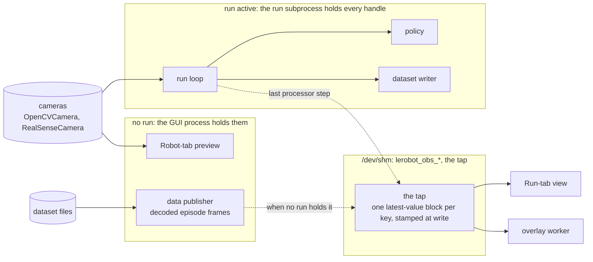
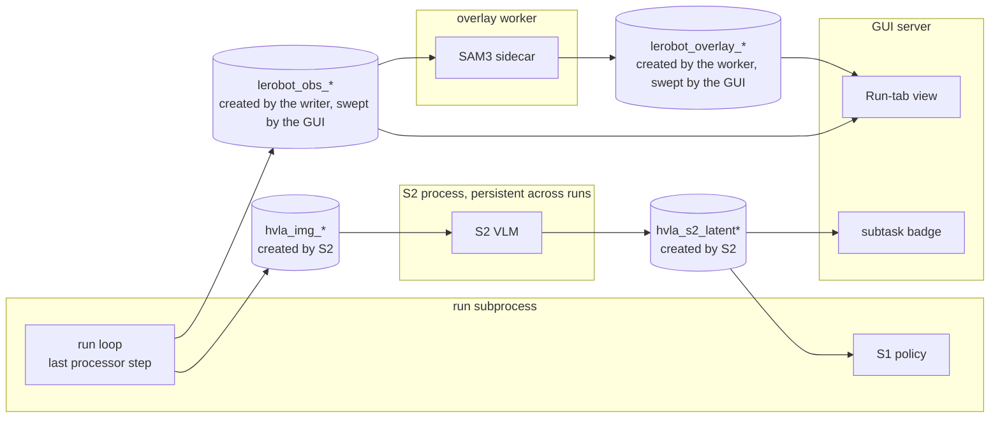
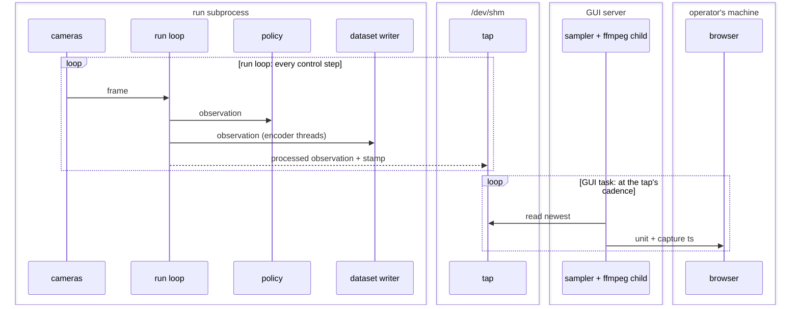
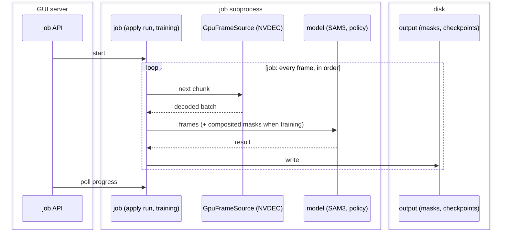
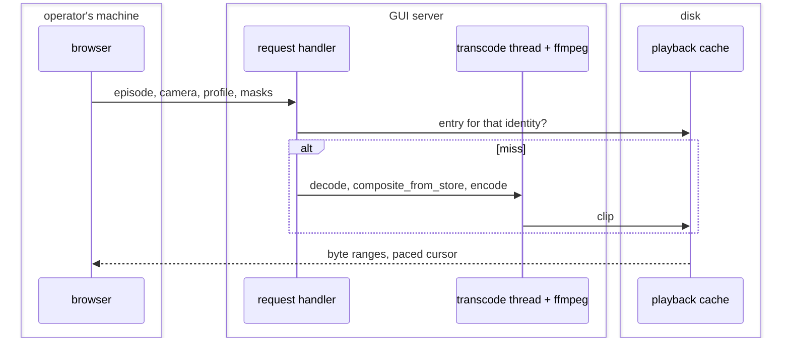
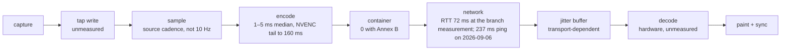

# Camera video transport

**Sealed 2026-09-06.** No further edits. The design restarts from the
reviewer's blueprint in `camera_video_pipelines.md` on branch
`design/camera-video-pipelines`; this file is kept for its
measurements (appendix A1, A6, A9, A10), which that document cites.

How camera pixels reach the browser for the Data tab (stored episodes), the
Run tab (live teleop and inference) and the Robot tab (camera preview). A
design under review. The main text is the problem, the facts that bear on
it, the trade-offs, the decisions taken, and the questions still open. The evidence is in the
[appendix](#a1); terms with a fixed meaning are in the
[glossary](#glossary).

## The problem

Polling JPEG stills costs a full picture per request, so the pixels must be
encoded as video at least once. The question is how to encode smartly:

- with little added latency where latency is the constraint (teleop);
- with little added compute where compute is the bottleneck (the same host
  runs the policy and the recorder, and between runs the training and mask
  jobs);
- with no duplicate work, or as little as possible, when several consumers
  read the same pixels (viewers of one camera; policy, recorder and viewer
  of one frame; readers of one file);
- accounting for platform and hardware differences (NVENC, VideoToolbox,
  or no GPU encoder at all).

The stored side must also scrub to any frame, play at 2x and show the saved
masks composited in.

## Facts

Each with its source. Numbers that depend on the network carry the day
they were measured.

1. **Bandwidth.** `main` polls stills: the Data tab needs 78 Mbit/s for
   three cameras at 30 fps. The branch streams video: 1.18 Mbit/s for the
   Run tab's mosaic, 1.61 Mbit/s for the Data tab at `medium`. ([A1](#a1))
2. **The link.** Tailscale round trip to the rig: 72 ms on the day of the
   branch's measurement, 237 ms by ping on 2026-09-06; a fresh HTTP request
   to the GUI took 0.48 s to first byte that day. ([A1](#a1))
3. **Picture age on the branch.** 0.4 s median, 0.60 s at the 95th
   percentile, at the 72 ms round trip, not growing over a session.
   ([A1](#a1))
4. **Where the branch's own delay comes from.** Encoding a frame costs
   1–5 ms. The MP4 muxer holds each frame one frame period (100 ms at
   10 fps, measured) because it takes the duration from the next frame's
   timestamp. NVENC's default settings add two more periods. The [MSE](#g-mse) player
   buffers and the branch seeks it back past 0.6 s. ([A1](#a1c), [A6](#a6))
5. **Who owns the cameras.** One process at a time: the [run subprocess](#g-run)
   during a run, the GUI otherwise. During a run the loop's last processing
   step copies each observation into shared memory (the [tap](#g-tap)), a
   write that waits for nothing; the tap is one per host, created by its
   writer, [swept](#g-sweep) by the GUI, with no delivery or freshness guarantee.
   ([A2](#a2), [A3](#a3))
6. **HVLA.** The same step also copies the same pixels into segments that
   the [S2 process](#g-s1-s2) owns and the GUI never touches. The shared-memory block
   is implemented twice with one header and protocol. ([A4](#a4))
7. **Consumers.** Ten read the cameras or the files. Three never drop a
   frame (policy, recorder, jobs); the rest are views that may. Shared
   today with an equivalence test: the mask [compositor](#g-compositor), the GPU decoder,
   the dataset reader. Duplicated today: one encoder process per open
   browser tab, five encoders, three stored decoders. ([A5](#a5))
8. **Hardware.** The rig's 5090 allows eight NVENC sessions; the recorder
   encodes on the CPU (SVT-AV1) or on NVENC when `vcodec=auto` finds it;
   training and the [mask job](#g-apply-run) decode on NVDEC. The codebase already
   resolves GPU-or-CPU [backends](#g-backend) three times, the same way. Browsers expose
   [WebCodecs](#g-webcodecs) only on HTTPS or `localhost`; the GUI runs on plain http.
   ([A6](#a6), [A8](#a8))
9. **The branch's Data tab.** One transcoded clip per camera, [profile](#g-profile) and
   mask recipe, cached, played by the browser from a file; scrubbing and 2x
   come from the `<video>` element. It meets the stored-side needs.
   ([A1](#a1))

## Trade-offs

Each has two sides; none is decided here.

- **Frame rate against bitrate against delay.** Fewer frames per second
  cost fewer bytes and add up to one frame period of delay per frame. At
  10 fps that period is 100 ms; against a 237 ms link it is not the
  largest term.
- **Player.** MSE works on plain http and buffers by design, so it needs a
  rule to stay near the live edge. WebCodecs presents a frame as soon as it
  has it and needs HTTPS. [WebRTC](#g-webrtc) brings its own [jitter buffer](#g-jitter-buffer) and hardware
  decode, works on plain http, and needs a WebRTC peer on the server.
- **Wire format.** Fragmented MP4 is what MSE accepts and costs the muxer's
  one-period hold. Raw H.264 ([Annex B](#g-annex-b)) costs nothing at the muxer and is
  what WebCodecs and WebRTC take.
- **Per-camera streams against a mosaic.** A mosaic is one encode and one
  decode, and its layout table fits one robot's camera names. Per-camera
  costs one encoder session per camera and profile, and lets the browser
  lay out, pick and enlarge.
- **One encode fanned out to all viewers, against one encode per viewer.**
  Fan-out saves an encoder per extra tab and adds a small server-side
  component; it only pays if more than one person watches at once.
- **GPU or CPU for the view's encode and decode.** NVENC sessions and
  NVDEC are shared with the recorder and the jobs; the CPU is shared with
  the recorder's SVT-AV1 threads. Which is the bottleneck during teleop
  and recording has not been measured.
- **Readouts at the picture's time, or newest.** Showing state, action and
  the URDF at the painted frame's time needs a capture time on every frame
  and a short state history in the browser. Showing newest values needs
  nothing. Whether the difference matters to an operator is not known.
- **Stored AV1: play the file directly or transcode.** Direct play saves
  the transcode for `full` and depends on the browser's AV1 decoder and on
  seeking with a keyframe every two frames; neither is verified.
- **The shared-memory block.** One class for the tap and HVLA saves a
  duplicate; the two channels have different owners and lifecycles, and
  merging them would give the tap a guarantee it does not have.

## What looks fixed

Stated with the reason; each is open to challenge.

- Keep the branch's Data-tab path. It meets the stored-side needs at
  1.61 Mbit/s (fact 9).
- Add nothing to the [run loop](#g-run-loop), and no second channel into the run process.
  The loop already publishes what a viewer needs (fact 5), and a viewer
  that may drop frames cannot share a queue with a consumer that may not
  (fact 7).
- The view yields shared accelerators to the recorder and the jobs, and
  resolves its backends per host with the pattern that exists (fact 8).
- Whatever the transport, carry the capture time with each frame. It is
  cheap and it makes the picture's age measurable in the browser.

## Decisions

Taken in review on 2026-09-06, each with what it settles.

1. **Latency: the lowest available.** For remote teleop the picture's
   delay must be nearly the physical delay alone, that is camera exposure
   plus the network. All processing between the camera and the screen,
   added together, may cost single-digit milliseconds.

   The measurements against that budget ([A6](#a6), [A10](#a10)):
   - Encoding one frame as raw H.264 ([Annex B](#g-annex-b)) costs 1.1 ms
     on NVENC and 2.3 ms on libx264 at the median. NVENC's 95th percentile
     reaches 35–101 ms at 30 fps and its worst frame 160 ms; libx264's
     worst is 20–67 ms.
   - Every fragmented-MP4 setting measured costs at least one frame period,
     35 ms at 30 fps. The budget excludes the MP4 container, and with it
     the [MSE](#g-mse) player, which accepts nothing else.
   - The branch's 10 fps resample waits up to 100 ms for the next sample.
     The budget excludes it: the view runs at the camera's own rate.
   - Not measured: the tap write, the browser's decode and paint, and the
     end-to-end figure of any candidate. The player choice (open
     question 1) cannot be made from the numbers in hand.

2. **Viewers at once.** A run usually has one viewer and at most about
   three. Data playback may have more, each at a different part of a
   dataset. A run therefore needs at most a handful of live streams, and
   the Data tab's cached files, which serve any number of readers at any
   position, fit its case (fact 9).

## Open questions

In plain terms, with what each answer costs. All deferred on 2026-09-06.

1. **How the browser plays the live stream.** With decision 1 the stream is
   raw H.264 frames, and two players can take it. [WebCodecs](#g-webcodecs)
   decodes in the page and presents each frame as it arrives; the browser
   offers it only when the GUI is served over HTTPS (fact 8), so the rig
   needs a Tailscale certificate. [WebRTC](#g-webrtc) works on plain http
   but needs a WebRTC endpoint on the server and adds a receive buffer of
   its own whose delay is not measured. Both should be measured end to end
   with the same source before choosing.
2. **One picture per camera, or all cameras tiled into one.** The branch
   sends one video with all cameras side by side (a [mosaic](#g-mosaic))
   and the browser cuts it up. That costs one encoder and one decoder for
   any number of cameras; in return every camera gets the same frame rate
   and resolution, the tiling is fixed on the server, and it only works for
   camera names the tiling table knows ([A1](#a1c)). One video per camera
   costs an encoder and a decoder per camera, and lets the browser show one
   camera large, hide another, or give each its own quality.
3. **Which machines run the GUI server.** The rig has an NVIDIA GPU with a
   hardware encoder (fact 8). If the GUI also runs on a Mac or on a machine
   without one, the live encode must also work on the CPU or on Apple's
   encoder, and its latency there is unmeasured.
4. **The numbers beside the picture.** The Run tab shows joint angles, the
   action and the robot drawing next to the video. They can be the newest
   values the robot reported, or the values from the moment the shown
   frame was captured. At decision 1's target the two differ by
   milliseconds, so this matters little for the live view; either way it
   needs the capture time on each frame, which is already planned.
5. **Full-quality stored playback.** Datasets are stored as AV1. At the
   `full` [profile](#g-profile) the browser could play the stored file as
   it is, saving the transcode, if its AV1 decoder works and seeking in a
   file with a keyframe every two frames works; neither is verified.
   Otherwise the branch's transcode stays.

## To measure, not to decide

- CPU and GPU headroom on the rig during teleop and recording. The live
  encode runs on whichever has room; the measurement settles it.
- The camera-to-screen delay of each candidate player, with the same
  source, over the actual link, dated.

## Order of work

Review on this file, in the draft PR, with line comments; decisions are
written back here. First, capture times on the frames and the picture's
age measured in the browser, on the branch as it is; then the two players
of open question 1 side by side with that measurement; then the Robot tab
onto the same path.

## Glossary

Terms with a fixed meaning in this document, in alphabetical order.
<a name="g-age"></a>**Source-to-display age** — the time between a frame's
capture by the camera and its appearance on the operator's screen; the
number decision 1 sets the budget for. Measured on the branch by a browser report
matched to the server's per-frame capture times (commit e0a76d076).

<a name="g-annex-b"></a>**Annex B** — the raw byte form of an H.264 stream:
encoded frames one after another, each preceded by a start code, with no
container around them. A decoder can consume a frame as soon as it arrives.
Named after the annex of the H.264 standard that defines it.

<a name="g-apply-run"></a>**Apply run** — the mask pass: a job that reads
every frame of an episode in order, segments it with SAM3 in the process
worker and writes the result to the mask store. Exact, never drops, holds
the aux-GPU slot while it runs.

<a name="g-atlas"></a>**Atlas** — one image holding several cameras' frames
side by side, so that one encoder and one decoder handle all of them. The
overlay worker's output on `main` is an atlas; the branch's Run-tab mosaic
is the same idea.

<a name="g-aux-slot"></a>**Aux-GPU slot** — a process-wide mutex in the GUI
server (`lerobot.gui.gpu_slot`) over the one heavy GPU activity allowed
beside a run. The overlay worker and the process worker take it in turn; a
second activity is refused, not queued.

<a name="g-backend"></a>**Backend** — one implementation of a stage: NVENC
or libx264 for encode, NVDEC or torchcodec for decode, `GpuMaskComposite` or
`composite_from_store` for the compositor. Resolved once per host, logged,
and never visible past its stage.

<a name="g-capture-backend"></a>**Capture backend** — the class that opens a
camera device and decodes its frames: `OpenCVCamera` (V4L2 on Linux,
AVFoundation on macOS) or `RealSenseCamera` (librealsense); `zmq` and
`reachy2` for network cameras.

<a name="g-class"></a>**Class** — the property that sorts every consumer of
camera pixels: _real time_ (in the loop; never drops; degrades in frame
rate), _job_ (reads every frame in order; never drops; degrades in wall
time), _view_ (shows pixels to a person; may drop or pace; degrades in the
delay before first play).

<a name="g-compositor"></a>**Compositor** — the one definition of "masks
applied to a frame under a recipe": `composite_from_store` on the CPU,
`GpuMaskComposite` on the device, pinned equal by
`tests/datasets/test_gpu_composite_equivalence.py`.

<a name="g-data-publisher"></a>**Data publisher** — the GUI process's writer
into the tap when no run is active: decoded episode frames, for the stored
overlay preview.

<a name="g-fmp4"></a>**Fragmented MP4** — the MP4 file format cut into small
self-contained fragments so that it can be streamed and fed to a player
piece by piece. The form MSE accepts. The format writes each frame's
duration in front of the frame, so a live encoder must hold a frame until
the next one arrives ([A6](#a6)).

<a name="g-gui-server"></a>**GUI server** — the FastAPI process the browser
talks to (`lerobot.gui.server`). It owns the camera previews when no run is
active, the Run-tab sampler, the transcodes and the caches, and it launches
the run, the workers and the jobs as subprocesses.

<a name="g-jitter-buffer"></a>**Jitter buffer** — a receiver's short queue
that absorbs uneven packet arrival so that frames can be shown at a steady
rate. Its depth is delay; WebRTC sizes it from the network's observed
variation.

<a name="g-lock-step"></a>**Lock-step** — processing every frame in order,
one after another, never skipping and never running ahead; the apply run's
mode, where each mask depends on the previous frame's.

<a name="g-mask-store"></a>**Mask store** — a dataset's saved masks, written
per episode and camera by the apply run (`mask_store.write_episode`) and
read by the training loader and by composited playback.

<a name="g-mosaic"></a>**Mosaic** — the branch's Run-tab atlas: a fixed
640x380 canvas with a rectangle per camera, drawn from a layout table
(`_PREVIEW_MOSAIC_RECT_OPTIONS`) keyed on camera names.

<a name="g-mse"></a>**MSE** — Media Source Extensions, the browser interface
that lets JavaScript feed video segments (fragmented MP4) into a `<video>`
element instead of giving it a file URL. The element buffers and plays them
at 1x, as it would a file: a natural fit for stored media, a buffered one
for live.

<a name="g-nvenc"></a>**NVENC, NVDEC** — the dedicated video encoder and
decoder engines on an NVIDIA GPU, separate from the CUDA cores. An encode
"session" is one stream being encoded; consumer drivers cap concurrent
sessions ([A6](#a6)).

<a name="g-overlay-worker"></a>**Overlay worker** — the SAM3 sidecar
subprocess that reads the tap, skips frames, and publishes RGBA overlays and
masks into `lerobot_overlay_*` for the live and stored overlay previews.
Best-effort by contract.

<a name="g-playback-cache"></a>**Playback cache** — the directory of
transcoded clips the Data tab plays, keyed by episode, camera, profile and
recipe fingerprint; filled by a transcode on a miss, pruned after each build.

<a name="g-process-worker"></a>**Process worker** — the subprocess that runs
an apply run (`lerobot.gui.process_worker`): decodes through
`GpuFrameSource`, segments in lock step, writes the mask store.

<a name="g-profile"></a>**Profile** — a resolution and a bitrate under a name
(`low`, `medium`, `full`). Part of a stream's or a cache entry's identity;
never an encoder preset, never consulted by a job.

<a name="g-recipe"></a>**Recipe** — the per-region treatments a dataset's
masks are composited with. Its fingerprint is part of a composited clip's
identity; a changed recipe is a new entry, not an invalidation.

<a name="g-run"></a>**Run, run subprocess** — a teleop, record, replay or
inference session, launched by the GUI server as a subprocess
(`lerobot-teleoperate`, `lerobot-record`, and so on). It holds every camera
for its lifetime.

<a name="g-run-loop"></a>**Run loop** — the control loop inside the run
subprocess: read the cameras, feed the policy and the dataset writer, copy
into the tap, at the robot's control rate. The only real-time path.

<a name="g-s1-s2"></a>**S1, S2** — HVLA's two systems. S2 is a
vision-language model in its own process, producing a latent and a subtask
at its own rate; S1 is the policy in the run loop, conditioned on S2's
latest latent and its age through the `hvla_*` shared-memory channel.

<a name="g-stage"></a>**Stage** — one step of the view pipeline with a fixed
interface and resolvable backends: decode, composite, segment, encode.

<a name="g-sweep"></a>**Sweep** — removing shared-memory segments left behind
by a writer that exited without cleaning up. The GUI sweeps `lerobot_obs_*`
and `lerobot_overlay_*`; nobody sweeps `hvla_*`.

<a name="g-tap"></a>**Tap** — the `lerobot_obs_*` shared-memory segments
(`ObservationStream`): the run loop's latest-value copy of the processed
observation, one block per key, stamped at write, best-effort by contract.
Written by the loop during a run and by the data publisher otherwise; read
by the Run-tab view and the overlay worker. [A3](#a3).

<a name="g-torn-read"></a>**Torn read** — a copy taken while the writer was
in the middle of replacing the value, so that it holds part of the old
frame and part of the new. The tap's sequence counters let a reader detect
this and report it instead of returning the mixed frame.

<a name="g-transcode"></a>**Transcode** — decoding a stored video and
re-encoding it in another codec, resolution or bitrate. A re-wrap (remux)
changes only the container around the encoded frames and does not touch the
pixels; the `full` profile is a re-wrap.

<a name="g-unit"></a>**Unit** — one encoded access unit, a frame's worth of
H.264 Annex B, carrying its capture timestamp. What the live encoder emits
and the presenter decodes.

<a name="g-webcodecs"></a>**WebCodecs** — the browser interface that gives
JavaScript direct access to the hardware video decoder: a unit goes in with
a timestamp, a decoded frame comes out with the same one. Available only on
a secure context (HTTPS or `localhost`).

<a name="g-webrtc"></a>**WebRTC** — the browser's built-in real-time media
stack (used by video calls): packets over UDP, a jitter buffer, hardware
decode, timestamps carried by the transport, no container. Works on plain
http, but needs a WebRTC peer on the server side.

<a name="g-wire-format"></a>**Wire format** — what crosses the network: H.264
Annex B units for live surfaces, byte ranges of a clip in the playback cache
for stored ones. The same whichever backend produced the bytes.

## Appendix: the evidence behind each observation

### A1. The two current paths

<a name="a1"></a>

<a name="o1a"></a>**On `main`, every surface polls JPEG stills over HTTP.**
The browser asks for a picture, the server encodes the newest frame as a
JPEG and answers, and the browser asks again.


Measured:

- Data tab, 3 cameras at 30 fps: 324 KB per tick, 78 Mbit/s sustained. No
  remote link carries that; over Tailscale, playback stalls and skips
  (commit a4b0db5c3).
- Run tab over Tailscale: each 20 Hz request pays a full network round
  trip before its picture can be shown, and the picture is a still, so the
  frame rate the operator sees is bounded by the round trip
  (commit e0a76d076).

One path on `main` does not poll: the Data-tab overlay preview streams a
server-composited H.264 [atlas](#g-atlas) as
[fragmented MP4](#g-fmp4) over MSE (`overlays.py`
`_stream_encoder_command`, `overlay_stream.js`), fed by the
[overlay worker](#g-overlay-worker), newest frame wins.

<a name="o1b"></a>**On `feat/camera-video-transport`, two surfaces stream
encoded video, each its own way.**


_Run tab._ The [GUI server](#g-gui-server) samples the tap ten times a second, draws the
cameras into one 640x380 [mosaic](#g-mosaic), pipes the mosaic frames into
an ffmpeg process that encodes H.264 into fragmented MP4, and streams the
result to the browser, which plays it through MSE. Measured over Tailscale
with a round-trip time of 72.2 ms on that day (the same link measured
237 ms by ping on 2026-09-06, 20 packets, 235–244 ms, and 0.48 s to first
byte for a fresh HTTP request to the GUI): 1.18 Mbit/s; the first frame appears
498 ms after the request; the [source-to-display age](#g-age) is about
0.4 s median and 0.60 s at the 95th percentile, and does not grow over a
session (commit e0a76d076).

_Data tab._ Each camera is a `<video>` element playing a clip
[transcoded](#g-transcode) from the stored file into a profile: `low` is
640 px wide at 500 kbit/s, `medium` is 1280 px at 1500 kbit/s, and `full`
is the stored file re-wrapped without re-encoding. Scrubbing and 2x speed
come from the element. Saved masks are composited into the clip on the
server when the viewer asks for them, and the result is stored in the
[playback cache](#g-playback-cache) under the episode, camera, profile and the
[recipe](#g-recipe)'s fingerprint, so a second viewer of the same clip
reads the file. Measured: 6.7 KB per frame at `medium`, 1.61 Mbit/s, 48x
less than the flipbook on `main`; a `full` clip prepares in 0.06 s against
0.44 s for `medium` (commit a4b0db5c3).

<a name="a1c"></a><a name="o1c"></a>**What the branch's Run path gets
wrong, and why each is a problem.**

- _The picture and the readouts beside it disagree, and nothing can bring
  them together._ The stream carries no capture timestamps: the server
  knows when each mosaic frame's source images were captured (it keeps that
  per frame in a session table, used only by a measurement endpoint), but
  the bytes sent to the browser do not say, and the browser shows whatever
  MSE has decoded. The state and action readouts and the URDF tile fetch
  the newest values independently, every 33 ms (`urdf_viz.html`
  `_pollLive`), so each readout is as old as one request: a network round
  trip plus at most one poll period, which is not measured but is bounded
  by one round trip plus 33 ms: about 100 ms at the 72 ms round trip of
  the branch's measurement, about 270 ms at the 237 ms measured on
  2026-09-06. The picture is
  0.4–0.6 s old (measured). The gap between the two is what the readouts
  lead the picture by. On `main` the gap is smaller, because a polled JPEG
  is one round trip old, not a video pipeline old. Whether the gap matters
  to an operator is open question 4. A latest-only source does mean the
  video shows its newest frame regardless of any timestamp; the timestamp
  is not for choosing which picture to show. It is for the readouts: with
  the frame's capture time known, the client can show the state that was
  recorded at that time (the Data tab already does this, because a stored
  frame's index is its timestamp and the URDF tile in dataset mode is
  driven by the scrubber's frame), and the age of the picture becomes
  measurable in the browser rather than by a separate reporting round trip.
- _The 10 Hz resample and the container each cost one frame period, and
  only one of them buys anything._ Ten frames a second is an acceptable
  picture for a preview, and a lower frame rate is a legitimate way to fit
  a link: fewer frames, fewer bytes, and a smooth late picture beats one
  that stalls. That trade stays, as the profile's frame rate. But every
  term of the pipeline that waits for "the next frame" waits one frame
  period, and at 10 fps a period is 100 ms. The sampler's wait (a frame
  captured just after a sample waits up to 100 ms for the next one; this
  follows from the sampling and is not separately measured) is the price of
  the frame rate. The fragmented-MP4 container's wait is not: it holds each
  encoded frame until the next one arrives, because the MP4 format writes a
  frame's duration in front of it, measured at 102.5 ms per frame with this
  encoder at 10 fps against 2.3 ms for the same encoder writing raw H.264
  ([A6](#a6)), and it saves no bytes. The design removes the second and
  keeps the first as a knob.
- _Every open browser tab starts its own ffmpeg process._ One request to
  `/api/run/preview.mp4` is one `_preview_video_stream` call, and each call
  composes its own mosaic and spawns its own encoder for the same frames.
  Two operators watching means the same picture encoded twice: two libx264
  threads on the CPU, or two of the GPU's eight NVENC sessions, per
  profile. The per-frame encode cost is measured (2.3 ms median at this
  size on the CPU); the per-tab CPU load has not been.
- _The mosaic layout is written for one robot._ The layout table
  (`_PREVIEW_MOSAIC_RECT_OPTIONS`) only matches cameras named `top`,
  `left_wrist` and `right_wrist` (or `top_l`, `top_r`); a robot with other
  camera names gets no video preview and falls back to JPEG polling. The
  Robot tab is untouched and still polls.
- _MSE buffers, and the branch bounds the delay with a seek._ The
  `<video>` element plays what MSE has been fed at 1x from wherever its
  playhead is, and buffers what has arrived ahead. If the network delivers
  in bursts or the decoder pauses, the playhead falls behind the newest
  segment and stays behind, so the operator's delay grows. The branch's
  player watches the gap between the playhead and the end of the buffer
  and, when it exceeds 0.6 s, seeks to 0.15 s before the end (`run.js`, the
  `end - video.currentTime > 0.6` rule). A seek skips the frames in
  between. Whether that is visible in practice has not been observed: the
  seek is not logged, and the branch's measurement over Tailscale (age not
  growing over a session, 0.60 s at the 95th percentile) says the gap
  rarely reaches the threshold on that link. The point that stands is
  smaller: a buffered player needs a correction rule at all, where a
  player fed timestamped frames does not.

### A2. Who holds the cameras, and what the run loop does

<a name="a2"></a>

A camera is opened through a [capture backend](#g-capture-backend): `OpenCVCamera` for any UVC
device through V4L2 on Linux (the Arducam wrists and the ZED-M top camera
on the OpenArm2 rig, where the ZED's side-by-side frame is halved by
`split_stereo_frame`; the wrist and front cameras on the SO-107 bench), or
`RealSenseCamera` through librealsense (the SO-107 bench's top camera).
`zmq` and `reachy2` are network cameras behind the same interface. A device
handle belongs to one process at a time.



- <a name="o2a"></a>While a run is active, the run subprocess holds every
  camera. The GUI never touches the device: `/api/robot/detect-cameras`
  refuses to open previews while the run is alive. While no run is active,
  the GUI process opens the devices itself for the Robot-tab previews
  (`_preview_cameras` in `gui/api/robot.py`) and releases them before a run
  starts.
- <a name="o2b"></a>The run loop reads the cameras and feeds the policy and
  the dataset writer in the same process. Each observation passes through a
  chain of processing steps before the policy sees it, and the last step of
  that chain (`ObservationStreamWriterStep`) copies the processed
  observation into the tap. That copy is a write into memory: no lock, no
  reader to wait for, failures suppressed, the observation returned
  unchanged. The tap module's own contract says that no policy, control,
  safety or recording path may depend on the copy succeeding; [A4](#a4)
  explains what that contract rests on.
- <a name="o2c"></a>For the Data tab's overlay preview, the GUI process
  starts a [data publisher](#g-data-publisher) that writes decoded episode frames into the same
  tap, so the overlay worker reads one place whether the frames are live or
  stored. The publisher refuses to start while a run is alive, and the
  launch path stops it before a run's `connect()` would remove the segments
  from under it.

### A3. How the tap is managed

<a name="a3"></a>

- <a name="o3a"></a>_Names and contents._ POSIX shared-memory segments under
  `/dev/shm`: `lerobot_obs_meta` (a JSON descriptor of the keys and image
  sizes), `lerobot_obs_obs` (the scalar observation), `lerobot_obs_act` (the
  last action sent) and one `lerobot_obs_img_<camera>` per camera. Each
  holds one value, the newest, behind a 24-byte header: two sequence
  counters and the wall-clock time of the write. A reader compares the
  counters before and after its copy, and if they differ the writer was in
  the middle of an update; the reader reports a [torn read](#g-torn-read) rather than
  returning a mixed frame. There is no queue and no history.
- <a name="o3b"></a>_Ownership._ The names carry no run id and no server
  id, so there is one tap per host. Its writer creates it: the run
  subprocess when the robot connects (the GUI launches every run with
  `LEROBOT_OBS_STREAM=1`) and unlinks it when the robot disconnects; the
  data publisher creates the same names in the GUI process. Either creation
  removes a same-named leftover first. Readers attach by name; the GUI's
  reader notices a recreated stream because the meta segment is a new file
  (its inode changes) and re-attaches.
- <a name="o3c"></a>_Sweeps._ A writer that dies uncleanly leaves its
  segments behind, and a reader attached to them serves a frozen picture as
  if the run were alive. So the GUI sweeps `lerobot_obs_*` unconditionally
  at its own startup and shutdown, and before every launch only if nothing
  has written to the segments in the last two seconds, so that a writer the
  GUI does not know about (a teleop started from a terminal) is left alone.
- <a name="o3d"></a>_Isolation is by time, not by name._ A run and the data
  publisher write the same segments, never at once. That is the whole
  reason the two writers share names: the overlay worker and the Run-tab
  view read one place.
- <a name="o3e"></a>_Guarantees._ The tap module states its own contract: a
  best-effort, single-slot, latest-value channel for display and debugging,
  with no delivery or freshness guarantee. A reader can miss samples, can
  get a torn read, and can stay attached to stale data after an unclean
  writer exit until a sweep or a reconnect catches up. The GUI can remove
  the segments at its own startup and shutdown regardless of who is
  writing.
- _A second GUI server on the same host_ (a test instance on another port)
  reads the same stream as the first, and its unconditional startup sweep
  removes a live run's segments; a later attach by name then fails until
  the run reconnects.

### A4. The HVLA channel

<a name="a4"></a>



- <a name="o4a"></a>_The image blocks hold the same pixels as the tap._ The
  same processor step that writes the tap also writes `hvla_img_<view>`
  when `LEROBOT_S2_IMAGE_BUFFER=1`, which the GUI sets for a run started
  with S2 loaded. It copies from the same processed-observation dict, at
  the same moment. The differences are bookkeeping: only the cameras in
  `DEFAULT_S2_CAM_KEY_MAP` are copied, under S2's view names (`front` →
  `base_0_rgb`, and so on); a frame whose shape differs from the block is
  skipped; and the joint state goes into `hvla_img__state` as a float
  array. For a camera in that map, `hvla_img_<view>` and
  `lerobot_obs_img_<camera>` are the same array written twice.
- <a name="o4b"></a>_The latent block is different in kind._
  `hvla_s2_latent`, with its `_subtask` text and `_conf` companions, carries
  S2's output (a latent vector, the model's summary of the scene and the
  current subtask) back to S1. S1 reads it inside the loop together with
  its age, and the age is an input to the model, clamped to the 0.15 s the
  model was trained with (`s1_process.py`). The GUI attaches read-only for
  the subtask badge.
- <a name="o4c"></a>_The owner and the contract differ, not the protocol._
  S2 creates all of the `hvla_*` blocks when it runs standalone, which is
  how the GUI keeps one S2 process loaded across runs (the "debug model"
  process); an S1 launcher that finds no S2 creates them and spawns S2
  itself. The run subprocess only attaches, and retries until S2's blocks
  exist. The GUI never sweeps `hvla_*`. The block implementation is the
  same design as the tap's: the same 24-byte header, the same torn-read
  protocol, in a second class (`SharedBlock` in `policies/hvla/ipc.py`
  against `_Block` in `robots/obs_stream.py`; the tap's module says "same
  pattern as policies.hvla.ipc"). Both [classes](#g-class) silence Python's
  `resource_tracker` so that a segment is not removed when a process that
  merely attached to it exits; `SharedBlock`'s comment gives the case: S2's
  memory must survive S1 exiting.
- _Merging the channels_ would mean giving the tap the lifecycle S2 relies
  on (no GUI removal while a run is alive, and a freshness guarantee); the
  tap's docstring names that future as an observation bus, to be built
  after the critical-path contract is added and tested. The writer step
  carries a TODO to move the S2 mirror into a policy-owned processor step.

### A5. Every reader of the cameras and of the files

<a name="a5"></a>

| Consumer                    | Reads                | Class     | Keeps up by      | May drop |
| --------------------------- | -------------------- | --------- | ---------------- | -------- |
| Policy inference            | cameras, in the loop | real time | the control rate | never    |
| Dataset writer              | cameras, in the loop | real time | encode threads   | never    |
| Run-tab view                | tap                  | view      | newest wins      | yes      |
| Overlay preview, live       | tap                  | view      | skips            | yes      |
| Robot-tab preview           | cameras, GUI process | view      | newest wins      | yes      |
| Training loader             | files, saved masks   | job       | throughput       | never    |
| Apply run (mask pass)       | files                | job       | lock-step        | never    |
| Playback, plain/composited  | files, saved masks   | view      | paced, seeks     | no       |
| Overlay preview, stored     | files, via the tap   | view      | skips            | yes      |
| Hub transfer, merge, export | files as bytes       | job       | —                | —        |

"Keeps up by" says what each consumer does when the source is faster than
it is: the loop runs at the robot's control rate and everything in it must
finish within a step; the dataset writer encodes on its own threads and
never skips a frame; a view shows the newest frame and forgets the rest;
the apply run works in [lock-step](#g-lock-step); playback is paced by the
browser from a file. The three mask modes the UI names are three rows: the
overlay preview (live and stored: approximate, skips, never written), the
apply run (a job that reads the files exactly like training, down to
decoding through training's GPU video reader `GpuFrameSource`; its product
is the [mask store](#g-mask-store)) and composited playback (a view that
reads what the apply run wrote and recomputes nothing).

_What each class runs on today._ Real time decodes through the capture
backend; the dataset writer encodes with `VideoEncodingManager` (PyAV:
SVT-AV1, H.264, HEVC, or a hardware codec under `vcodec=auto`). Jobs decode
through `GpuFrameSource` ([NVDEC](#g-nvenc)) with the CPU dataset reader
(torchcodec) as the fallback; training composites with `GpuMaskComposite`
or `composite_from_store`; the apply run segments in the SAM3
[process worker](#g-process-worker) and writes the mask store. Views each
have their own encoder: the Run tab an ffmpeg H.264 mosaic on the branch
and JPEG per poll on `main`; the two overlay previews the overlay worker's
ffmpeg H.264 atlas; the Robot tab JPEG per poll; playback ffmpeg H.264 into
the playback cache after `composite_from_store`. The stored overlay preview
decodes with torchcodec in the GUI process and publishes into the tap.

_Shared today, by design._ The compositor: one definition, two backends,
`composite_from_store` on the CPU and `GpuMaskComposite` batched on the
device (4.6–7.3 ms per 720p frame on the CPU against about 0.2 ms batched,
per its module note), pinned equal on real rows by
`tests/datasets/test_gpu_composite_equivalence.py`; the playback clip calls
the CPU definition at display scale (5–18 ms per frame, commit 8f040758c).
The GPU decoder `GpuFrameSource` serves training and the apply run. The
dataset reader `LeRobotDataset` over `decode_video_frames` (torchcodec,
PyAV fallback) is the CPU training loader, the apply run's fallback and the
Data-tab frame endpoint. The tap has two writers and two readers, never
more than one writer at a time. The stereo split `split_stereo_frame` is
called by the live camera and by the offline dataset transform, and its
module states the rule: only the naming and the split are shared, the
lifecycles are not.

_Duplicated today._ Encoders: PyAV in the recorder, three ffmpeg command
builders in the GUI (`_preview_encoder_command`, `_stream_encoder_command`,
`_transcode_episode*`), and JPEG behind every polling endpoint, each with
its own flags, latency profile and bug surface. Stored decoders: torchcodec
in the dataset reader, NVDEC in the jobs, ffmpeg in the transcodes (the
last only because the transcode wants a pipe rather than frames). The
shared-memory block: `_Block` and `SharedBlock` ([A4](#a4)).

_Separate on purpose._ Two SAM3 processes, the overlay worker (skips
frames, reads the tap) and the process worker (lock-step, reads files),
load the same weights and take turns through the
[aux-GPU slot](#g-aux-slot). They cannot share a queue, because a queue
with a consumer that may drop and one that may not eventually drops the
wrong frame. They share the model call and the mask codec.

_Where the classes collide._ The encoder budget: the recorder encodes every
camera in real time in its own threads (SVT-AV1 on the CPU on the rig
today, NVENC when `vcodec=auto` finds it); the branch's preview encoders
are libx264 pinned to one thread per viewer on the same CPU; moving
previews to NVENC frees the CPU but spends sessions, and three recorded
cameras plus three preview cameras at one profile is six of the eight. The
decode engines: training and the apply run both decode on NVDEC, with
nothing arbitrating between them beyond the aux-GPU slot; the view decodes
in software and is not a third contender today. The clock: dataset
timestamps are episode-relative (frame index over fps), tap stamps are wall
clock at write, and on the live side the image block's stamp is the key
that joins a frame to the state and action of the same loop iteration. The
process boundary: the tap is the view's only channel into the run, and
`hvla_*` is the policy's.

_The three classes at run time_, each diagram grouping its participants by
process, left to right.

During a run, four places: the run subprocess holds the cameras, the loop,
the policy and the dataset writer (the writer's encoders are threads of
that process); the tap is the segments in `/dev/shm`; the GUI server
samples the tap from an asyncio task and pipes each frame into a child
ffmpeg; the browser is on the operator's machine. The two loops are in two
processes that share only the tap, and the first never waits for the
second.



A job: the GUI server starts it and polls it; the job is a subprocess (the
process worker for the apply run, the training container for training)
that owns the decoder, the model and the output for its lifetime.



A view of stored video: the browser asks for a clip by its identity (the
episode, the camera, the profile and the recipe fingerprint together). A
request handler in the GUI server answers from the playback cache, or runs
the transcode on a worker thread (a decoding ffmpeg child, the compositor's
thread pool, an encoding ffmpeg child) under a lock held per identity, so
two requests for the same clip build it once.



### A6. Transport measurements

<a name="a6"></a>

<a name="o6a"></a>_Encoder latency._ Per-frame latency from frame-in to the
encoded [unit](#g-unit) out, idle RTX 5090, 150 frames per row, medians (script
`enc_latency2.py`; the full table with p95 and max is in [A10](#a10)).

- libx264 (software), fragmented MP4: 102.5 ms at 640x380@10, 35.4 ms at
  30 fps, 38.0 ms at 720p30, one frame period each time. The MP4 format
  writes a frame's duration in front of the frame, so the container holds
  each packet until the next one arrives.
- libx264, Annex B (`-f h264 -flush_packets 1`): 2.3 / 2.2 / 4.6 ms.
- h264_nvenc (GPU), fragmented MP4, default settings:
  300.8 / 101.0 / 101.6 ms, three frame periods: NVENC's default two-frame
  output delay plus the container hold.
- h264_nvenc, fragmented MP4, `-delay 0`: 101.1 / 34.6 / 35.5 ms, one
  period.
- h264_nvenc, Annex B, `-delay 0`: 1.1 / 1.2 / 2.1 ms median; p95 up to
  about 101 ms and max about 150–163 ms, so NVENC has an occasional long
  frame that the software encoder does not.

<a name="o6b"></a>_Browser capabilities depend on the origin._ Browsers
expose some interfaces only on a "secure context" (HTTPS or `localhost`).
Probed with headless Chromium 151 (`codec_probe2.py`): over plain `http://`
on the LAN IP or the Tailscale IP, `isSecureContext` is false and WebCodecs
(`VideoDecoder`) and `WebTransport` are undefined; MSE,
`requestVideoFrameCallback`, WebRTC (`RTCPeerConnection`) and `WebSocket`
are available. On `localhost` everything is available. Tailscale can issue
a certificate for the machine's `ts.net` name.

<a name="o6c"></a>_GPU inventory._ RTX 5090: three NVENC engines (9th
generation), two NVDEC engines; GeForce drivers ≥ 550.54.14 allow eight
concurrent NVENC sessions. ffmpeg on both rigs exposes `h264_nvenc`,
`hevc_nvenc`, `av1_nvenc` and CUDA hardware decode.

### A7. What the industry does

<a name="a7"></a>

- Foxglove `CompressedVideo`: H.264 Annex B, one frame per message, its
  timestamp beside it, the decoder configuration (SPS/PPS) repeated with
  every keyframe, no frames that depend on a later frame (B-frames), so any
  frame can be decoded as soon as it arrives. Decoded with WebCodecs.
- Rerun `VideoStream` (0.24+): H.264 Annex B samples with presentation
  timestamps, same constraints, same decoder.
- Teleoperation products default to WebRTC: the browser's own jitter buffer
  and hardware decoder, timestamps carried by the transport (RTP), no
  container, works on insecure origins. Latency is bounded by the jitter
  buffer, which the sender controls through pacing and keyframe policy.
- MSE is the right tool for stored media and acceptable for live with a
  catch-up policy; it is buffered by design.
- WebCodecs is the lowest-latency browser decoder and the simplest to
  synchronise, but requires a secure context.
- ROS 2: one image topic, and each consumer subscribes with its own quality
  of service, the recorder reliable and complete, the visualiser
  best-effort with a history depth of one, while `image_transport` plugins
  put the viewer's compression in the subscriber's path, never the
  publisher's.

### A8. Accelerators, floors, and hosts without them

<a name="a8"></a>

_The three existing resolutions._ `resolve_vcodec` walks `HW_VIDEO_CODECS`
(VideoToolbox, NVENC, VA-API, QSV) and falls to `libsvtav1`. The training
`data_path` knob is `auto`, `cpu` or `gpu`: `auto` checks facts (a CUDA
device, a decodable codec, a dataset it can composite, this dataset's own
frames verified against the CPU decoder), and `gpu` refuses rather than
silently training on the other path, "a wrong measurement rather than a
slow one". The apply run's `_gpu_frame_sources` returns the CPU read with
the reason logged. The compositor's CPU definition is the reference and the
GPU one is pinned equal to it. The encoder [stage](#g-stage)'s knob replaces the
`LEROBOT_PREVIEW_ENCODER` environment override on the branch.

_Each stage's accelerator today, and the floor under it._

- Live encode: NVENC, three engines and eight sessions on the 5090; two
  sources (Run, Robot preview) at two or three profiles fit with room, and
  an inference run that records on NVENC spends one session per camera.
  Floor: libx264, one thread per stream, 2.3 ms median at 640x380 and 4.6 ms
  at 720p30 into Annex B on the rig's CPU. VideoToolbox on a Mac is the
  first entry in `HW_VIDEO_CODECS` and is unmeasured; `enc_latency2.py`
  runs there unchanged.
- Stored decode and composite: the jobs use NVDEC through `GpuFrameSource`
  and CUDA through `GpuMaskComposite`. The Data tab does not: its transcode
  is the dataset reader (torchcodec, PyAV where torchcodec has no wheel),
  `composite_from_store` at display scale (5–18 ms per frame, commit
  8f040758c; 7.8 → 1.9 ms per frame with the composite thread pool on a
  24-core box, per the note in `gui/api/datasets.py`) and the resolved
  encoder. Moving the view onto NVDEC or CUDA is taken only with a measured
  need, and it yields to the jobs.
- Segmentation: SAM3 in both workers runs wherever torch puts it; on a host
  without CUDA that is MPS or the CPU, at a speed nobody has measured. The
  overlay preview drops to whatever rate the model sustains; the apply run
  takes longer and stays exact.
- The client decodes H.264 in hardware in every browser on every platform.
  That universality is a reason H.264 is the wire format: AV1 decode in
  Safari depends on the machine's hardware, so playing a stored AV1 file
  directly is never the only path.

_Unmeasured._ VideoToolbox as the live encoder; SAM3 on MPS or the CPU;
encoder contention on the rig with the recorder and a loaded policy running
at once, which is the first measurement to make.

_Blockers on a Mac that are not this design's._ `ObservationStream` sweeps
stale segments through `/dev/shm` paths (`multiprocessing.shared_memory`
itself works on macOS, the sweep does not); camera discovery is V4L2
(`_linux_video_capture_candidates`), while OpenCV opens devices through
AVFoundation there; librealsense on macOS is partial; PyNvVideoCodec is
absent, which the `auto` knobs already handle.

### A9. Latency budget, teleop

<a name="a9"></a>

Where the time goes between the camera and the operator's eye, with the
measured terms filled in and the rest named as unmeasured.



The two terms the redesign controls are sampling (the encoder runs at the
source's frame rate, not a 10 Hz resample) and the container plus player
buffer (Annex B into a decoder that presents immediately). Both are measured
at one frame period each on the branch ([A6](#a6)); together they are the
pipeline's own budget over the network's; decision 1 excludes both.

### A10. Encoder latency table

<a name="a10"></a>

Frame-in to unit-out, idle RTX 5090, 150 frames, `enc_latency2.py`.

```
encoder     shape    size@fps       bitrate   median   p95     max
libx264     mp4      640x380@10     1200k    102.5   103.0   103.2
libx264     mp4      640x380@30     1200k     35.4    68.7   102.3
libx264     mp4      1280x720@30    1500k     38.0    39.0    71.5
libx264     annexb   640x380@10     1200k      2.3     2.7    20.1
libx264     annexb   640x380@30     1200k      2.2    35.4    36.2
libx264     annexb   1280x720@30    1500k      4.6     5.4    66.7
h264_nvenc  mp4      640x380@10     1200k    300.8   301.4   301.6
h264_nvenc  mp4      640x380@30     1200k    101.0   167.5   201.2
h264_nvenc  mp4      1280x720@30    1500k    101.6   135.4   168.4
h264_nvenc  mp4 -delay 0  640x380@10  1200k  101.1   101.5   160.7
h264_nvenc  mp4 -delay 0  640x380@30  1200k   34.6   101.5   165.5
h264_nvenc  mp4 -delay 0  1280x720@30 1500k   35.5    69.4   167.4
h264_nvenc  annexb   640x380@10     1200k      1.1     1.3   159.1
h264_nvenc  annexb   640x380@30     1200k      1.2   101.0   163.2
h264_nvenc  annexb   1280x720@30    1500k      2.1    35.5   150.4
```

`mp4` is the branch's `_preview_encoder_command` shape (fragment per frame,
zero-latency tuning). `annexb` is `-f h264 -flush_packets 1`. Milliseconds.
