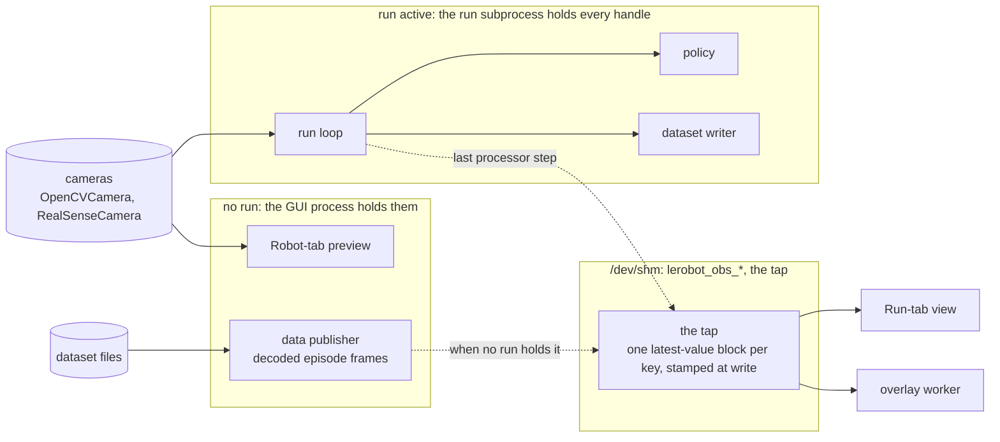
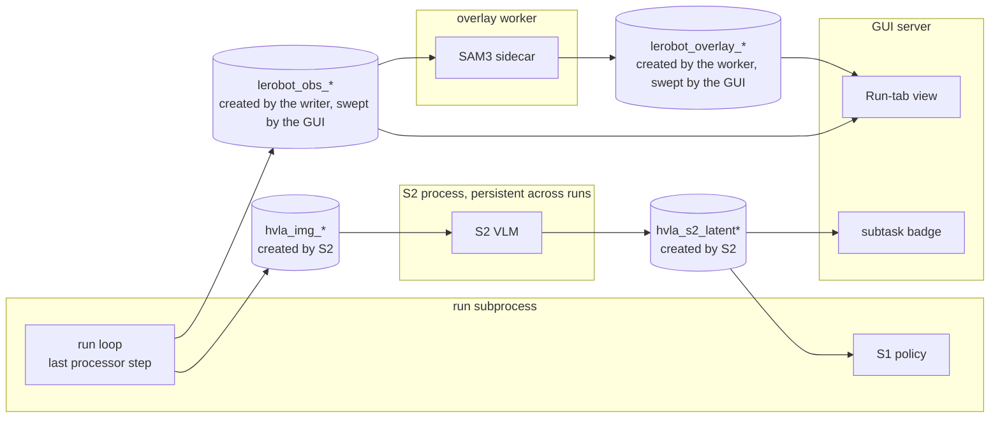
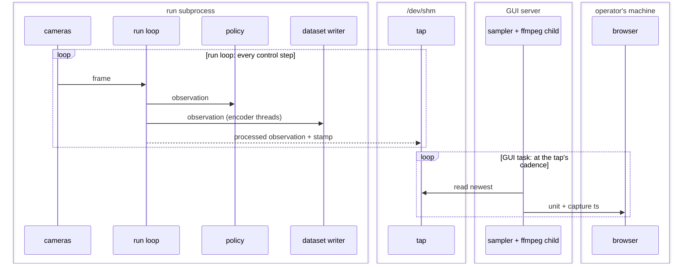
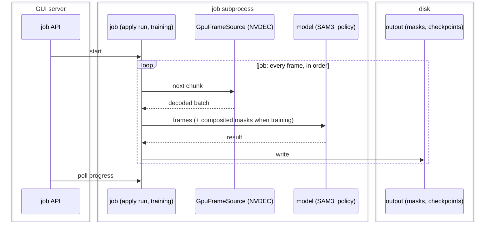
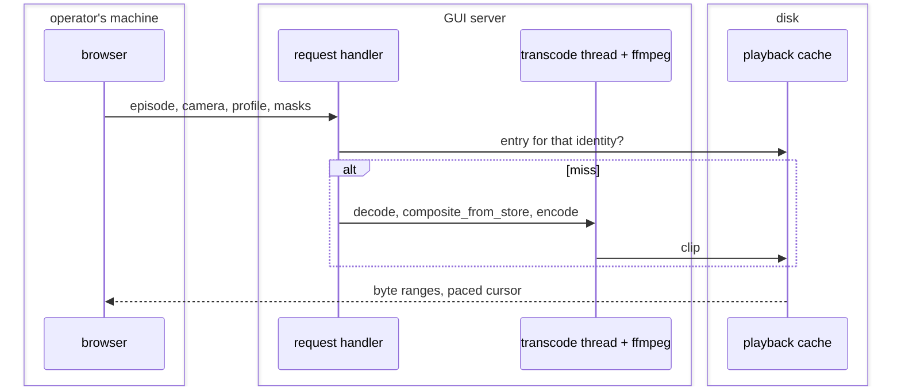

# Camera video transport

How camera pixels reach the browser, for the three surfaces that show them:
the Data tab (stored episodes), the Run tab (live teleop and inference) and
the Robot tab (camera preview). This is a design under review, not a
description of shipped behaviour.

The document is an argument in four parts. Part 1 states what the surfaces
need. Part 2 is a series of observations about the system as it is, each
closing with the conclusion it forces; the observations are numbered O1–O8
and the conclusions C1–C8. Part 3 adds the conclusions up into the
constraints the design may not move and the freedoms it has. Part 4 is the
architecture, and every element of it names the constraint or conclusion it
comes from. Open decisions and the order of work follow. Terms with a fixed
meaning are collected in the [glossary](#glossary) at the end, and the first
use of each links to it; a term that is not in the glossary is meant in its
plain-English sense.

Client is a desktop browser on an arbitrary laptop. Server is the
[GUI server](#g-gui-server)'s host, which usually has a capable GPU (both
current rigs carry an RTX 5090) but may not: a Mac, or a box with no GPU at
all, must still work. Until the [robot host](#g-robot-host) and the GUI
server are split, that host sits next to the robot. Phone and tablet clients
are out of scope.

## Part 1: What the surfaces need

Three surfaces, three sources. What differs between them is the source and
the clock, not the pixels.

**Data tab.** The source is stored video plus per-frame timestamps in
parquet. The codec is whatever the recorder chose: SVT-AV1 by default, H.264
or HEVC when configured, a hardware encoder (`h264_nvenc`, `hevc_nvenc`,
VideoToolbox, VA-API, QSV) when `vcodec=auto` finds one; older datasets store
per-frame images instead of video. Offline: an upfront delay is acceptable if
playback is then smooth. Must scrub to a frame. Playing the video with the
saved masks composited in, at 2x, is a goal.

**Run tab.** The source is the running process's latest frame, published
through shared memory (the [tap](#g-tap), described in O3). Wall clock, 1:1.
Latency-sensitive, teleop most of all: the network already costs the
operator hundreds of milliseconds, so the pipeline may not add a budget of
its own. Video must stay in step with the state and action readouts and the
URDF view beside it, or the operator sees a robot that moves before its
picture does. Overlays (SAM3, saliency) are computed on the side; they must
skip frames, never hold the video back.

**Robot tab.** The source is the device itself, opened by the GUI process
when no run is active and released before one starts. A preview: latency
matters less, but it should be the same path as the Run tab, so there is one
thing to maintain and one thing that can break.

Common to all three: one desktop browser client; a link that may be a LAN,
Tailscale or worse; a server that should do the heavy work and may or may
not have a GPU.

The requirements, numbered so the architecture can cite them:

- **R1** — Works over a remote link. The bandwidth of the current paths is
  measured in O1 and is the reason this design exists.
- **R2** — Live video adds no latency budget of its own, and stays in step
  with state, actions and the URDF view.
- **R3** — Stored video scrubs, plays at 2x, and shows the saved masks
  composited in.
- **R4** — The Robot tab and the Run tab share one path.
- **R5** — Nothing the view does may slow, block or corrupt the policy, the
  recorder, or a training or mask job.
- **R6** — Every stage runs on a host without NVIDIA, and on a host without
  any GPU, without a change of architecture.

## Part 2: Observations, and what each one forces

### O1. What the two current paths cost

<a name="o1"></a>

**On `main`, every surface polls JPEG stills over HTTP.**


Measured:

- Data tab, 3 cameras at 30 fps: 324 KB per tick, 78 Mbit/s sustained.
  No remote link carries that; playback stalls and skips (commit a4b0db5c3).
- Run tab over Tailscale: each 20 Hz request pays the round trip; this is
  why the branch's low-bandwidth preview was built (commit e0a76d076).

One path on `main` does not poll: the Data-tab overlay preview streams a
server-composited H.264 atlas as fragmented MP4 over MSE
(`overlays.py` `_stream_encoder_command`, `overlay_stream.js`), in lock-step
with the [overlay worker](#g-overlay-worker), latest frame wins.

**On `feat/camera-video-transport`, two surfaces stream encoded video, each
its own way.**


- Run tab: one H.264 stream per viewer, a fixed 640x380 mosaic of the cameras
  at 10 fps, encoded by a per-viewer ffmpeg. Measured over Tailscale (RTT
  72.2 ms): 1.18 Mbit/s, first frame after 498 ms, source-to-display age
  about 0.4 s median and 0.60 s p95, not accumulating (commit e0a76d076).
- Data tab: each camera is a `<video>` element playing a transcoded clip
  (`low` 640 px at 500 kbit/s, `medium` 1280 px at 1500 kbit/s, `full` =
  remux without re-encode); scrubbing and `playbackRate` come from the
  element. Saved masks are composited into the clip on the server when asked
  for, keyed by [recipe](#g-recipe) fingerprint and [profile](#g-profile).
  Measured: 6.7 KB per frame at `medium`, 1.61 Mbit/s, 48x less than the
  flipbook; a `full` remux prepares in 0.06 s against 0.44 s for `medium`
  (commit a4b0db5c3).

What is wrong with the branch as an end state:

- The Run path carries no timestamps. The browser shows the newest decoded
  picture and the URDF tile polls state at 30 Hz; nothing aligns them.
- The live source is resampled at 10 fps into a mosaic whose layouts are
  written for one rig (`_PREVIEW_MOSAIC_RECT_OPTIONS`). The cadence alone
  puts 100 ms between samples.
- Each viewer owns an encoder. Two operators watching is two encodes.
- The Robot tab is untouched and still polls.
- MSE is a buffered player. Staying at the live edge is a catch-up heuristic
  (`end - currentTime > 0.6 → seek`), a seam the operator can see.

**Conclusion C1.** Polling stills cannot meet R1; an encoded stream can, and
the branch's Data-tab path (a transcoded clip per camera and profile, masks
composited on the server, played by the browser from a cached file) already
meets R1 and R3 and is kept. The live path is kept as an idea and redone in
four respects: frames carry their capture time (R2), the source is encoded
at its own cadence rather than resampled, one encode serves every viewer,
and the player does not buffer ahead of the newest frame. The Robot tab
joins the live path (R4).

### O2. Who holds the cameras, and what the run loop does with them

<a name="o2"></a>

A camera is opened through a [capture backend](#g-capture-backend):
`OpenCVCamera` for any UVC device through V4L2 on Linux (the Arducam wrists
and the ZED-M top camera on the OpenArm2 rig, where the ZED's side-by-side
frame is halved by `split_stereo_frame`; the wrist and front cameras on the
SO-107 bench), or `RealSenseCamera` through librealsense (the SO-107 bench's
top camera). `zmq` and `reachy2` are network cameras behind the same
interface. A device handle belongs to one process at a time.

**O2a. Which process holds the handle depends on whether a run is active.**



- While a run is active, the [run subprocess](#g-run) holds every camera.
  The GUI never touches the device: `/api/robot/detect-cameras` refuses to
  open previews while the run is alive.
- While no run is active, the GUI process opens the devices itself for the
  Robot-tab previews (`_preview_cameras` in `gui/api/robot.py`) and releases
  them before a run starts.

**O2b. The run loop reads the cameras and feeds three things, in order.**
The [run loop](#g-run-loop) reads the cameras, feeds the policy and the
dataset writer in-process, and then, as the last step of the observation
processor, copies the processed observation into the tap
(`ObservationStreamWriterStep`). That copy is a write into memory: no lock,
no reader to wait for, failures suppressed, the observation returned
unchanged. The tap module's contract says that no policy, control, safety or
recording path may depend on the copy succeeding.

**O2c. The tap has a second writer when no run is active.** For the Data
tab's overlay preview, the GUI process starts a
[data publisher](#g-data-publisher) that writes decoded episode frames into
the same tap, so the overlay worker has one input in both cases. The
publisher refuses to start while a run is alive, and the launch path stops
it before a run's `connect()` would unlink the segments from under it.

**Conclusion C2.** The Run tab and the Robot tab see the same cameras under
two owners: through the tap while a run holds the handles, through a
capture backend the GUI opens otherwise. The view therefore has two live
[source adapters](#g-source-adapter), and both must produce the same form
(pixels plus capture time) so that nothing downstream can tell which one it
is reading; that is what makes R4 possible. The tap is the view's only
channel into the run process, and the loop already publishes what the view
needs, so nothing is added to the loop (R5).

### O3. What the tap is, and how it is managed

<a name="o3"></a>

**O3a. Names and contents.** The tap is a set of POSIX shared-memory
segments under `/dev/shm` with fixed names: `lerobot_obs_meta` (a JSON
descriptor of the keys and image sizes), `lerobot_obs_obs` (the scalar
observation), `lerobot_obs_act` (the last action sent) and one
`lerobot_obs_img_<camera>` per camera. Each segment holds one value, the
newest, behind a 24-byte header: two sequence counters and the wall-clock
time of the write. A reader compares the counters before and after its copy
and reports a torn frame rather than returning a mixed one. There is no
queue and no history: a reader slower than the writer sees the newest frame
and misses the ones between.

**O3b. Ownership.** The names carry no run id and no server id, so there is
one tap per host. Its writer creates it: the run subprocess when the robot
connects (the GUI launches every run with `LEROBOT_OBS_STREAM=1`) and
unlinks it when the robot disconnects; the data publisher creates the same
names in the GUI process. Either creation unlinks a same-named leftover
first. Readers attach by name; the GUI's reader notices a recreated stream
by the inode of the meta segment and re-attaches.

**O3c. Sweeps.** A writer that dies uncleanly leaves its segments behind,
and a reader attached to them serves a frozen picture as if the run were
alive. So the GUI sweeps `lerobot_obs_*` unconditionally at its own startup
and shutdown, and before every launch only if nothing has written to the
segments in the last two seconds, so that a writer the GUI does not know
about (a teleop started from a terminal) is left alone.

**O3d. Isolation is by time, not by name.** A run and the data publisher
write the same segments, never at once (O2c). That is the whole reason the
two writers share names: the overlay worker and the Run-tab view read one
place.

**O3e. Guarantees.** The tap module states its own contract: a best-effort,
single-slot, latest-value channel for display and debugging, with no
delivery or freshness guarantee. A reader can miss samples, can get a torn
read, and can stay attached to stale data after an unclean writer exit
until a sweep or a reconnect catches up. The GUI can unlink the segments at
its own startup and shutdown regardless of who is writing.

**Conclusion C3.** Four things follow for the design, and they are rules,
not habits:

- The live source adapter is one per host, like the tap, so "encode once
  per source and profile" (C1) is per host.
- A second GUI server on the same host (a test instance on another port)
  reads the same stream as the first, and its unconditional startup sweep
  unlinks a live run's segments; a later attach by name then fails until the
  run reconnects. A test server never runs beside a live GUI on one host.
- Discovery (the fixed names, the inode check, the sweeps) lives inside the
  live source adapter and nowhere else, so a tap namespaced per run later
  changes one component.
- The tap is a same-host mechanism. When the robot host and the GUI server
  split, the adapter and the encoder move with the cameras (Part 4).

### O4. The HVLA channel carries the same pixels under a different owner

<a name="o4"></a>

HVLA is a two-system policy ([S1 and S2](#g-s1-s2)). S2 is a vision-language
model in its own process; S1 is the policy in the run loop. They share
memory in both directions, beside the tap:



**O4a. The image blocks hold the same pixels as the tap.** The same
processor step that writes the tap (O2b) also writes `hvla_img_<view>` when
`LEROBOT_S2_IMAGE_BUFFER=1`, which the GUI sets for a run started with S2
loaded. It copies from the same processed-observation dict, at the same
moment. The differences are bookkeeping: only the cameras in
`DEFAULT_S2_CAM_KEY_MAP` are copied, under S2's view names (`front` →
`base_0_rgb`, and so on); a frame whose shape differs from the block is
skipped; and the joint state goes into `hvla_img__state` as a float array.
For a camera in that map, `hvla_img_<view>` and `lerobot_obs_img_<camera>`
are the same array written twice.

**O4b. The latent block is different in kind.** `hvla_s2_latent`, with its
`_subtask` text and `_conf` companions, carries S2's output back. S1 reads
it inside the loop together with its age, and the age is an input to the
model, clamped to the 0.15 s the model was trained with
(`s1_process.py`). The GUI attaches read-only for the subtask badge.

**O4c. The owner and the contract differ, not the protocol.** S2 creates
all of the `hvla_*` blocks when it runs standalone, which is how the GUI
keeps it warm across runs as the "debug model" process; an S1 launcher that
finds no S2 creates them and spawns S2 itself. The run subprocess only
attaches, and retries until S2's blocks exist. The GUI never sweeps
`hvla_*`. The block implementation is the same design as the tap's: the
same 24-byte header, the same torn-read protocol, in a second class
(`SharedBlock` in `policies/hvla/ipc.py` against `_Block` in
`robots/obs_stream.py`; the tap's module says "same pattern as
policies.hvla.ipc"). Both classes silence Python's `resource_tracker` so
that a segment is not unlinked when a process that merely attached to it
exits; `SharedBlock`'s comment gives the case: S2's memory must survive S1
exiting.

So "the tap must not feed the policy" (O2b, O3e) is a statement about the
tap's lifecycle, not about its pixels. The pixels are identical to what S2
reads. What S2 relies on is a channel that the policy side creates and that
the GUI never unlinks; what the tap offers is a channel the GUI creates for
its own use, unlinks at will, and reuses for decoded files. A policy that
read the tap would stop seeing the cameras whenever the GUI restarted.

**Conclusion C4.** Two things, and a boundary:

- The block is one primitive implemented twice, and the sharing rule of O5
  applies to it: share the operation, never the lifecycle. Folding `_Block`
  into `SharedBlock` is a refactor with an equivalence test on the header
  bytes. The lifecycles stay in their own modules, because they are the
  whole difference: writer-created and GUI-swept for the tap, S2-created and
  persistent for `hvla_*`, worker-created for the overlay blocks.
- The double copy of each S2 camera frame is the policy's business. The
  writer step already carries a TODO to move the S2 mirror into a
  policy-owned processor step. This design changes nothing there, and adds
  no channel and no writer to the loop (R5).
- The channels do not merge in this design. Merging them means giving the
  tap the lifecycle S2 relies on (no GUI unlink while a run is alive, and a
  freshness guarantee); the tap's docstring names that future as an
  observation bus, to be built after the critical-path contract is added
  and tested. The view needs nothing from such a bus, so this design does
  not ask for it.

### O5. Every reader of the cameras and of the files

<a name="o5"></a>

Two origins: the cameras, and the files the recorder wrote from them. Every
consumer of camera pixels reads one of the two. What separates the
consumers is when they run, how fast they must keep up and whether a
dropped frame is allowed: their [class](#g-class), not which tab they belong
to.

**O5a. The consumers.**

| Consumer                    | Reads                | Class     | Keeps up by      | May drop |
| --------------------------- | -------------------- | --------- | ---------------- | -------- |
| Policy inference            | cameras, in the loop | real time | the control rate | never    |
| Dataset writer              | cameras, in the loop | real time | encode threads   | never    |
| Run-tab view                | tap                  | view      | newest wins      | yes      |
| Overlay preview, live       | tap                  | view      | skips            | yes      |
| Robot-tab preview           | cameras, GUI process | view      | newest wins      | yes      |
| Training loader             | files, saved masks   | job       | throughput       | never    |
| Apply run (mask pass)       | files                | job       | lock-step        | never    |
| Playback, plain/composited  | files, saved masks   | view      | paced, seeks     | no       |
| Overlay preview, stored     | files, via the tap   | view      | skips            | yes      |
| Hub transfer, merge, export | files as bytes       | job       | —                | —        |

The three mask modes the UI names are three of these rows: the overlay
preview (the live and stored rows: approximate, skips, never written), the
[apply run](#g-apply-run) (a job that reads the files exactly like training,
down to decoding through training's `GpuFrameSource`; its product is the
[mask store](#g-mask-store)) and composited playback (a view that reads what
the apply run wrote and recomputes nothing).

**O5b. What each class runs on today.**

- _Real time_ decodes through the capture backend. The dataset writer
  encodes with `VideoEncodingManager` (PyAV: SVT-AV1, H.264, HEVC, or a
  hardware codec under `vcodec=auto`).
- _Jobs_ decode through `GpuFrameSource` (NVDEC), with the CPU dataset
  reader (torchcodec) as the fallback. Training composites with
  `GpuMaskComposite` or `composite_from_store`; the apply run segments in the
  SAM3 [process worker](#g-process-worker) and writes the mask store.
- _Views_ each have their own encoder: the Run tab an ffmpeg H.264 mosaic on
  the branch and JPEG per poll on `main`; the two overlay previews the
  overlay worker's ffmpeg H.264 atlas; the Robot tab JPEG per poll; playback
  ffmpeg H.264 into the [playback cache](#g-playback-cache) after
  `composite_from_store`. The stored overlay preview decodes with torchcodec
  in the GUI process and publishes into the tap.

**O5c. The three classes at run time**, each diagram grouping its
participants by process, left to right.

_During a run._ Four places: the run subprocess holds the cameras, the loop,
the policy and the dataset writer (the writer's encoders are threads of that
process); the tap is the segments in `/dev/shm`; the GUI server samples the
tap from an asyncio task and pipes each frame into a child ffmpeg; the
browser is on the operator's machine. The two loops below are in two
processes that share only the tap, and the first never waits for the second.



_A job._ The GUI server starts the job and polls it; the job is a
subprocess (the process worker for the apply run, the training container
for training) that owns the decoder, the model and the output for its
lifetime. The GUI's poll is a request the job answers, not something the job
waits on.



_A view of stored video._ The browser asks for a clip by identity (episode,
camera, profile, recipe fingerprint). A request handler in the GUI server
answers from the playback cache, or runs the transcode on a worker thread (a
decoding ffmpeg child, the [compositor](#g-compositor)'s thread pool, an
encoding ffmpeg child) under a per-identity lock. The browser paces itself
from the file; a second viewer of the same identity costs a cache read.



**O5d. What is shared today, by design.**

- _The compositor._ One definition, two backends: `composite_from_store` on
  the CPU, `GpuMaskComposite` batched on the device (4.6–7.3 ms per 720p
  frame on the CPU against about 0.2 ms batched, per its module note),
  pinned equal on real rows by
  `tests/datasets/test_gpu_composite_equivalence.py`. The playback clip calls
  the CPU definition at display scale (5–18 ms per frame, commit 8f040758c),
  so a recipe renders the same in the training batch, the playback clip and
  the apply run.
- _The GPU decoder._ `GpuFrameSource` serves training and the apply run;
  `_MaskFramePrefetch` decodes chunks ahead of the sequential tracker.
- _The dataset reader._ `LeRobotDataset` over `decode_video_frames`
  (torchcodec, PyAV fallback) is the CPU training loader, the apply run's
  fallback and the Data-tab frame endpoint.
- _The tap._ Two writers (the loop, the data publisher), two readers (the
  Run-tab view, the overlay worker), never more than one writer at a time.
- _The stereo split._ `split_stereo_frame` is called by the live camera and
  by the offline dataset transform, and its module states the rule: only the
  naming and the split are shared, the lifecycles are not, because one owns
  a V4L2 handle and the other decodes files.

**O5e. What is duplicated today.**

- _Encoders._ Five ways pixels become bytes: PyAV in the recorder, three
  ffmpeg command builders in the GUI (`_preview_encoder_command` for the Run
  tab, `_stream_encoder_command` for the overlay atlas, `_transcode_episode*`
  for the Data tab), and JPEG behind every polling endpoint. Each has its own
  flag set, latency profile and bug surface.
- _Stored decoders._ Three: torchcodec in the dataset reader, NVDEC in the
  jobs, ffmpeg in the transcodes; the last exists only because the transcode
  wants a pipe rather than frames.
- _The shared-memory block._ `_Block` and `SharedBlock` (O4c).

**O5f. What is separate on purpose.** Two SAM3 processes: the overlay worker
(skips frames, reads the tap) and the process worker (lock-step, reads
files) load the same weights and take turns through the
[aux-GPU slot](#g-aux-slot). They cannot share a queue: one may drop and the
other may not. They share the model call and the mask codec, and they do.

**O5g. Where the classes collide.**

- _The encoder budget._ The recorder encodes every camera in real time in
  its own threads: SVT-AV1 on the CPU on the rig today, NVENC when
  `vcodec=auto` finds it. The branch's preview encoders are libx264 pinned
  to one thread per viewer, on the same CPU. Moving previews to NVENC frees
  the CPU but spends sessions: three recorded cameras on NVENC plus three
  preview cameras at one profile is six of the eight (O6c).
- _The decode engines._ Training and the apply run both decode on NVDEC
  through `GpuFrameSource`, with nothing arbitrating between them beyond the
  aux-GPU slot the apply run holds. Playback transcodes and the frame
  endpoint decode in software, so the view is not a third contender today.
- _The clock._ Dataset timestamps are episode-relative (frame index over
  fps); tap stamps are wall clock at write. Each is the right clock for its
  side. On the live side the blocks of one loop iteration are written
  together, and the image block's stamp is the join key for state and
  action.
- _The process boundary._ The loop and the GUI are separate processes; the
  tap is the view's only channel into the run (C2), and `hvla_*` is the
  policy's (C4).

**Conclusion C5.** The rule `stereo.py` states is the rule for the whole
table: share the operation, never the lifecycle. A consumer that must not
drop and one that may can share a function, a model and a file format; they
cannot share a queue, a thread or a device handle. From that:

- The five encoders become one live encoder plus the recorder's; the
  recorder stays separate because a queue shared with a consumer that may
  drop eventually drops the wrong frame (R5).
- The three stored decoders become the dataset reader for the view, feeding
  the shared compositor and encoder. The view does not take NVDEC without a
  measured need, and yields to the jobs if it ever does (R5).
- A third compositor written for the view would be the drift the
  equivalence test exists to catch; the view uses the one definition (R3).
- The view carries the source's own stamp, wall clock or episode-relative,
  and never re-stamps at encode time (R2).
- Where the classes meet a shared budget (NVENC sessions, NVDEC engines),
  the budget is written down per deployment and the view is the one that
  yields (R5).

### O6. Measurements that shape the transport

<a name="o6"></a>

**O6a. Codec compute is not the cost.** Per-frame latency from frame-in to
the encoded [unit](#g-unit) out, idle RTX 5090, 150 frames per row, medians
(script `enc_latency2.py`; the full table with p95 and max is in the
appendix):

- libx264, fMP4 container: 102.5 ms at 640x380@10, 35.4 ms at 30 fps,
  38.0 ms at 720p30, one frame period each time. The MP4 muxer holds a
  packet until the next one arrives, to write its duration.
- libx264, raw Annex B (`-f h264 -flush_packets 1`): 2.3 / 2.2 / 4.6 ms.
- h264_nvenc, fMP4, default settings: 300.8 / 101.0 / 101.6 ms, three frame
  periods: NVENC's default two-frame output delay plus the muxer hold.
- h264_nvenc, fMP4, `-delay 0`: 101.1 / 34.6 / 35.5 ms, one period.
- h264_nvenc, Annex B, `-delay 0`: 1.1 / 1.2 / 2.1 ms median; p95 up to
  about 101 ms and max about 150–163 ms, so NVENC has a tail the software
  encoder does not.

**O6b. Browser capabilities depend on the origin, not the browser.** Probed
with headless Chromium 151 (`codec_probe2.py`): over plain `http://` on the
LAN IP or the Tailscale IP, `isSecureContext` is false and `VideoDecoder`
(WebCodecs) and `WebTransport` are undefined; MSE,
`requestVideoFrameCallback`, `RTCPeerConnection` and `WebSocket` are
available. On `localhost` everything is available. The GUI is reached over
plain http today.

**O6c. GPU inventory.** RTX 5090: three NVENC engines (9th generation), two
NVDEC engines; GeForce drivers ≥ 550.54.14 allow eight concurrent NVENC
sessions. ffmpeg on both rigs exposes `h264_nvenc`, `hevc_nvenc`, `av1_nvenc`
and CUDA hardware decode.

**Conclusion C6.** The latency in the branch's live path is made of design
choices, none of them codec work: the 10 Hz resample (one period), the MP4
container (one period), NVENC's default delay (two periods when enabled),
and the player's buffer. The live path therefore emits raw Annex B units at
the source's cadence, with the low-latency flag each encoder needs
(`-delay 0` on NVENC, `-tune zerolatency` on libx264) applied inside the
encoder stage. Any design that decodes in JavaScript needs HTTPS first
(Tailscale can issue a certificate for the machine's `ts.net` name); WebRTC
works on the plain-http origins in use. Which of the two to choose is open
(Part 5).

### O7. What the industry converged on

<a name="o7"></a>

Robotics visualisers use one [wire format](#g-wire-format) for live video: a
stream of timestamped, encoded access units, decoded in the browser.

- Foxglove `CompressedVideo`: H.264 Annex B, one frame per message, its
  timestamp beside it, SPS/PPS repeated with every keyframe, no B-frames.
  Decoded with WebCodecs.
- Rerun `VideoStream` (0.24+): H.264 Annex B samples with presentation
  timestamps, same constraints, same decoder.
- Teleoperation products default to WebRTC: the browser's own jitter buffer
  and hardware decoder, RTP timestamps, no container, works on insecure
  origins. Latency is bounded by the jitter buffer, which the sender controls
  through pacing and keyframe policy.
- MSE is the right tool for stored media and acceptable for live with a
  catch-up policy; it is buffered by design.
- WebCodecs is the lowest-latency browser decoder and the simplest to
  synchronise (a unit goes in with a timestamp, a frame comes out with the
  same one), but requires a secure context.

Those are observation tools and say nothing about the policy or the
recorder. The all-in-one precedent is ROS 2: one image topic, and each
consumer subscribes with its own quality of service, the recorder reliable
and complete, the visualiser best-effort with a history depth of one, while
`image_transport` plugins put the viewer's compression in the subscriber's
path, never the publisher's.

**Conclusion C7.** The frame's capture timestamp travels with its bytes and
the receiver synchronises on it; that is what the branch's live path lacks
(C1) and what R2 needs. The ROS arrangement is the tap by another name: the
loop publishes once, best-effort readers take the newest, and the viewer's
encoder lives on the reader's side, in the GUI process, never in the loop
(C2, R5).

### O8. Hosts without NVIDIA, and hosts without a GPU

<a name="o8"></a>

**O8a. The codebase already resolves accelerated backends three times, the
same way.** `resolve_vcodec` walks `HW_VIDEO_CODECS` (VideoToolbox, NVENC,
VA-API, QSV) and falls to `libsvtav1`. The training `data_path` knob is
`auto`, `cpu` or `gpu`: `auto` checks facts (a CUDA device, a decodable
codec, a dataset it can composite, this dataset's own frames verified
against the CPU decoder), and `gpu` refuses rather than silently training on
the other path, "a wrong measurement rather than a slow one". The apply
run's `_gpu_frame_sources` returns the CPU read with the reason logged. The
compositor's CPU definition is the reference and the GPU one is pinned equal
to it.

**O8b. Each class already tolerates a slower backend along one axis.** A
real-time consumer accepts a lower frame rate but not lag; a job accepts a
longer wall time but not a different output; a view accepts a longer wait
before first play but not stutter during play.

**O8c. What is unmeasured.** VideoToolbox as the live encoder on a Mac; SAM3
on MPS or on the CPU; encoder contention on the rig with the recorder and a
loaded policy running at once. The benchmark script from O6a runs on a Mac
unchanged.

**O8d. Blockers on a Mac that are not this design's.** `ObservationStream`
sweeps stale segments through `/dev/shm` paths
(`multiprocessing.shared_memory` itself works on macOS, the sweep does not);
camera discovery is V4L2 (`_linux_video_capture_candidates`), while OpenCV
opens devices through AVFoundation there; librealsense on macOS is partial;
PyNvVideoCodec is absent, which the `auto` knobs already handle.

**Conclusion C8.** R6 costs no architecture. Each [stage](#g-stage) of the
view that can be accelerated (encode, decode, composite, segment) gets the
pattern of O8a: one interface, a reference implementation that runs
anywhere, accelerated [backends](#g-backend) resolved once per host and
logged, and an `auto`/`cpu`/`gpu` knob whose forced mode refuses rather than
degrades. A slower backend degrades each class along the axis of O8b, and
the live cursor's rule of never buffering ahead (C1) is what turns a slow
encoder into fewer frames per second rather than a growing lag. Nothing past
a stage may see which backend ran.

## Part 3: The constraints, the freedoms, and the shape they leave

The conclusions add up to five things the design may not move, and four it
may.

**Fixed**, because a consumer that must not drop owns it:

- **F1. The run loop.** Its cadence, its order (cameras, policy, writer, then
  the copy into the tap) and the rule that nothing is added to it: no second
  channel, no second copy, no work that waits on a viewer. The view reads
  what the loop already publishes. (C2, C4, R5)
- **F2. The recorder's product.** The file is whatever the recorder wrote:
  its codec, its resolution, per-frame images in older datasets. The view
  adapts to the file; the file never adapts to the view. (Part 1, C1)
- **F3. The jobs' exactness.** The apply run and training produce the same
  artefact on every backend, and the compositor has one definition; a view
  that composites uses that definition. (C5, C8)
- **F4. The process boundary.** The tap is the view's only way into the run;
  `hvla_*` belongs to the policy; neither channel is merged, and the block
  primitive is shared without sharing a lifecycle. (C2, C4)
- **F5. The tap's scope.** One per host, same host as the cameras, discovered
  by fixed names, unlinkable by the GUI. (C3)

**Free**, because a view may drop:

- The profile a viewer watches, and how many viewers share one encode. (C1)
- Where the encode runs (the GUI server now, the robot host after the split)
  and which backend each stage resolves. (C3, C8)
- What the playback cache holds, and when it is filled or evicted. (C1)
- Whether the view gets the accelerators at all: it takes them when they are
  free and yields to the jobs. (C5)

**The shape that satisfies F1–F5 with those freedoms.** Adapters at the two
origins: the cameras, through the tap during a run and a capture backend
otherwise (C2), and the files through the dataset reader (C5), each
producing one form, pixels plus capture timestamp (C7). Behind the adapters,
one chain of stages, decode, composite, encode, each with a reference
implementation and a resolved backend (C5, C8). At the client, one
[presenter](#g-presenter) keyed on the source's stamp (C7). On the stored
side, a cache, because there the product is a file (C1). Everything between
an adapter and the presenter is view-class: it drops, yields and resolves,
and none of it is visible from the loop or the jobs (F1, F3). Part 4 draws
that out.

## Part 4: Proposed architecture


Each element, with where it comes from.

**Frame model** (C7, R2). Every unit that leaves the server carries the
capture timestamp of the frame it encodes: for live frames the tap's stamp,
for stored frames the parquet timestamp. Nothing downstream is allowed to
invent a time.

**Source adapters** (C2, C5, F5). One per source, each producing pixels plus
capture time at the source's own cadence: the capture backend for the Robot
tab (the GUI holds the handle, no run active), the tap reader for the Run
tab (the run holds the handle), the dataset reader for the Data tab. The
first two are the same cameras under two owners, so both produce the same
form and the presenter cannot tell which it is watching. The tap reader is
the only place that knows the tap's names, inode check and sweeps. Adapters
own nothing else.

**Encode once, fan out** (C1, C3, C5, C6). A live source is encoded once
per (source, profile) into H.264 Annex B units, and the units are fanned out
to every viewer of that profile. Viewers cost bandwidth, not encoder time.
Which encoder produces the units is resolved per host (below); the
low-latency flags each one needs live inside the stage and are not visible
past it. The stored case does not go through the live encoder: it is a
transcode whose product is a file in the playback cache, as on the branch
today.

**Cursor policies** (C1, C7, C8). Live surfaces run a _follow-live_ cursor:
present the newest decoded frame, drop anything older, never buffer ahead
of the newest unit. Stored surfaces run a _paced_ cursor: rate times wall
clock, seekable, buffered ahead as much as it likes. These are the only two,
and a surface picks one.

**Presenter** (C7, R2). One client component that decodes units, keeps the
last presented capture timestamp, and paints. Overlays are separate streams
keyed by the same timestamps and painted over the frame whose timestamp
they match, or not at all if they are late. State, actions and the URDF pose
are read at the presented frame's timestamp, not at "now".

**Profiles** (F2, F3). `low`, `medium`, `full` remain the quality vocabulary
for both live and stored, chosen by the viewer. A profile is a resolution
and a bitrate, never an encoder preset, so the same profile means the same
picture on every host. A profile is part of a stream's or a cache entry's
identity, and never something a job consults.

**Backend resolution** (C8, R6). Each stage that can be accelerated has one
interface, a reference implementation that runs anywhere, and accelerated
backends resolved once per host and logged, with the three-way knob of O8a.
The encoder stage's knob replaces the `LEROBOT_PREVIEW_ENCODER` override on
the branch. What the accelerators are today, and the floor under each:

- _Live encode._ NVENC, three engines and eight sessions on the 5090: two
  sources (Run, Robot preview) at two or three profiles fit with room, and
  an inference run that records on NVENC spends one session per camera.
  Floor: libx264, one thread per stream, 2.3 ms median at 640x380 and 4.6 ms
  at 720p30 into Annex B on the rig's CPU (O6a). VideoToolbox on a Mac is
  the first entry in `HW_VIDEO_CODECS` and is unmeasured.
- _Stored decode and composite._ The jobs use NVDEC through `GpuFrameSource`
  and CUDA through `GpuMaskComposite`. The Data tab does not: its transcode
  is the dataset reader (torchcodec, PyAV where torchcodec has no wheel),
  `composite_from_store` at display scale (5–18 ms per frame, commit
  8f040758c; 7.8 → 1.9 ms per frame with the composite thread pool on a
  24-core box, per the note in `gui/api/datasets.py`) and the resolved
  encoder. Moving the view onto NVDEC or CUDA is taken only with a measured
  need, and it yields to the jobs (C5).
- _Segmentation._ SAM3 in both workers runs wherever torch puts it; on a
  host without CUDA that is MPS or the CPU, at a speed nobody has measured.
  The overlay preview drops to whatever rate the model sustains; the apply
  run takes longer and stays exact.
- _The client_ decodes H.264 in hardware in every browser on every platform.
  That universality is a reason H.264 is the wire format: AV1 decode in
  Safari depends on the machine's hardware, so playing a stored AV1 file
  directly is never the only path.

**The split of robot host and GUI server** (C3, F5). When the two hosts
separate, the live source adapters and the encode stage move to the robot
host, because the frames, the tap and their timestamps originate there, and
the GUI server relays units. Nothing else in the diagram changes, which is
the reason to carry timestamps with the bytes now.

### Invariants

- Processing never consults viewer settings. An apply run, a transcode or a
  composite produces the same artefact whatever the viewer has selected.
  (F3)
- Quality is part of the identity. Two profiles are two streams or two cache
  entries; a recipe change is a new fingerprint and a new entry, never an
  invalidation. (C1)
- One clock. Every frame carries its capture timestamp end to end; anything
  shown beside a frame is looked up by that timestamp. (C7)
- Live never buffers ahead of the newest frame. If the link falls behind,
  the picture jumps forward; it does not lag further and further. (C1, C8)
- Overlays skip, never stall. A late overlay is dropped; the video underneath
  does not wait. (Part 1)
- One encode per source and profile, regardless of the number of viewers.
  (C1, C3)
- Nothing is added to the run loop, and no second channel into the run
  process. (F1, F4)
- No backend is visible past its stage. The wire format is H.264 Annex B
  whichever encoder produced it; the presenter, the profiles and the cache
  identity carry no backend name; the only place a backend's name appears
  is the log line that says it was chosen. (C8)

### Latency budget, teleop

Where the time goes between the camera and the operator's eye, with the
measured terms filled in and the rest named as unmeasured.


The two terms the redesign controls are sampling (the encoder runs at the
source's cadence, not a 10 Hz resample) and the container plus player buffer
(Annex B into a decoder that presents immediately). Both are measured at one
frame period each on the branch (O6a); together they are the pipeline's own
budget over the network's, and R2 says that budget is zero.

## Part 5: Open decisions

1. **Live transport.** Three candidates. _WebRTC_: browser jitter buffer and
   hardware decode, works on plain http, needs a server-side implementation
   (aiortc or a small native relay), the most moving parts. _MSE with
   in-browser remux_: keep MSE, feed it Annex B remuxed to fMP4 in
   JavaScript (jmuxer-style), which removes the muxer's one-period hold but
   keeps a buffered player and the catch-up seam. _WebCodecs over WebSocket_:
   simplest sync story and lowest latency, but needs HTTPS (O6b).
   Recommendation: measure WebRTC and WebCodecs-over-HTTPS side by side with
   the same source before choosing; O6a says either can beat the branch by
   two frame periods, and the difference is operational (certificates
   against a relay).
2. **Per-camera streams or a mosaic.** A mosaic is one decode and one layout
   problem; per-camera streams cost more sessions but let the client lay
   out, pick and enlarge, and need no per-rig layout tables. Recommendation:
   per-camera, since the session budget (O6c) allows it and the layout
   tables are the part of the branch that does not generalise.
3. **Stored AV1: play directly or transcode.** Chrome and Firefox decode
   AV1; the `full` profile is already a remux. If the browser plays the
   source container directly, the Data tab needs no transcode for `full` and
   the cache holds only lower profiles and composites. Unverified: seek
   behaviour with `g=2` AV1 in the browser, and hardware decode availability
   on the laptops in use.
4. **How `auto` picks a profile.** A manual selector exists on the branch; an
   RTT or throughput probe could pick for the user. Not decided.

## Part 6: How to iterate

Put the design next to the code and review it there: this file, in a draft
PR on `feat/camera-video-transport`, with line comments as the medium. The
decisions have to end up in this file, and a PR review is where a diagram or
a number gets challenged at the line it appears on.

Order of work, each a PR small enough to read:

1. Timestamps end to end on the existing branch path: carry the capture
   stamp in the fMP4 stream and read state at the presented frame's time. No
   transport change; it makes the sync claim testable.
2. The live transport spike: WebRTC and WebCodecs-over-HTTPS, same source,
   same profile, source-to-display age measured the way e0a76d076 measured
   it. Pick one.
3. Per-camera streams, encode-once fan-out, Annex B from the resolved
   encoder. Delete the mosaic layout tables.
4. Robot tab onto the same path.
5. Stored AV1 direct-play experiment for `full`.

## Glossary

Terms with a fixed meaning in this document, in alphabetical order. Each
first use above links here.

<a name="g-apply-run"></a>**Apply run** — the mask pass: a job that reads
every frame of an episode in order, segments it with SAM3 in the process
worker and writes the result to the mask store. Exact, never drops, holds
the aux-GPU slot while it runs.

<a name="g-aux-slot"></a>**Aux-GPU slot** — a process-wide mutex in the GUI
server (`lerobot.gui.gpu_slot`) over the one heavy GPU activity allowed
beside a run. The overlay worker and the process worker take it in turn; a
second activity is refused, not queued.

<a name="g-backend"></a>**Backend** — one implementation of a stage: NVENC
or libx264 for encode, NVDEC or torchcodec for decode, `GpuMaskComposite` or
`composite_from_store` for the compositor. Resolved once per host, logged,
and never visible past its stage.

<a name="g-capture-backend"></a>**Capture backend** — the class that opens a
camera device and decodes its frames: `OpenCVCamera` (V4L2 on Linux,
AVFoundation on macOS) or `RealSenseCamera` (librealsense); `zmq` and
`reachy2` for network cameras.

<a name="g-class"></a>**Class** — the property that sorts every consumer of
camera pixels: _real time_ (in the loop; never drops; degrades in frame
rate), _job_ (reads every frame in order; never drops; degrades in wall
time), _view_ (shows pixels to a person; may drop or pace; degrades in the
delay before first play).

<a name="g-compositor"></a>**Compositor** — the one definition of "masks
applied to a frame under a recipe": `composite_from_store` on the CPU,
`GpuMaskComposite` on the device, pinned equal by
`tests/datasets/test_gpu_composite_equivalence.py`.

<a name="g-data-publisher"></a>**Data publisher** — the GUI process's writer
into the tap when no run is active: decoded episode frames, for the stored
overlay preview.

<a name="g-gui-server"></a>**GUI server** — the FastAPI process the browser
talks to (`lerobot.gui.server`). It owns the camera previews when no run is
active, the Run-tab sampler, the transcodes and the caches, and it launches
the run, the workers and the jobs as subprocesses.

<a name="g-mask-store"></a>**Mask store** — a dataset's saved masks, written
per episode and camera by the apply run (`mask_store.write_episode`) and
read by the training loader and by composited playback.

<a name="g-overlay-worker"></a>**Overlay worker** — the SAM3 sidecar
subprocess that reads the tap, skips frames, and publishes RGBA overlays and
masks into `lerobot_overlay_*` for the live and stored overlay previews.
Best-effort by contract.

<a name="g-playback-cache"></a>**Playback cache** — the directory of
transcoded clips the Data tab plays, keyed by episode, camera, profile and
recipe fingerprint; filled by a transcode on a miss, pruned after each build.

<a name="g-presenter"></a>**Presenter** — the proposed client component that
decodes units, keeps the last presented capture timestamp and paints: one
for live, with a follow-live cursor, and one for stored, with a paced
cursor.

<a name="g-process-worker"></a>**Process worker** — the subprocess that runs
an apply run (`lerobot.gui.process_worker`): decodes through
`GpuFrameSource`, segments in lock step, writes the mask store.

<a name="g-profile"></a>**Profile** — a resolution and a bitrate under a name
(`low`, `medium`, `full`). Part of a stream's or a cache entry's identity;
never an encoder preset, never consulted by a job.

<a name="g-recipe"></a>**Recipe** — the per-region treatments a dataset's
masks are composited with. Its fingerprint is part of a composited clip's
identity; a changed recipe is a new entry, not an invalidation.

<a name="g-robot-host"></a>**Robot host** — the machine the cameras and the
robot are plugged into. Today the same machine as the GUI server; the
design keeps the two separable.

<a name="g-run"></a>**Run, run subprocess** — a teleop, record, replay or
inference session, launched by the GUI server as a subprocess
(`lerobot-teleoperate`, `lerobot-record`, and so on). It holds every camera
for its lifetime.

<a name="g-run-loop"></a>**Run loop** — the control loop inside the run
subprocess: read the cameras, feed the policy and the dataset writer, copy
into the tap, at the robot's control rate. The only real-time path.

<a name="g-s1-s2"></a>**S1, S2** — HVLA's two systems. S2 is a
vision-language model in its own process, producing a latent and a subtask
at its own rate; S1 is the policy in the run loop, conditioned on S2's
latest latent and its age through the `hvla_*` shared-memory channel.

<a name="g-source-adapter"></a>**Source adapter** — the proposed component
at each origin that produces pixels plus capture timestamp at the source's
own cadence and owns nothing else: the tap reader (Run tab), the capture
backend (Robot tab), the dataset reader (Data tab). The first two are
called the live source adapters.

<a name="g-stage"></a>**Stage** — one step of the view pipeline with a fixed
interface and resolvable backends: decode, composite, segment, encode.

<a name="g-tap"></a>**Tap** — the `lerobot_obs_*` shared-memory segments
(`ObservationStream`): the run loop's latest-value copy of the processed
observation, one block per key, stamped at write, best-effort by contract.
Written by the loop during a run and by the data publisher otherwise; read
by the Run-tab view and the overlay worker. Described in O3.

<a name="g-unit"></a>**Unit** — one encoded access unit, a frame's worth of
H.264 Annex B, carrying its capture timestamp. What the live encoder emits
and the presenter decodes.

<a name="g-wire-format"></a>**Wire format** — what crosses the network: H.264
Annex B units for live surfaces, byte ranges of a clip in the playback cache
for stored ones. The same whichever backend produced the bytes.

## Appendix: encoder latency table

Frame-in to unit-out, idle RTX 5090, 150 frames, `enc_latency2.py`.

```
encoder     shape    size@fps       bitrate   median   p95     max
libx264     mp4      640x380@10     1200k    102.5   103.0   103.2
libx264     mp4      640x380@30     1200k     35.4    68.7   102.3
libx264     mp4      1280x720@30    1500k     38.0    39.0    71.5
libx264     annexb   640x380@10     1200k      2.3     2.7    20.1
libx264     annexb   640x380@30     1200k      2.2    35.4    36.2
libx264     annexb   1280x720@30    1500k      4.6     5.4    66.7
h264_nvenc  mp4      640x380@10     1200k    300.8   301.4   301.6
h264_nvenc  mp4      640x380@30     1200k    101.0   167.5   201.2
h264_nvenc  mp4      1280x720@30    1500k    101.6   135.4   168.4
h264_nvenc  mp4 -delay 0  640x380@10  1200k  101.1   101.5   160.7
h264_nvenc  mp4 -delay 0  640x380@30  1200k   34.6   101.5   165.5
h264_nvenc  mp4 -delay 0  1280x720@30 1500k   35.5    69.4   167.4
h264_nvenc  annexb   640x380@10     1200k      1.1     1.3   159.1
h264_nvenc  annexb   640x380@30     1200k      1.2   101.0   163.2
h264_nvenc  annexb   1280x720@30    1500k      2.1    35.5   150.4
```

`mp4` is the branch's `_preview_encoder_command` shape (fragment per frame,
zero-latency tuning). `annexb` is `-f h264 -flush_packets 1`. Milliseconds.
