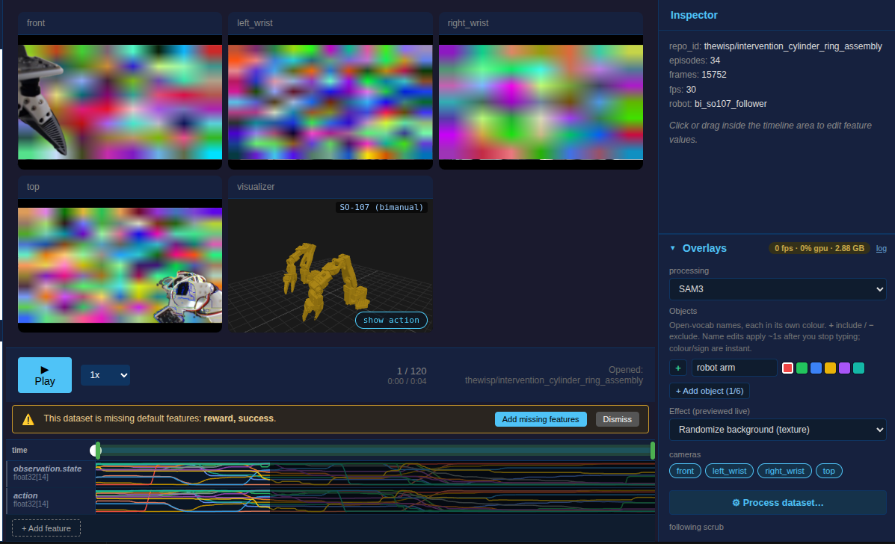
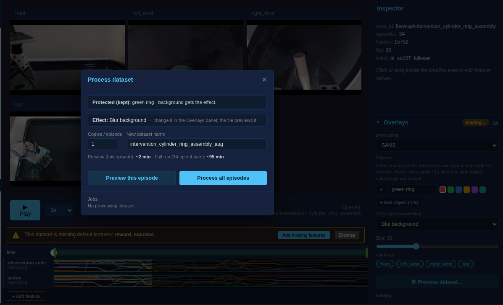
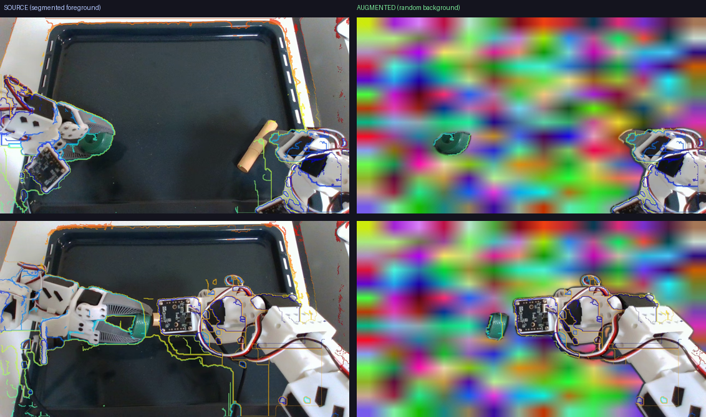
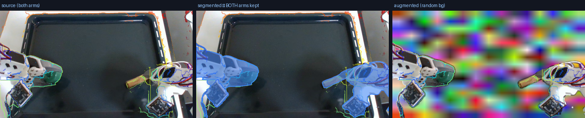

# Data Editing — segment + effect → augmented dataset

**Status:** prototype (2026-06-30). Builds on the Overlays SAM3 path
([overlays.md](overlays.md)) and the Hub-transfer job model
([hub_transfers.md](hub_transfers.md)).

## What it is

Camera-side **visual domain randomization** for imitation-learning data. The user
segments the task-relevant objects (the same SAM3 the data-tab overlay already
previews), and an offline pass rewrites every frame's **background** (or, for
global effects, the whole frame) and writes the result as a **new
LeRobotDataset**. Only camera pixels change — actions, states, tasks, and timing
are copied verbatim, so the augmented dataset trains exactly like the original.

This is the GreenAug / RoboEngine recipe: keeping a few objects and randomizing
the background gives the largest measured robustness gain, beating both
no-augmentation and (more expensive) generative backgrounds. The segmented
objects + anything the user marks are the **protected foreground**.

The effect is configured in the data Overlays panel and the camera tiles show the
augmented result live (WYSIWYG) — "robot arm" kept, background randomized:



"Process dataset…" is a thin commit that echoes the previewed effect and runs it
on one episode (preview) or all episodes:



A real SAM3 pass on episode 0 (top camera) — source (left) vs augmented (right);
the faint contours are baked into this source dataset's video, not added here:



## Flow

```
Data tab → Overlays panel (pick SAM3, name objects)  ──►  "⚙ Process dataset…"
   │                                                          │
   │  objects = protected foreground                          ▼
   │                                              ProcessData modal (process.js)
   │                                              effect · params · copies · name
   │                                              [Preview episode] [Process all]
   ▼                                                          │ POST /api/process/start
GUI server (api/process.py)                                   ▼
   • frees the live overlay (VRAM)                  spawn detached worker subprocess
   • registers ProcessJobState              ──►     python -m lerobot.gui.process_worker
   • polls <job>.json for progress                          │
                                                            ▼
                                            dataset_postprocess.process_dataset:
                                            for each episode/camera/frame →
                                              SAM3 segment → feathered alpha →
                                              apply effect → add_frame
                                            → save_episode → new LeRobotDataset
```

The worker writes a per-job progress JSON (`~/.cache/lerobot/gui/process_jobs/`)
~2 Hz; the GUI's `GET /api/process/jobs` merges it and renders frame-count
progress cards (Cancel / Dismiss / Open dataset). "Open dataset" calls
`window.openDataset(out_root)`, so the augmented dataset lands in the tree.

## Effects

Background (foreground protected, soft-feathered seam):

- **Randomize background (color)** — random solid colour, per episode.
- **Randomize background (texture)** — random blobby colour texture, per episode.
- **Solid background color** — fixed colour (param).
- **Blur background** — Gaussian defocus (param: sigma).

Global (whole frame, mask ignored):

- **Jitter brightness / contrast** — per-episode random within ±amount.

Randomized effects always sample **once per episode** (consistent within a
trajectory — per-frame variation would flicker and corrupt the motion cues a
policy learns from, and never makes sense here, so it isn't offered). **Copies
per episode** writes N independently-randomized variants of each source episode.

**Segment all instances** (checkbox in the overlay, default on): SAM3 returns each
match as a separate instance, so a concept like "robot arm" covers _both_ arms.
Off = the single largest instance only. The setting is shared by the live preview
and the batch commit (`multi_instance` on `set_control` / `process_dataset`), so
what you preview is what you get; the run-tab debug overlay keeps its single lock.



## The overlay IS the preview (WYSIWYG)

The effect isn't a separate step — it's configured in the **data overlay panel**
(an "Effect (previewed live)" selector next to the objects), and the overlay
worker composites that effect onto the scrubbed frame instead of drawing debug
contours. So the camera tile shows the _actual augmented result_ as you scrub,
using the warm SAM3 that's already running. "Process dataset…" just persists that
same effect to every episode — the menu echoes the effect read-only. The overlay
worker and the batch pass share `lerobot.overlays.effects`, so preview == commit.

Imperfect tracking is the main friction — the result may miss an object or drift,
and a full run is expensive. So the flow is staged, cheapest-first:

1. **Tune + preview live (free).** Edit the object list and effect in the overlay;
   the tile shows the composited result per frame (segmentation warm). This is
   where you catch "the left arm isn't detected" before spending anything. The
   effect re-renders the parked frame on change; scrub/play to check other frames.
2. **Preview this episode (~seconds).** Runs the full pipeline on just the current
   episode into a `…__preview` dataset in the normal datasets dir (so it's
   detectable/findable), overwritten each run, and auto-opens + navigates to it —
   a clean every-frame pass (the live overlay skips frames under load), so you see
   temporal tracking over a whole trajectory exactly as the batch will produce it.
3. **Process all episodes (minutes).** Commit the full run once it looks right.

### Measured overhead (RTX 5090, 720p)

| Step                   | Cost         | Note                                                                    |
| ---------------------- | ------------ | ----------------------------------------------------------------------- |
| SAM3 load              | ~6 s         | one-time per run                                                        |
| Segment (track)        | ~60 ms/frame | the per-frame steady state                                              |
| Segment (seed/re-seed) | ~150 ms      | frame 0 + every 150 frames + **every 5 frames while an object is lost** |
| Effect apply           | ~9 ms        | trivial                                                                 |
| Decode source frame    | ~17 ms       |                                                                         |

Segmentation dominates (~90 ms/frame/camera steady-state ≈ 11 fps); the effect
and I/O are noise. So a full dataset (tens of thousands of frames × cameras) is
**tens of minutes**, while a single-episode preview is **seconds-to-a-minute** —
hence the split. The menu shows both estimates up front. A missing object is
doubly costly (wrong result _and_ constant recovery re-seeds), which is exactly
what the preview is for.

## Layers

| Layer          | File                                              | Role                                                                                                     |
| -------------- | ------------------------------------------------- | -------------------------------------------------------------------------------------------------------- |
| Core transform | `datasets/dataset_postprocess.py`                 | `process_dataset` + effect registry + compositing (pure, GPU-agnostic; SAM adapter injectable for tests) |
| Segmentation   | `overlays/adapters.py`                            | `Sam3TrackByDetectionAdapter.segment()` — raw per-object masks (shared body with `infer()`)              |
| Aux-GPU slot   | `gui/gpu_slot.py`                                 | `AuxGpuSlot` + `SLOT` singleton — the resource mutex overlays and jobs share (see Concurrency)           |
| Job IPC        | `gui/process_jobs.py`                             | `ProcessJobConfig` / `State` / `Paths` (reuses `hub_jobs` pid/atomic-write helpers)                      |
| Worker         | `gui/process_worker.py`                           | subprocess entry; progress writer thread; SIGTERM = graceful cancel                                      |
| API            | `gui/api/process.py`                              | `/effects`, `/start`, `/jobs`, `/{id}/cancel`, `/{id}/dismiss`                                           |
| UI             | `gui/static/process.js` + button in `overlays.js` | modal + job tray                                                                                         |

## Concurrency — two layers: one aux-GPU slot, one activity at a time

The exclusive resource is a **GPU**, not the overlay. Heavy auxiliary GPU work is
modelled as two layers (`gui/gpu_slot.py`):

- **The slot** — the _resource_: one exclusive **aux-GPU slot per GPU** (a single
  slot today). It does **not** gate a robot's own GPU work (policy inference during
  a run, or local training) — only the resource-expensive _auxiliary_ jobs the GUI
  spins up on demand.
- **An activity** — the _occupant_: exactly one at a time holds the slot. Today's
  activities are the SAM3 overlay (data tab or run tab) and a batch augmentation
  job; a future DepthAnything overlay / depth-export would be another. The slot
  doesn't classify what the activity is — it holds an opaque `key` + a human
  `label` and treats every requester the same (a plain mutex, no priority, no
  preemption). You stop one activity before starting another; **switching from one
  heavy overlay to another follows the same acquire path**.

Interactive activities (overlays) **heartbeat** — the holder's ~2 Hz status poll
refreshes the lease, so a closed tab frees the slot after `timeout_s` (12 s) and
the next requester auto-resumes. Background activities (a batch job) hold the slot
with **no heartbeat** until they explicitly release it (done / cancelled). The
`X-Overlay-Session` header (a `sessionStorage` UUID per tab) keys a data overlay;
the run overlay is `overlay:run`; a job is `process:<id>`. GPU selection later just
means one slot per GPU — same two layers.

**Process hands off from your own preview.** Hitting "Process dataset…" sends your
tab's `X-Overlay-Session`; if _your own_ preview overlay holds the slot, the server
tears it down and the job takes the slot (auto-handoff, no manual "stop preview"
step). If **another** client's overlay or job holds it, the job is refused (409
`overlay_busy`, "GPU busy: …") — no preempting other people.

| Scenario                               | Behavior                                                                                                                                                     |
| -------------------------------------- | ------------------------------------------------------------------------------------------------------------------------------------------------------------ |
| SAM3 model load                        | Loaded by whoever holds the slot; reused within that activity. (Warm reuse _across_ activities is a later optimization — for now the next one reloads.)      |
| 2nd data client (any machine)          | 409 `overlay_busy` → "busy: SAM3 overlay"; auto-resumes when the holder releases or its heartbeat lapses.                                                    |
| Data overlay ↔ run overlay            | **Same slot, symmetric** — whichever holds it blocks the other; stop one to use the other.                                                                   |
| Holder turns overlay off / tab closes  | Slot released (explicit, or 12 s heartbeat timeout) → next waiting activity takes over.                                                                      |
| Start a job from your own preview      | **Auto-handoff** — your preview overlay is torn down and the job acquires the slot as a background (non-heartbeat) activity.                                 |
| Start a job while another client holds | 409 `overlay_busy` with the holder's label; the other activity is untouched (no preemption).                                                                 |
| Batch job running                      | Holds the slot until it finishes; you can still teleop / browse data (backgrounded), but another overlay shows "busy: processing …". One job per source.     |
| Live teleop run active                 | Teleop owns the obs stream (a physical single-writer constraint) → the data publisher is refused, surfaced as the same `overlay_busy` (holder `teleop run`). |

## Notes / limits

- One processing job per source dataset at a time (409 otherwise); the output
  path must not already exist (no clobber).
- SAM3 tracks one instance per concept — a two-arm scene protects one arm unless
  the user adds a second object row.
- Starting a job hands the aux-GPU slot off from _your own_ preview overlay (tears
  it down so SAM3 isn't double-loaded); another client's overlay/job blocks it.

Follow-ups are tracked in [../TODO.md](../TODO.md) (Data Editing section).
