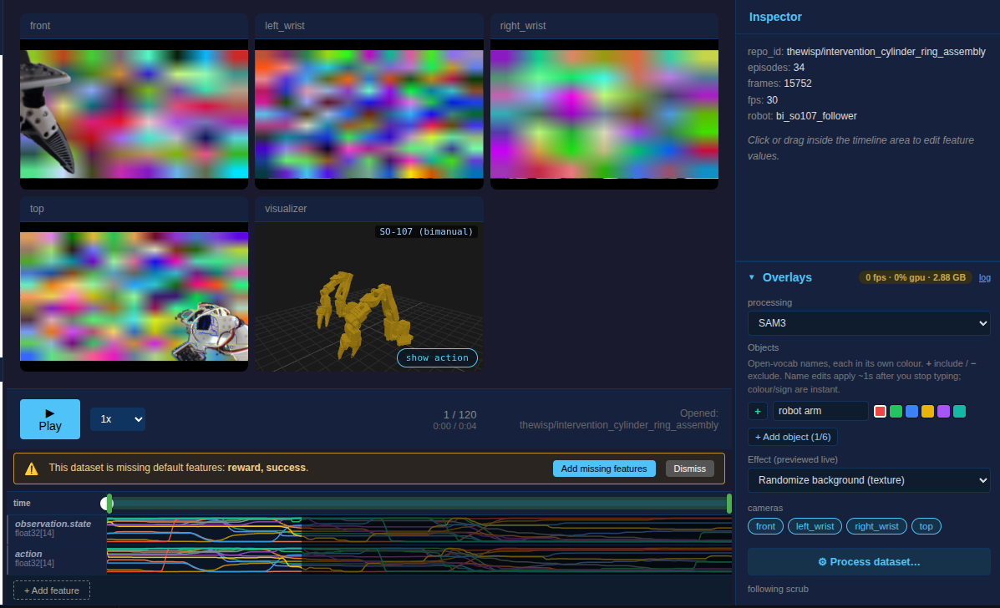
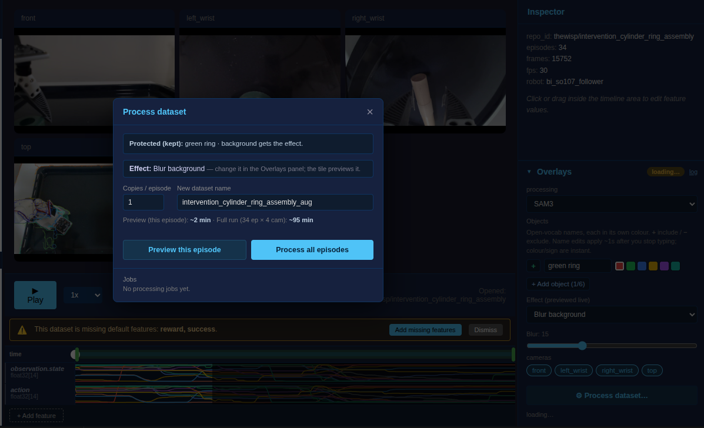
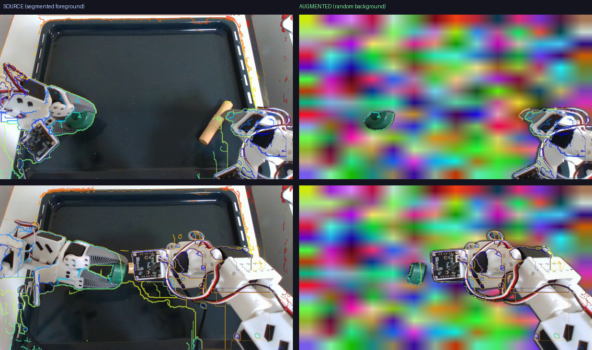
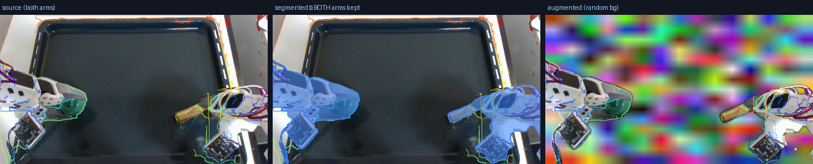

# Data Editing — segment + per-region treatment → augmented dataset

> **The UI described here no longer exists.** Treatments are stored as a
> per-dataset recipe and composited when frames are read, so nothing is baked
> into a copy any more; the whole-dataset path is the filler in
> [saved_masks.md](saved_masks.md), which writes masks in place under the write
> rule. `POST /api/process/start` still exists for an external consumer that
> needs pixels it cannot composite itself, and **nothing in the GUI reaches it**
> — see the note at the top of `gui/static/process.js`. What remains accurate
> below is the treatment vocabulary and the GreenAug rationale; the dialog, the
> job flow and "writes a new LeRobotDataset" describe the superseded path.

**Status:** superseded — see the note above. Builds on the Overlays SAM3 path
([overlays.md](overlays.md)) and the Hub-transfer job model
([hub_transfers.md](hub_transfers.md)).

## What it is

Camera-side **visual domain randomization** for imitation-learning data, as a
**per-region** edit. The user segments task objects (the same SAM3 the data-tab
overlay previews); then **every region — each object and the background — carries
one _treatment_** (Tint / Random / Blur / None). An offline pass applies those
treatments to every frame and writes a **new LeRobotDataset**. Only camera pixels
change — actions, states, tasks, and timing are copied verbatim, so the augmented
dataset trains exactly like the original.

The default (objects **None** = kept as-is, background **Random**) is the GreenAug
recipe — keep the objects, randomize the background — the largest measured
robustness gain, zero clicks. But it's one mechanism: tinting an object and
randomizing the background are the same operation pointed at a different mask
(`composite_regions` in `lerobot/overlays/effects.py`).

Treatments are configured per region in the data Overlays panel; the camera tiles
show the live WYSIWYG result. A thin **accent glow + label** marks each detected
object — that's a detection aid (chrome), **never part of the written dataset**:



"Process dataset…" is a thin commit that echoes the previewed treatments and runs them
on one episode (preview) or all episodes:



A real SAM3 pass on episode 0 (top camera) — source (left) vs augmented (right);
the faint contours are baked into this source dataset's video, not added here:



## Flow

```
Data tab → Overlays panel (pick SAM3, name objects)  ──►  "⚙ Process dataset…"
   │                                                          │
   │  objects = protected foreground                          ▼
   │                                              ProcessData modal (process.js)
   │                                              treatments · copies · name
   │                                              [Preview episode] [Process all]
   ▼                                                          │ POST /api/process/start
GUI server (api/process.py)                                   ▼
   • frees the live overlay (VRAM)                  spawn detached worker subprocess
   • registers ProcessJobState              ──►     python -m lerobot.gui.process_worker
   • polls <job>.json for progress                          │
                                                            ▼
                                            dataset_postprocess.process_dataset:
                                            for each episode/camera/frame →
                                              SAM3 segment → per-region masks →
                                              composite_regions(treatments) → add_frame
                                            → save_episode → new LeRobotDataset
```

The worker writes a per-job progress JSON (`~/.cache/lerobot/gui/process_jobs/`)
~2 Hz; the GUI's `GET /api/process/jobs` merges it and renders frame-count
progress cards (Cancel / Dismiss / Open dataset). "Open dataset" calls
`window.openDataset(out_root)`, so the augmented dataset lands in the tree.

## Treatments

Each region (each object row + the **Background** row) picks one, via a labelled
segmented control `[ Tint | Random | Blur | None ]`:

- **Tint** — blend the region toward a colour (picker: presets + custom RGB).
- **Random** — replace the region with a random blobby colour _texture_, per episode
  (a flat colour is weak augmentation; random real-photo backgrounds are a follow-up).
- **Blur** — Gaussian defocus of the region (param: strength).
- **None** — keep the region's real pixels (the neutral default for objects).

The control is a compact **icon** segmented set (∅ none · colour-square tint · dice
random · droplet blur), plus a `+/−` polarity pill per object (add vs. suppress).

The registry is `TREATMENTS` in `lerobot/overlays/effects.py` and is served to the
frontend at `GET /api/process/treatments`; it extends with no structural change
(texture / noise / solid / brightness are latent in `_treat`). Randomized
treatments sample **once per episode** (per-frame would flicker and corrupt the
motion cues a policy learns from). **Variants / episode** writes N
independently-randomized variants of each source episode (only meaningful with a
randomized treatment — deterministic ones would be identical copies).

**Segment all instances** (checkbox in the overlay, default on): SAM3 returns each
match as a separate instance, so a concept like "robot arm" covers _both_ arms.
Off = the single largest instance only. The setting is shared by the live preview
and the batch commit (`multi_instance` on `set_control` / `process_dataset`), so
what you preview is what you get; the run-tab debug overlay keeps its single lock.



## Model + Quality (both selectable, both part of preview == commit)

Two selectors in the overlay panel choose **how** segmentation runs; the batch job
inherits both from the live preview that tuned it, so the committed masks are the
previewed masks.

**Model** — the SAM3 segmenter over the gated `facebook/sam3` weights:

| Key          | Pipeline                                                                          | Character (measured, one episode, 672 px, 5090)                                                                                                                                                   |
| ------------ | --------------------------------------------------------------------------------- | ------------------------------------------------------------------------------------------------------------------------------------------------------------------------------------------------- |
| `sam3_track` | two-tier: detect once → geometric tracker propagates; hand-rolled re-seed on loss | ~39 ms/frame steady (p95 spikes on re-seed churn). Easy objects perfect; a hard object (thin "wooden dowel") was **lost on ~37% of in-view frames**, and an out-of-view object keeps a stale mask |

Alternative segmenters with better tracking holds (Meta's unified
`Sam3VideoModel` running detection + association every frame, and the SAM 3.1
multiplex tracker via a sidecar env) are a follow-up PR — they need more
soak time before shipping as defaults.

**Quality** — the SAM inference resolution, a **load-time** knob (the
global-attention RoPE tables are built from the model config, so changing it
respawns/rebuilds the model; a processor-only resize crashes):

| Preset            | Detector fwd (5090, fp16) | Mask quality on real robot frames                                       |
| ----------------- | ------------------------- | ----------------------------------------------------------------------- |
| Full (1008 px)    | ~54 ms                    | baseline                                                                |
| Balanced (672 px) | ~30 ms (**1.8×**)         | IoU 0.985 vs Full on "robot arm"; found a ring Full missed; **default** |
| Fast (504 px)     | ~25 ms (2.15×)            | IoU 0.957; scores dip on hard frames                                    |

Presets are `ConceptMaskAdapter.RESOLUTIONS`, served with labels at
`GET /api/overlays/models` (`resolutions`), validated by every endpoint that takes
one, and carried through `ProcessJobConfig` so preview == commit includes the
resolution.

## The overlay IS the preview (WYSIWYG)

Treatments aren't a separate step — they're set per region in the **data overlay
panel**, and the overlay worker runs the exact same `composite_regions` the batch
pass uses (they share `lerobot.overlays.effects`), so the camera tile shows the
_actual committed result_ as you scrub, on the warm SAM3 that's already running.
"Process dataset…" just persists those same per-region treatments to every episode.

The one thing on the tile that is **not** committed is the **detection chrome** —
the accent glow + tiny label on each object. It's drawn by the live worker
(`standalone._draw_detection_chrome`) after the composite, purely so you can verify
segmentation; `process_dataset` never draws it. Because it only ever outlines
(never fills/recolours), it can't be mistaken for a Tint. Each object's outline +
label take that concept's stable auto-assigned colour (never user-chosen), so
colour carries identity only. BOTH tabs run this one mechanism — the WYSIWYG
composite + chrome; the run tab simply defaults every treatment to None (pure
observability: real pixels + chrome), and its overlay is transparent outside
treated regions and chrome so the live feed shows through at full rate.

Imperfect tracking is the main friction — the result may miss an object or drift,
and a full run is expensive. So the flow is staged, cheapest-first:

1. **Tune + preview live (free).** Edit the objects and their per-region treatments;
   the tile shows the composited result per frame (segmentation warm). This is
   where you catch "the left arm isn't detected" before spending anything. The
   effect re-renders the parked frame on change; scrub/play to check other frames.
2. **Preview this episode (~seconds).** Runs the full pipeline on just the current
   episode into a `…__preview` dataset in the normal datasets dir (so it's
   detectable/findable), overwritten each run, and auto-opens + navigates to it —
   a clean every-frame pass (the live overlay skips frames under load), so you see
   temporal tracking over a whole trajectory exactly as the batch will produce it.
3. **Process all episodes (minutes).** Commit the full run once it looks right.

### Measured overhead (RTX 5090, 720p, Balanced 672 px)

| Step                                | Cost         | Note                                                                    |
| ----------------------------------- | ------------ | ----------------------------------------------------------------------- |
| SAM3 load                           | ~6 s         | one-time per run (per resolution — it's baked into the model)           |
| Segment (`sam3_track`, steady)      | ~39 ms/frame | tracker-only propagation                                                |
| Segment (`sam3_track`, seed/reseed) | ~90 ms       | frame 0 + every 150 frames + **every 5 frames while an object is lost** |
| Segment (`sam3_video`)              | ~52 ms/frame | flat — detector + tracker + association every frame                     |
| Treatment apply                     | ~9 ms        | trivial                                                                 |
| Decode source frame                 | ~10 ms       |                                                                         |

Segmentation dominates; the effect and I/O are noise. Full (1008 px) multiplies
the segment rows by ~1.8×. So a full dataset (tens of thousands of frames ×
cameras) is **tens of minutes**, while a single-episode preview is
**seconds-to-a-minute** — hence the split. The menu shows both estimates up
front. On `sam3_track` a missing object is doubly costly (wrong result _and_
constant recovery re-seeds) — which is what the preview is for, and what
`sam3_video` fixes structurally.

### Live-preview latency (event-driven)

The live tile crosses two boundaries; both are now event-paced, so the felt lag is
essentially the model time:

| Boundary             | Mechanism                                                          | Latency                                        |
| -------------------- | ------------------------------------------------------------------ | ---------------------------------------------- |
| GUI server → worker  | lock-free shared memory + sequence counters (`obs_stream`)         | **~3 ms** idle-poll pickup                     |
| worker               | SAM segment + `composite_regions`                                  | **~40–55 ms** at Balanced (the real cost)      |
| server → **browser** | **SSE push** (`GET /api/overlays/data/events`) → immediate re-pull | ~one tick + RTT (500 ms poll kept as fallback) |

History: this path used to be ≤33 ms pickup + up to **500 ms** browser
`setInterval` poll. The 500 ms was never the IPC (that is a Disruptor-style
lock-free ring — `seq_write`/`seq_done` torn-read counters); it was the browser
poll, replaced by a server-side watcher on `SharedOverlayBuffer.overlay_seq(cam)`
that pushes `{cam, seq}` the moment a camera's overlay advances. The worker's idle
wait dropped 33 ms → ~3 ms (`_IDLE_POLL_S`; the `seq == last_seq` gate already
blocks redundant inference, so this is a few extra cheap shm-header reads — not a
busy-wait spin). The rigorous zero-CPU version remains a blocking **eventfd/futex**
wake from the frame-writer (~µs) — noted as a follow-up, not built.

## Layers

| Layer          | File                                              | Role                                                                                                                                                           |
| -------------- | ------------------------------------------------- | -------------------------------------------------------------------------------------------------------------------------------------------------------------- |
| Core transform | `datasets/dataset_postprocess.py`                 | `process_dataset` + per-region `composite_regions` (pure, GPU-agnostic; SAM adapter injectable for tests)                                                      |
| Segmentation   | `overlays/adapters.py`                            | `ConceptMaskAdapter` base (`segment()`/carving/compositing) + `Sam3TrackByDetectionAdapter` (two-tier) and `Sam3VideoUnifiedAdapter` (unified, memory-bounded) |
| Aux-GPU slot   | `gui/gpu_slot.py`                                 | `AuxGpuSlot` + `SLOT` singleton — the resource mutex overlays and jobs share (see Concurrency)                                                                 |
| Job IPC        | `gui/process_jobs.py`                             | `ProcessJobConfig` / `State` / `Paths` (reuses `hub_jobs` pid/atomic-write helpers)                                                                            |
| Worker         | `gui/process_worker.py`                           | subprocess entry; progress writer thread; SIGTERM = graceful cancel                                                                                            |
| API            | `gui/api/process.py`                              | `/treatments`, `/start`, `/jobs`, `/{id}/cancel`, `/{id}/dismiss`                                                                                              |
| UI             | `gui/static/process.js` + button in `overlays.js` | modal + job tray                                                                                                                                               |

## Concurrency — two layers: one aux-GPU slot, one activity at a time

The exclusive resource is a **GPU**, not the overlay. Heavy auxiliary GPU work is
modelled as two layers (`gui/gpu_slot.py`):

- **The slot** — the _resource_: one exclusive **aux-GPU slot per GPU** (a single
  slot today). It does **not** gate a robot's own GPU work (policy inference during
  a run, or local training) — only the resource-expensive _auxiliary_ jobs the GUI
  spins up on demand.
- **An activity** — the _occupant_: exactly one at a time holds the slot. Today's
  activities are the SAM3 overlay (data tab or run tab) and a batch augmentation
  job; a future DepthAnything overlay / depth-export would be another. The slot
  doesn't classify what the activity is — it holds an opaque `key` + a human
  `label` and treats every requester the same (a plain mutex, no priority, no
  preemption). You stop one activity before starting another; **switching from one
  heavy overlay to another follows the same acquire path**.

Interactive activities (overlays) **heartbeat** — the holder's ~2 Hz status poll
refreshes the lease, so a closed tab frees the slot after `timeout_s` (12 s) and
the next requester auto-resumes. Background activities (a batch job) hold the slot
with **no heartbeat** until they explicitly release it (done / cancelled). The
`X-Overlay-Session` header (a `sessionStorage` UUID per tab) keys a data overlay;
the run overlay is `overlay:run`; a job is `process:<id>`. GPU selection later just
means one slot per GPU — same two layers.

**Process hands off from your own preview.** Hitting "Process dataset…" sends your
tab's `X-Overlay-Session`; if _your own_ preview overlay holds the slot, the server
tears it down and the job takes the slot (auto-handoff, no manual "stop preview"
step). If **another** client's overlay or job holds it, the job is refused (409
`overlay_busy`, "GPU busy: …") — no preempting other people.

| Scenario                               | Behavior                                                                                                                                                     |
| -------------------------------------- | ------------------------------------------------------------------------------------------------------------------------------------------------------------ |
| SAM3 model load                        | Loaded by whoever holds the slot; reused within that activity. (Warm reuse _across_ activities is a later optimization — for now the next one reloads.)      |
| 2nd data client (any machine)          | 409 `overlay_busy` → "busy: SAM3 overlay"; auto-resumes when the holder releases or its heartbeat lapses.                                                    |
| Data overlay ↔ run overlay            | **Same slot, symmetric** — whichever holds it blocks the other; stop one to use the other.                                                                   |
| Holder turns overlay off / tab closes  | Slot released (explicit, or 12 s heartbeat timeout) → next waiting activity takes over.                                                                      |
| Start a job from your own preview      | **Auto-handoff** — your preview overlay is torn down and the job acquires the slot as a background (non-heartbeat) activity.                                 |
| Start a job while another client holds | 409 `overlay_busy` with the holder's label; the other activity is untouched (no preemption).                                                                 |
| Batch job running                      | Holds the slot until it finishes; you can still teleop / browse data (backgrounded), but another overlay shows "busy: processing …". One job per source.     |
| Live teleop run active                 | Teleop owns the obs stream (a physical single-writer constraint) → the data publisher is refused, surfaced as the same `overlay_busy` (holder `teleop run`). |

## Notes / limits

- One processing job per source dataset at a time (409 otherwise); the output
  path must not already exist (no clobber).
- SAM3 tracks one instance per concept — a two-arm scene protects one arm unless
  the user adds a second object row.
- Starting a job hands the aux-GPU slot off from _your own_ preview overlay (tears
  it down so SAM3 isn't double-loaded); another client's overlay/job blocks it.

Follow-ups are tracked in [../TODO.md](../TODO.md) (Data Editing section).
