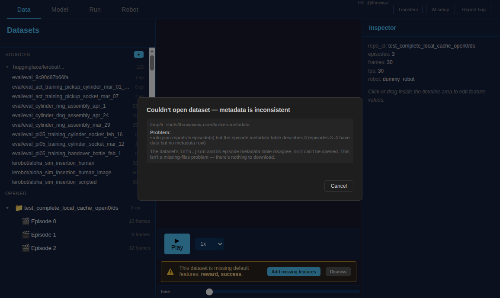
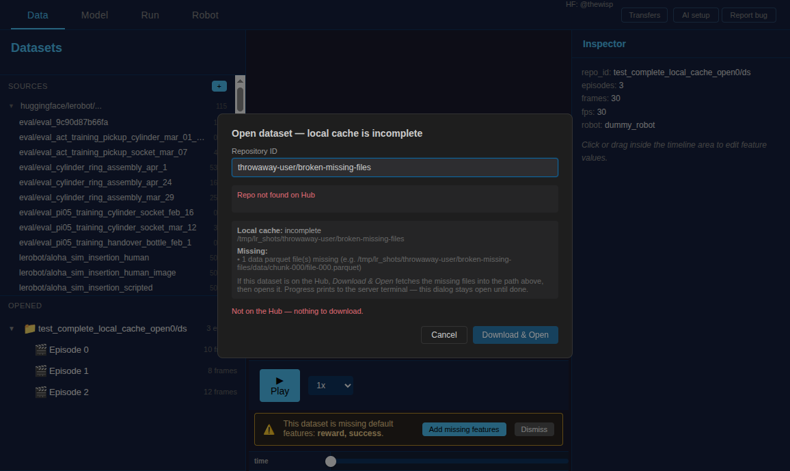
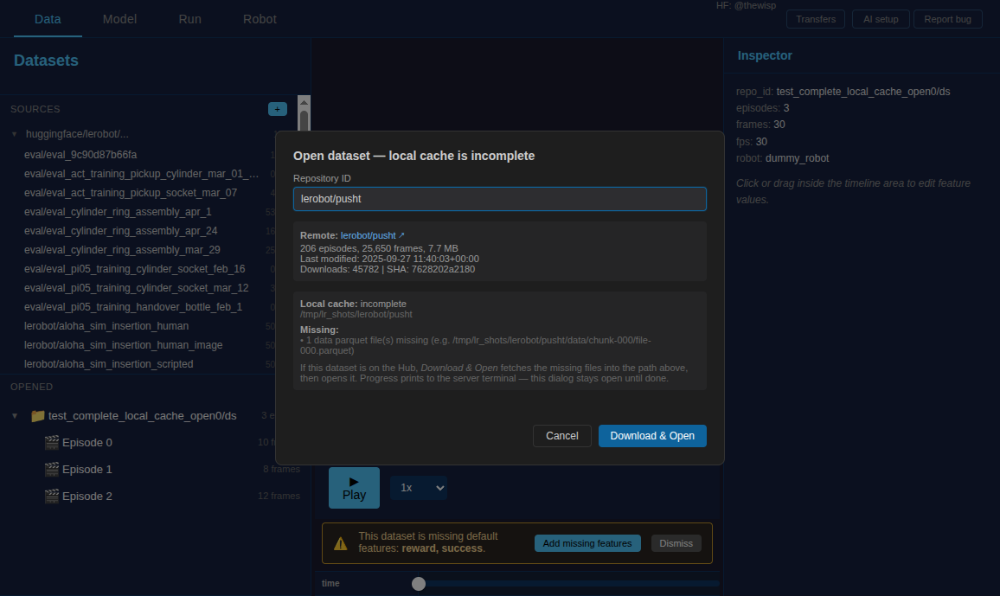

# Data Tab Design

Design doc for the dataset visualization and editing tab.

---

## Core Features

### Dataset Management

- Load one or more LeRobot datasets
- Connect to HuggingFace Hub (authentication required)
- Open local datasets (drag and drop support)
- Create new datasets from the UI
- Tree view showing multiple datasets and their episodes
- Free-text note per dataset, shown under its row (see [notes.md](notes.md))

### Episode Visualization

- Main panel displays all episode features:
  - Camera views (multiple simultaneous video streams)
  - Actions (plotted as time series)
  - States (plotted as time series)
- Horizontal timeline with timestamps
- Play/pause controls, click-to-seek, frame-by-frame navigation

### Episode Editing

- Mark episodes as deleted (with confirmation)
- Reorder episodes (swap)
- Duplicate episodes
- Copy/move episodes between datasets (enables natural merging and splitting)
- Timeline trimming (iOS-style drag handles)

### Data Model

- Source of truth: locally cached dataset files
- In-memory working copy for edits
- Edits are local until explicit save
- UI navigation doesn't lose unsaved changes
- Global save operation (and later: undo/redo)

---

## Local vs Remote Dataset Philosophy

### Core Principle: Local-First Editing

```
+-----------------------------------------------------------+
|                    HuggingFace Hub                         |
|                   (remote storage)                         |
+-----------------------------------------------------------+
              ^ Upload                    v Download
              | (explicit,                | (explicit,
              |  overwrites remote)       |  overwrites local)
+-----------------------------------------------------------+
|                    Local Dataset                           |
|            (source of truth for editing)                   |
|                                                            |
|   - All edits happen here                                  |
|   - Reload = re-read from local disk only                  |
|   - User always knows the local path                       |
+-----------------------------------------------------------+
```

### Why No Sync/Merge with Hub?

1. **No version control** - LeRobot datasets don't have commit history or checksums
2. **No conflict resolution** - We can't reliably detect what changed or merge edits
3. **Explicit is better** - User decides direction: "replace local" or "replace remote"
4. **Simplicity** - No complex sync state to track or debug

### Dataset Opening Modes

| Mode              | Input              | Behavior                                  |
| ----------------- | ------------------ | ----------------------------------------- |
| **Open Local**    | `/path/to/dataset` | Work directly on local files              |
| **Open from Hub** | `user/repo_id`     | Download to local path, then work locally |

### Opening an incomplete or inconsistent local cache

Opening a local path never silently downloads from the Hub. When a dataset
can't be opened as-is, the open pre-check classifies _why_ and the dialog states
it faithfully — it never offers a download that wouldn't help.

| Failure                                                                                           | What the dialog does                                                   |
| ------------------------------------------------------------------------------------------------- | ---------------------------------------------------------------------- |
| **Metadata inconsistent** — `info.json`'s episode count disagrees with the episode-metadata table | States the mismatch; no download (it isn't a missing-files problem)    |
| **Missing files, repo not on the Hub**                                                            | Lists what's missing; _Download & Open_ is disabled (nothing to fetch) |
| **Missing files, repo on the Hub**                                                                | Lists what's missing; _Download & Open_ fetches them, then opens       |







### Reload Semantics

**"Reload" always means re-read from local disk** — never fetches from Hub. Used after applying edits or when an external tool modifies the dataset.

### HuggingFace Hub Operations

Both upload and download are **destructive** and require user confirmation:

- **Download**: "Replace local dataset with version from Hub? Local changes will be lost."
- **Upload**: "Push local dataset to Hub? Remote version will be overwritten."

---

## Technical Analysis: LeRobot Dataset Format

### Dataset Structure

```
dataset_root/
+-- meta/
|   +-- info.json              # fps, features, codec info
|   +-- tasks.parquet          # task definitions
|   +-- episodes/chunk-*/      # episode metadata (parquet)
+-- data/chunk-*/              # frame data (parquet, ~100MB chunks)
+-- videos/{camera}/chunk-*/   # video files (mp4, ~200MB chunks)
```

### Performance Characteristics

| Component              | Load Time          | Notes                             |
| ---------------------- | ------------------ | --------------------------------- |
| Metadata (info.json)   | <10ms              | Loaded once at init               |
| Episode info (parquet) | ~50ms              | Memory-mapped, fast lookups       |
| Frame data (parquet)   | ~1ms/frame         | Memory-mapped, snappy compression |
| **Video decode**       | **50-500ms/frame** | **THE BOTTLENECK**                |

### Video Decoding Bottleneck

- Each frame request triggers `decode_video_frames()` synchronously
- Video containers (MP4) require seeking to keyframes (every 1-2s) and decoding forward
- torchcodec: 50-100ms (preferred, GPU support); pyav: 200-500ms (fallback)

---

## Architecture

### Python Backend (FastAPI) + Web Frontend

**Rationale:**

1. Must use LeRobot Python code — no rewriting dataset logic
2. Video decoding stays in Python — torchcodec/pyav are Python libs
3. Web UI is best for timeline/video UX — rich ecosystem
4. Can wrap in Tauri later for native feel

```
+-------------------------------------------------------------+
|                        Web Frontend                          |
|  +----------+  +----------+  +----------+  +--------------+ |
|  | TreeView |  | Timeline |  | VideoGrid|  | Action Charts| |
|  |(datasets)|  |(scrubber)|  |(cameras) |  | (plotly/d3)  | |
+-------------------------------------------------------------+
                              | WebSocket + REST
                              v
+-------------------------------------------------------------+
|                    Python Backend (FastAPI)                   |
|  +----------------------------------------------------------+|
|  |  Window builder — N seconds of every camera, encoded     ||
|  +----------------------------------------------------------+|
|  |  Window cache on disk (LRU under a byte ceiling)          ||
|  +----------------------------------------------------------+|
|  |  Edit State Manager — in-memory pending edits             ||
|  +----------------------------------------------------------+|
|  |  LeRobot Integration Layer — dataset instances            ||
|  +----------------------------------------------------------+|
+-------------------------------------------------------------+
```

### Key Optimizations

The pictures come from **windowed playback**, designed and measured in
[dataset_playback.md](dataset_playback.md); the still-per-frame JPEG path this
tab used until 2026-09-07 is gone, along with its frame cache, its prefetch
worker and its websocket stream.

1. **Windows, not frames** — the page pulls the next 0.5 to 4 s of every camera
   as one encoded response and decodes it with WebCodecs, so a second of
   playback is one request rather than one per camera per frame
2. **One clock in the page** — frame j of every camera, its masks and its
   readout are painted together, from the same window
3. **A quality ladder chosen from the measured link rate**, ending at the
   archive's own samples when the link carries them
4. **A window cache on disk**, least recently used out under a byte ceiling,
   dropped for a dataset when an edit rewrites it
5. **Thumbnail Strip** — 1 thumbnail/second for timeline scrubbing preview

---

## API Design

### REST Endpoints

```
GET  /api/datasets                     # List opened datasets
POST /api/datasets                     # Open dataset (local path or HF repo_id)
DELETE /api/datasets/{id}              # Close dataset

GET  /api/datasets/{id}/episodes       # List episodes with metadata
GET  /api/datasets/{id}/episodes/{ep}  # Episode details
GET  /api/datasets/{id}/episodes/{ep}/thumbnails  # Timeline strip

GET  /api/datasets/{id}/episodes/{ep}/bundle       # Episode overview: envelopes, task, mask presence
GET  /api/datasets/{id}/episodes/{ep}/window       # N seconds of every camera, encoded
GET  /api/datasets/{id}/episodes/{ep}/data         # Parquet data

POST /api/edits/trim                   # Queue trim edit
POST /api/edits/delete                 # Queue delete edit
POST /api/edits/reorder                # Queue reorder edit
POST /api/edits/merge                  # Queue merge operation
GET  /api/edits/pending                # List pending edits
POST /api/edits/save                   # Apply all pending edits to disk
POST /api/edits/discard                # Discard pending edits

# Hub operations
GET  /api/hub/auth-status
POST /api/hub/login
POST /api/datasets/{id}/hub/download
POST /api/datasets/{id}/hub/upload
```

---

## Edit State Model

```python
@dataclass
class PendingEdit:
    edit_type: Literal["trim", "delete", "reorder", "duplicate", "move", "merge"]
    dataset_id: str
    params: dict
    created_at: datetime

@dataclass
class EditState:
    pending_edits: list[PendingEdit]
    def get_virtual_episodes(self, dataset_id) -> list[VirtualEpisode]: ...
    def apply_all(self): ...
```

---

## Dataset Merge Design

### Motivation

Sometimes the original dataset has flaws. Rather than extending it directly, the workflow is:
record a new dataset, then selectively merge good episodes into the original. This gives
flexibility to cherry-pick data.

### Existing Backend

`lerobot-edit-dataset --operation.type merge` calls `merge_datasets()` in `dataset_tools.py`,
which delegates to `aggregate_datasets()` in `aggregate.py`. The pipeline:

1. `validate_all_metadata()` — checks FPS, robot_type, features match
2. `aggregate_videos()` — `shutil.copy` or ffmpeg concat (NO re-encoding, preserves HF hashes)
3. `aggregate_data()` — merge parquet files with remapped indices
4. `aggregate_metadata()` — remap episode metadata with `src_to_dst` mapping
5. `finalize_aggregation()` — write tasks, info, stats

**Key property:** Videos are never recompressed. They are copied or concatenated via ffmpeg stream
copy (remux only). This preserves HuggingFace upload hashes for unchanged files.

### Known Bug (Fixed, Verified)

When merging datasets with multiple meta/episodes files, indices were not remapped correctly.
Fixed with proper `meta_src_to_dst` mapping in `aggregate_metadata()`.

- Single merge regression test: `tests/datasets/test_merge_regression.py`
- Chained merge tests (A+B->C, C+D->E and triple chain A+B->C->E->G, with video and file
  rotation): `tests/datasets/test_chained_merge.py` — all pass.

### GUI UX: Merge Dialog

A "Merge" button on the Data tab opens a dialog:

1. Select target: always a new dataset (never mutate in-place)
2. Select source datasets from opened datasets (checkboxes)
3. Optionally select specific episodes from each source (checkbox list)
4. Show validation summary (FPS, robot_type, features — green/red checks)
5. Preview result: episode count, total frames, estimated size
6. Execute merge

Episode ordering: append source episodes in order (A's episodes, then B's). No drag-to-reorder
(would force video recompression).

### Integrity Safeguards

1. **Pre-merge validation panel** — green/red checks for FPS, robot_type, features
2. **Always merge to new dataset** — never mutate existing datasets
3. **Post-merge integrity check** — verify:
   - Every episode's video timestamps are seekable
   - Every episode's data parquet row count matches `length`
   - Episode indices are contiguous
   - No orphan video/data files
4. **Diff summary before commit** — "N episodes from A, M from B -> new dataset C"

### Episode Selection (Partial Merge)

For selecting specific episodes (not whole datasets): the user picks episodes via checkboxes,
backend creates a filtered view (similar to virtual edits), and passes only selected episodes
to the merge pipeline.

---

## Future Features

### 3D Robot Visualization (URDF-based)

- Load robot URDF, render synchronized with timeline
- Display current joint positions from `observation.state`
- Overlay commanded actions from `action`
- Use case: verify camera-to-robot time alignment, debug teleop latency

### Optional Tauri Wrapper

Wrap web UI in Tauri for native desktop feel without changing code.

---

## Open Questions

1. **Multiple camera sync:** Independent scrubbing per camera, or always sync?
2. **Large datasets:** 1000+ episodes need virtual scrolling in tree view
3. **Video re-encoding on trim:** Show progress bar? Allow cancel?
4. **URDF loading:** Stored in dataset metadata or loaded separately?
