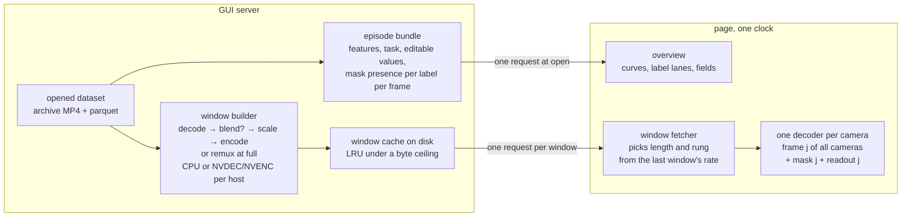
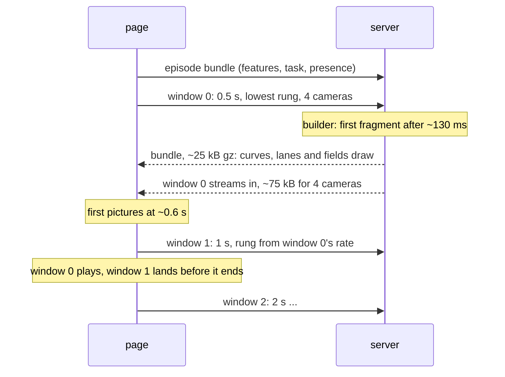

# Dataset playback

How a stored episode reaches the Data tab: pictures, masks, numbers and
their timing. The design is for a remote operator on a slow link; the
same mechanism serves the local case by choosing a higher rung of the
same ladder. It replaces the still-per-frame path on `main` and the
per-episode transcode of `feat/camera-video-transport`. Every number
here was measured on 2026-09-06 and says where; see
[camera_video_pipelines.md](camera_video_pipelines.md) for the live path
and for the measurements this document builds on.

## Requirements

- **P0 Latency.** Opening an episode, switching episodes, or scrubbing
  to a frame shows a picture quickly, at a quality the link allows.
- **P0 Local quality.** When server and client are the same machine, the
  operator sees the stored pixels, not a downscaled copy, and not through
  a special case: the general mechanism reaches full quality whenever the
  bandwidth does.
- **P0 Synchronization.** Cameras agree with each other, and the masks,
  state and action shown belong to the frame on screen.
- **P1 Several users.** A few people on different datasets and episodes
  at once, none slowed by another.
- Agreed along the way: frame-exact scrubbing and stepping, 2x, episodes
  of any length at constant cost, masks as data with free toggling, one
  transcoder and one quality ladder shared with the live path, every
  request logged, the codec of the archive never reaching the page.

## The shape

Two channels per episode. One request at open carries everything whose
size does not depend on what the operator is looking at: the numeric
features, the task and editable values, and which labels have a mask on
which frame. After that the page pulls **windows**: the next N seconds,
for the cameras in view, as one response holding each camera's encoded
frames, the masks for those frames, and nothing else. The page owns the
clock, decodes each camera's frames itself, and paints frame j of every
camera together with mask j and the readout for j.

### The window

A window is `(dataset, episode, cameras, rung, first frame, length)`.
Lengths come from a fixed set, 0.5, 1, 2 and 4 seconds, aligned to
multiples of themselves, so windows repeat across users and sessions and
the cache hits. The response is one body with a small header giving the
byte offset of each part:

- per camera, the frames as raw H.264 starting on a keyframe, or at the
  `full` rung the archive's own samples cut out without re-encoding;
- per masked camera, the mask runs for each frame, in the encoding the
  page already decodes (`masks.js`), at the rung's resolution;
- the frame numbers the window covers, so the page can pair every part
  with the values it already holds.

### The ladder

The same rungs the live path uses, so the operator sees one set of
choices: 320 wide at 0.3 Mbit/s, 640 wide at 0.8 Mbit/s, 1280 wide at
1.5 Mbit/s, and `full`, which is the stored samples untouched, 6 to 20
Mbit/s per camera on the datasets measured. The page picks the rung per
window from bytes over seconds of the previous window, aiming at about
80% of the measured rate for the cameras in view, and starts every
episode and every seek at the lowest rung with the shortest window, then
climbs. On the same machine the first window already measures a rate no
rung can exhaust, so the second window is `full`.

### The builder

One resident worker per opened dataset holds the archive open and builds
windows on demand: seek to the window's first frame (the archive has a
keyframe every two frames), decode N seconds, blend a mask when a blended
window is asked for, scale to the rung, encode with a keyframe first,
write the cache entry, and stream it to the requester as it is produced.
At `full` it cuts the samples out and re-wraps them, no decode. Backend
per host with the pattern the codebase already has: the CPU decoder and
libx264, or NVDEC and NVENC when the CPU is busy. The old branch's
per-episode transcode is this builder with the window equal to the
episode; the still-per-frame path on `main` is this builder with the
window equal to one frame and JPEG as the encoding.

## Opening an episode, over the link

Round trip 237 ms; throughput 3 to 4 Mbit/s; cold builder.

- One round trip, 0.24 s, is the floor for anything the page has not
  already got; the bundle and window 0 go out in parallel at t=0 so they
  share it.
- The bundle is 22 kB gzipped for a 372-frame episode's state and
  action, 25 kB with every non-image feature, 7 ms on the server. The
  overview is complete before the first picture.
- The builder's first fragment is ready 120 to 140 ms after a cold
  ffmpeg start on the 5090 machine; the resident worker removes the
  start-up and has not been measured.
- Window 0 at the lowest rung is about 19 kB per camera for half a
  second, 0.17 s on the link for four cameras.
- So the first picture is at about 0.6 s after the click, and each
  later window is requested while the previous one plays, so playback
  never waits on a request unless the link falls below the rung.

Scrubbing is the same sequence without the bundle: a seek drops the
queued windows and asks for window 0 at the target frame, lowest rung,
shortest length. Stepping within the current window costs nothing: the
page holds the window's decoded frames. Switching episodes is opening.

Localhost: round trip under a millisecond, window 0 is the builder's
130 ms, and from window 1 the rung is `full`, the remux of the stored
samples, which the old branch measured at 0.06 s per episode. First
picture in about 0.15 s, then the stored pixels.

## How each requirement is met

**P0 Latency.** The first picture costs one round trip plus the shortest
window at the lowest rung, about 0.6 s on today's link and 0.15 s
locally, and the same for a seek or an episode switch. Nothing waits on
the masks or the features, and no request ever concerns more than the
next few seconds. Sustained playback holds because the page never asks
for a rung the previous window's rate cannot carry, and drops rung or
cameras before it stalls.

**P0 Local quality.** `full` is a rung, not a mode. It ships the archive's
samples unchanged, so the picture is the stored one, and the page reaches
it through the same rate rule as any other rung. A fast enough LAN
reaches it too. The page must decode the archive's codec for `full`;
Chromium 151 decodes AV1 main and H.264, not HEVC, so `full` is gated
per dataset on the codec in `meta/info.json` and falls back to 1280 for
the rest.

**P0 Synchronization.** One clock. The page holds a frame counter, and
every window covers the same frame range for every camera, with the
masks and values keyed by the same numbers. Each paint draws frame j of
every camera, mask j, and the readout for j, in one pass. There is no
per-camera video element to drift, no separate mask fetch to arrive
late, and no first-camera-drives-the-rest rule as in both earlier
branches, where the four cameras were measured 0.9 to 4.6 s apart under
starvation. If one camera's part is missing, the page holds the frame
for all of them rather than let one run ahead.

**P1 Several users.** The server keeps no playhead; the page owns
position, so users never touch each other's state. Windows are cached
by their key, so a second viewer of the same window costs a file read.
Uncached builds are the shared resource: the CPU builder ran four
cameras at 17 times real time each on the 32-core machine, so a user at
2x uses about an eighth of it, and the builder serves requests round
robin across sessions so a prefetch never delays another user's first
window. Each opened dataset has one resident worker, shared.

**Frame-exact stepping, backwards too.** A window starts on a keyframe
and the page keeps its decoded frames, so stepping inside it is a paint;
stepping across a boundary decodes the neighbouring window from its
keyframe; how long the page takes to decode a window is on the
unmeasured list below.

**2x.** The page asks for windows at twice the rate; the builder's 17
times real time per camera leaves 8 times headroom uncached, and cached
windows cost nothing to build.

**Any length.** Every cost is per window, so an hour-long episode costs
the same per second as a short one, and the cache holds only what was
watched. The bundle grows with length, 22 kB per 372 frames, about 4 MB
per hour of state and action; if that shows in the load, a fixed-size
envelope of each curve replaces the per-frame values in the bundle and
the values ride in the windows, which is a change to the bundle alone.

**Masks.** Data, not pixels, so toggling a label is a repaint and one
video serves every mask choice. Measured 2.6 kB gzipped per frame per
camera, about a fifth of the video's bytes at the 640 rung, and painted
in 1.2 to 4.6 ms median per frame. Presence per label per frame travels
in the bundle, so a label lane is complete at open and never shows a
gap that is really an unfetched window. A blended window is the option
when the link is the bottleneck and the mask view is fixed.

**Logging.** The server logs every bundle and window request with its
key, cache hit or miss, build time and bytes; the page keeps per-window
rate, rung chosen, decode time and frames painted, and reports them the
way the prototype does, so any session can be read back from either
side.

## Prototype results

Built on 2026-09-06 as `gui/api/window_playback.py`,
`static/window_playback.html`, `scripts/gui/eval_window_playback.py` and
`tests/gui/test_window_playback.py`. The remote figures are from my own
server on the rig on a spare port with a self-signed certificate, not the
operator's GUI; the tailnet did not yet have HTTPS enabled. Link during
the runs: round trip 244–265 ms, a 5 MB range at 3.8–4.1 Mbit/s.

Local, intervention dataset, episode 5, four 720p cameras, 640 rung:
first picture 128 ms after open; 30 fps at 1x and 59 fps at 2x with no
hold during play; seeks 11 to 109 ms; a half-second window of four
cameras 187 kB built in 88 ms; cache hits 1 to 4 ms.

Over the link, the rig's labelled dataset, episode 242, four cameras
(two at 960x600, two at 1280x720), two masked, 320 rung: first picture
2.0 s after open, of which the bundle (79 kB gzipped, 1.36 s including
the TLS handshake) and window 0 (109 kB, 1.96 s) ran in parallel on a
fresh connection; then 29.5 fps at 1x over ten seconds with one 116 ms
hold, the window length ramping 0.5, 0.5, 1, 2, 4 s on the page's own
measurement; seeks 11 to 16 ms inside a held window and 0.5 to 1.1 s
cold; 2x at 35 fps, held by the link. The 640 rung on the same link ran
at 19.6 fps with holds of up to 2.9 s: four cameras at 0.8 Mbit/s plus
masks exceed what the link carried, which is the case the manual rung
leaves to the operator and an automatic rule would step down from.
Server side on the rig, misses: 104 ms for a 0.5 s window, 161 ms for
2 s, 281 ms for 4 s, four cameras built in parallel.

Three faults the first remote run exposed, all in the prototype and
fixed the same day: mask parts were raw JSON and outweighed the video
(108 kB against 72 kB per half second; gzipped they are 37 kB); the
fetcher ramped on a schedule to 4 s windows the link could not deliver
and kept downloading abandoned windows after a seek, which starved the
one the operator waited for; and the round trip used in the throughput
estimate came from the bundle request, which on a fresh HTTPS
connection includes the handshake. Now mask parts are gzipped, every
fetch is aborted on a seek that it cannot serve, at most two windows
are in flight, the length grows only while the measured link rate
carries the window's bitrate with margin, and the round trip comes
from a HEAD probe on the warm connection.

With the tailnet's own certificate (HTTPS enabled on tailba99ca.ts.net
on 2026-09-07, `tailscale cert` on the rig, a Let's Encrypt certificate
valid to 2026-12-05), a test instance on a spare port measured the same
way, no certificate bypass in the browser: WebCodecs available on the
tailnet address, no errors; first picture 1.93 s; 26.5 fps at 1x over
ten seconds with holds of 83 to 834 ms as the link varied; cold seeks
0.65 to 0.74 s; 2x at 29 fps, held by the link. The operator's own GUI
runs from a checkout without the two server flags until this branch
lands.

What the first picture over the link is made of, against the 0.6 s
estimate above: the estimate left out the TLS handshake on the fresh
connections (about one round trip more, measured earlier at 0.24 s),
the bundle sharing the link with window 0 (79 kB against 109 kB), and
the browser's connection setup. Window 0 before the bundle, a smaller
bundle (the rig's carries 385 frames of every feature and two mask
presence tracks), and one connection for both would each take a share
off; none is measured yet.

### Encoder options, measured

The reviewer's first run in his own browser (2026-09-07) waited between
windows at every rung. His session's server log showed one half-second
window requested every 0.61 s at the 320 rung: the link carried about
2.2 Mbit/s and four cameras with two mask tracks needed 2.1 to 3. Two
findings and four changes followed, each measured.

- Masks were still at the archive's resolution and a third of every
  window's bytes. Scaled to the rung's width on the server (14 to 20 ms
  per camera for a half-second window, in parallel with the encodes):
  60 kB to 20 kB per half second at 320, 5 kB at 160.
- A 160 rung at 150 kbit/s per camera, and an automatic rung that picks
  from the measured link rate after every window, stepping down at once
  and up after two windows agree.
- Zero-latency tuning dropped: it exists for live encoding; on a stored
  window it cost SSIM 0.980 to 0.988 at 320 on the rig's dataset, with
  5 to 10 percent more bytes as the rate control spends its budget.
- Codec, rate control, quality and preset as request options, in the
  cache key, with selectors in the page. On the rig's labelled dataset,
  one camera, 2 s windows at three positions, SSIM against the scaled
  source, 320 wide: H.264 constant 300 kbit/s 76 to 77 kB at 0.988;
  H.264 quality 26 22 to 27 kB at 0.970; AV1 preset 8 quality 34 33 to
  38 kB at 0.992 at three times the encode time (330 ms per camera per
  2 s). Over the link at the fixed 320 rung, four cameras with masks,
  12 s each: constant bitrate 188 kB per second of media at 26.8 fps
  with holds to 900 ms; H.264 quality 26 86 kB per second at 29.8 fps
  with one 83 ms hold; AV1 quality 34 101 kB per second at 29.3 fps with
  one 317 ms hold.

Against the old branch, measured the same day on the same rig, dataset
and episode: its low profile is 0.54 Mbit/s per camera (2.2 for four,
640 wide) with the first byte of a clip 1.3 to 1.45 s after a cold
request (the whole-episode transcode) and 1.0 s warm, the four low
clips 3.7 to 6 s to download, its medium profile 17 to 23 s, and its
masks one 4.9 MB response (about 2 MB on the wire) in 4.9 s.

What a window's time is made of over the link at 320, half a second,
four cameras: round trip about 250 ms; build 80 to 105 ms with the mask
scaling inside it; transfer, the window's bytes over the link; decode
about 0.5 ms per frame per camera in the page. Everything on the server
is CPU; the page uses the browser's decoder.

Still to build from the discussion: a buffer target in seconds with
continuous fetching up to it and the rung driven by the buffer's trend;
a half-frame-rate window for continuous playback above 1x, never for
pause, step or seek; rung bitrates set from a quality target.

## What is measured and what is not

Measured (2026-09-06, see the pipelines document for the scripts):
link round trip and throughput; stored bitrates; bundle sizes and server
time; mask bytes per frame and paint time; builder speed for one and
four cameras, CPU and GPU, cold; decoder speed alone; the old branch's
remux time; browser codec support in headless Chromium.

Also measured now, above: the prototype's first picture, playback,
seeks and ramp locally and over the link at two rungs, the per-window
build on the rig, and the page's decode time (about 0.5 ms per frame per
camera at the 320 and 640 rungs in headless Chromium).

Not measured: the resident builder's per-window cost against one ffmpeg
per window; the operator's own browser; the rate rule on a link that
varies over minutes; server uplink; a second viewer's cache hit rate.

## Decisions

Taken in review on 2026-09-06.

- **The page decodes with WebCodecs, and the GUI is served over HTTPS.**
  One clock in the page is what synchronization needs. Measured cost of
  HTTPS on the link: one extra round trip on a fresh connection (first
  byte 0.72–0.79 s against 0.48–0.52 s), nothing on a reused one; the
  browser reuses, so it is paid once at page open. A WebAssembly H.264
  decoder is the documented fallback for a deployment that cannot have a
  certificate, at the cost of baseline profile only, no `full` rung, and
  browser CPU. What others do: Rerun and Foxglove decode in the page with
  WebCodecs; CVAT decodes server-cut chunks in the page with a
  WebAssembly decoder; Hugging Face's visualizer uses video elements with
  one primary driving the rest.
- **A late camera pauses playback.** It should not happen; when it does,
  every camera holds on the last complete frame until the window is
  whole. A loading indicator is optional.
- **A window carries every camera of the episode.** There is no way to
  hide a camera today; revisit if playback, rather than a job such as
  segmentation over several cameras, turns out to be the bottleneck.
- **Standalone page first.** Integration into the Data tab, and retiring
  the still endpoint, come after the page has been measured.
- **Rung selection is manual in the prototype.** A quick setting; whether
  the integrated tab exposes it or decides automatically is a UX question
  for later.
- **Window length against round trip.** A window's length sets how many
  bytes precede the first picture, not how often the page waits: windows
  are requested ahead, and the page keeps enough of them in flight to
  cover the round trip plus the build, so with a 0.24 s round trip and
  0.5 s windows one ahead suffices and with a longer round trip two are.
  The first window after an open or a seek stays 0.5 s at the lowest
  rung; later ones grow. Defaults, each revisited from the prototype's
  numbers: lengths 0.5, 1, 2 and 4 s; the ladder 320, 640, 1280, `full`;
  80% of the last window's measured rate; masks in the encoding
  `masks.js` decodes, at the rung's resolution; the bundle with every
  non-image feature per frame and mask presence as the existing per-frame
  bitset; one ffmpeg per window first, the resident worker measured
  against it.

## Open decisions

1. **The window container.** Multipart or a small binary header; either
   is a day's work, and it should be whatever the live path's fan-out
   can also emit.
2. **The resident builder.** ffmpeg per window, PyAV in-process, or
   PyNvVideoCodec on the GPU path; decided by measuring the per-window
   cost of each.

## Order of work

1. Done: the bundle and window endpoints with the CPU builder and the
   disk cache, logged; the page with one clock, WebCodecs decode per
   camera, masks and readouts per frame, a manual rung; the harness;
   measured locally and over the link.
2. Done on the tailnet and the rig: HTTPS enabled, the certificate
   issued, measured against a test instance. Left: the operator's own
   GUI started with the two flags once the branch lands, and a
   measurement in the operator's own browser.
3. The first picture over the link: window 0 ahead of the bundle, a
   smaller bundle, measured one at a time. The automatic rung, from the
   same rate the ramp already measures.
4. `full` as remux, gated by codec; the GPU backend; the blended window
   option; a second viewer; then the Data tab, retiring the still
   endpoint.
