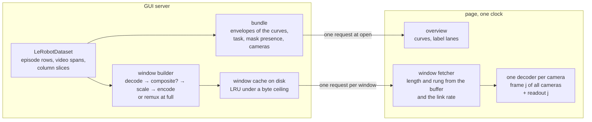

# Dataset playback

How a stored episode reaches the Data tab: pictures, masks, numbers and
their timing. The design is for a remote operator on a slow link; the
same mechanism serves the local case by choosing a higher rung of the
same ladder. It replaces the still-per-frame JPEG path of the Data tab.
Every number in this document was measured and is dated in the
[evidence](#evidence) appendix; see
[camera_video_pipelines.md](camera_video_pipelines.md) for the live path
and the archive measurements this design rests on.

## Build status

The contracts below are the design; the branch implements them in this
order, and each item is marked here until its commit lands.

- Bundle, windows at the encoded rungs with features and mask runs, the
  disk cache, the rule, the page: built and measured.
- The three dataset accessors, and the playback code reading the
  dataset only through them: built.
- The archive's bitrate per camera in the bundle; no upscaling of a
  source narrower than the rung; `full` as a remux with `lead` frames;
  the automatic rung climbing into `full` and upgrading held windows on
  an idle link: built and tested on localhost.
- `masks=composited` windows and `masks=none`: built and tested.
- The Data tab plays through the shared player module: built and
  tested.
- The retirement of the still endpoint, its frame cache, its prefetcher
  and the websocket still stream: done; an edit now drops the dataset's
  cached windows.

## Requirements

- **P0 Latency.** Opening an episode, switching episodes, or scrubbing
  to a frame shows a picture quickly, at a quality the link allows.
- **P0 Local quality.** When server and client are the same machine, the
  operator sees the stored pixels, not a downscaled copy, and not through
  a special case: the general mechanism reaches full quality whenever the
  bandwidth does.
- **P0 Synchronization.** Cameras agree with each other, and the masks,
  state and action shown belong to the frame on screen.
- **P1 Several users.** A few people on different datasets and episodes
  at once, none slowed by another.
- Agreed along the way: frame-exact scrubbing and stepping, 2x, episodes
  of any length at constant cost, masks as data with free toggling, one
  transcoder and one quality ladder shared with the live path, every
  request logged, the codec of the archive never reaching the page
  except at `full`, playback that wraps within the episode and never
  leaves it on its own, and no access to a dataset except through
  `LeRobotDataset`'s own accessors.

## Shape

Two channels per episode. One request at open, the **bundle**, carries
everything whose size does not depend on what the operator is looking
at and is bounded whatever the episode's length. After that the page
pulls **windows**: the next N seconds, every camera, as one response
holding each camera's encoded frames and the numeric features' rows for
those frames. The page owns the clock, decodes each camera's frames
itself, and paints frame j of every camera together with the readout
for j, from the same window.

### The bundle

`GET /api/datasets/{id}/episodes/{ep}/bundle`, one gzipped JSON:

- `length`, `fps`, `episodes` (the dataset's count), `format_version`;
- `cameras`: per video feature its width, height, codec and the
  archive's bitrate in kbit/s, which is what the `full` rung costs;
- `envelope`: per numeric feature the min and max per column over at
  most 1024 equal spans of frames (`columns`, `lo`, `hi`); an episode with
  no more frames than columns is sent exactly, one frame per column, with
  `hi` null;
- `series`: per mask feature the presence bitset per frame and the
  disabled bitset, and `task` per frame;
- `masks`: per mask feature its labels and segmented size;
- the ladder: `rungs`, `rung_kbps`, `window_lengths`, `encoder_options`.

The per-frame numeric values are not in the bundle; they ride in the
windows. That is what keeps an hour-long episode's bundle at 182 kB.

### The window

`GET .../episodes/{ep}/window?start=F&len=S&rung=R[&codec=&rc=&q=&preset=][&masks=none|runs|composited&mv=V][&v=FORMAT]`

`start` is a frame index on the grid of `len`: lengths are 0.5, 1, 2 and
4 s, each aligned to multiples of itself, so windows repeat across users
and sessions and the cache hits. The body is a 4-byte little-endian
header length, a JSON header, then the parts back to back; the header
gives each part's offset and length, and for a video part the size of
every frame so the page hands the decoder one frame at a time:

- per camera, `kind: video`: raw H.264 (Annex B, one keyframe first, no
  B-frames, an access-unit delimiter per frame) or an AV1 OBU stream, at
  the rung's width, under the requested rate control; at `full`, the
  archive's own samples from the keyframe at or before `start`, with
  `lead` frames to decode and drop before the first requested frame;
- `kind: features`: every numeric feature's rows for the window's frames,
  gzipped JSON;
- with `masks=runs`, per masked camera `kind: masks`: the mask runs for
  those frames scaled to the rung's width, gzipped, with their `size`;
- with `masks=composited`, the video parts carry the saved-mask recipe
  rendered into the pixels by the library's own compositor, what a policy
  is fed, and `mv` is the recipe version the page holds so an edit
  changes the URL; at `full` a composited window is encoded at the source
  size at constant quality 18, since composited pixels cannot be the
  archive's samples.

Responses are cacheable in the browser for an hour. The cache key, on
the server's disk and in the browser's URL, is the tuple of dataset,
episode, start, length, rung, encoder options, format version, and for
composited windows the recipe fingerprint. Stored pixels never change,
so a recipe edit is a new key of its own; anything that rewrites the
archive or the rows -- a trim, a delete, a feature or mask save -- drops
every cached window of that dataset through the GUI's shared cache
invalidation, which is where the frame cache used to be cleared.

### The ladder

`160`, `320`, `640` and `1280` are widths with a nominal bitrate each
(150, 300, 800 and 1500 kbit/s per camera under constant bitrate; under
constant quality or AV1 a window is far smaller than its rung's cap,
which is why the rule measures cost rather than assume it). A source
narrower than a rung is not upscaled. `full` is the archive's samples
untouched, cost per camera as the bundle reports, available when
`meta/info.json` names a codec the browser decodes (Chromium 151: AV1
main and H.264, not HEVC). The automatic rule climbs into `full` like
any other rung, when the measured rate carries the archive's bitrate
for every camera with margin; on the same machine that is the second
window. That is how P0 local quality is met without a mode.

### The builder

One ffmpeg per camera per window, in parallel across cameras and with
the mask and features parts, from the archive: seek to the window's
first frame, decode, scale, encode with a keyframe first; cache the
body on disk under a byte ceiling, least recently used out first. A
composited window decodes with the library, renders the recipe per
frame with `mask_compositing.composite_from_store`, and pipes raw
frames to the same encoder. At `full` the builder demuxes the samples
from the keyframe at or before the first frame and re-wraps them, no
decode. The still-per-frame path this replaces was this builder with a
window of one frame and JPEG as the encoding.

Everything the builder reads comes through the dataset: the episode's
row range in the loaded table (episode filtering honoured), a column
slice for those rows, and a camera's video span (file, first and last
timestamp) for the episode.

## The adaptation rule

Stated as a rule so it can be judged on any link, not tuned to one: the
buffer-plus-throughput hybrid that DASH players use, with the window
length as a third output.

Inputs, all measured by the page: B, the seconds of decoded media held
ahead of the clock, measured every tick and continuing across the wrap;
R, the link rate, a bytes-weighted average over the last six windows
large enough to measure (at least 60 kB and 150 ms of transfer after the
server's time and one round trip); C(rung), the cost in bytes per second
of media of the last window seen at each rung, and for a rung not yet
seen the last window's cost scaled by the ladder's nominal bitrates (for
`full`, the archive's bitrate from the bundle); the playback rate r; the
round trip from a HEAD probe; and, from the previous page load against
the same server, the rung it ended at and its last R, kept per server
origin because the link is a property of the browser and the server,
not of the dataset.

Parameters: the buffer target T (4 s at 1x, scaled by r); the window
lengths; the ladder; the margin m (1.2); the buffer thresholds for the
window length (0.4, 1.2, 2.5 s) and for the rung (0.5 s to allow a step
down, 1.0 s to allow a step up, 0.75 T as evidence of headroom while no
rate can be measured).

Decisions, each window:

- Start: the rung remembered for this server, else the lowest. The
  remembered R seeds the average with the weight of the smallest
  measurable window, so one real window outweighs it and a link that
  has changed since is stepped down at once.
- Fetch: while the media held or requested ahead of the clock is under
  T and fewer than two requests are in flight, request the next window;
  never discard a window that is held; abort fetches a seek makes
  useless. Past the last frame the walk continues from frame 0, since
  playback wraps, and at that point the next episode's bundle and window
  0 are fetched for a manual switch.
- Length: the longest grid length allowed by B, the shortest when B is
  near zero, and among those the longest whose predicted arrival, its
  bytes at the current rung's C over R shared with the requests in
  flight plus the round trip and the build, is under B. A window starts
  with a keyframe, so a long one is cheaper per second (2.4 times at 640
  wide with AV1); the only reason for a short one is having nothing to
  play while it arrives.
- Rung: step down one rung when B is thin and the last window took
  longer than it plays, or when the current rung's C times m exceeds R.
  Step up one rung when B has a second of slack and the next rung's C
  times m fits R. While no window has been large enough to measure R, B
  at 0.75 T stands in for it, worth one step. Once R is measured, R
  decides. Never more than one step per window.
- Rescue: if the clock has been held for over a second on a window
  still in flight, the link has dropped under what that window needs;
  abort it and request the shortest window at the lowest rung for the
  current position.
- Upgrade: when the buffer is at T and nothing is in flight, the state
  the per-window choice never sees since no window arrives, step the
  rung up by the same evidence and re-fetch the first held window at or
  after the clock that is below the rung, one at a time; it replaces the
  held one once decoded. This is what takes a short episode on localhost
  from the lowest rung to the archive's own samples: the whole episode
  is held within a second and would otherwise stay at the rung it was
  first fetched at.

What it does not know: the codec, the rung's pixels, the dataset, the
link's nature. It sees bytes, seconds and a buffer.

Judged by `tests/gui/test_window_adaptation.py`, which plays a synthetic
noise episode through Chromium's network emulation on four profiles set
relative to the content's measured bytes per rung: a slow link with
250 ms latency at 1.5 times the 320 rung's bytes (no holds once the
buffer has formed, 320 or below, windows growing to 2 s or more); a fast
link at three times the 1280 rung's bytes (climbs to 640 or above, no
holds); a link that drops after eight seconds to 1.2 times the 160
rung's bytes (comes down to 160, no hold over three seconds); and three
page loads in one browser, fast, fast again, then slow (the second
starts at the remembered rung without holds, the third starts there and
comes down without a hold over three seconds). A change to the rule has
to pass all four. When the operator reports a wait, the first step is
to turn it into a profile here.

## The page

- One clock. The clock is a frame counter; a paint draws frame j of
  every camera and the readout for j from the window that holds them,
  in one pass. If any camera lacks frame j, every camera holds on its
  last complete frame until the window is whole.
- Playback wraps within the episode, as the Data tab does, and never
  leaves the episode on its own. The buffer continues across the wrap,
  so the wrap is a paint.
- A seek drops the fetches that cannot serve the target frame and asks
  for the shortest window at the target; stepping inside a held window
  is a paint; the frame's own row is always in the same window as its
  picture, so a step never shows a value from a different frame.
- The next episode's bundle and window 0 are fetched ahead once the
  buffer has reached the end of the current one, so the operator's
  switch paints from them.
- Every camera of the episode is in every window; there is no way to
  hide a camera. A focus mode that gives the enlarged camera the higher
  rung is an open item.
- The page keeps per window the bytes, time, cache result, rung and
  rate, per paint the frame and the buffered seconds, every hold, and
  the decode time per camera, and the server logs every bundle and
  window with its key, cache result, build time and bytes, so any
  session can be read from either side.

## Integration into the Data tab

The tab's camera tiles become canvases painted by the player module the
standalone page proved; everything the tab did per frame is done per
paint instead: the frame and time readouts, the timeline, and the
notifications to the feature editing, overlays, mask and URDF modules.
The play loop is the player's clock with the trim range as its wrap;
the speed selector sets its rate; stepping and seeking call its seek.

The tab draws saved masks itself from the episode masks response, as it
does today, so the tab's windows carry no mask runs. When saved masks
exist the tab shows the recipe's composite with outlines drawn over it;
the tab then asks for composited windows with the mask version it
already tracks, which is the same contract the still path had and the
same cache invalidation. The live overlay stream and an armed apply run
own the tiles while they are active, as they do today; the player is
paused while they are, and a scrub leaves them.

The JPEG still endpoint, its frame cache and its prefetcher are retired
once the tab plays through windows; nothing else in the GUI reads them.

## Decisions

- **The page decodes with WebCodecs, and the GUI is served over HTTPS.**
  One clock in the page is what synchronization needs. HTTPS costs one
  extra round trip on a fresh connection and nothing on a reused one.
  What others do: Rerun and Foxglove decode in the page with WebCodecs;
  CVAT decodes server-cut chunks with a WebAssembly decoder; Hugging
  Face's visualizer uses video elements with one primary driving the
  rest. A WebAssembly H.264 decoder is the fallback for a deployment
  without a certificate, at the cost of baseline profile only, no `full`
  rung, and browser CPU.
- **A late camera pauses playback.** Every camera holds until the window
  is whole.
- **A window carries every camera of the episode.**
- **Playback wraps within the episode.** The page never moves to another
  episode on its own; the next episode is fetched ahead for the switch
  the operator makes.
- **The rung is automatic**, by the rule above, remembered per server;
  a manual rung remains as a setting.
- **The bundle is bounded**: envelopes of the curves, values in the
  windows.
- **Masks are data in the tab**, drawn by the tab from the episode
  masks response; the standalone page draws them from window parts.
- **Windows are built one ffmpeg per camera** with a disk cache; the
  resident worker and the GPU backend are open items measured against
  it, not assumed.
- **The dataset is read only through `LeRobotDataset`'s accessors.**

## Open items

- The resident builder (PyAV in-process, or PyNvVideoCodec on the GPU
  path), decided by measuring the per-window cost against one ffmpeg
  per window.
- A pre-encoded ladder per dataset, built once in the background with
  slow presets, so windows are cache hits at better quality per bit.
- A focus mode: the enlarged camera at the higher rung, the others at
  the lowest.
- A half-frame-rate window for continuous playback above 1x only, never
  for pause, step or seek.
- Rung bitrates set from a quality target rather than nominal caps.
- Browser-side invalidation on edit: the server drops a dataset's
  cached windows when it is edited, and a recipe edit changes the URL
  through the mask version, but a URL whose pixels an edit rewrote (a
  trim, say) can still be answered from the browser's own cache for up
  to an hour. A dataset edit generation in the URL would close that.
- Not measured: the hour-long episode and the episode switch over the
  link; a second viewer's cache hit rate; the operator's own browser
  under instrumentation; the rule on a link that varies over minutes.

## Sealed prototype

`static/window_playback.html` with `scripts/gui/eval_window_playback.py`
is the measurement page: it runs the same player module as the tab,
`static/window_player.js`, against the same endpoints, exposes
`window.__metrics` and `window.__playback`, and is what the adaptation
profiles run against. It takes no more features; the Data tab is the
product.

## Evidence

Measured on 2026-09-06 and 2026-09-07. Local means this machine (32
cores, a 5090); the link means Tailscale between this machine and the
rig, direct (IPv6, no relay), round trip 233 to 265 ms, 3.8 to 4.1
Mbit/s in a single stream server-side and 2.2 to 2.8 Mbit/s as the
operator's browser measured it.

**Archive.** Stored AV1 at 5.8 to 6.3 Mbit/s per camera on the rig's
labelled dataset and 20 Mbit/s per camera on the local intervention
dataset; a keyframe every two frames. Masks are 7.0% of the rig's
labelled dataset, 0.8 to 4.9 MB of RLE per episode.

**Local playback**, intervention dataset, four 720p cameras, 640 rung:
first picture 128 ms after open; 30 fps at 1x and 59 fps at 2x with no
hold; seeks 11 to 109 ms; a half-second window of four cameras 187 kB
built in 88 ms; cache hits 1 to 4 ms.

**Over the link**, the rig's labelled dataset, four cameras, two masked,
with the tailnet's certificate: first picture 1.3 to 1.9 s (bundle and
window 0 in parallel on a fresh HTTPS connection, one round trip more
than a reused one); at the 320 rung 26.5 to 29.5 fps with holds under
a second as the link varied; cold seeks 0.5 to 1.1 s; 2x at 29 to 35
fps, held by the link; the 640 rung fixed at 19.6 fps with holds to
2.9 s, which the automatic rung steps down from. Server-side misses on
the rig: 104 ms for a 0.5 s window, 161 ms for 2 s, 281 ms for 4 s, four
cameras in parallel.

**Encoder options**, one camera of the rig's dataset, 2 s windows at
320 wide, SSIM against the scaled source: H.264 constant 300 kbit/s 76
to 77 kB at 0.988; H.264 quality 26 22 to 27 kB at 0.970; AV1 preset 8
quality 34 33 to 38 kB at 0.992 at three times the encode time (330 ms
per camera per 2 s). Zero-latency tuning cost SSIM 0.980 to 0.988 with 5
to 10 percent more bytes and is not used. Masks scaled to the rung's
width: 60 kB to 20 kB per half second at 320, 5 kB at 160, 14 to 20 ms
per camera per half-second window. Over the link at the fixed 320 rung,
four cameras with masks: constant bitrate 188 kB per second of media at
26.8 fps with holds to 900 ms; H.264 quality 26 86 kB per second at 29.8
fps with one 83 ms hold; AV1 quality 34 101 kB per second at 29.3 fps
with one 317 ms hold.

**Window length.** At 640 wide with AV1 a half-second window cost 174 kB
and a four-second one 574 kB: 2.4 times cheaper per second of media.

**The rule over the link**, four cameras with masks, twelve seconds
each: auto with AV1 quality 34, first picture 1.35 s, 30 fps with no
hold, the rung climbing 160 to 320 and the buffer to 6 s, 138 kB per
second of media; auto with H.264 quality 26, first picture 1.33 s, 30
fps with no hold, the rung climbing to 640, 77 kB per second; the
operator's own sessions on episode 8, twice and at 2x, without a wait.
Against the old branch on the same rig and episode: its low profile
0.54 Mbit/s per camera with the first byte of a clip 1.3 to 1.45 s cold
and the four low clips 3.7 to 6 s to download, its masks one 4.9 MB
response in 4.9 s.

**Faults the profiles and sessions found**, each fixed and pinned: mask
parts as raw JSON outweighing the video; a fetcher ramping on a schedule
and downloading abandoned windows after a seek; the round trip taken
from a request that included the TLS handshake; a rung climbing from
160 to 1280 on one 44 kB sample; a 4 s window at 1280 in flight holding
playback after a link drop; an aborted fetch removing the record of the
rescue fetch that replaced it; a full buffer counting as evidence for a
step up after the rate had been measured; every episode starting from
an empty buffer when playback ran into the next episode, which is why
the buffer continues across the wrap instead.

**Episode length**, a synthetic hour-long episode (108,000 frames at 30
fps, two 480x240 cameras, 16-dim state and action), local: seeks into
the 54,000th and 97,000th frame painted in 76 to 145 ms; half-second
windows built in 40 to 105 ms; 30 fps at 1x and 58 fps at 2x with no
hold. The bundle with every numeric value per frame was 31 MB gzipped,
4.8 s to build and 5.4 s to the first picture, 100 s over a 2.5 Mbit/s
link from the measured bytes; with envelopes it is 182 kB, built in 62
to 66 ms, first picture 0.38 s. On the rig's labelled dataset the bundle
went from 770 to 800 ms on the server, a pandas read of the mask columns
of the whole parquet file per call, to 11 to 22 ms read from the loaded
table, and episode 242's bundle from 79 kB to 42 kB.

**Episode switch**, local, the test dataset: the next episode's first
frame paints 17 ms after a switch to a prefetched episode (three runs,
17.1 to 17.3 ms).

**Localhost quality.** On the test dataset with the automatic rung, the
page reaches `full` within the first windows and the canvas pixels equal
the archive's own frames decoded from the file, on an AV1 archive and on
an H.264 one (`tests/gui/test_window_playback.py`, 2026-09-07).

**Browser.** Headless Chromium 151 reports AV1 main and H.264 decode
supported and smooth, not HEVC; the page decodes at about 0.5 ms per
frame per camera at the 320 and 640 rungs. Window responses were always
cacheable for an hour, which is why a replayed window never reaches the
server.
