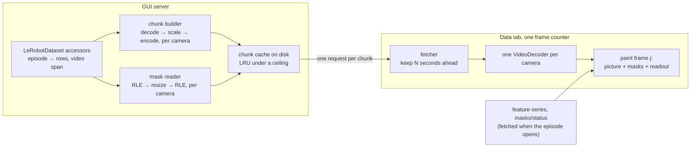

# Dataset video playback

Status: proposed
State of the work: [#221](https://github.com/TheWisp/lerobot/pull/221) until the tracking issue is opened

The Data tab fetches one JPEG per camera per frame at the playhead. On a LAN that
is adequate. Over Tailscale to the rig the requests serialize behind the
playhead: cameras arrive seconds apart, the frame rate is set by the link, and an
operator reviewing episodes remotely cannot watch motion at speed — which is what
the tab is for.

**Proposal.** The tab draws its camera tiles from video. The server sends a
[chunk](#g-chunk) — a few seconds of every camera, each encoded at a resolution
the link carries, with the saved masks for those frames as
[RLE rows](#g-rle-rows) at the same resolution — and the page decodes, composites
and paints every camera's frame _j_ together under one frame counter. Video
arrives behind a two-value [profile](#g-profile) selector beside the
[JPEG path](#g-jpeg-path), so it can be built and measured against the path it
replaces; removing that path is the step after.

## Scope

In:

- Playing a stored episode's cameras in the Data tab at a fixed profile, with
  the tab's existing controls — play, pause, step, seek, speed, trim, episode
  switch — behaving as they do now.
- Saved masks drawn over that picture, sent as RLE rows at each camera's
  [encoded resolution](#g-encoded-resolution).
- The overlay panel keeps working: the live SAM overlay, its mask composition,
  and apply-and-play. They act on the tiles the tab paints rather than on a
  surface of their own, so changing where the tiles come from can break them
  without touching their code ([O11](#o11)).

Out, and why:

- **Removing the JPEG path.** The destination is that video is the tab's only
  picture path and the JPEG endpoint, its frame cache and its prefetcher are
  gone. Not in this step: doing both at once made the earlier attempt
  ([E4](#e4)) too large to review.
- **Adapting to the link.** A bitrate ladder that measures the link and moves
  between rungs exists and works ([E2](#e2)). Not in this step: whether a fixed
  profile is enough is the first thing to find out, and a ladder is a mechanism
  that has to be understood before a wait can be explained.

Non-goals:

- **The Run and Robot tabs' live camera path.** An earlier design covered both at
  once on the theory that a transcoder and a quality ladder could be shared. The
  shared part is small — a live path encodes what a camera just produced and
  caches nothing; a stored path decodes a file and caches everything — and
  designing them together produced two half-built pipelines. Separate problem,
  separate document.
- **Any GPU path.** Decode, scale and encode on the CPU with ffmpeg, which is
  what every measurement here was taken with; nothing measured needed more.
- **Compositing on the server.** Masks cross as data and the page draws them
  ([C3](#c3)).
- **Auditing what a policy is fed.** This is an observation view. The picture is
  a transcode and the page's rendering of a [recipe](#g-recipe)'s treatment approximates the
  library's compositor. Judging the exact training input is a different question
  and is not answered here.

## Requirements

This is an observation view. The operator watches recorded motion to judge what
happened — whether the gripper closed at the right moment, whether a mask follows
the object, whether an episode is worth keeping. **Smoothness and latency beat
fidelity**, and the priorities follow from that.

Targets are stated against two conditions:

- **Local** — server and browser on the same workstation.
- **Link** — Tailscale to fc500t, round trip 233–265 ms, 2.2–2.8 Mbit/s as the
  browser measured it (2026-09-07; it varies by day, re-measure before quoting).

The workload for both: the rig's labelled dataset, four cameras at 960×600 and
1280×720, 30 fps, AV1, two of them carrying saved masks.

| #                         | Pri | Requirement                                           | Target                                                                                | Why that target                                                                                                                                                                                                                                                                                                                                          | Checked by                                                                                                                                           |
| ------------------------- | --- | ----------------------------------------------------- | ------------------------------------------------------------------------------------- | -------------------------------------------------------------------------------------------------------------------------------------------------------------------------------------------------------------------------------------------------------------------------------------------------------------------------------------------------------- | ---------------------------------------------------------------------------------------------------------------------------------------------------- |
| **R1**   | P0  | Playback keeps time at every speed the tab offers     | media time within 5% of wall time and no stall over 500 ms, from 0.25× to 2×          | 2× at 30 fps is 60 frames of media per second, and it is the target because the operator reviews at speed and drops to 1× at what looks wrong. Video and saved-mask drawing only; the live SAM overlay has costs of its own. Reached over the Link by the reference branch: 1.01 / 1.00 / 0.99 / 0.98 / 0.97 at 0.25× through 2×, no stalls ([E2](#e2)). | The page's frame counter sampled against the wall clock per speed, over the Link, as in E2's table; pinned by a Playwright test on an emulated link. |
| **R2**   | P0  | Opening an episode paints every camera                | ≤ 2 s on the Link, ≤ 300 ms Local                                                     | The operator scans episodes one after another, so this decides whether the tab is usable; 13.8 s, what direct play took over the Link, is what unusable looks like. 1.3–1.9 s was reached ([E2](#e2)).                                                                                                                                                   | Time from episode selection to every tile painted, instrumented in the page.                                                                         |
| **R3**   | P0  | A seek paints the target frame                        | ≤ 1.5 s on the Link, ≤ 150 ms Local                                                   | Scrubbing is how a labelling error is found. 0.5–1.1 s cold on the Link and 11–109 ms Local were reached ([E2](#e2)).                                                                                                                                                                                                                                    | Time from scrub to the target frame painted on every tile.                                                                                           |
| **R4**   | P0  | Cameras stay frame-synchronized                       | every tile shows one frame index; if one camera lacks it, none advances               | Two cameras a few frames apart look like a real time offset in the data, and the operator cannot tell that from a true one.                                                                                                                                                                                                                              | Cameras recorded as distinct flat greys so a canvas says which frame it shows; withhold one camera's chunk and assert no tile advances.              |
| **R5**   | P0  | A step is exact                                       | the next frame on every camera, with the readout for that frame                       | An off-by-one between picture and state is a wrong conclusion about the data.                                                                                                                                                                                                                                                                            | Step, then compare the painted frame index per tile and the readout against the expected frame.                                                      |
| **R6**   | P0  | The overlay panel behaves as it does on the JPEG path | live SAM overlay, mask composition, apply-and-play                                    | They act on the tab's tiles, so the picture source is a dependency they do not declare ([O11](#o11)).                                                                                                                                                                                                                                                    | The existing overlay and apply-and-play tests run at `low`; apply-and-play checked against the mask counts on disk.                                  |
| **R7**   | P1  | Several viewers                                       | one viewer never pushes another below R1                                              | This path uses no GPU, so the bound is CPU, and it should be an explicit bound rather than an accident.                                                                                                                                                                                                                                                  | Two browser contexts on different episodes; R1 holds for both.                                                                                       |
| **R8**   | P1  | Episode length does not matter                        | R2 and R3 still met at 108,000 frames                                                 | Episodes are already tens of thousands of frames; anything that scales with length fails later and quietly. Seeks into the 54,000th and 97,000th frame painted in 76–145 ms ([E2](#e2)).                                                                                                                                                                 | R2 and R3 measured on the hour-long synthetic episode.                                                                                               |
| **R9**   | P1  | Failure falls back, loudly                            | any build, decode or capability failure returns the tab to the JPEG path and says why | While both paths exist this is nearly free, and it is what makes the profile safe to switch.                                                                                                                                                                                                                                                             | A build failure injected; a codec the browser will not decode; the tab shows JPEG tiles and a message, before the first blank tile.                  |
| **R10** | P1  | The JPEG path keeps working while it is there         | at `high`, the tab behaves exactly as today                                           | It is the fallback for R9 and the comparison this path is measured against. Temporary; see [Scope](#scope).                                                                                                                                                                                                                                              | At `high`, no chunk request reaches the server and the tab's existing tests pass unchanged.                                                          |
| **R11** | P1  | Toggling a mask label is free                         | no refetch                                                                            | Masks are data in the page, so a label is a repaint. Mask paint measured 1.2–4.6 ms median per frame ([E3](#e3)).                                                                                                                                                                                                                                        | No network request on a label toggle.                                                                                                                |

R4, R5, R6, R9 and R10 are behaviours; the rest are measurements.

## Observations

Each is sourced, and each closes with what it forces.

**O1 — The JPEG path costs a round trip per frame.** `get_frame`
in `gui/api/datasets.py` serves one camera of one frame; `playLoop` in
`static/app.js` requests every camera at the playhead each tick. Over a 250 ms
round trip the frame rate is bounded by round trips, not by bytes. → Pictures
must be fetched ahead of the playhead in units of many frames.

**O2 — The stored video does not fit the link.** 5.8–6.3 Mbit/s
per camera against 2.2–2.8 Mbit/s measured at the browser; a page playing the
files directly over the Link took 13.8 s to become ready and advanced the cameras
0.9–4.6 s of media in 8 s ([E1](#e1); `scripts/gui/eval_static_playback.py` on
`design/camera-video-pipelines`). Locally the same page was ready in 0.09 s. →
The server transcodes to a lower resolution and bitrate; playing the file as
stored is viable only locally.

**O3 — Over the link, bytes per second of media decide whether
playback keeps time, and the margin is thin.** Four cameras with masks at 320
wide: 86 kB per second of media sustained 29.8 fps with one 83 ms hold; 101 kB/s
sustained 29.3 fps with one 317 ms hold; 188 kB/s fell to 26.8 fps with holds to
900 ms ([E3](#e3)). Locally the same content ran at 59 fps with the server's
build time and the browser's decode as the visible costs ([E2](#e2)). → Over the
link the profile's resolution and quality are the tuning knobs; on a LAN they are
not the constraint, and E2 records what is.

**O4 — Masks at the stored resolution stalled playback.** They
were a third of a chunk's bytes; the page asked for a half-second chunk every
0.61 s and every chunk landed as the previous one ended, at every rung the ladder
offered. Resized to the encoded resolution they became about a quarter of a much
smaller total and the same link played without waiting ([E3](#e3); the mask
parts of `gui/api/window_playback.py` on `design/camera-video-pipelines`). → Mask
rows are resized to each camera's encoded resolution before they cross.

**O5 — A mask resized after segmentation still lines up.** The
mask was computed at the stored resolution and is only drawn smaller; what
resizing loses is pixels at the boundary, the same class of loss the transcoded
picture already carries. Nothing is re-segmented at the lower resolution, which
would be a different result rather than a coarser one. → Resized masks are
acceptable under the ordering principle; the question is which resolution, not
whether.

**O6 — A chunk's length has a floor set by the round trip and a
cost that falls with length.** A chunk has to buy more media time than the round
trip plus its transfer; at 250 ms a half-second chunk spends half its media time
before a byte arrives, and O4's stall was a half-second chunk every 0.61 s. A
chunk pays for a keyframe whatever its length: 2.4× cheaper per second of media
at 640 wide going from 0.5 s to 4 s, with build time 104 ms against 281 ms
([E3](#e3)). → Length has a floor and a gradient favouring longer; only R2 and R3
push it shorter, since nothing paints until a whole chunk has arrived. The value
is [to measure](#to-measure).

**O7 — The tab already holds the episode's numbers when it
opens.** `get_episode_feature_series` and `get_episode_masks_status` in
`gui/api/datasets.py` return the whole episode's numeric series and its mask
status; `static/feature_editing.js` loads the series on episode open. → The
readout for a frame is in the page before playback starts. A chunk carries
pictures and mask rows and nothing else; the per-episode "bundle" of the earlier
design served a standalone page and is not needed by the tab.

**O8 — A `<video>` element cannot promise frame-exact
synchronization; `VideoDecoder` can, in a secure context.** A `<video>` element
is addressed by time, not frame index, and each has its own clock. WebCodecs
decodes frame by frame — about 0.5 ms per frame per camera at 320 and 640 wide
([E2](#e2); `static/window_player.js` on `design/camera-video-pipelines`) — and
exists only under HTTPS or on localhost. Chromium 151 decodes AV1 main and H.264,
not HEVC ([E1](#e1)). → R4 and R5 force WebCodecs, which makes a secure context
a precondition away from localhost.

**O9 — Three hand-rolled copies of "where are this episode's
rows" disagreed.** One GUI helper summed episode lengths, the mask store used
`dataset_from_index` as a global row index, and the writer stores it as the
global frame index — right for a fully loaded dataset and wrong for one opened
with an episode filter (commit `feat(datasets): episode accessors` on
`design/camera-video-pipelines`). → The GUI reads a dataset only through
`LeRobotDataset`'s accessors: episode row range, column slice, video span. They
are not on `main` and are carried over first.

**O10 — Build cost depends on granularity.** One clip per
episode, camera and profile (`feat/camera-video-transport`): a `medium` clip
prepared in 0.44 s, and over the Link the first byte of a clip arrived 1.3–1.45 s
cold with four `low` clips taking 3.7–6 s to download. One chunk per camera per
request (`design/camera-video-pipelines`): 104 ms for 0.5 s, 161 ms for 2 s,
281 ms for 4 s, four cameras in parallel ([E2](#e2), [E3](#e3)). A resident
in-process encoder was listed as an open item there and never measured. →
Whole-episode clips cannot meet R2 over the Link; per-chunk builds can; the
process model behind a chunk is [to measure](#to-measure).

**O11 — The overlay panel acts on the tab's tiles, and
apply-and-play's speed is set by its lock step.** `static/overlays.js`,
`overlay_stream.js` and `overlay_gate.js` take over the camera tiles while the
live overlay or an apply run is active and hand them back on a scrub.
Apply-and-play is lock-step by design: the playhead moves to a frame, waits for
that frame's masks to come back from the worker, stages them, and only then moves
on (`static/overlays.js`; `docs/saved_masks.md`). Every frame pays a serialized
round trip and nothing batches. On the rig it ran at about 0.76 frames a second
on one camera against roughly 40 camera-frames a second for the batch worker over
the same frames ([E4](#e4)); the split between model time and round trip was not
measured. → The picture source is a dependency these paths do not declare, and
the per-frame cost belongs to the overlay's own path, not to the tiles. R6 is
checked by their own tests at `low`.

**O12 — An edit can leave a browser holding stale pixels.**
The GUI's `cache_invalidation.py` drops server-side caches when a dataset is
edited; chunk responses on `design/camera-video-pipelines` were cacheable in the
browser for an hour under a URL that an edit does not change. → Server-side
invalidation on edit is fixed; whether the URL carries an edit generation is
[Q4](#q4).

**O13 — The GUI has no settings surface.** One `localStorage`
key in total (`featureEditing.cameraGridHeight` in `static/feature_editing.js`)
and no settings route under `gui/api/`. → The profile selector needs a home;
[Q1](#q1).

## Constraints and freedoms

**C1** Pictures are fetched ahead of the playhead in chunks of
several seconds ([O1](#o1), [O6](#o6)).

**C2** Each camera is transcoded on the server to an encoded
resolution below its source, under one fixed profile ([O2](#o2), [O3](#o3),
[R10](#r10)). Cameras differ in size, so the profile names a target width and
each camera scales from its own resolution, never upscaled.

**C3** Mask rows travel in the same chunk at that camera's
encoded resolution, and the page composites ([O4](#o4), [O5](#o5),
[R11](#r11)). A chunk's pixels therefore do not depend on the recipe.

**C4** The page decodes with one `VideoDecoder` per camera under
one frame counter, and must be a secure context ([O8](#o8), [R4](#r4),
[R5](#r5)).

**C5** The dataset is read only through `LeRobotDataset`'s
accessors ([O9](#o9)).

**C6** Chunks start on a grid of their own length and are keyed
by profile, so two viewers of one episode share cache entries ([O3](#o3),
[R7](#r7)).

**C7** The server's chunk cache is dropped for a dataset when an
edit rewrites its video or rows; the browser side is open ([O12](#o12)).

Free, within those:

**C8** The codec. H.264 at constant quality is the proposal;
AV1 is the same code path with different arguments ([E3](#e3)).

**C9** The chunk length, above the floor ([O6](#o6)) —
[to measure](#to-measure).

**C10** What builds a chunk: a process per camera per chunk or
a resident encoder ([O10](#o10)) — [to measure](#to-measure).

**C11** Where the profile setting is stored ([O13](#o13)) —
[Q1](#q1).

## Architecture

**The profile selector** ([R10](#r10), [O13](#o13), [C2](#c2)). One setting,
two values, `high` by default. `high` is the JPEG path as it is today. `low` is
video at a fixed profile — a target width per camera and a quality — that this
design sets, not the operator. It follows the profiles on
`feat/camera-video-transport` (`low` 640 px wide at 500 kbit/s, `medium` 1280 px
at 1500 kbit/s, `full` the stored file re-wrapped), cut to two: there is no use
offering a choice between video qualities before one is known to work. At `low`
in a page that is not a secure context, the option is unavailable with the
reason shown ([C4](#c4)). The selector is temporary; once video replaces the
JPEG path, `high` has nothing to select.

**The chunk endpoint** ([C1](#c1), [C2](#c2), [C3](#c3), [C6](#c6)). One
request returns, per camera, encoded video for the chunk's frames starting with
a keyframe, and the mask RLE rows for the same frames at that camera's encoded
resolution. Both, because the page composites; video alone cannot be drawn the
way the tab draws it today. The start frame lies on the chunk-length grid. What
the tab already fetches on episode open — the numeric series and the mask status
([O7](#o7)) — is unchanged and is what the readout is drawn from.

**The chunk builder** ([C2](#c2), [C5](#c5), [C10](#c10)). Seek to the chunk's
first frame in the stored file, decode, scale to the camera's encoded
resolution, encode with a keyframe first. Reads the episode's row range and the
camera's video span through the accessors. Runs from a pool bounded
independently of how many viewers there are ([R7](#r7)). Whether each build is a
process or a call into a resident encoder is [to measure](#to-measure).

**The mask reader** ([C3](#c3), [O4](#o4)). Decodes the stored RLE rows for the
chunk's frames, resizes each to the camera's encoded resolution, re-encodes, and
gzips. A camera with no recipe carries no rows.

**The chunk cache** ([C6](#c6), [C7](#c7), [O12](#o12)). On disk under a byte
ceiling, least recently used evicted first, keyed by dataset, episode, start,
length, profile, encoder options and a format version. The recipe is not in the
key. The existing invalidation hook drops a dataset's chunks when an edit
rewrites its video or rows.

**The page** ([C4](#c4), [R4](#r4), [R5](#r5), [R11](#r11)). A fetcher keeps a
few seconds of chunks ahead of the frame counter and drops in-flight requests a
seek makes useless. One `VideoDecoder` per camera. One paint draws frame _j_ of
every camera, its resized masks, and the readout for _j_ in a single pass; if any
camera has not decoded _j_, no tile advances. Play, step, seek, speed and the
trim range are expressed against the counter, which is what makes them behave as
they do on the JPEG path: playback wraps within the episode or the trim, a step
is one increment. A label toggle is a repaint.

**Failure** ([R9](#r9)). ffmpeg missing or failing on a file, a codec the
browser will not decode, a chunk that never arrives, a decoder that errors: the
tab returns to the JPEG path for that episode and says why. The step that
removes the JPEG path has to replace this with a real error state.

**The overlay panel** ([R6](#r6), [O11](#o11)). Unchanged in code; the live
overlay and an apply run take over the tiles as they do today and a scrub returns
them. Their tests run at `low`.

## Alternatives, and what this costs

What else would meet the requirements, and why it is not the proposal:

- **Keep the JPEG path.** Fails R1–R3 over the Link by O1: the frame rate is set
  by round trips. Works on a LAN, which is why it stays until video is proven.
- **Play the stored file directly.** Fails over the Link by O2; locally it is
  the best possible picture at the lowest server cost, and it is what a `full`
  profile would be if one is added later.
- **One clip per episode, played by `<video>` elements** — what
  `feat/camera-video-transport` built. Fails R2 over the Link by O10 (four `low`
  clips took 3.7–6 s to download before playback) and cannot promise R4 and R5
  by O8.
- **An adaptive bitrate ladder** — what `design/camera-video-pipelines` built.
  Meets every measured target ([E2](#e2)). Deferred rather than rejected: a
  fixed profile is simpler to reason about, and whether adaptation is needed is
  unknown until a fixed profile has been tried on the links in use.
- **Compositing on the server** — also on `design/camera-video-pipelines`.
  Gives the exact composite in the tab. Costs the recipe in the cache key, a
  decode-composite-encode pass in the builder, and a refetch on every label
  toggle. A non-goal here because the tab is an observation view.
- **A GPU path.** Nothing measured needed it: the CPU builds a 2 s chunk of four
  cameras in 161 ms ([E2](#e2)). It would add a dependency and a second code
  path for no requirement.
- **A WebAssembly H.264 decoder.** Avoids the secure-context precondition, at
  baseline profile only and with decode on the browser's CPU. It is the fallback
  if [Q2](#q2) closes against HTTPS.

What the proposal makes harder or forecloses:

- HTTPS becomes a deployment precondition for `low` anywhere but localhost.
- A fixed profile cannot follow a link slower than it; the operator sees stalls
  rather than a lower picture.
- Every camera is in every chunk, so a camera cannot be hidden to save bytes.
- Each chunk pays for a keyframe, which a continuous stream would not.
- Once the JPEG path is removed, the exact composite has no home in the tab.
- The selector is interface that has to be removed later.
- The dataset accessors are a change outside the GUI ([O9](#o9)).

## Open questions

Forks for the reader. Each cites the facts above and states a leaning.

**Q1 — Where does the profile setting live?** The GUI has no
settings surface ([O13](#o13)). Stored in the browser: simple, per-browser,
invisible to the server. Stored under `~/.config/lerobot/` with an endpoint:
follows the operator across browsers and needs a route. _Leaning:_ the browser,
since the selector is temporary.

**Q2 — Is serving the GUI over HTTPS an acceptable
precondition?** Without a secure context there is no `VideoDecoder` and no `low`
([O8](#o8)). The rig has a tailnet certificate and has served the GUI with it.
_Leaning:_ yes, with `low` shown as unavailable and the reason stated on a plain
HTTP page.

**Q3 — Does the page draw a recipe's treatments, or only the
mask regions and outlines?** Either way the drawing approximates the compositor
([Non-goals](#scope)). Treatments answer "is this treatment doing what I meant";
regions alone are cheaper to draw and cannot be mistaken for the training input.
_Leaning:_ the treatments, since that is the question an operator has.

**Q4 — Does the chunk URL carry an edit generation?** Without
one, a browser can serve pre-edit pixels for up to an hour after a trim
([O12](#o12)); with one, every edit also changes every URL for that dataset.
_Leaning:_ yes — someone who trims and replays is exactly the person who must
not see the pre-trim pixels.

**Q5 — Terminology.** `chunk`, `profile` and `encoded
resolution` are provisional. `window` and `size` were the previous names and
both are common words; `segment` collides with SAM segmentation; `clip` on
`feat/camera-video-transport` meant a whole episode. _Leaning:_ as written,
unless better names exist.

To measure — settled by a number, not by the reader:

- **The `low` profile's target width and quality**, against R1 at 2× over the
  Link ([O3](#o3)). 320 wide at H.264 quality 26 is the starting point.
- **The chunk length**, against R2 and R3 with the round-trip floor ([O6](#o6)).
  2 s is the starting point.
- **What builds a chunk**: a process per camera per chunk against a resident
  encoder, on build time and on the server's CPU across several viewers
  ([O10](#o10), [R7](#r7)).

## Glossary

**Chunk** — A few seconds of every camera in one response:
per camera, encoded video starting with a keyframe, plus the mask RLE rows for
the same frames. The unit of transfer.

**Profile** — A named quality setting. `high` is the JPEG
path; `low` is video at a target width per camera and a fixed quality.

**Encoded resolution** — What one camera's
video in a chunk is at: that camera's own source resolution scaled to the
profile's target width, never upscaled. Cameras differ, so this differs per
camera.

**Recipe** — The per-camera saved-mask specification in
`meta/info.json` — which labels, what treatment (tint, blur, random) — read by
`mask_compositing`.

**RLE rows** — Masks in their stored form: COCO
run-length rows, one per camera per frame.

**JPEG path** — The existing per-frame JPEG endpoint
and what the tab does with it.

## Appendix: evidence

Measured on 2026-09-06 and 2026-09-07 on the two reference branches
([E4](#e4)), with a CPU pipeline of this shape. Captured files — measurement
JSON, stills, recordings — are in
[`docs/proofs/windowed-playback/EVIDENCE.md`](https://github.com/TheWisp/lerobot/blob/design/camera-video-pipelines/docs/proofs/windowed-playback/EVIDENCE.md)
on `design/camera-video-pipelines`.

**E1 — The stored video and the link.** Stored AV1 at 5.8–6.3
Mbit/s per camera on the rig's labelled dataset and 20 Mbit/s per camera on a
local one, keyframe every two frames. Masks are 7.0% of the rig's labelled
dataset — 326 MB over 274 episodes, 0.8–4.9 MB of RLE per episode, median
1.75 MB; one episode's gzipped to 1.96 MB and took 3.2 s to fetch over the Link.
The Link: round trip 233–265 ms; 3.8–4.1 Mbit/s in a single server-side stream,
2.2–2.8 Mbit/s as the browser measured it. Playing the stored files directly:
ready in 0.09 s Local and 13.8 s over the Link; seeks 6–40 ms Local and 1.0–4.8 s
over the Link; over the Link, 8 s of wall time advanced the cameras 0.9–4.6 s of
media. Headless Chromium 151 decodes AV1 main and H.264, reports both smooth, and
does not decode HEVC. An episode is a time range inside a packed MP4 holding up
to seven of them; an index at the end of the file costs one extra range request.

**E2 — What a chunked CPU pipeline reached.** Local, four 720p
cameras at 640 wide: first picture 128 ms after open; 30 fps at 1× and 59 fps at
2× with no hold; seeks 11–109 ms; a half-second chunk of four cameras 187 kB
built in 88 ms; cache hits 1–4 ms. Over the Link, four cameras with two masked:
first picture 1.3–1.9 s; 26.5–29.5 fps at 320 wide; cold seeks 0.5–1.1 s; builds
104 ms (0.5 s chunk), 161 ms (2 s), 281 ms (4 s), four cameras in parallel. On
the rig at 250 ms round trip, the frame counter against the wall clock per speed:

| speed | media seconds | asked | ratio | stalls |
| ----- | ------------- | ----- | ----- | ------ |
| 0.25× | 7.6           | 7.5   | 1.01  | 0      |
| 0.5×  | 15.0          | 15.0  | 1.00  | 0      |
| 1×    | 29.8          | 30.0  | 0.99  | 0      |
| 1.5×  | 44.3          | 45.0  | 0.98  | 0      |
| 2×    | 58.0          | 60.0  | 0.97  | 0      |

The frame counter and the repaint rate are different numbers: the player keeps
time and skips frames when it cannot repaint fast enough, so counting distinct
frames drawn read a correct real-time playback as half speed the first time
these were taken. Decode: about 0.5 ms per frame per camera at 320 and 640 wide.
An hour-long synthetic episode (108,000 frames, 30 fps) cost the same to open and
to scrub into as a short one once the per-episode payload was bounded: seeks into
the 54,000th and 97,000th frame painted in 76–145 ms.

**E3 — Encoder options and what masks cost.** One camera, 2 s
chunks at 320 wide, SSIM against the scaled source:

| encoding                   | bytes per chunk | SSIM  | note               |
| -------------------------- | --------------- | ----- | ------------------ |
| H.264, constant 300 kbit/s | 76–77 kB        | 0.988 |                    |
| H.264, constant quality 26 | 22–27 kB        | 0.970 |                    |
| AV1, preset 8, quality 34  | 33–38 kB        | 0.992 | 3× the encode time |

Zero-latency tuning cost SSIM (0.980–0.988) for 5–10% more bytes and was not
used. Over the Link at 320 wide, four cameras with masks, cost per second of
media and the frame rate it sustained: constant bitrate 188 kB/s at 26.8 fps with
holds to 900 ms; H.264 quality 26, 86 kB/s at 29.8 fps with one 83 ms hold; AV1
quality 34, 101 kB/s at 29.3 fps with one 317 ms hold. Chunk length: at 640 wide
with AV1 a half-second chunk cost 174 kB and a four-second one 574 kB. Masks at
the stored resolution: the page asked for one half-second chunk every 0.61 s and
every chunk landed as the previous one ended — four cameras plus two mask tracks
needed 2.1–3 Mbit/s against about 2.2 Mbit/s delivered — and the masks were a
third of the bytes; resized to the encoded resolution they became about a quarter
of a much smaller total, at 14–20 ms per camera per half-second chunk to decode,
resize and re-encode. Painting them in the page: 1.2–4.6 ms median per frame,
9.3 ms at worst. The clip path on `feat/camera-video-transport`, same rig and
episode: `low` at 0.54 Mbit/s per camera, the first byte of a clip 1.3–1.45 s
cold, four `low` clips 3.7–6 s to download, masks as one 4.9 MB response in
4.9 s.

**E4 — The reference branches.**
[#203](https://github.com/TheWisp/lerobot/pull/203) on
`design/camera-video-pipelines`: chunked playback end to end, the Data tab on
canvases, the builder and its disk cache, a bitrate ladder, server-side
compositing, and the removal of the JPEG path; its rig session drove apply-and-play through video tiles at about 0.76 frames a second on one camera against roughly 40 camera-frames a second for the batch worker over the same frames — the lock step's serialized round trip per frame, with the split between model time and round trip not measured. Sealed and open.
[#193](https://github.com/TheWisp/lerobot/pull/193) on
`feat/camera-video-transport`: per-viewer H.264 over MSE for the Run tab,
whole-episode clips per profile for the Data tab with masks composited on the
server, and the transport design document. Sealed and open.
