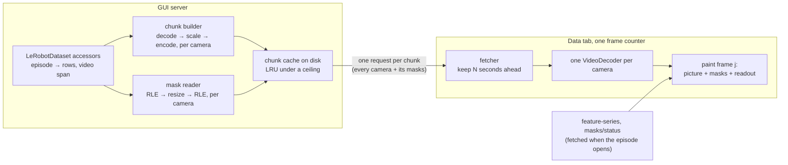

# Dataset video playback

Status: proposed
State of the work: [#221](https://github.com/TheWisp/lerobot/pull/221) until the tracking issue is opened

The Data tab fetches one JPEG per camera per frame at the playhead. On a LAN that
is adequate. Over Tailscale to the rig the requests serialize behind the
playhead: cameras arrive seconds apart, the frame rate is set by the link, and an
operator reviewing episodes remotely cannot watch motion at speed — which is what
the tab is for.

**Proposal.** The tab draws its camera tiles from video. The server sends a
[chunk](#g-chunk) — a few seconds of every camera, each encoded at a resolution
the link carries, with the saved masks for those frames as
[RLE rows](#g-rle-rows) at the same resolution — and the page decodes, composites
and paints every camera's frame _j_ together under one frame counter. Video
arrives behind a two-value [profile](#g-profile) selector beside the
[JPEG path](#g-jpeg-path), so it can be built and measured against the path it
replaces; removing that path is the step after.

## Scope

In:

- Playing a stored episode's cameras in the Data tab at a fixed profile, with
  everything the tab does on the JPEG path: play, pause, step, seek, speed, trim,
  episode switch, the keyboard.
- Saved masks drawn over that picture with the [recipe](#g-recipe)'s treatments,
  sent as RLE rows at each camera's [encoded resolution](#g-encoded-resolution).
- The overlay panel: the live SAM overlay, its mask composition, and
  apply-and-play. They act on the tiles the tab paints rather than on a surface
  of their own, so changing where the tiles come from can break them without
  touching their code ([O11](#o11)).

Out, and why:

- **Removing the JPEG path.** The destination is that video is the tab's only
  picture path and the JPEG endpoint, its frame cache and its prefetcher are
  gone. Not in this step: doing both at once made the earlier attempt
  ([E4](#e4)) too large to review.
- **Adapting to the link.** A bitrate ladder that measures the link and moves
  between rungs exists and works ([E2](#e2)). Not in this step: whether a fixed
  profile is enough is the first thing to find out, and a ladder is a mechanism
  that has to be understood before a wait can be explained.

Non-goals:

- **The Run and Robot tabs' live camera path.** An earlier design covered both at
  once on the theory that a transcoder and a quality ladder could be shared. The
  shared part is small — a live path encodes what a camera just produced and
  caches nothing; a stored path decodes a file and caches everything — and
  designing them together produced two half-built pipelines. Separate problem,
  separate document.
- **Any GPU path.** Decode, scale and encode on the CPU with ffmpeg, which is
  what every measurement here was taken with; nothing measured needed more.
- **Compositing on the server.** Masks cross as data and the page draws them
  ([C3](#c3)).
- **Auditing what a policy is fed.** This is an observation view. The picture is
  a transcode, the recipe's composite runs on it at the transcode's size, and
  `random` draws the page's own noise. Judging the exact training input is a
  different question and is not answered here.

## Requirements

This is an observation view. The operator watches recorded motion to judge what
happened — whether the gripper closed at the right moment, whether a mask follows
the object, whether an episode is worth keeping. **Smoothness and latency beat
fidelity**, and the priorities follow from that.

Targets are stated against two conditions:

- **Local** — server and browser on the same workstation.
- **Link** — Tailscale to fc500t, round trip 233–265 ms, 2.2–2.8 Mbit/s as the
  browser measured it (2026-09-07; it varies by day, re-measure before quoting).

The workload for both: the rig's labelled dataset, four cameras at 960×600 and
1280×720, 30 fps, AV1, two of them carrying saved masks.

| #                         | Pri | Requirement                                                                                    | Target                                                                                                                                                                                                                                         | Why that target                                                                                                                                                                                                                                                                                                                                                        | Checked by                                                                                                                                                                                                                                                                                                                                                                                                                                                             |
| ------------------------- | --- | ---------------------------------------------------------------------------------------------- | ---------------------------------------------------------------------------------------------------------------------------------------------------------------------------------------------------------------------------------------------- | ---------------------------------------------------------------------------------------------------------------------------------------------------------------------------------------------------------------------------------------------------------------------------------------------------------------------------------------------------------------------- | ---------------------------------------------------------------------------------------------------------------------------------------------------------------------------------------------------------------------------------------------------------------------------------------------------------------------------------------------------------------------------------------------------------------------------------------------------------------------- |
| **R1**   | P0  | Playback keeps time at every speed the tab offers                                              | media time within 5% of wall time and no stall over 500 ms, from 0.25× to 2×                                                                                                                                                                   | 2× at 30 fps is 60 frames of media per second, and it is the target because the operator reviews at speed and drops to 1× at what looks wrong. Video and saved-mask drawing only; the live SAM overlay has costs of its own ([O11](#o11)). Reached over the Link by the reference branch: 1.01 / 1.00 / 0.99 / 0.98 / 0.97 at 0.25× through 2×, no stalls ([E2](#e2)). | A 30 s episode of scrolling noise — fifteen chunks — played through Chromium's emulated 250 ms link capped at 1.5× the content's own bytes at 1× and 3× at 2×, asserting no hold over 500 ms and media time within 5%; the complement at 0.4× must hold, and the content must cost at least 20 kB/s, since a flat fixture's 4 kB chunks put the cap at the throttle's floor. Over the real Link, the frame counter against the wall clock per speed, as in E2's table. |
| **R2**   | P0  | Opening an episode paints every camera                                                         | ≤ 2 s on the Link, ≤ 300 ms Local                                                                                                                                                                                                              | The operator scans episodes one after another, so this decides whether the tab is usable; 13.8 s, what direct play took over the Link, is what unusable looks like. 1.3–1.9 s was reached ([E2](#e2)).                                                                                                                                                                 | Time from episode selection to every tile painted, instrumented in the page.                                                                                                                                                                                                                                                                                                                                                                                           |
| **R3**   | P0  | A seek paints the target frame                                                                 | ≤ 1.5 s on the Link, ≤ 150 ms Local                                                                                                                                                                                                            | Scrubbing is how a labelling error is found. 0.5–1.1 s cold on the Link and 11–109 ms Local were reached ([E2](#e2)).                                                                                                                                                                                                                                                  | Time from scrub to the target frame painted on every tile.                                                                                                                                                                                                                                                                                                                                                                                                             |
| **R4**   | P0  | Cameras stay frame-synchronized                                                                | every tile shows one frame index; if one camera lacks it, none advances                                                                                                                                                                        | Two cameras a few frames apart look like a real time offset in the data, and the operator cannot tell that from a true one.                                                                                                                                                                                                                                            | Cameras recorded as distinct flat greys so a canvas says which frame it shows; withhold one camera's chunk and assert no tile advances.                                                                                                                                                                                                                                                                                                                                |
| **R5**   | P0  | A step is exact                                                                                | the next frame on every camera, with the readout for that frame                                                                                                                                                                                | An off-by-one between picture and state is a wrong conclusion about the data.                                                                                                                                                                                                                                                                                          | Step, then compare the painted frame index per tile and the readout against the expected frame.                                                                                                                                                                                                                                                                                                                                                                        |
| **R6**   | P0  | Everything the tab does on the JPEG path, it does at `low`                                     | saved masks drawn with the recipe's treatments; the live SAM overlay, its composition and apply-and-play; every control                                                                                                                        | The tab's features act on the tiles, so the picture source is a dependency they do not declare ([O11](#o11)). The overlay panel is the case most easily missed: saved masks rendering correctly does not imply it works, because they are different paths onto the same tiles.                                                                                         | The tab's existing Playwright suite run at `low`, the overlay and apply-and-play tests included; apply-and-play checked against the mask counts on disk.                                                                                                                                                                                                                                                                                                               |
| **R7**   | P0  | An edit is what plays next                                                                     | after a trim, a delete, a frame removal, a mask save or a treatment change, the next paint shows the edited data — pixels, mask rows, the treatment drawn, and the lane's presence — and nothing from before the edit is served from any cache | An operator who edits and replays is checking the edit. Pre-edit pixels are a wrong conclusion about their own work ([O12](#o12)).                                                                                                                                                                                                                                     | Edit, then replay the same frames with the page's buffer warm: the painted frames are the post-edit ones; a treatment write changes what the tiles show; a rows write is followed by a chunk request the server answers as a miss, a changed mask on the tile, and a changed lane.                                                                                                                                                                                     |
| **R8**   | P0  | Episode length does not matter                                                                 | R2 and R3 still met at 108,000 frames                                                                                                                                                                                                          | Episodes are already tens of thousands of frames; anything that scales with length fails later and quietly. Seeks into the 54,000th and 97,000th frame painted in 76–145 ms ([E2](#e2)).                                                                                                                                                                               | R2 and R3 measured on the hour-long synthetic episode.                                                                                                                                                                                                                                                                                                                                                                                                                 |
| **R9**   | P0  | The JPEG path keeps working while it is there, and `low` falls back to it when it cannot apply | at `high`, the tab behaves exactly as today; when the browser cannot decode the dataset's codec, the tab uses the JPEG path and says so                                                                                                        | It is the comparison this path is measured against and the only picture when `low` cannot apply. Temporary as a selectable path; see [Scope](#scope).                                                                                                                                                                                                                  | At `high`, no chunk request reaches the server and the tab's existing tests pass unchanged. At `low` on a dataset in a codec the browser lacks, JPEG tiles and a message appear before any blank tile.                                                                                                                                                                                                                                                                 |
| **R10** | P1  | Several viewers                                                                                | one viewer never pushes another below R1                                                                                                                                                                                                       | This path uses no GPU, so the bound is CPU, and it should be an explicit bound rather than an accident.                                                                                                                                                                                                                                                                | Two browser contexts on different episodes; R1 holds for both.                                                                                                                                                                                                                                                                                                                                                                                                         |
| **R11** | P1  | Toggling a mask label is free                                                                  | no refetch                                                                                                                                                                                                                                     | Masks are data in the page, so a label is a repaint. Mask paint measured 1.2–4.6 ms median per frame ([E3](#e3)).                                                                                                                                                                                                                                                      | No network request on a label toggle.                                                                                                                                                                                                                                                                                                                                                                                                                                  |

R4, R5, R6, R7 and R9 are behaviours; the rest are measurements.

## Observations

Each is sourced, and each closes with what it forces.

**O1 — The JPEG path costs a round trip per frame.** `get_frame`
in `gui/api/datasets.py` serves one camera of one frame; `playLoop` in
`static/app.js` requests every camera at the playhead each tick. Over a 250 ms
round trip the frame rate is bounded by round trips, not by bytes. → Pictures
must be fetched ahead of the playhead in units of many frames.

**O2 — The stored video does not fit the link.** 5.8–6.3 Mbit/s
per camera against 2.2–2.8 Mbit/s measured at the browser; a page playing the
files directly over the Link took 13.8 s to become ready and advanced the cameras
0.9–4.6 s of media in 8 s ([E1](#e1); `scripts/gui/eval_static_playback.py` on
`design/camera-video-pipelines`). Locally the same page was ready in 0.09 s. →
The server transcodes to a lower resolution and bitrate; playing the file as
stored is viable only locally.

**O3 — Over the link, bytes per second of media decide whether
playback keeps time, and the margin is thin.** Four cameras with masks at 320
wide: 86 kB per second of media sustained 29.8 fps with one 83 ms hold; 101 kB/s
sustained 29.3 fps with one 317 ms hold; 188 kB/s fell to 26.8 fps with holds to
900 ms ([E3](#e3)). Locally the same content ran at 59 fps with the server's
build time and the browser's decode as the visible costs ([E2](#e2)). → Over the
link the profile's resolution and quality are the tuning knobs; on a LAN they are
not the constraint, and E2 records what is.

**O4 — Masks at the stored resolution stalled playback.** They
were a third of a chunk's bytes; the page asked for a half-second chunk every
0.61 s and every chunk landed as the previous one ended, at every rung the ladder
offered. Resized to the encoded resolution they became about a quarter of a much
smaller total and the same link played without waiting ([E3](#e3); the mask
parts of `gui/api/window_playback.py` on `design/camera-video-pipelines`). → Mask
rows are resized to each camera's encoded resolution before they cross.

**O5 — A mask resized after segmentation still lines up.** The
mask was computed at the stored resolution and is only drawn smaller; what
resizing loses is pixels at the boundary, the same class of loss the transcoded
picture already carries. Nothing is re-segmented at the lower resolution, which
would be a different result rather than a coarser one. → Resized masks are
acceptable under the ordering principle; the question is which resolution, not
whether.

**O6 — A chunk's length has a floor set by the round trip and a
cost that falls with length.** A chunk has to buy more media time than the round
trip plus its transfer; at 250 ms a half-second chunk spends half its media time
before a byte arrives, and O4's stall was a half-second chunk every 0.61 s. A
chunk pays for a keyframe whatever its length: 2.4× cheaper per second of media
at 640 wide going from 0.5 s to 4 s, with build time 104 ms against 281 ms
([E3](#e3)). → Length has a floor and a gradient favouring longer; only R2 and R3
push it shorter, since nothing paints until a whole chunk has arrived. The value
is [to measure](#to-measure).

**O7 — The tab already holds the episode's numbers when it
opens.** `get_episode_feature_series` and `get_episode_masks_status` in
`gui/api/datasets.py` return the whole episode's numeric series and its mask
status; `static/feature_editing.js` loads the series on episode open. The timeline's mask lane reads per-frame presence from the same
`feature-series` call: a mask column is served as one presence bit per frame
(`_mask_presence_bits` in `gui/api/datasets.py`), not as rows. The whole
episode's rows at the stored resolution, `episodes/{ep}/masks`, are fetched by
the mask layer for drawing only. → The
readout for a frame is in the page before playback starts. A chunk carries
pictures and mask rows and nothing else; at Low Bandwidth the page never fetches
`episodes/{ep}/masks`, since the rows it draws arrive with the chunks and the
lane's presence already comes with the series; the per-episode "bundle" of the earlier
design served a standalone page and is not needed by the tab.

**O8 — A `<video>` element cannot promise frame-exact
synchronization; `VideoDecoder` can, in a secure context.** A `<video>` element
is addressed by time, not frame index, and each has its own clock. WebCodecs
decodes frame by frame — about 0.5 ms per frame per camera at 320 and 640 wide
([E2](#e2); `static/window_player.js` on `design/camera-video-pipelines`) — and
exists only under HTTPS or on localhost. Chromium 151 decodes AV1 main and H.264,
not HEVC ([E1](#e1)). → R4 and R5 force WebCodecs, which makes a secure context
a precondition away from localhost. The rig has a tailnet certificate and has
served the GUI with it; HTTPS is accepted as the precondition ([C4](#c4)).

**O9 — "Where are this episode's rows" is computed three ways
on `main`, and they agree by repair rather than by a shared source.**
`_get_episode_start_index` in `gui/api/datasets.py` sums episode lengths, and its
docstring says `dataset_from_index` is per-parquet-file. `mask_store.py`,
`_edits_core.py`, `process.py` and other endpoints in `datasets.py` read
`dataset_from_index` directly. The writers in `datasets/dataset_tools.py` store it
as the global frame index, and `repair_episode_indices`, run on every dataset
open and reload, rewrites metadata in which it resets at file boundaries — the
case the summing helper was written for. The reader keeps a third mapping,
`absolute_to_relative_idx`, for a dataset opened with an episode filter; no GUI or
MCP path opens one that way. → Not a live bug: with every episode loaded and the
repair run, the copies agree. It is a hardening — the agreement holds by
construction, not by a shared source, and any future caller that loads a subset
breaks it. The chunk builder needs episode → rows and a camera's video span
regardless, so it reads them through `LeRobotDataset` accessors (built on
`design/camera-video-pipelines`, not yet on `main`) and adds no fourth copy.

**O10 — Build cost depends on granularity; the request does
not have to.** One clip per episode, camera and profile
(`feat/camera-video-transport`): a `medium` clip prepared in 0.44 s, and over the
Link the first byte of a clip arrived 1.3–1.45 s cold with four `low` clips
taking 3.7–6 s to download. On `design/camera-video-pipelines` one request
returned a few seconds of every camera in one response, built by one ffmpeg per
camera in parallel: 104 ms for 0.5 s, 161 ms for 2 s, 281 ms for 4 s, four
cameras ([E2](#e2), [E3](#e3)). A resident in-process encoder was listed there as
an open item and never measured. → Whole-episode clips cannot meet R2 over the
Link; a multi-second chunk of every camera can. One request per chunk, carrying
every camera and its masks, is the batching this design keeps, and nothing is
requested per frame ([C1](#c1)). Whether the builder behind a chunk is a process
per camera or a resident encoder is [to measure](#to-measure).

**O11 — The overlay panel acts on the tab's tiles, and
apply-and-play's speed is set by its lock step.** `static/overlays.js`,
`overlay_stream.js` and `overlay_gate.js` take over the camera tiles while the
live overlay or an apply run is active and hand them back on a scrub.
Apply-and-play is lock-step by design: the playhead moves to a frame, waits for
that frame's masks to come back from the worker, stages them, and only then moves
on (`static/overlays.js`; `docs/saved_masks.md`). Every frame pays a serialized
round trip and nothing batches. On the rig it ran at about 0.76 frames a second
on one camera against roughly 40 camera-frames a second for the batch worker over
the same frames ([E4](#e4)); the split between model time and round trip was not
measured. [#134](https://github.com/TheWisp/lerobot/issues/134) records the
other term, the tracker-bound model time of the live preview (about 80 ms per
camera per frame, serial); the lock step's round trip has no issue of its own. →
The picture source is a dependency these paths do not declare, and the per-frame
cost belongs to the overlay's own path, not to the tiles. R6 is checked by their
own tests at `low`.

**O12 — The JPEG path never lets the browser cache a frame,
and every edit path clears the server's caches.** `get_frame` sends
`Cache-Control: no-store, no-cache, must-revalidate`, and composited frames also
carry the mask version in the URL. Every edit path — `_edits_core.py`,
`edits.py`, `datasets.py`, `process.py` — calls
`cache_invalidation.invalidate_caches`, which cleared the frame cache. Chunk
responses on `design/camera-video-pipelines` were browser-cacheable for an hour
under URLs an edit does not change, which was the one place a pre-edit picture
could have come from. → Chunks follow the JPEG path: `no-store`, so every request
reaches a server whose cache is dropped on edit; the page's own buffer is the
only client-side cache and is dropped on edit too ([C7](#c7)). Browser-cacheable
chunks with an edit generation in the URL are an optimization to measure, not a
correctness mechanism.

**O13 — The GUI has no settings surface, and the earlier
prototype had a mode dropdown.** `main` has one `localStorage` key
(`featureEditing.cameraGridHeight` in `static/feature_editing.js`) and no settings
route under `gui/api/`. `feat/camera-video-transport` added a **Camera Video**
dropdown — Auto / Full Quality / Low Bandwidth — stored under
`lerobot.cameraVideoMode` in `localStorage` and mapped to a profile per request
(`_videoProfile` in its `static/app.js`). → The selector reuses that dropdown's
values and storage without Auto, placed beside the playback speed selector in the
Data tab's controls bar ([the profile selector](#the-profile-selector)).

## Constraints and freedoms

**C1** Pictures are fetched ahead of the playhead in chunks of
several seconds, one request per chunk carrying every camera and its mask rows,
and nothing is requested per frame during playback ([O1](#o1), [O6](#o6),
[O10](#o10)). Enforced, not assumed: a test counts requests during N seconds of
playback and asserts they equal the chunk count, and the server logs one line per
chunk with the cameras it carried.

**C2** Each camera is transcoded on the server to an encoded
resolution below its source, under one fixed profile ([O2](#o2), [O3](#o3),
[R9](#r9)). Cameras differ in resolution, so the profile names a target width
and each camera scales from its own, never upscaled.

**C3** Mask rows travel in the same chunk at that camera's
encoded resolution, and the page composites ([O4](#o4), [O5](#o5),
[R11](#r11)). A chunk's pixels therefore do not depend on the recipe.

**C4** The page decodes with one `VideoDecoder` per camera under
one frame counter, and must be a secure context; HTTPS is the accepted
precondition away from localhost ([O8](#o8), [R4](#r4), [R5](#r5)).

**C5** The dataset is read only through `LeRobotDataset`'s
accessors ([O9](#o9)).

**C6** Chunks start on a grid of their own length and are keyed
by profile, so two viewers of one episode share the server's cache entries
([O3](#o3), [R10](#r10)).

**C7** Chunk responses are `no-store`; the server's chunk cache
and the page's buffer are both dropped for a dataset when an edit rewrites its
video or rows ([O12](#o12), [R7](#r7)).

Free, within those:

**C8** The codec. H.264 at constant quality is the proposal;
AV1 is the same code path with different arguments ([E3](#e3)).

**C9** The chunk length, above the floor ([O6](#o6)) —
[to measure](#to-measure).

**C10** What builds a chunk: a process per camera per chunk or
a resident encoder ([O10](#o10)) — [to measure](#to-measure).

## Architecture

**The profile selector** ([R9](#r9), [O13](#o13), [C2](#c2)). A dropdown
beside the playback speed selector in the Data tab's controls bar, with the
values and storage of the earlier prototype's **Camera Video** control minus
Auto: **Full Quality**, the JPEG path as it is today and the default, and **Low
Bandwidth**, video at the fixed profile below. The choice is kept in
`localStorage` under the prototype's key. At Low Bandwidth in a page that is not a
secure context, the option is unavailable with the reason shown ([C4](#c4)). The
selector is temporary; once video replaces the JPEG path, Full Quality has
nothing to select.

A profile is a rule applied per camera, not one output resolution: a target
width and a constant-quality encoder setting. Each camera is scaled to the
smaller of the target width and its own width, keeping its aspect ratio, so at
a target of 320 a 960×600 camera encodes at 320×200 and a 1280×720 one at
320×180. Constant quality rather than constant bitrate means a still camera costs
less than a moving one and the bytes follow the content ([E3](#e3)). The cost of
a chunk is the sum over its cameras, so the profile is set against the reference
workload — four cameras, two with masks — to meet R1 at 2× over the Link, and a
dataset with fewer cameras is cheaper. What a fixed profile does not do is adapt:
a dataset with more cameras, or a slower link, stalls rather than dropping
quality ([Alternatives](#alternatives-and-what-this-costs)). The width and quality
are [to measure](#to-measure); 320 wide at H.264 quality 26 is the starting
point.

**The chunk endpoint** ([C1](#c1), [C2](#c2), [C3](#c3), [C6](#c6)). One
request returns, per camera, encoded video for the chunk's frames starting with
a keyframe, and the mask RLE rows for the same frames at that camera's encoded
resolution. Both, because the page composites; video alone cannot be drawn the
way the tab draws it today. The start frame lies on the chunk-length grid. What
the tab already fetches on episode open — the numeric series and the mask status
([O7](#o7)) — is unchanged and is what the readout is drawn from. Enforced by
the request-count test and the per-chunk log line in [C1](#c1).

**The chunk builder** ([C2](#c2), [C5](#c5), [C10](#c10)). Seek to the chunk's
first frame in the stored file, decode, scale to the camera's encoded
resolution, encode with a keyframe first, for every camera of the chunk in
parallel. Reads the episode's row range and the camera's video span through the
accessors. Runs from a pool bounded independently of how many viewers there are
([R10](#r10)). Whether each camera's build is a process or a call into a
resident encoder is [to measure](#to-measure).

**The mask reader** ([C3](#c3), [O4](#o4)). Decodes the stored RLE rows for the
chunk's frames, resizes each to the camera's encoded resolution, re-encodes, and
gzips. A camera with no recipe carries no rows.

**The chunk cache** ([C6](#c6), [C7](#c7), [O12](#o12)). On disk under a byte
ceiling, least recently used evicted first, keyed by dataset, episode, start,
length, profile, encoder options and a format version. The recipe is not in the
key. Responses are `no-store`. The existing invalidation hook drops a dataset's
chunks when an edit rewrites its video or rows, and the page drops its buffer
for that dataset on the same event, so the next paint after an edit is built
from the edited data ([R7](#r7)).

**The page** ([C4](#c4), [R4](#r4), [R5](#r5), [R11](#r11)). A fetcher keeps a
few seconds of chunks ahead of the frame counter and drops in-flight requests a
seek makes useless. One `VideoDecoder` per camera, and one chunk decoded at a
time: decoders are a process-wide resource the browser reclaims when a page
holds too many, so the count has to follow the camera set and not how far ahead
the fetcher has run. A page that opened one per camera per buffered chunk had
sixteen on the rig's four-camera dataset, Chrome reclaimed them mid-stream
(`Codec reclaimed due to inactivity`), and the chunks decoded part way. Each
tile's canvas is the camera's
declared resolution — which the chunk header carries beside the encoded one,
since the dataset payload the tab holds lists feature names only — and the
decoded frame is scaled into it, so the tile has the JPEG path's geometry at
either profile. One paint draws frame _j_ of
every camera, its resized masks with the recipe's treatments, and the readout
for _j_ in a single pass; if any camera has not decoded _j_, no tile advances.
Play, step, seek, speed and the trim range are expressed against the counter,
which is what makes them behave as they do on the JPEG path: playback wraps
within the episode or the trim, a step is one increment. A label toggle is a
repaint.

**Masks and treatments in the page** ([C3](#c3), [R6](#r6), [R11](#r11)).
The player hands each paint the chunk's rows for the frame, and the mask layer
draws them through the one entry the JPEG path draws through (`drawCamera`,
with `chromeOptions` deciding the chrome): outlines and label names whenever
the camera has saved masks, hidden labels hidden, muted rows skipped by the
layer's own `entryEnabled`, at the camera's declared resolution with the rows
upscaled from the chunk's. The recipe's composite is `mask_composite.js`: the
library's compositor (`overlays/effects.py`) in a second language, its
definition and its arithmetic — exclusive masks smallest-first, the feathered
alpha from cv2's 8-bit Gaussian in 1/256ths, tint in float32 rounded half to
even, blur through the same 8-bit Gaussian, `blendLinear` in float32. The two
are pinned pixel for pixel, seams and blur included, by
`tests/gui/test_mask_composite_equivalence.py`; the treatments' defaults reach
the page from the compositor through `masks/status` (`effects.resolve_params`).
Two things differ by design: the composite runs at the encoded size, where
frame and rows agree pixel for pixel, with the feather radius and the blur's
sigma scaled by the encoded-to-declared width ratio; and `random` draws the
page's own texture, one per episode and recipe fingerprint (the library's numpy
generator is not reproduced), so it is fixed across frames and seeks but is not
the training input's pixels.

**Masks after an edit** ([C7](#c7), [R7](#r7), [O7](#o7)). One event, on both
sides. On the server every mask write path — a segmentation save, a run or
range edit, a treatment change — calls the shared invalidation hook, which drops
the dataset's chunks and its cached series. In the page the mask layer's version
moves on the same write, and that is what the player and the lane follow: the
player drops its buffer and asks again from the frame counter (the server
answers with fresh chunks, since its cache is empty), the mask layer refetches
the status (recipe and fingerprints), and the lane refetches the series. No
part of the page keeps a copy that the write did not reach.

**Errors and fallback** ([R9](#r9)). Errors are handled as the GUI handles them
elsewhere: a programming or setup error — ffmpeg absent, the builder raising, a
decoder error — is surfaced as an error, not hidden behind a fallback. Two cases
are not errors. A dataset stored in a codec the browser will not decode: Low
Bandwidth cannot apply, the tab uses the JPEG path and says so. A chunk the page
cannot show -- it never arrives, or it arrives and its frames never come out of
the decoder -- is dropped and asked for again a bounded number of times, and the
operator sees a hold meanwhile.

The budget is terminal. When it is spent the page gives up on the frames that
chunk covers, says which ones, steps to the next chunk rather than holding, and
stops asking; scrubbing back into a given-up range asks for it again. A budget
that is spent and then ignored is not a budget: on the rig the page asked for
one chunk every four seconds for an hour, reporting each time that it had
already given up, while the chunks behind it sat decoded and waiting and the
operator saw a picture frozen fifteen frames in.

**The overlay panel** ([R6](#r6), [O11](#o11)). The live overlay and an apply
run take over the tiles as they do today, by one rule in one place: `drawCamera`
paints no stored chrome while the live layer owns the tiles, whoever calls it.
The composited stream takes each base picture's rectangle — its atlas is one
height for every camera, smaller than a tile on a large screen — and the base
picture and the still overlay's last PNG are hidden under it; the chunk player
yields the transport to the stream as the still loop does, and lands on the
frame the stream reached when it stops. Checked at production sizes in both
modes by `tests/gui/test_low_bandwidth_overlay_stream_playwright.py`.

## Alternatives, and what this costs

What else would meet the requirements, and why it is not the proposal:

- **Keep the JPEG path.** Fails R1–R3 over the Link by O1: the frame rate is set
  by round trips. Works on a LAN, which is why it stays until video is proven.
- **Play the stored file directly.** Fails over the Link by O2; locally it is
  the best possible picture at the lowest server cost, and it is what a
  source-quality profile would be if one is added later.
- **One clip per episode, played by `<video>` elements** — what
  `feat/camera-video-transport` built. Fails R2 over the Link by O10 (four `low`
  clips took 3.7–6 s to download before playback) and cannot promise R4 and R5
  by O8.
- **An adaptive bitrate ladder** — what `design/camera-video-pipelines` built.
  Meets every measured target ([E2](#e2)). Deferred rather than rejected: a
  fixed profile is simpler to reason about, and whether adaptation is needed is
  unknown until a fixed profile has been tried on the links in use.
- **Compositing on the server** — also on `design/camera-video-pipelines`.
  Gives the exact composite in the tab. Costs the recipe in the cache key, a
  decode-composite-encode pass in the builder, and a refetch on every label
  toggle. A non-goal here because the tab is an observation view.
- **A GPU path.** Nothing measured needed it: the CPU builds a 2 s chunk of four
  cameras in 161 ms ([E2](#e2)). It would add a dependency and a second code
  path for no requirement.
- **A WebAssembly H.264 decoder.** Avoids the secure-context precondition, at
  baseline profile only and with decode on the browser's CPU. Not chosen: HTTPS
  is accepted as the precondition ([C4](#c4)).
- **Browser-cacheable chunks with an edit generation in the URL.** Saves a
  request for a chunk the page has dropped and asks for again. Not chosen for
  correctness, which `no-store` gives outright ([C7](#c7)); it remains an
  optimization to measure if re-fetches turn out to matter.

What the proposal makes harder or forecloses:

- HTTPS is a deployment precondition for Low Bandwidth anywhere but localhost.
- A fixed profile cannot follow a link slower than it, or a dataset with more
  cameras than the reference workload; the operator sees stalls rather than a
  lower picture.
- Every camera is in every chunk, so a camera cannot be hidden to save bytes.
- Each chunk pays for a keyframe, which a continuous stream would not.
- Once the JPEG path is removed, the exact composite has no home in the tab.
- The selector is interface that has to be removed later.
- The dataset accessors are a change outside the GUI ([O9](#o9)).

## Open questions

None remain for the reader; the forks the earlier revisions carried are decided
above — the selector's home and storage ([O13](#o13)), HTTPS ([C4](#c4)), the
treatments drawn in the page ([R6](#r6)), and correctness after an edit
([C7](#c7)).

To measure — settled by a number, not by the reader:

- **The profile's target width and quality**, against R1 at 2× over the Link
  with the reference workload ([O3](#o3)). 320 wide at H.264 quality 26 is the
  starting point.
- **The chunk length**, against R2 and R3 with the round-trip floor ([O6](#o6)).
  2 s is the starting point.
- **What builds a chunk**: a process per camera per chunk against a resident
  encoder, on build time and on the server's CPU across several viewers
  ([O10](#o10), [R10](#r10)).
- **The cost of `feature-series` for the lane on the rig's labelled dataset**: the reference branch saw 770–800 ms for the mask columns through the same read; if that holds, the lane is the slow part of opening an episode at any profile ([O7](#o7)).
- **Whether re-fetches matter**: how often the page asks again for a chunk it
  held and dropped, which decides whether browser-cacheable chunks with an edit
  generation are worth their complexity ([O12](#o12)).

## Glossary

**Chunk** — A few seconds of every camera in one response:
per camera, encoded video starting with a keyframe, plus the mask RLE rows for
the same frames. The unit of transfer.

**Profile** — A named quality setting. Full Quality is
the JPEG path; Low Bandwidth is video at a target width per camera and a fixed
quality.

**Encoded resolution** — What one camera's
video in a chunk is at: that camera's own source resolution scaled to the
profile's target width, never upscaled. Cameras differ, so this differs per
camera.

**Recipe** — The per-camera saved-mask specification in
`meta/info.json` — which labels, what treatment (tint, blur, random) — read by
`mask_compositing`.

**RLE rows** — Masks in their stored form: COCO
run-length rows, one per camera per frame.

**JPEG path** — The existing per-frame JPEG endpoint
and what the tab does with it.

## Appendix: evidence

Measured on 2026-09-06 and 2026-09-07 on the two reference branches
([E4](#e4)), with a CPU pipeline of this shape. Captured files — measurement
JSON, stills, recordings — are in
[`docs/proofs/windowed-playback/EVIDENCE.md`](https://github.com/TheWisp/lerobot/blob/design/camera-video-pipelines/docs/proofs/windowed-playback/EVIDENCE.md)
on `design/camera-video-pipelines`.

**E1 — The stored video and the link.** Stored AV1 at 5.8–6.3
Mbit/s per camera on the rig's labelled dataset and 20 Mbit/s per camera on a
local one, keyframe every two frames. Masks are 7.0% of the rig's labelled
dataset — 326 MB over 274 episodes, 0.8–4.9 MB of RLE per episode, median
1.75 MB; one episode's gzipped to 1.96 MB and took 3.2 s to fetch over the Link.
The Link: round trip 233–265 ms; 3.8–4.1 Mbit/s in a single server-side stream,
2.2–2.8 Mbit/s as the browser measured it. Playing the stored files directly:
ready in 0.09 s Local and 13.8 s over the Link; seeks 6–40 ms Local and 1.0–4.8 s
over the Link; over the Link, 8 s of wall time advanced the cameras 0.9–4.6 s of
media. Headless Chromium 151 decodes AV1 main and H.264, reports both smooth, and
does not decode HEVC. An episode is a time range inside a packed MP4 holding up
to seven of them; an index at the end of the file costs one extra range request.

**E2 — What a chunked CPU pipeline reached.** Local, four 720p
cameras at 640 wide: first picture 128 ms after open; 30 fps at 1× and 59 fps at
2× with no hold; seeks 11–109 ms; a half-second chunk of four cameras 187 kB
built in 88 ms; cache hits 1–4 ms. Over the Link, four cameras with two masked:
first picture 1.3–1.9 s; 26.5–29.5 fps at 320 wide; cold seeks 0.5–1.1 s; builds
104 ms (0.5 s chunk), 161 ms (2 s), 281 ms (4 s), four cameras in parallel. On
the rig at 250 ms round trip, the frame counter against the wall clock per speed:

| speed | media seconds | asked | ratio | stalls |
| ----- | ------------- | ----- | ----- | ------ |
| 0.25× | 7.6           | 7.5   | 1.01  | 0      |
| 0.5×  | 15.0          | 15.0  | 1.00  | 0      |
| 1×    | 29.8          | 30.0  | 0.99  | 0      |
| 1.5×  | 44.3          | 45.0  | 0.98  | 0      |
| 2×    | 58.0          | 60.0  | 0.97  | 0      |

The frame counter and the repaint rate are different numbers: the player keeps
time and skips frames when it cannot repaint fast enough, so counting distinct
frames drawn read a correct real-time playback as half speed the first time
these were taken. Decode: about 0.5 ms per frame per camera at 320 and 640 wide.
An hour-long synthetic episode (108,000 frames, 30 fps) cost the same to open and
to scrub into as a short one once the per-episode payload was bounded: seeks into
the 54,000th and 97,000th frame painted in 76–145 ms.

**E3 — Encoder options and what masks cost.** One camera, 2 s
chunks at 320 wide, SSIM against the scaled source:

| encoding                   | bytes per chunk | SSIM  | note               |
| -------------------------- | --------------- | ----- | ------------------ |
| H.264, constant 300 kbit/s | 76–77 kB        | 0.988 |                    |
| H.264, constant quality 26 | 22–27 kB        | 0.970 |                    |
| AV1, preset 8, quality 34  | 33–38 kB        | 0.992 | 3× the encode time |

Zero-latency tuning cost SSIM (0.980–0.988) for 5–10% more bytes and was not
used. Over the Link at 320 wide, four cameras with masks, cost per second of
media and the frame rate it sustained: constant bitrate 188 kB/s at 26.8 fps with
holds to 900 ms; H.264 quality 26, 86 kB/s at 29.8 fps with one 83 ms hold; AV1
quality 34, 101 kB/s at 29.3 fps with one 317 ms hold. Chunk length: at 640 wide
with AV1 a half-second chunk cost 174 kB and a four-second one 574 kB. Masks at
the stored resolution: the page asked for one half-second chunk every 0.61 s and
every chunk landed as the previous one ended — four cameras plus two mask tracks
needed 2.1–3 Mbit/s against about 2.2 Mbit/s delivered — and the masks were a
third of the bytes; resized to the encoded resolution they became about a quarter
of a much smaller total, at 14–20 ms per camera per half-second chunk to decode,
resize and re-encode. Painting them in the page: 1.2–4.6 ms median per frame,
9.3 ms at worst. The clip path on `feat/camera-video-transport`, same rig and
episode: `low` at 0.54 Mbit/s per camera, the first byte of a clip 1.3–1.45 s
cold, four `low` clips 3.7–6 s to download, masks as one 4.9 MB response in
4.9 s.

**E4 — The reference branches.**
[#203](https://github.com/TheWisp/lerobot/pull/203) on
`design/camera-video-pipelines`: chunked playback end to end, the Data tab on
canvases, the builder and its disk cache, a bitrate ladder, server-side
compositing, and the removal of the JPEG path; its rig session drove
apply-and-play through video tiles at about 0.76 frames a second on one camera
against roughly 40 camera-frames a second for the batch worker over the same
frames — the lock step's serialized round trip per frame, with the split between
model time and round trip not measured. Sealed and open.
[#193](https://github.com/TheWisp/lerobot/pull/193) on
`feat/camera-video-transport`: per-viewer H.264 over MSE for the Run tab,
whole-episode clips per profile for the Data tab with masks composited on the
server, the Camera Video mode dropdown, and the transport design document. Sealed
and open.
