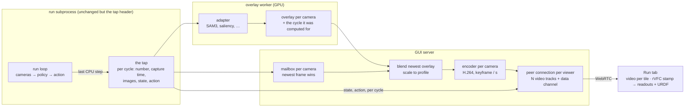

# Live camera video

Status: proposed
State of the work: [https://github.com/TheWisp/lerobot/pull/226](https://github.com/TheWisp/lerobot/pull/226) until the tracking issue is opened

The Run tab shows a run's cameras as one JPEG per camera per tick, polled
twenty times a second. Over the link to the rig each picture is a round trip
old before it is shown, and every picture costs a full frame of bytes, so the
operator sees a slideshow that lags the robot. That operator is the person
this design is for: a remote operator whose commands reach the robot by their
own path, and whose only feedback is this picture — the same picture an
observer watches to decide when to press Stop. Today neither can act on it.

**Proposal.** The server pushes one encoded frame per camera, at the camera's
own rate, the moment it exists: no container, nothing queued, the newest frame
always winning. Any overlay is drawn onto the frame on the server before
encoding, from whichever adapter produced it, and the frame never waits for it.
The robot's state and the commanded action travel on the same connection,
paired to the frame they were recorded with, so the joint readouts and the URDF
tile show the same instant as the picture. The transport is WebRTC; the encode
runs once per camera on the CPU first, with the GPU as a measured step; the
JPEG path stays as the other choice of the same control the Data tab already
has.

## Scope

In:

- The Run tab's camera tiles, the URDF tile and the state/action readouts
  during a run — teleop, record, replay, a policy — at the
  [Low Bandwidth](#g-profile) profile.
- Overlays on those tiles: the live SAM3 preview, policy saliency, and any
  future [adapter](#g-adapter), drawn on the server.
- One viewer at P0; several viewers of one run at P1.

Out, and why:

- **The Robot tab.** Between runs the GUI process owns the cameras itself, so
  it is the same pipeline with a different frame source and no policy. After the
  Run tab, because the run case is the one the requirement is about.
- **Adapting to the link.** A fixed [profile](#g-profile) first, for the reason
  [`dataset_playback.md`](dataset_playback.md) gives: whether one is enough is
  the first thing to find out, and a mechanism that moves between rungs has to
  be understood before a stall can be explained. WebRTC's bandwidth estimate is
  where adaptation would attach later.
- **Removing the JPEG path.** It is the comparison this path is measured
  against and what Low Bandwidth falls back to; removing it is the step after,
  as for the Data tab.

Non-goals:

- **The remote command path.** Keyboard, space mouse or VR commands from the
  operator to the robot are low-dimensional and travel by their own transport;
  nothing in this design carries them or depends on how they travel. The two
  add up in the operator's loop, which is why this design states the picture's
  budget on its own.
- **A view for a headset.** Whether a VR client shows these cameras, and how, is
  decided later; a client on the operator's machine can receive the same stream.
- **Auditing what a policy is fed.** The picture is a transcode with an overlay
  drawn on it; what the policy sees is the tap's frame in the run process.

## Requirements

The picture is the remote operator's only feedback, and the observer's means to
stop a run in time, so **age and continuity come first and fidelity last**. The
host that serves the picture is the host running the policy and the recorder,
so not slowing the run is a P0 rather than a courtesy.

Conditions, named once:

- **Local** — server and browser on the same workstation.
- **Link** — Tailscale to fc500t. Round trip 233–265 ms and 2.2–2.8 Mbit/s as
  the browser measured it on 2026-09-07 ([E2](#e2)); 237 ms by ping on
  2026-09-06; 72 ms on the day of the earlier branch's measurement. It varies
  by day: re-measure before quoting, and date the number.
- **Workload** — the rig: four cameras at 960×600 and 1280×720, 30 fps, one of
  them carrying a live overlay, during a teleop or policy run with the recorder
  on.

| #                         | Pri | Requirement                                                          | Target                                                                                                                                                                                                                                                                            | Why that target                                                                                                                                                                                                                                                                                                                                                                                                                       | Checked by                                                                                                                                                                                                                                                                                    |
| ------------------------- | --- | -------------------------------------------------------------------- | --------------------------------------------------------------------------------------------------------------------------------------------------------------------------------------------------------------------------------------------------------------------------------- | ------------------------------------------------------------------------------------------------------------------------------------------------------------------------------------------------------------------------------------------------------------------------------------------------------------------------------------------------------------------------------------------------------------------------------------- | --------------------------------------------------------------------------------------------------------------------------------------------------------------------------------------------------------------------------------------------------------------------------------------------- |
| <a name="r1"></a>**R1**   | P0  | The picture is as young as the physical path allows                  | [Age](#g-age) at the eye, median: Local ≤ 50 ms at 30 fps; Link ≤ 50 ms plus half the round trip — ≤ 185 ms at the 2026-09-07 round trip                                                                                                                                          | One frame period of capture cadence (33 ms at 30 fps), plus the pipeline's own share — encode, send, decode — which decision 1 (2026-09-06, reaffirmed 2026-09-12) caps at single-digit milliseconds, plus half a display refresh. The earlier branch measured 0.4 s median at a 72 ms round trip ([E3](#e3)), which is what too old looks like.                                                                                      | The capture time carried on every frame ([C3](#c3)); the page reports capture-to-paint per frame. Local measures the pipeline's share; the Link adds the link. Dated tables per condition.                                                                                                    |
| <a name="r2"></a>**R2**   | P0  | The picture keeps moving                                             | Over a ten-minute session: the 95th-percentile age within one frame period (33 ms) of the median; the last minute's median within one frame period of the first's; no gap between painted frames longer than three periods (100 ms) except while the receiver reports packet loss | An observer presses Stop on what they see; a picture that freezes or falls behind hides the moment that matters. Agreed on 2026-09-13: the mechanism is what is landed and the average is what is checked. A tail one frame wide is how a mechanism that cannot accumulate delay reads; anything wider is a stage holding a frame.                                                                                                    | Unit tests on the [mailbox](#g-mailbox): a slow consumer sees only the newest value, never two. In the browser over a throttled Link: the age series and the painted-interval distribution against the captured one.                                                                          |
| <a name="r3"></a>**R3**   | P0  | Play paints every camera promptly                                    | Every camera painted ≤ 3 s after the stream is asked for over the Link, ≤ 0.5 s Local                                                                                                                                                                                             | Connection setup is several round trips — signalling, ICE, DTLS — and the first frame is the next keyframe, at most a second away ([C7](#c7)); the earlier branch showed its first frame 498 ms after the request at a 72 ms round trip ([E3](#e3)). A run's own connect takes seconds, so the picture must be up before the robot moves.                                                                                             | Time from the control's change, or from the run's start with the stream selected, to every tile painted, instrumented in the page, per condition, dated.                                                                                                                                      |
| <a name="r4"></a>**R4**   | P0  | Quality yields to the link                                           | ≤ 1.5 Mbit/s for the Workload's four cameras at 30 fps at the profile, about 375 kbit/s per camera, with the frame rate untouched                                                                                                                                                 | About half of the 2.2–2.8 Mbit/s the browser measured on 2026-09-07, leaving room for the data channel, loss recovery and the rest of the page. The Data tab reached 30 fps for four cameras at 320 wide at 690 kbit/s ([`dataset_playback.md` E3](dataset_playback.md#e3)), so the budget is within reach at that width. Resolution and bitrate are the knobs; a lower frame rate costs a frame period of age per frame ([O4](#o4)). | Bytes per second from the sender's statistics on the Workload, against the profile's configured bitrate and against the Link's measured rate, dated ([to measure](#to-measure)).                                                                                                              |
| <a name="r5"></a>**R5**   | P0  | Pictures, state and action show one instant                          | At every paint, every tile shows the same [cycle](#g-cycle), and the readouts and the URDF tile show the values recorded in that cycle; every paint is paired; no independent poll runs while streaming                                                                           | In DAgger or online RL the operator judges what the policy is commanding now against what they see; two cameras a few frames apart look like a real time offset in the data; a readout a poll period off is a wrong conclusion about the robot. Today nothing pairs them ([O11](#o11)).                                                                                                                                               | A synthetic tap writer: each camera a flat grey encoding the cycle, the state encoding the cycle. Playwright asserts painted cycle equals readout cycle per tile per paint, and the request log shows no `obs-stream/state`, `urdf-viz` or `obs-stream/image` request while the stream is up. |
| <a name="r6"></a>**R6**   | P0  | An overlay never delays the picture                                  | With the adapter slowed tenfold, the painted-frame interval distribution is unchanged within one frame period; the overlay drawn is the newest; the reported lag equals the injected delay in cycles                                                                              | Overlays are computed, not stored, and expensive; they may skip frames. A picture that waits for one inherits its rate — which is what the Data tab's stream does today and what [#225](https://github.com/TheWisp/lerobot/issues/225) records as wrong.                                                                                                                                                                              | A test adapter with an injected delay; the documented rule in [`overlays.md`](overlays.md), "latest-wins, no frame pairing", holds on this path.                                                                                                                                              |
| <a name="r7"></a>**R7**   | P0  | The run is not slowed by being watched                               | The loop's cycle-time median and 95th percentile with one viewer lie within the spread between two runs without a viewer; the run process's change is the tap header alone                                                                                                        | The same host runs the policy and the recorder. The tap's contract already says no control path may depend on the write ([O3](#o3)); a viewer that costs the loop time would defeat the purpose of watching.                                                                                                                                                                                                                          | Three runs on the virtual robot — two without a viewer, one with — reading the run's own latency report; the diff of the run process.                                                                                                                                                         |
| <a name="r8"></a>**R8**   | P0  | The JPEG path keeps working, and is what Low Bandwidth falls back to | At Full Quality the tab behaves as today and no stream is opened; when the stream cannot be established, JPEG tiles and the reason appear before any blank tile                                                                                                                   | It is the comparison this path is measured against and the only picture when the stream cannot apply. Temporary as a choice; see [Scope](#scope).                                                                                                                                                                                                                                                                                     | The Run tab's existing tests at Full Quality pass unchanged; with the encoder unavailable or the connection refused, JPEG tiles and a message appear before any blank tile.                                                                                                                   |
| <a name="r9"></a>**R9**   | P1  | Several people can watch one run                                     | One encoder per camera for any number of viewers; a second viewer on a link with injected loss leaves the first viewer's median age within one frame period of its single-viewer value; a joiner paints within one [keyframe group](#g-keyframe-group), one second                | Two operators watching should not cost the host two encodes ([O14](#o14)); one bad link must not become everyone's. Agreed as P1 on 2026-09-13.                                                                                                                                                                                                                                                                                       | Two browser contexts, one with injected loss: encoder count is one; the other's age unchanged; join-to-first-picture within the group length.                                                                                                                                                 |
| <a name="r10"></a>**R10** | P1  | The GPU carries the overlay and the encode where it exists           | If the CPU path costs more than one core for the Workload during a recording, blend and encode run on the GPU where NVENC exists, chosen per host as the other backends are; the CPU path stays the baseline on every host                                                        | The recorder's encoder and the policy's preprocessing share the CPU with the stream; a stream that takes a whole core is a run that records slower. The CPU path is measured cheap per frame idle ([E1](#e1)); what it costs during a recording is not measured.                                                                                                                                                                      | Per-frame host cost for the Workload during a recording, both paths, dated ([to measure](#to-measure)).                                                                                                                                                                                       |

R5, R6 and R8 are behaviours; the rest are measurements. The numbers above are
met or missed in dated runs on the rig and the workstation, recorded under
`docs/proofs/`; the guardrails in the test suite compare against a baseline on
the same machine — the Local instrument, a run without a viewer, the profile's
own setting — rather than against these numbers, so a slow CI machine cannot
fail them and a fast one cannot pass them for the wrong reason.

## Observations

Each is sourced to `main` at `ef6f5bf93` unless it says otherwise, and each
closes with what it forces.

<a name="o1"></a>**O1 — Both live tabs poll a full-resolution JPEG per camera.**
The Run tab ticks every 50 ms and sets one `img.src` per camera
([run.js L2412–L2438](https://github.com/TheWisp/lerobot/blob/ef6f5bf933f8b6c061aa36c85adca1710035425a/src/lerobot/gui/static/run.js#L2412-L2438));
the Robot tab every 100 ms
([robot.js L768](https://github.com/TheWisp/lerobot/blob/ef6f5bf933f8b6c061aa36c85adca1710035425a/src/lerobot/gui/static/robot.js#L768)).
The endpoint encodes the newest tap frame at JPEG quality 80, and its own note
puts the conversion and encode at 5–10 ms for a 720p frame
([run.py L1506](https://github.com/TheWisp/lerobot/blob/ef6f5bf933f8b6c061aa36c85adca1710035425a/src/lerobot/gui/api/run.py#L1506)).
Over the Link each picture is one round trip old at best, and each is a full
picture of bytes: the same content as video measured 48× smaller
([E4](#e4)). → Pictures are pushed, not polled, and compressed as video.

<a name="o2"></a>**O2 — The [tap](#g-tap) is per-cycle and latest-value, with
no cycle identity and no capture time.** Every block carries a 24-byte header
of two sequence counters and the wall-clock write time
([obs_stream.py L113–L115](https://github.com/TheWisp/lerobot/blob/ef6f5bf933f8b6c061aa36c85adca1710035425a/src/lerobot/robots/obs_stream.py#L113-L115));
`write_obs` writes the scalar block and then each image block, each with its
own counter, and `write_action` is a third write
([L279–L300](https://github.com/TheWisp/lerobot/blob/ef6f5bf933f8b6c061aa36c85adca1710035425a/src/lerobot/robots/obs_stream.py#L279-L300)).
The camera's capture time exists — `OpenCVCamera` keeps `latest_timestamp` and
`read_latest()` returns it
([camera_opencv.py L437](https://github.com/TheWisp/lerobot/blob/ef6f5bf933f8b6c061aa36c85adca1710035425a/src/lerobot/cameras/opencv/camera_opencv.py#L437))
— but `read()` and `async_read()` return the array alone, so it is gone before
the observation is built. The writer is the last step of the observation
processor
([obs_stream.py L399](https://github.com/TheWisp/lerobot/blob/ef6f5bf933f8b6c061aa36c85adca1710035425a/src/lerobot/robots/obs_stream.py#L399),
[lerobot_record.py L968–L976](https://github.com/TheWisp/lerobot/blob/ef6f5bf933f8b6c061aa36c85adca1710035425a/src/lerobot/scripts/lerobot_record.py#L968-L976)).
→ Pairing needs one cycle number and one capture time written on every block
of a cycle. That is a change to the tap's header, not to the loop.

<a name="o3"></a>**O3 — The tap write is best-effort by contract, and the run
process owns the cameras.** The writer's docstring: no policy, control, safety
or recording path may depend on the publication succeeding
([obs_stream.py L399–L410](https://github.com/TheWisp/lerobot/blob/ef6f5bf933f8b6c061aa36c85adca1710035425a/src/lerobot/robots/obs_stream.py#L399-L410)).
During a run the run subprocess holds every camera and uploads each frame to
the GPU for the policy; the GUI never touches the device (the earlier design's
[A2](https://github.com/TheWisp/lerobot/blob/e7dfef2fed87ba11a17673f2fbe5ba4068aca3b6/src/lerobot/gui/docs/camera_video_transport.md#a2)).
→ The stream's work runs outside the run process, on a frame the view uploads
a second time — 1.7–2.8 MB per frame per camera at the Workload's sizes, by
arithmetic; the cost is unmeasured and not on any control path.

<a name="o4"></a>**O4 — Encoding is cheap; containers, resampling and buffered
players each cost a frame period.** Idle host with a 5090, 150 frames per row
([E1](#e1)): raw H.264 out of libx264 costs 2.2–4.6 ms at the median, out of
NVENC 1.1–2.1 ms; the fragmented-MP4 container holds each frame one period
(35 ms at 30 fps, 100 ms at 10) because it writes a frame's duration before the
frame; NVENC's default settings add two more periods; a 10 fps resample waits
up to 100 ms for the next sample. NVENC has the better median and the worse
tail in every row — worst frames 150–163 ms against libx264's 20–67. → No
container, no resample, no buffered player; the encoder runs at the camera's
rate; encode cost is a host-cost term, not an age term, at the Link's round
trip.

<a name="o5"></a>**O5 — The Link's round trip dominates, and its loss is
unmeasured.** 233–265 ms and 2.2–2.8 Mbit/s at the browser on 2026-09-07; 237
ms on 2026-09-06; 72 ms on the earlier branch's day ([E2](#e2)). Loss and
jitter during a session have never been measured. → Four cameras must fit two
to three megabits; R1's target is stated as an addition to the network because
the network is the largest term; whether packets are lost decides how the
transport must behave under loss ([O9](#o9)) and is [to measure](#to-measure).

<a name="o6"></a>**O6 — The Data tab's composited overlay stream is the closest
existing code.** It reads frames, blends the worker's RGBA overlay in NumPy,
resizes into an atlas, and pipes raw frames to an ffmpeg child that encodes
libx264 (ultrafast, zerolatency, baseline, a keyframe every second, no
B-frames) into fragmented MP4 for an MSE player
([overlays.py L737–L788](https://github.com/TheWisp/lerobot/blob/ef6f5bf933f8b6c061aa36c85adca1710035425a/src/lerobot/gui/api/overlays.py#L737-L788),
[L912–L975](https://github.com/TheWisp/lerobot/blob/ef6f5bf933f8b6c061aa36c85adca1710035425a/src/lerobot/gui/api/overlays.py#L912-L975),
[overlay_stream.js](https://github.com/TheWisp/lerobot/blob/ef6f5bf933f8b6c061aa36c85adca1710035425a/src/lerobot/gui/static/overlay_stream.js)).
Three of its choices are the ones O4 and R6 exclude: the container, the
buffered player, and a wait for each frame's overlay
([#225](https://github.com/TheWisp/lerobot/issues/225)). Its input is a pipe
with back-pressure — a queue, so a slow encoder ages every frame behind it.
→ The shape carries over — frames, blend, encode, stream — with raw H.264 out,
a mailbox in, and no wait.

<a name="o7"></a>**O7 — Overlays are produced by [adapters](#g-adapter) on the
GPU, and leave it as a picture.** The worker builds its adapter on CUDA
([process_worker.py L107](https://github.com/TheWisp/lerobot/blob/ef6f5bf933f8b6c061aa36c85adca1710035425a/src/lerobot/gui/process_worker.py#L107)),
reads the tap
([standalone.py L630](https://github.com/TheWisp/lerobot/blob/ef6f5bf933f8b6c061aa36c85adca1710035425a/src/lerobot/overlays/standalone.py#L630)),
and publishes one RGBA overlay per camera through shared memory
([overlay_ipc.py L169](https://github.com/TheWisp/lerobot/blob/ef6f5bf933f8b6c061aa36c85adca1710035425a/src/lerobot/overlays/overlay_ipc.py#L169));
the tensor becomes NumPy at
[adapters.py L201](https://github.com/TheWisp/lerobot/blob/ef6f5bf933f8b6c061aa36c85adca1710035425a/src/lerobot/overlays/adapters.py#L201).
Adapters include SAM3 tracking and policy saliency
([L519](https://github.com/TheWisp/lerobot/blob/ef6f5bf933f8b6c061aa36c85adca1710035425a/src/lerobot/overlays/adapters.py#L519),
[L1303](https://github.com/TheWisp/lerobot/blob/ef6f5bf933f8b6c061aa36c85adca1710035425a/src/lerobot/overlays/adapters.py#L1303)),
and one overlay — depth edges — runs inside the run process as a processor
step, so the tap already carries it drawn
([depth_edge_processor.py L198](https://github.com/TheWisp/lerobot/blob/ef6f5bf933f8b6c061aa36c85adca1710035425a/src/lerobot/processor/depth_edge_processor.py#L198)).
The Run tab today layers the RGBA as a PNG over each tile
([overlays.py L1709–L1712](https://github.com/TheWisp/lerobot/blob/ef6f5bf933f8b6c061aa36c85adca1710035425a/src/lerobot/gui/api/overlays.py#L1709-L1712)).
The documented rule for compositing is "latest-wins, no frame pairing"
([overlays.md L224](https://github.com/TheWisp/lerobot/blob/ef6f5bf933f8b6c061aa36c85adca1710035425a/src/lerobot/gui/docs/overlays.md#L224)).
→ The stream takes an overlay from whichever adapter produced it, without
knowing which. An adapter reads a stamped frame, so the cycle its overlay was
computed for is known and can travel with the frame it is drawn on.

<a name="o8"></a>**O8 — The GPU pieces exist; only the encoder is unused.**
`GpuMaskComposite` reproduces the saved-mask composite on the device for
training, ~0.2 ms per frame batched against 4.6–7.3 on the CPU, pinned to the
CPU result within two levels ([E7](#e7)); the training pipeline resizes on the
device; `PyNvVideoCodec` ≥ 2.2.2 is a declared dependency on Linux and Windows
with no macOS wheel
([pyproject.toml L187–L190](https://github.com/TheWisp/lerobot/blob/ef6f5bf933f8b6c061aa36c85adca1710035425a/pyproject.toml#L187-L190))
and only its decoder is called
([gpu_data_pipeline.py L166](https://github.com/TheWisp/lerobot/blob/ef6f5bf933f8b6c061aa36c85adca1710035425a/src/lerobot/datasets/gpu_data_pipeline.py#L166));
PyAV is under the `av-dep` extra; aiortc is not declared. → The CPU path needs
nothing new but an encoder invocation. The GPU path keeps the overlay on the
device past `adapters.py:201`, blends and encodes there, and reuses the resize
and the binding already present; the training pipeline is not refactored for
it.

<a name="o9"></a>**O9 — WebRTC in Python sends what it is handed, and shares
the encoded frame across viewers but not the packets.** In aiortc at
`8a28646` (read 2026-09-13, [E5](#e5)) the sender takes what the track hands
it: a raw frame is encoded, an already-encoded packet is split into RTP
payloads as-is — the path its own `MediaPlayer(decode=False)` uses. Each peer
connection has its own sender, sequence numbers and encryption keys, so packets
are built per viewer while the encoded frame is shared. A receiver's keyframe
request sets a flag that only the encode path reads; on the pre-encoded path it
is ignored. → One encoder per camera feeds a track of packets; fan-out is at
the encoded-frame level ([R9](#r9)); the keyframe cadence is the server's to
set — one per second, as O6's command already does — or the request is wired
through by hand.

<a name="o10"></a>**O10 — What the browser offers depends on the origin, and
the rig's origin is now HTTPS.** WebCodecs needs a secure context; WebRTC and
MSE do not (the earlier design's
[A6](https://github.com/TheWisp/lerobot/blob/e7dfef2fed87ba11a17673f2fbe5ba4068aca3b6/src/lerobot/gui/docs/camera_video_transport.md#a6),
probed 2026-09-04). The rig serves over HTTPS (verified 2026-09-12). Chromium
151 exposes `jitterBufferTarget` and `playoutDelayHint` on a WebRTC receiver
([`camera_video_pipelines.md`](https://github.com/TheWisp/lerobot/blob/594fe772f12f9923a397bd6fbab1f8ccb3f1b2c1/src/lerobot/gui/docs/camera_video_pipelines.md)),
and `requestVideoFrameCallback` reports a painted frame's RTP timestamp, which
is what pairs a frame with its readouts ([to verify](#to-measure) on the
Chromium we ship). A WebCodecs H.264 decoder and per-camera paint exist for the
Data tab
([chunk_player.js L326–L352](https://github.com/TheWisp/lerobot/blob/ef6f5bf933f8b6c061aa36c85adca1710035425a/src/lerobot/gui/static/chunk_player.js#L326-L352)).
→ WebRTC is the product transport ([C6](#c6)); the same encoded frames over a
streamed HTTP response into WebCodecs is the Local measuring instrument, with
no transport in the way.

<a name="o11"></a>**O11 — State, action and the URDF tile are polled apart from
the pictures.** `/obs-stream/state` returns the newest observation and action
with their write times
([run.py L1397](https://github.com/TheWisp/lerobot/blob/ef6f5bf933f8b6c061aa36c85adca1710035425a/src/lerobot/gui/api/run.py#L1397));
the URDF tile is an iframe
([run.js L2375](https://github.com/TheWisp/lerobot/blob/ef6f5bf933f8b6c061aa36c85adca1710035425a/src/lerobot/gui/static/run.js#L2375))
that polls `/urdf-viz?source=state` every 33 ms
([urdf_viz.html L640–L651](https://github.com/TheWisp/lerobot/blob/ef6f5bf933f8b6c061aa36c85adca1710035425a/src/lerobot/gui/static/urdf_viz.html#L640-L651));
pictures are polled every 50 ms (O1). Each is as old as its own request and
nothing pairs them. On the Data tab the tile follows the playhead's frame. →
State and action ride the stream per cycle; the tile and the readouts draw
from the cycle on screen, as the Data tab's tile follows the frame; the polls
stop while the stream is up.

<a name="o12"></a>**O12 — The Data tab already has the control.** A dropdown in
its controls bar, Full Quality or Low Bandwidth, kept per browser in
`localStorage` under the earlier prototype's key
([index.html L137–L141](https://github.com/TheWisp/lerobot/blob/ef6f5bf933f8b6c061aa36c85adca1710035425a/src/lerobot/gui/static/index.html#L137-L141),
[app.js L28–L60](https://github.com/TheWisp/lerobot/blob/ef6f5bf933f8b6c061aa36c85adca1710035425a/src/lerobot/gui/static/app.js#L28-L60)).
→ One setting describes the link, not a tab: the Run tab reads the same key and
shows the same control in the same position.

<a name="o13"></a>**O13 — No teleop input crosses the network today.** Leader
arms are USB on the rig; the Quest opens `https://<LAN-IP>:8443`
([configuration_quest_vr.py L27–L32](https://github.com/TheWisp/lerobot/blob/ef6f5bf933f8b6c061aa36c85adca1710035425a/src/lerobot/teleoperators/quest_vr/configuration_quest_vr.py#L27-L32));
the phone is found by `hebi.Lookup()` on the LAN
([teleop_phone.py L98–L100](https://github.com/TheWisp/lerobot/blob/ef6f5bf933f8b6c061aa36c85adca1710035425a/src/lerobot/teleoperators/phone/teleop_phone.py#L98-L100)).
Remote commands are planned and are a separate design (decided 2026-09-12). →
The stream is designed for an operator whose commands arrive by another path;
its budget is the picture's share of that operator's loop.

<a name="o14"></a>**O14 — What the earlier Run-tab branch got wrong.**
`feat/camera-video-transport` tiled the cameras into one mosaic whose layout
knew three camera names, resampled to 10 fps, muxed into fragmented MP4 for
MSE with a catch-up seek, and started one ffmpeg per open browser tab; measured
over the Link at a 72 ms round trip, 1.18 Mbit/s and an age of 0.4 s median,
0.60 s at the 95th percentile ([E3](#e3)). → One stream per camera, so the
browser lays out and enlarges as it already does; one encoder per camera shared
by viewers; no resample; no buffered player.

## Constraints and freedoms

<a name="c1"></a>**C1** One encoded frame is pushed per camera, at the camera's
own rate, in raw H.264 with no container ([O4](#o4), [O14](#o14), [R1](#r1),
[R4](#r4)).

<a name="c2"></a>**C2** Between the tap and each encoder sits a
[mailbox](#g-mailbox): one value, a new frame replacing an unread one. The
encoder takes the newest frame when it is free and nothing is ever queued
behind a slow frame. The page paints a frame on arrival and drops any decoded
frame older than the newest ([O6](#o6), [R2](#r2)).

<a name="c3"></a>**C3** Every tap block written in one [cycle](#g-cycle)
carries the cycle number and the capture time. That is the only change to the
run process ([O2](#o2), [O3](#o3), [R5](#r5), [R7](#r7)).

<a name="c4"></a>**C4** The overlay is drawn on the server onto the frame it is
newest for, and the frame never waits; the cycle the overlay was computed for
travels with the frame ([O7](#o7), [R6](#r6)).

<a name="c5"></a>**C5** The stream's work — reading the tap, blending,
scaling, encoding, sending — runs in the GUI and worker processes, never in the
run loop ([O3](#o3), [R7](#r7)).

<a name="c6"></a>**C6** The transport is WebRTC: one peer connection per
viewer, one video track per camera, one [data channel](#g-data-channel) for
the cycle's state and action. The encoded frame is shared across viewers;
packets are built per viewer ([O9](#o9), [O10](#o10), [R1](#r1), [R9](#r9)).

<a name="c7"></a>**C7** One encoder per camera per [profile](#g-profile), at
the profile's width and bitrate, a keyframe every second, no B-frames
([O4](#o4), [O6](#o6), [O9](#o9), [R4](#r4), [R9](#r9)).

<a name="c8"></a>**C8** The CPU path — NumPy blend, libx264 — is the baseline
on every host; the GPU path is chosen per host where NVENC exists
([O8](#o8), [R10](#r10)).

<a name="c9"></a>**C9** The JPEG path is untouched. Low Bandwidth opens the
stream; a stream that cannot be established falls back to the JPEG path with
the reason shown ([O12](#o12), [R8](#r8)).

<a name="c10"></a>**C10** Stop is the HTTP request it is today and has no part
in the stream; nothing in the stream is on its path.

Free, within those:

<a name="c11"></a>**C11** Where the encoder runs: an ffmpeg child fed through
the mailbox, as the existing stream does, or PyAV in the GUI process. Decided by
what each costs the event loop — [to measure](#to-measure).

<a name="c12"></a>**C12** The profile's width and bitrate — [to
measure](#to-measure) against R4 on the Link. 320 wide, as the Data tab's
profile, is the starting point.

<a name="c13"></a>**C13** How a viewer recovers from loss: the keyframe cadence
alone, or the viewer's request wired through to the encoder ([O9](#o9)).
Decided by the loss measurement.

<a name="c14"></a>**C14** How a joining viewer gets its first picture (P1): the
last [keyframe group](#g-keyframe-group) kept and replayed, or a keyframe
forced on join ([O9](#o9), [R9](#r9)).

## Architecture



**The tap header** ([C3](#c3), [O2](#o2)). Each cycle the writer stamps every
block it writes with the cycle number and one capture time. The capture time
comes from the camera when its backend provides one and from the moment the
observation was assembled when it does not, and the header says which. Readers
that ignore the two fields are unaffected; the overlay worker reads them so its
overlay knows its cycle ([C4](#c4)).

**The mailbox** ([C2](#c2), [O6](#o6)). One per camera in the GUI process,
filled from the tap at the tap's rate, emptied by the encoder at the encoder's.
A frame that arrives while the previous is unread replaces it. The encoder is
the only reader, so the rule is one compare-and-swap, and it is what makes
[R2](#r2) a property rather than a hope: no stage can hold more than one frame.

**The overlay and its lag** ([C4](#c4), [O7](#o7), [R6](#r6)). The blend takes
the newest overlay the worker has published for that camera and draws it on
the frame in the mailbox. The overlay's cycle number rides in the data channel
message beside the frame's; the page shows the difference when it is not zero.
A frame with no overlay yet is sent bare. The adapter is whatever the worker is
running — SAM3, saliency, a future one — and the blend does not know which.

**The encoder and the profile** ([C7](#c7), [C12](#c12)). Per camera: scale to
the profile's target width, keeping the aspect ratio and never upscaling;
encode with a keyframe every second and no B-frames, at the profile's bitrate;
emit raw H.264. The [stamp](#g-stamp) on each encoded frame is the capture
time in the transport's units. On the CPU path this is the existing stream's
ffmpeg command with the container flags removed, or PyAV; on the GPU path
([R10](#r10)) it is NVENC from the tensor the blend produced.

**Transport and pairing** ([C6](#c6), [O9](#o9), [O10](#o10), [R5](#r5)). A
viewer opens one peer connection over the existing HTTP for signalling. It
carries one video track per camera, each fed by that camera's encoder through
a track that hands aiortc encoded packets, and one data channel. Per cycle the
server sends one message on the channel: the cycle number, the stamp, the
state, the action, and each camera's overlay cycle. The page reads the stamp
of the frame it just painted from `requestVideoFrameCallback` and looks up the
message with the same stamp; that is where the readouts and the URDF tile get
their values. Two tiles with the same stamp are the same cycle, which is
[R5](#r5)'s camera-to-camera half.

**The page** ([O11](#o11), [R5](#r5)). Each camera tile is a `<video>` element
on its track — the overlay is already in the pixels, so nothing is drawn on
top — with the receiver's buffer set to its minimum. The URDF tile and the
readouts subscribe to the paired message instead of polling; their polls do
not run while the stream is up. Enlarging one camera is the tile grid's
existing behaviour. Stop is the button it is today ([C10](#c10)).

<a name="the-control"></a>**The control** ([O12](#o12), [C9](#c9)). The Data
tab's dropdown, shown on the Run tab in the same position: below the split
handle, above the bottom tabs, in a controls bar of its own. Both read and
write the one per-browser key, so changing it on either tab changes both.
Beside it, while a stream is up, the profile in use and the measured age.

```
Data tab (today)                              Run tab (proposed)
┌────────────────────────────────────┐        ┌────────────────────────────────────┐
│  [top]     [left_wrist] [right_w.] │        │  [top]     [left_wrist] [right_w.] │
│                       [URDF tile]  │        │                       [URDF tile]  │
├── drag handle ─────────────────────┤        ├── drag handle ─────────────────────┤
│ ▶ Play  [1x ▾]  [Full Quality ▾] … │        │ [Full Quality ▾]  320 wide · age … │  ← controls bar
├────────────────────────────────────┤        ├────────────────────────────────────┤
│ timeline lanes                     │        │ Output │ Latency │                 │
│                                    │        │ …process log…                      │
└────────────────────────────────────┘        └────────────────────────────────────┘
```

**Falling back** ([C9](#c9), [R8](#r8)). If the peer connection does not
reach connected, or the server has no encoder, the tab uses the JPEG path and
says so in the controls bar. Full Quality never opens a stream.

**Several viewers** ([R9](#r9), [C6](#c6), [C14](#c14); P1). The encoder's
output goes to a broadcaster; each viewer's track subscribes and aiortc
packetizes the same encoded frame per viewer. A viewer that falls behind drops
to newest in its own queue. A joiner receives the last keyframe group from a
ring, or triggers a keyframe, per C14.

**The GPU path** ([R10](#r10), [O8](#o8), [C8](#c8); P1). The overlay stays a
tensor past `adapters.py:201`; the frame is uploaded once, blended on the
device, resized with the training pipeline's resize, and encoded by
`PyNvVideoCodec`'s encoder from the tensor. The encoded frame crosses to the
GUI's sender as bytes. The interface between pipeline and sender — encoded
frame plus stamp — is the same on both paths, which is what lets the pipeline
move processes without the sender changing.

**The Local instrument** ([O10](#o10)). The same encoded frames over a streamed
HTTP response, decoded with the Data tab's WebCodecs setup and painted on
arrival, with the stamp inline. It measures the pipeline's own age with no
transport in the way and is the baseline every WebRTC number is compared to.
It is not a product mode.

## Alternatives, and what this costs

What else would meet the requirements, and why it is not the proposal:

- **Keep polling JPEGs.** Fails R1 and R4 over the Link by O1 and O5: a round
  trip per picture, a full picture per frame. Stays as the fallback.
- **Push JPEGs instead of polling them.** Meets R1's structure — encode, one
  way, decode — and fails R4 on bytes: no inter-frame compression, so 48× the
  bytes of video at the same picture ([E4](#e4)), against a link of two to
  three megabits for four cameras.
- **Chunks, as the Data tab does.** A chunk is as old as its length; the Data
  tab's design says so itself — a live path encodes what a camera just produced
  and caches nothing. Fails R1.
- **Fragmented MP4 over MSE**, the earlier branch's form. One frame period in
  the container and a buffered player that needs a catch-up rule (O4, O14);
  measured at 0.4 s median age ([E3](#e3)). Fails R1.
- **A streamed HTTP response into WebCodecs as the product.** Meets R1 on a
  clean link and carries the stamp inline, and it is the Local instrument here.
  Over TCP a lost packet stalls every frame behind it for a round trip — 233–265
  ms on the Link — and it does so precisely when the link is bad. Kept as the
  case to revisit if the loss measurement comes back low.
- **One mosaic of every camera.** One encoder and one decoder for any number of
  cameras; in return a fixed layout that knew three camera names and one rate
  and resolution for all, which the earlier branch listed among its own defects
  (O14), against a tile grid that already enlarges one camera.
- **Encode in the run process from the policy's GPU tensor**, as the
  `camera_video_pipelines.md` blueprint proposed. Saves the view's second upload
  (O3) and puts work in the control loop that the tap's contract forbids
  depending on. Revisited if the second upload measures as a cost.
- **Send the overlay to the page as data**, as the Data tab does with saved
  masks. Saved masks are stored rows; a live overlay is computed, expensive and
  skips frames (O7). Baking it in on the server is one picture instead of two
  and no client work.
- **Do nothing.** A remote operator has no picture they can act on, and the
  observer's Stop is a guess.

What the proposal makes harder or more expensive:

- A new dependency with a protocol behind it — aiortc, signalling, ICE — where
  the JPEG path has none.
- The frame's readouts cannot ride inside the video packets, so pairing needs
  the data channel and the stamp lookup on the page; a page that shows the
  video without pairing shows the picture and nothing else.
- Keyframe requests from a viewer are the server's to honour, not the
  library's (O9).
- A second upload of every frame while the run process keeps its own (O3).
- Two picture paths in the Run tab until the JPEG path is removed.
- The Local instrument is a second, small sender to keep working.

## Open questions

<a name="q1"></a>**Q1 — A `<video>` element per tile, or the frames drawn into
the canvas the tiles use today?** A video element is the least work per frame
and the browser's own decoder path, and the overlay is already in the pixels;
the Run tab's tiles are `` elements with a PNG overlay layered on them and
a text overlay for subtask labels, so the tile code changes either way. Drawing
into a canvas keeps the tiles the same kind of surface as the Data tab's, at
the cost of a copy per frame and one more place to fall behind. Leaning: the
video element, with the text overlay staying a DOM layer over it.

<a name="to-measure"></a>To measure — settled by a number, not by the reader:

- **Age at the eye**, Local and over the Link, from the carried capture time,
  for the Workload ([R1](#r1)). The Local number is the pipeline's own share.
- **Host cost per frame** for four cameras at the profile during a recording,
  on the CPU path first ([R7](#r7), [R10](#r10), [C8](#c8)); the GPU path if it
  does not fit.
- **Loss and jitter on the Link during a session**, dated ([O5](#o5),
  [C13](#c13)). It decides the keyframe policy and whether the streamed-HTTP
  alternative deserves a second look.
- **The profile's width and bitrate** against R4 on the Link ([C12](#c12)).
- **Where the encoder runs** — ffmpeg child or PyAV in-process — by what each
  costs the GUI's event loop ([C11](#c11)).
- **Packetization cost per viewer** in aiortc for four tracks at 30 fps
  ([R9](#r9); P1).

To verify, once: that the Chromium we ship reports the RTP timestamp in
`requestVideoFrameCallback` metadata for a WebRTC track ([O10](#o10)) — the
pairing depends on it, and the fallback is a frame counter in the data channel
matched by arrival order.

## Glossary

<a name="g-age"></a>**Age** — The time between a frame's capture by the camera
and its appearance on the viewer's screen. Measured in the page from the
[stamp](#g-stamp).

<a name="g-cycle"></a>**Cycle** — One pass of the run loop: read the cameras and
the state, run the policy or the teleoperator, send the action, write the tap.
The cycle number is the loop's counter, written on every tap block of that
pass.

<a name="g-stamp"></a>**Stamp** — A frame's capture time in the transport's
units, carried on the encoded frame and repeated in the data channel message
for the same cycle. The number the page pairs a painted frame with its readouts
by.

<a name="g-tap"></a>**Tap** — The shared-memory blocks the run subprocess
writes each cycle — images, state, action — one latest value per block, read
by the GUI and the overlay worker. Defined in `robots/obs_stream.py`.

<a name="g-adapter"></a>**Adapter** — A model wrapped to produce an overlay
from a camera frame in the overlay worker: SAM3 tracking, policy saliency, and
whatever is added next. Defined in `overlays/adapters.py`.

<a name="g-profile"></a>**Profile** — A named quality setting for the stream: a
target width per camera and a bitrate. Low Bandwidth is the stream at the
profile; Full Quality is the JPEG path.

<a name="g-mailbox"></a>**Mailbox** — A one-value handoff between two stages in
which a new value replaces an unread one. The stage after it always takes the
newest, and nothing waits behind a slow value.

<a name="g-keyframe-group"></a>**Keyframe group** — A keyframe and the frames
that depend on it until the next keyframe; one second long here. A decoder can
start only at a keyframe.

<a name="g-data-channel"></a>**Data channel** — WebRTC's message pipe beside
the video tracks on the same connection; here it carries one message per
cycle.

<a name="g-jpeg-path"></a>**JPEG path** — The existing per-frame JPEG endpoints
and what the tabs do with them.

<a name="g-viewer"></a>**Viewer** — One browser page watching a run over one
peer connection.

## Appendix: evidence

Numbers taken on a superseded branch are attributed to it so nobody re-measures
what is known, and so nobody mistakes them for a measurement of this design.

<a name="e1"></a>**E1 — Encoder and container costs.** Frame in to encoded
bytes out, idle host with an RTX 5090, 150 frames per row, script
`enc_latency2.py` on `feat/camera-video-transport`, recorded in that design's
[A10](https://github.com/TheWisp/lerobot/blob/e7dfef2fed87ba11a17673f2fbe5ba4068aca3b6/src/lerobot/gui/docs/camera_video_transport.md#a10)
(2026-09-04). Milliseconds.

```
encoder     shape         size@fps      median   p95     max
libx264     annexb        640x380@10       2.3     2.7    20.1
libx264     annexb        640x380@30       2.2    35.4    36.2
libx264     annexb        1280x720@30      4.6     5.4    66.7
libx264     fMP4          640x380@10     102.5   103.0   103.2
libx264     fMP4          640x380@30      35.4    68.7   102.3
h264_nvenc  annexb -delay 0  640x380@10    1.1     1.3   159.1
h264_nvenc  annexb -delay 0  640x380@30    1.2   101.0   163.2
h264_nvenc  annexb -delay 0  1280x720@30   2.1    35.5   150.4
h264_nvenc  fMP4 default  640x380@10     300.8   301.4   301.6
h264_nvenc  fMP4 -delay 0 640x380@30      34.6   101.5   165.5
```

<a name="e2"></a>**E2 — The Link.** Round trip 233–265 ms; 3.8–4.1 Mbit/s in a
single server-side stream, 2.2–2.8 Mbit/s as the browser measured it
(2026-09-07, [`dataset_playback.md` E1](dataset_playback.md#e1)). 237 ms by
ping on 2026-09-06, 20 packets, 235–244 ms, and 0.48 s to first byte for a
fresh HTTP request to the GUI; 72.2 ms on the day of the earlier branch's
measurement (that design's
[A1](https://github.com/TheWisp/lerobot/blob/e7dfef2fed87ba11a17673f2fbe5ba4068aca3b6/src/lerobot/gui/docs/camera_video_transport.md#a1)).
Loss and jitter: not measured.

<a name="e3"></a>**E3 — The earlier Run-tab branch, over the Link.**
`feat/camera-video-transport`, commit e0a76d076, at a 72.2 ms round trip: a
640×380 mosaic at 10 fps, libx264 into fragmented MP4 over MSE; 1.18 Mbit/s;
first frame 498 ms after the request; age 0.4 s median and 0.60 s at the 95th
percentile, not growing over a session (that design's
[A1](https://github.com/TheWisp/lerobot/blob/e7dfef2fed87ba11a17673f2fbe5ba4068aca3b6/src/lerobot/gui/docs/camera_video_transport.md#a1)).

<a name="e4"></a>**E4 — Bytes: JPEG against video.** On the rig's three-camera
dataset, the Data tab's JPEG flipbook needed 324 KB per tick, 78 Mbit/s at 30
fps — about 108 KB per camera picture; the same content as H.264 at 1280 wide
and 1500 kbit/s was 6.7 KB per frame, 48× less
(`feat/camera-video-transport`, commit a4b0db5c3, that design's
[A1](https://github.com/TheWisp/lerobot/blob/e7dfef2fed87ba11a17673f2fbe5ba4068aca3b6/src/lerobot/gui/docs/camera_video_transport.md#a1)).

<a name="e5"></a>**E5 — aiortc's sender.** Read on 2026-09-13 at commit
[`8a28646`](https://github.com/aiortc/aiortc/commit/8a2864630bf417d977a06dda8d0254b1c1501bfb)
(2026-07-17):
[`rtcrtpsender.py` L294–L332](https://github.com/aiortc/aiortc/blob/8a2864630bf417d977a06dda8d0254b1c1501bfb/src/aiortc/rtcrtpsender.py#L294-L332)
— a `Frame` from the track is encoded with the pending keyframe flag, anything
else is passed to the codec's `pack`;
[`codecs/h264.py` L298–L302](https://github.com/aiortc/aiortc/blob/8a2864630bf417d977a06dda8d0254b1c1501bfb/src/aiortc/codecs/h264.py#L298-L302)
— `pack` splits the Annex B bitstream into NAL units and packetizes them, with
the timestamp from the packet's `pts`;
[L351–L355](https://github.com/aiortc/aiortc/blob/8a2864630bf417d977a06dda8d0254b1c1501bfb/src/aiortc/rtcrtpsender.py#L351-L355)
— a PLI or FIR from the receiver sets the flag the encode path reads. Each
`RTCRtpSender` belongs to one peer connection.

<a name="e6"></a>**E6 — The overlay preview's rate today.** With the live SAM3
preview on and three cameras at the 672 preset, the Data tab's stream shows
about 3 pictures a second on the 5090, 5.5–6.5 with one camera
([#134](https://github.com/TheWisp/lerobot/issues/134)); the stream holds each
frame for that frame's overlay
([#225](https://github.com/TheWisp/lerobot/issues/225)).

<a name="e7"></a>**E7 — The GPU composite.** `GpuMaskComposite` on real 720p
rows: about 0.2 ms per frame batched against 4.6–7.3 ms for the CPU composite,
identical on about 97% of pixels and within two levels elsewhere, pinned by
`tests/datasets/test_gpu_composite_equivalence.py`
([gpu_mask_composite.py](https://github.com/TheWisp/lerobot/blob/ef6f5bf933f8b6c061aa36c85adca1710035425a/src/lerobot/datasets/gpu_mask_composite.py)).
