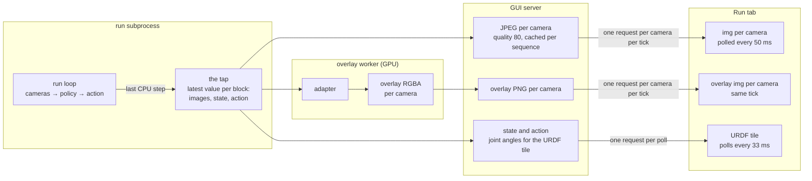
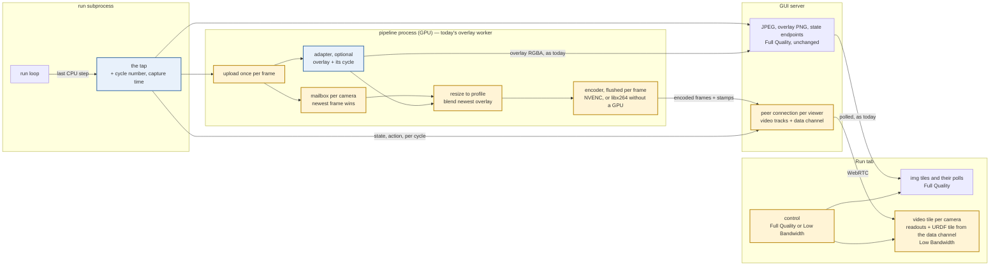

# Live camera video

Status: built, with the gaps marked **NOT IMPLEMENTED** at the claim
State of the work: [#226](https://github.com/TheWisp/lerobot/pull/226) for the design, [#230](https://github.com/TheWisp/lerobot/pull/230) for the code

The Run tab shows a run's cameras as one JPEG per camera per tick, polled
twenty times a second. Over the link to the rig each picture is a round trip
old before it is shown, and every picture costs a full frame of bytes, so the
operator sees a slideshow that lags the robot. That operator is the person
this design is for: a remote operator whose commands reach the robot by their
own path, and whose only feedback is this picture — the same picture an
observer watches to decide when to press Stop. Today neither can act on it.

**Proposal.** The server pushes one encoded frame per camera, at the camera's
own rate, the moment it exists: no container, nothing queued, the newest frame
always winning. Any overlay is drawn onto the frame on the server before
encoding, from whichever adapter produced it, and the frame never waits for it.
The robot's state and the commanded action travel on the same connection, one
message per cycle, so the joint readouts and the URDF tile are as fresh as the
picture with nothing polled. The transport is WebRTC; the whole pipeline runs
on the GPU where there is one, and the encode runs once per camera for every
viewer; the JPEG path stays as the other choice of the same control the Data
tab already has.

## Scope

In:

- The Run tab's camera tiles, the URDF tile and the state/action readouts
  during a run — teleop, record, replay, a policy — at the
  [Low Bandwidth](#g-profile) profile.
- Overlays on those tiles: the live SAM3 preview, policy saliency, and any
  future [adapter](#g-adapter), drawn on the server.
- One viewer at P0; several viewers of one run at P1.
- The link constant, shared with the Data tab: its `low` profile is re-anchored
  on the same constant in the same change ([O16](#o16)).

Out, and why:

- **The Robot tab.** Between runs the GUI process owns the cameras itself, so
  it is the same pipeline with a different frame source and no policy. After the
  Run tab, because the run case is the one the requirement is about.
- **Adapting to the link.** A fixed [profile](#g-profile) first, for the reason
  [`dataset_playback.md`](dataset_playback.md) gives: whether one is enough is
  the first thing to find out, and a mechanism that moves between rungs has to
  be understood before a stall can be explained. WebRTC's bandwidth estimate is
  where adaptation would attach later.
- **Removing the JPEG path.** It is the comparison this path is measured
  against and what the operator switches to when the stream fails; removing it
  is the step after,
  as for the Data tab.

Non-goals:

- **The remote command path.** Keyboard, space mouse or VR commands from the
  operator to the robot are low-dimensional and travel by their own transport,
  and none of them crosses a network today ([O13](#o13)); nothing in this design
  carries them or depends on how they travel. The two
  add up in the operator's loop, which is why this design states the picture's
  budget on its own.
- **A view for a headset.** Whether a VR client shows these cameras, and how, is
  decided later; a client on the operator's machine can receive the same stream.
- **Auditing what a policy is fed.** The picture is a transcode with an overlay
  drawn on it; what the policy sees is the tap's frame in the run process.

## Requirements

The picture is the remote operator's only feedback, and the observer's means to
stop a run in time, so **age and continuity come first and fidelity last**. The
host that serves the picture is the host running the policy and the recorder,
so not slowing the run is a P0 rather than a courtesy.

Conditions, named once:

- **Local** — server and browser on the same workstation.
- **Class link** — the link the design is built for: Lighthouse's and Chrome
  DevTools' _Slow 4G_ preset — 1.6 Mbit/s down, 750 kbit/s up, 150 ms round
  trip — which Lighthouse describes as roughly the bottom quarter of 4G
  connections and the top quarter of 3G ([E10](#e10)). One constant in code, shared with the Data tab,
  names it ([C11](#c11)); the profile, the budget, the shaper and the tests
  derive from it, and every target below is stated against it.
- **Rig link** — Tailscale to fc500t, whose capacity moves by more than the
  design can absorb, within an afternoon: 25–70 kbit/s with the stream losing
  43% of its packets at one hour, and no loss at all at 3 Mbit/s two hours
  later ([E16](#e16), [E18](#e18), [E19](#e19)). Runs over it are evidence,
  dated and timed; they do not define a target. What it is worth for is the
  two ends of the range: what the stream does on a link that carries it, and
  what it does on one that does not.
- **Workload** — the rig: four cameras at 960×600 and 1280×720, 30 fps, one of
  them carrying a live overlay, during a teleop or policy run with the recorder
  on.

| #                       | Pri | Requirement                                                    | Target                                                                                                                                                                                                                                                                                                                                                                                                                                                                                          | Why that target                                                                                                                                                                                                                                                                                                                                                                                                                                                                                                                                                                                                 | Checked by                                                                                                                                                                                                                                                                                                                                                                                                                                                                                                        |
| ----------------------- | --- | -------------------------------------------------------------- | ----------------------------------------------------------------------------------------------------------------------------------------------------------------------------------------------------------------------------------------------------------------------------------------------------------------------------------------------------------------------------------------------------------------------------------------------------------------------------------------------- | --------------------------------------------------------------------------------------------------------------------------------------------------------------------------------------------------------------------------------------------------------------------------------------------------------------------------------------------------------------------------------------------------------------------------------------------------------------------------------------------------------------------------------------------------------------------------------------------------------------- | ----------------------------------------------------------------------------------------------------------------------------------------------------------------------------------------------------------------------------------------------------------------------------------------------------------------------------------------------------------------------------------------------------------------------------------------------------------------------------------------------------------------- |
| <a name="r1"></a>**R1** | P0  | The freshest observation through the lowest-latency pipeline   | Every stage forwards the newest frame it has and holds nothing; the pipeline runs on the GPU wherever it can; no camera waits for another and no readout waits for a picture. Measured two ways: median [age](#g-age) at the eye over a ten-minute session — Local ≤ 50 ms at 30 fps, Class link ≤ 125 ms, Rig link Local plus half that day's round trip — and no gap between painted frames longer than three periods except while the receiver reports loss                                  | Decision 1 (2026-09-06, reaffirmed 2026-09-12): the picture's delay must be nearly the camera's exposure plus the network alone — one frame period of capture cadence, a pipeline share measured under a millisecond on the GPU ([E9](#e9)), half a display refresh. The two numbers are one mechanism seen twice, its level and its absence of stalls, and a right mechanism meets both (2026-09-14); the earlier branch's 0.4 s median ([E3](#e3)) is what a wrong one looks like. Holding a fast camera for a slow one, or a readout for a picture, would spend the budget on an alignment nobody asked for. | The capture time on every frame ([C3](#c3)); the page's clock offset estimated over the data channel; capture-to-paint per frame in the controls bar, and the painted-interval series. Mechanism tests: the [mailbox](#g-mailbox) never holds two; the stages run on both devices. In the suite, relatively: the WebRTC path's Local age against the Local instrument's on the same machine ([O10](#o10)). The numbers in dated runs; the rig's GPU and CPU share during a recording ([to measure](#to-measure)). |
| <a name="r2"></a>**R2** | P0  | The first picture follows the first frame                      | Every camera painted within two round trips of frames becoming available — 300 ms on the Class link — on a connection opened before the run's frames exist                                                                                                                                                                                                                                                                                                                                      | Once the connection is up, the first picture is one forced keyframe ([O17](#o17)), one way across the link, and a decode; nothing in that path justifies more than two round trips. The connection's own setup — signalling, ICE, DTLS — is several round trips ([O15](#o15)) and is paid when the tab is shown with Low Bandwidth selected or when Launch is pressed, behind the run's own start, which takes seconds.                                                                                                                                                                                         | Under the shaper at delays _d_, the time from the first tap frame to every tile painted grows by no more than 2 _d_; the connection's setup time measured and reported separately; the rig, dated.                                                                                                                                                                                                                                                                                                                |
| <a name="r3"></a>**R3** | P0  | The stream fits the shared link constant with margin           | All cameras together ≤ three quarters of the constant's downlink — 1,200 kbit/s — the per-camera bitrate derived as that budget divided by the camera count, the frame rate untouched                                                                                                                                                                                                                                                                                                           | One constant names the link for both tabs (2026-09-14), and the Data tab's profile is re-anchored on it in the same change ([O16](#o16)). A quarter is kept for the data channel, retransmissions and the rest of the page. The Data tab reached 30 fps for four cameras at 320 wide at 690 kbit/s ([`dataset_playback.md` E3](dataset_playback.md#e3)), so the width fits the budget. Resolution and bitrate are the knobs; a lower frame rate costs a frame period of age per frame ([O4](#o4)).                                                                                                              | The sender's byte count against the budget derived from the constant ([C11](#c11)), on a recorded episode rather than a pattern, since bytes follow content ([E17](#e17)); the shaper runs at the class rate; the Data tab's smoothness tests re-capped on the same constant.                                                                                                                                                                                                                                     |
| <a name="r4"></a>**R4** | P0  | State and action ride the stream                               | The data channel carries every [cycle](#g-cycle)'s state, action and the pose the visualizer draws; the tile — and any readout the tab grows — shows the newest received, as fresh as the pictures; no `obs-stream/state`, `urdf-viz` or `obs-stream/image` poll runs while streaming. The visualizer tile still fetches its own identity once when it is built — which robot, which URDF — and loads that robot's meshes over plain HTTP, both of which this design leaves alone ([E20](#e20)) | Today the URDF tile polls thirty times a second and the pictures twenty times per camera, each as old as its own request ([O11](#o11)); one connection carries all of it with nothing to poll. The tile is the state's only display today, so the pose is computed once per cycle on the server and sent with the readouts rather than derived on the page. Pairing a readout to one particular frame is not required (2026-09-14): each shows its newest.                                                                                                                                                      | A synthetic tap writer with the cycle encoded in the state: the readouts show the newest cycle written; the request log shows no poll while the stream is up.                                                                                                                                                                                                                                                                                                                                                     |
| <a name="r5"></a>**R5** | P0  | An overlay never delays the picture                            | With the adapter slowed tenfold, the painted-frame interval distribution is unchanged within one frame period; the overlay drawn is the newest; the reported lag equals the injected delay in cycles                                                                                                                                                                                                                                                                                            | Overlays are computed, not stored, and expensive; they may skip frames. A picture that waits for one inherits its rate — which is what the Data tab's stream does today, at about three pictures a second ([E6](#e6)), and what [#225](https://github.com/TheWisp/lerobot/issues/225) records as wrong.                                                                                                                                                                                                                                                                                                         | A test adapter with an injected delay; the documented rule in [`overlays.md`](overlays.md), "latest-wins, no frame pairing", holds on this path.                                                                                                                                                                                                                                                                                                                                                                  |
| <a name="r6"></a>**R6** | P0  | The run is not slowed by being watched                         | The loop's cycle-time median and 95th percentile with one viewer lie within the spread between two runs without a viewer; the run process's change is the tap header alone                                                                                                                                                                                                                                                                                                                      | The same host runs the policy and the recorder. The tap's contract already says no control path may depend on the write ([O3](#o3)); a viewer that costs the loop time would defeat the purpose of watching.                                                                                                                                                                                                                                                                                                                                                                                                    | Three runs on the virtual robot — two without a viewer, one with — reading the run's own latency report; the diff of the run process.                                                                                                                                                                                                                                                                                                                                                                             |
| <a name="r7"></a>**R7** | P0  | Full Quality is untouched, and Low Bandwidth reports its state | At Full Quality the tab behaves as today and no stream is opened. At Low Bandwidth the controls bar shows connecting, streaming with the age, or failed with the reason; a failure leaves the last frame on the tiles with the reason beside them, never a blank tile, and the operator switches paths by the control                                                                                                                                                                           | The JPEG path is the comparison this path is measured against. An automatic switch between paths mid-run is a second state machine to get right; a visible state and one control are enough (2026-09-13).                                                                                                                                                                                                                                                                                                                                                                                                       | The Run tab's existing tests at Full Quality pass unchanged and make no signalling request; with the encoder unavailable or the connection refused, the reason is shown, the last frame stays, and no request leaves for the JPEG path.                                                                                                                                                                                                                                                                           |
| <a name="r8"></a>**R8** | P1  | Several people can watch one run                               | One encoder per camera for any number of viewers; a second viewer on a link with injected loss leaves the first viewer's median age within one frame period of its single-viewer value; a joiner's first picture within R2's bound, from a keyframe forced on join ([O17](#o17))                                                                                                                                                                                                                | Two operators watching should not cost the host two encodes ([O14](#o14)); one bad link must not become everyone's. Agreed as P1 on 2026-09-13.                                                                                                                                                                                                                                                                                                                                                                                                                                                                 | Two browser contexts, one with injected loss: encoder count is one; the other's age unchanged; join-to-first-picture within R2's bound.                                                                                                                                                                                                                                                                                                                                                                           |

R4, R5 and R7 are behaviours; the rest are measurements,
met or missed in dated runs on the rig and the workstation, recorded under
`docs/proofs/`; the guardrails in the test suite compare against a baseline on
the same machine — the Local instrument, a run without a viewer, the profile's
own setting — rather than against these numbers, so a slow CI machine cannot
fail them and a fast one cannot pass them for the wrong reason.

## Observations

Each is sourced to `main` at `ef6f5bf93` unless it says otherwise, and each
closes with what it forces.

<a name="o1"></a>**O1 — Both live tabs poll a full-resolution JPEG per camera.**
The Run tab ticks every 50 ms and sets one `img.src` per camera
([run.js L2412–L2438](https://github.com/TheWisp/lerobot/blob/ef6f5bf933f8b6c061aa36c85adca1710035425a/src/lerobot/gui/static/run.js#L2412-L2438));
the Robot tab every 100 ms
([robot.js L768](https://github.com/TheWisp/lerobot/blob/ef6f5bf933f8b6c061aa36c85adca1710035425a/src/lerobot/gui/static/robot.js#L768)).
The endpoint encodes the newest tap frame at JPEG quality 80, and its own note
puts the conversion and encode at 5–10 ms for a 720p frame
([run.py L1506](https://github.com/TheWisp/lerobot/blob/ef6f5bf933f8b6c061aa36c85adca1710035425a/src/lerobot/gui/api/run.py#L1506)).
Over the Link each picture is one round trip old at best, and each is a full
picture of bytes: the same content as video measured 48× smaller
([E4](#e4)). → Pictures are pushed, not polled, and compressed as video.

<a name="o2"></a>**O2 — The [tap](#g-tap) is per-cycle and latest-value, with
no cycle identity and no capture time.** Every block carries a 24-byte header
of two sequence counters and the wall-clock write time
([obs_stream.py L113–L115](https://github.com/TheWisp/lerobot/blob/ef6f5bf933f8b6c061aa36c85adca1710035425a/src/lerobot/robots/obs_stream.py#L113-L115));
`write_obs` writes the scalar block and then each image block, each with its
own counter, and `write_action` is a third write
([L279–L300](https://github.com/TheWisp/lerobot/blob/ef6f5bf933f8b6c061aa36c85adca1710035425a/src/lerobot/robots/obs_stream.py#L279-L300)).
The camera's capture time exists — `OpenCVCamera` keeps `latest_timestamp` and
`read_latest()` returns it
([camera_opencv.py L437](https://github.com/TheWisp/lerobot/blob/ef6f5bf933f8b6c061aa36c85adca1710035425a/src/lerobot/cameras/opencv/camera_opencv.py#L437))
— but `read()` and `async_read()` return the array alone, so it is gone before
the observation is built. The writer is the last step of the observation
processor
([obs_stream.py L399](https://github.com/TheWisp/lerobot/blob/ef6f5bf933f8b6c061aa36c85adca1710035425a/src/lerobot/robots/obs_stream.py#L399),
[lerobot_record.py L968–L976](https://github.com/TheWisp/lerobot/blob/ef6f5bf933f8b6c061aa36c85adca1710035425a/src/lerobot/scripts/lerobot_record.py#L968-L976)).
→ Age needs a capture time and the overlay's lag needs a cycle number, both
written on every block of a cycle. That is a change to the tap's header, not
to the loop.

<a name="o3"></a>**O3 — The tap write is best-effort by contract, and the run
process owns the cameras.** The writer's docstring: no policy, control, safety
or recording path may depend on the publication succeeding
([obs_stream.py L399–L410](https://github.com/TheWisp/lerobot/blob/ef6f5bf933f8b6c061aa36c85adca1710035425a/src/lerobot/robots/obs_stream.py#L399-L410)).
During a run the run subprocess holds every camera and uploads each frame to
the GPU for the policy; the GUI never touches the device (the earlier design's
[A2](https://github.com/TheWisp/lerobot/blob/e7dfef2fed87ba11a17673f2fbe5ba4068aca3b6/src/lerobot/gui/docs/camera_video_transport.md#a2)).
→ The stream's work runs outside the run process, on a frame the view uploads
a second time — 1.7–2.8 MB per frame per camera at the Workload's sizes, by
arithmetic; the cost is unmeasured and not on any control path.

<a name="o4"></a>**O4 — Encoding is cheap; containers, resampling and buffered
players each cost a frame period.** Idle host with a 5090, 150 frames per row
([E1](#e1)): raw H.264 out of libx264 costs 2.2–4.6 ms at the median, out of
NVENC 1.1–2.1 ms; the fragmented-MP4 container holds each frame one period
(35 ms at 30 fps, 100 ms at 10) because it writes a frame's duration before the
frame; NVENC's default settings add two more periods; a 10 fps resample waits
up to 100 ms for the next sample. NVENC has the better median and the worse
tail in every row — worst frames 150–163 ms against libx264's 20–67. → No
container, no resample, no buffered player; the encoder runs at the camera's
rate; encode cost is a host-cost term, not an age term, at the Link's round
trip.

<a name="o5"></a>**O5 — The Link's round trip dominates, and its loss is
unmeasured.** 233–265 ms and 2.2–2.8 Mbit/s at the browser on 2026-09-07; 237
ms on 2026-09-06; 72 ms on the earlier branch's day ([E2](#e2)). Loss and
jitter during a session have never been measured. → Four cameras must fit two
to three megabits; R1's target is stated as an addition to the network because
the network is the largest term; whether packets are lost decides how the
transport must behave under loss ([O9](#o9)) and is [to measure](#to-measure).

<a name="o6"></a>**O6 — The Data tab's composited overlay stream is the closest
existing code.** It reads frames, blends the worker's RGBA overlay in NumPy,
resizes into an atlas, and pipes raw frames to an ffmpeg child that encodes
libx264 (ultrafast, zerolatency, baseline, a keyframe every second, no
B-frames) into fragmented MP4 for an MSE player
([overlays.py L737–L788](https://github.com/TheWisp/lerobot/blob/ef6f5bf933f8b6c061aa36c85adca1710035425a/src/lerobot/gui/api/overlays.py#L737-L788),
[L912–L975](https://github.com/TheWisp/lerobot/blob/ef6f5bf933f8b6c061aa36c85adca1710035425a/src/lerobot/gui/api/overlays.py#L912-L975),
[overlay_stream.js](https://github.com/TheWisp/lerobot/blob/ef6f5bf933f8b6c061aa36c85adca1710035425a/src/lerobot/gui/static/overlay_stream.js)).
Three of its choices are the ones O4 and R5 exclude: the container, the
buffered player, and a wait for each frame's overlay
([#225](https://github.com/TheWisp/lerobot/issues/225)). Its input is a pipe
with back-pressure — a queue, so a slow encoder ages every frame behind it.
→ The shape carries over — frames, blend, encode, stream — with raw H.264 out,
a mailbox in, and no wait.

<a name="o7"></a>**O7 — Overlays are produced by [adapters](#g-adapter) on the
GPU, and leave it as a picture.** The worker builds its adapter on CUDA
([process_worker.py L107](https://github.com/TheWisp/lerobot/blob/ef6f5bf933f8b6c061aa36c85adca1710035425a/src/lerobot/gui/process_worker.py#L107)),
reads the tap
([standalone.py L630](https://github.com/TheWisp/lerobot/blob/ef6f5bf933f8b6c061aa36c85adca1710035425a/src/lerobot/overlays/standalone.py#L630)),
and publishes one RGBA overlay per camera through shared memory
([overlay_ipc.py L169](https://github.com/TheWisp/lerobot/blob/ef6f5bf933f8b6c061aa36c85adca1710035425a/src/lerobot/overlays/overlay_ipc.py#L169));
the tensor becomes NumPy at
[adapters.py L201](https://github.com/TheWisp/lerobot/blob/ef6f5bf933f8b6c061aa36c85adca1710035425a/src/lerobot/overlays/adapters.py#L201).
Adapters include SAM3 tracking and policy saliency
([L519](https://github.com/TheWisp/lerobot/blob/ef6f5bf933f8b6c061aa36c85adca1710035425a/src/lerobot/overlays/adapters.py#L519),
[L1303](https://github.com/TheWisp/lerobot/blob/ef6f5bf933f8b6c061aa36c85adca1710035425a/src/lerobot/overlays/adapters.py#L1303)),
and one overlay — depth edges — runs inside the run process as a processor
step, so the tap already carries it drawn
([depth_edge_processor.py L198](https://github.com/TheWisp/lerobot/blob/ef6f5bf933f8b6c061aa36c85adca1710035425a/src/lerobot/processor/depth_edge_processor.py#L198)).
The Run tab today layers the RGBA as a PNG over each tile
([overlays.py L1709–L1712](https://github.com/TheWisp/lerobot/blob/ef6f5bf933f8b6c061aa36c85adca1710035425a/src/lerobot/gui/api/overlays.py#L1709-L1712)).
The documented rule for compositing is "latest-wins, no frame pairing"
([overlays.md L224](https://github.com/TheWisp/lerobot/blob/ef6f5bf933f8b6c061aa36c85adca1710035425a/src/lerobot/gui/docs/overlays.md#L224)).
→ The stream takes an overlay from whichever adapter produced it, without
knowing which. An adapter reads a stamped frame, so the cycle its overlay was
computed for is known and can travel with the frame it is drawn on.

<a name="o8"></a>**O8 — The GPU pieces exist; only the encoder is unused.**
`GpuMaskComposite` reproduces the saved-mask composite on the device for
training, ~0.2 ms per frame batched against 4.6–7.3 on the CPU, pinned to the
CPU result within two levels ([E7](#e7)); the training pipeline resizes on the
device; `PyNvVideoCodec` ≥ 2.2.2 is a declared dependency on Linux and Windows
with no macOS wheel
([pyproject.toml L187–L190](https://github.com/TheWisp/lerobot/blob/ef6f5bf933f8b6c061aa36c85adca1710035425a/pyproject.toml#L187-L190))
and only its decoder is called
([gpu_data_pipeline.py L166](https://github.com/TheWisp/lerobot/blob/ef6f5bf933f8b6c061aa36c85adca1710035425a/src/lerobot/datasets/gpu_data_pipeline.py#L166));
PyAV is under the `av-dep` extra; aiortc is not declared. → Nothing new is needed
on the device but an encoder invocation: the overlay stays there past
`adapters.py:201`, the blend and the encode run there, and the resize and the
binding already present are reused; the training pipeline is not refactored
for it. Without a GPU the same stages run on CPU tensors, with libx264 in the
encoder's place.

<a name="o9"></a>**O9 — WebRTC in Python sends what it is handed, and shares
the encoded frame across viewers but not the packets.** In aiortc at
`8a28646` (read 2026-09-13, [E5](#e5)) the sender takes what the track hands
it: a raw frame is encoded, an already-encoded packet is split into RTP
payloads as-is — the path its own `MediaPlayer(decode=False)` uses. Each peer
connection has its own sender, sequence numbers and encryption keys, so packets
are built per viewer while the encoded frame is shared. A receiver's keyframe
request sets a flag that only the encode path reads; on the pre-encoded path it
is ignored. → One encoder per camera feeds a track of packets; fan-out is at
the encoded-frame level ([R8](#r8)); the keyframe cadence is the server's to
set — one per second, as O6's command already does — or the request is wired
through by hand.

<a name="o10"></a>**O10 — What the browser offers depends on the origin, and
the rig's origin is now HTTPS.** WebCodecs needs a secure context; WebRTC and
MSE do not (the earlier design's
[A6](https://github.com/TheWisp/lerobot/blob/e7dfef2fed87ba11a17673f2fbe5ba4068aca3b6/src/lerobot/gui/docs/camera_video_transport.md#a6),
probed 2026-09-04). The rig serves over HTTPS (verified 2026-09-12). Chromium
151 exposes `jitterBufferTarget` and `playoutDelayHint` on a WebRTC receiver
([`camera_video_pipelines.md`](https://github.com/TheWisp/lerobot/blob/594fe772f12f9923a397bd6fbab1f8ccb3f1b2c1/src/lerobot/gui/docs/camera_video_pipelines.md)),
and `requestVideoFrameCallback` reports a painted frame's RTP timestamp, which
is what the page measures a painted frame's age from, once the track's
constant is known ([O18](#o18); [to verify](#to-measure) on the Chromium we
ship). A WebCodecs H.264 decoder and per-camera paint exist for the
Data tab
([chunk_player.js L326–L352](https://github.com/TheWisp/lerobot/blob/ef6f5bf933f8b6c061aa36c85adca1710035425a/src/lerobot/gui/static/chunk_player.js#L326-L352)).
→ WebRTC is the product transport ([C6](#c6)); the same encoded frames over a
streamed HTTP response into WebCodecs is the Local measuring instrument, with
no transport in the way.

<a name="o11"></a>**O11 — The robot's state reaches the Run tab as the
visualizer tile's own poll, apart from the pictures.** Nothing on the page
shows joint numbers today: the tile is where the state is seen, and it fetches
its own. `/obs-stream/state` returns the newest observation and action with
their write times and is there for readers outside the page
([run.py L1397](https://github.com/TheWisp/lerobot/blob/ef6f5bf933f8b6c061aa36c85adca1710035425a/src/lerobot/gui/api/run.py#L1397));
the URDF tile is an iframe
([run.js L2375](https://github.com/TheWisp/lerobot/blob/ef6f5bf933f8b6c061aa36c85adca1710035425a/src/lerobot/gui/static/run.js#L2375))
that polls `/urdf-viz?source=state` every 33 ms
([urdf_viz.html L640–L651](https://github.com/TheWisp/lerobot/blob/ef6f5bf933f8b6c061aa36c85adca1710035425a/src/lerobot/gui/static/urdf_viz.html#L640-L651));
pictures are polled every 50 ms (O1). Each is as old as its own request and
nothing pairs them. On the Data tab the tile follows the playhead's frame. →
State and action ride the stream per cycle, with the pose the tile draws
computed server-side from the same cycle; the tile shows the newest received,
as fresh as the pictures, and its poll stops while the stream is up. Joint
readouts, when the tab grows them, draw from the same message.

<a name="o12"></a>**O12 — The Data tab already has the control.** A dropdown in
its controls bar, Full Quality or Low Bandwidth, kept per browser in
`localStorage` under the earlier prototype's key
([index.html L137–L141](https://github.com/TheWisp/lerobot/blob/ef6f5bf933f8b6c061aa36c85adca1710035425a/src/lerobot/gui/static/index.html#L137-L141),
[app.js L28–L60](https://github.com/TheWisp/lerobot/blob/ef6f5bf933f8b6c061aa36c85adca1710035425a/src/lerobot/gui/static/app.js#L28-L60)).
→ One setting describes the link, not a tab: the Run tab reads the same key and
shows the same control in the same position.

<a name="o13"></a>**O13 — No teleop input crosses the network today.** Leader
arms are USB on the rig; the Quest opens `https://<LAN-IP>:8443`
([configuration_quest_vr.py L27–L32](https://github.com/TheWisp/lerobot/blob/ef6f5bf933f8b6c061aa36c85adca1710035425a/src/lerobot/teleoperators/quest_vr/configuration_quest_vr.py#L27-L32));
the phone is found by `hebi.Lookup()` on the LAN
([teleop_phone.py L98–L100](https://github.com/TheWisp/lerobot/blob/ef6f5bf933f8b6c061aa36c85adca1710035425a/src/lerobot/teleoperators/phone/teleop_phone.py#L98-L100)).
Remote commands are planned and are a separate design (decided 2026-09-12). →
The stream is designed for an operator whose commands arrive by another path;
its budget is the picture's share of that operator's loop.

<a name="o14"></a>**O14 — What the earlier Run-tab branch got wrong.**
`feat/camera-video-transport` tiled the cameras into one mosaic whose layout
knew three camera names, resampled to 10 fps, muxed into fragmented MP4 for
MSE with a catch-up seek, and started one ffmpeg per open browser tab; measured
over the Link at a 72 ms round trip, 1.18 Mbit/s and an age of 0.4 s median,
0.60 s at the 95th percentile ([E3](#e3)). → One stream per camera, so the
browser lays out and enlarges as it already does; one encoder per camera shared
by viewers; no resample; no buffered player.

<a name="o15"></a>**O15 — How the transport moves a frame.** In aiortc ([E5](#e5))
an encoded frame is cut into RTP packets of at most 1,300 bytes — a 2 KB
P-frame at the profile is two packets, a 30 KB keyframe about twenty-five —
and sent as soon as the frame is handed over. The sender keeps a history of
sent packets and retransmits on the receiver's NACK; a PLI or FIR sets a
keyframe flag that only an internal encoder reads; the receiver's bandwidth
estimate is applied only to an internal encoder. Each video track is its own
RTP stream with its own sequence numbers and its own receive-side jitter
buffer, so frames of different cameras arrive and are presented independently.
Setting a connection up is several round trips — signalling, ICE, DTLS — before
the first packet. → Per-camera tracks do not present the same cycle at the
same instant ([R1](#r1)); loss recovery and keyframe requests are per track
and, on the pre-encoded path, the server's to honour ([O17](#o17)); the connection
is opened before it is needed ([R2](#r2)).

<a name="o16"></a>**O16 — The Data tab's profile is anchored on width and
quality, not on a link.** `PROFILES["low"]` is 320 wide at constant quality 26
([chunk_playback.py L62](https://github.com/TheWisp/lerobot/blob/ef6f5bf933f8b6c061aa36c85adca1710035425a/src/lerobot/gui/api/chunk_playback.py#L62));
no bandwidth constant exists in the GUI package, and the smoothness test caps
its emulated link at a multiple of the content's own bytes
([test_low_bandwidth_smoothness_playwright.py L159](https://github.com/TheWisp/lerobot/blob/ef6f5bf933f8b6c061aa36c85adca1710035425a/tests/gui/test_low_bandwidth_smoothness_playwright.py#L159)).
→ One constant names the link both tabs are built for; the live path derives
its profile, budget, shaper and tests from it, and the Data tab's profile is
re-anchored on it in the same change ([C11](#c11)).

<a name="o17"></a>**O17 — The GPU encoder holds three frames unless flushed, and
gives keyframes on demand.** `PyNvVideoCodec`'s encoder on the workstation's
5090 ([E9](#e9)): a submitted frame's bitstream comes back three submissions
later — 100 ms at 30 fps — while a flush after each submission returns it in
0.24 ms at the median (0.32 for a four-tile atlas), keeps the session, and
leaves the keyframe cadence as configured. `NV_ENC_PIC_FLAG_FORCEIDR` on a
submission yields an IDR frame, with the parameter sets when also flagged. →
The encoder is driven with a flush per frame; a keyframe is forced when a
viewer's stream starts or a viewer asks for one, which is what stands in for
the request aiortc drops on the pre-encoded path ([O9](#o9)).

<a name="o18"></a>**O18 — Two things the library decides that this design has
to take back.** Read and run at aiortc 1.15.0 ([E12](#e12)). The sender adds a
random 32-bit origin to every timestamp it sends, so a receiver's reading is
the capture time plus a constant nobody told it; the constant is the same for
the life of a track, so one frame whose capture time is known fixes it. And a
connection left to the library's own preference order settles on VP8, which
makes the viewer decode H.264 access units as VP8 and paint nothing. → The
connection offers H.264 alone; the page learns each track's constant once,
from its first picture.

<a name="o19"></a>**O19 — An answer can only describe what the offer asked
for, and asking a public server first costs seconds.** Run at aiortc 1.15.0
([E13](#e13)). The side that answers cannot add a video stream or a data
channel the offer did not describe, and its codec list is settled the moment
the offer is applied — so the page decides the camera count, the codec order
and who opens the channel, and the server can only accept or refuse. And a
connection left with the library's default ICE server spends about ten
seconds asking a public STUN server for a candidate that is never used here,
against fifty milliseconds with none: the page reaches this server directly.
→ The page offers one receive-only video stream per camera with H.264 first
and opens the data channel; the server checks the offer and refuses with the
reason rather than answering with a stream nothing can decode; neither side
configures an ICE server.

<a name="o21"></a>**O21 — A video packet has to fit the smallest path, and
the library's default does not.** aiortc packetizes H.264 at 1300 bytes, which
is right for an ethernet frame. A WireGuard interface carries 1280, and 1300
plus RTP, UDP and IP headers is 1340, so on a tunnelled path every full-size
packet is split into two datagrams and needs both to arrive ([E18](#e18)). →
The packet size is capped below the smallest path we serve, which is the
tailnet's 1280.

<a name="o20"></a>**O20 — Every video stream after the first shares the
transport chosen for the first one.** Run at aiortc 1.15.0 ([E13](#e13)). A
video stream added to a connection is given the transport of the first video
stream already on it, and the bundle's own transport is settled in the first
negotiation. So a connection opened with the data channel alone, and given
its cameras later, answers all of them and carries one: the other three were
answered, never started, and sent nothing while the first sent 681 packets.
A connection opened with one video stream in it does not have that problem,
because that stream is the one the rest inherit. → The offer that opens the
connection early carries one placeholder video stream, and says it is not
attaching cameras; the offer that attaches them names the connection and
describes one stream per camera.

## Constraints and freedoms

<a name="c1"></a>**C1** One encoded frame is pushed per camera at the camera's own rate, in raw H.264 with no container
([O4](#o4), [O14](#o14), [R1](#r1), [R3](#r3)).

<a name="c2"></a>**C2** Between the tap and each encoder sits a
[mailbox](#g-mailbox): one value, a new frame replacing an unread one. The
encoder takes the newest frame when it is free and nothing is ever queued
behind a slow frame. After the encoder nothing is dropped, because a decoder
cannot skip an access unit: a viewer's queue is in order and bounded, emptied
when the viewer stops taking, and what it takes next is a keyframe. The page
hands each track to a video element, which is where the rule holds: a
WebRTC track renders the newest frame and does not queue decoded ones. The
page does not set a playout target of its own, so what enforces this is the
browser's default rather than anything here, and the measured age is the
link plus half a refresh ([E14](#e14), [E19](#e19))
([O6](#o6), [R1](#r1)).

<a name="c3"></a>**C3** Every tap block written in one [cycle](#g-cycle)
carries the cycle number and the capture time. That is the only change to the
run process ([O2](#o2), [O3](#o3), [R1](#r1), [R5](#r5), [R6](#r6)).

<a name="c4"></a>**C4** The overlay is drawn on the server onto the frame it is
newest for, and the frame never waits; the cycle the overlay was computed for
travels with the frame ([O7](#o7), [R5](#r5)). The pipeline reads the
worker's own overlay buffer — the one the JPEG path's PNG endpoint is served
from — so the adapter's result reaches the stream without either side
knowing about the other. What rides with the frame is the cycle the overlay
**arrived on**, not the cycle it was computed for: the buffer carries a write
time and no cycle, so the exact figure [R5](#r5) asks for needs a field the
worker does not publish yet.

<a name="c5"></a>**C5** The stream's work — upload, adapter, resize, blend,
encode — runs in the [pipeline process](#g-pipeline-process) on the GPU, never
in the run loop; the GUI process holds only the senders ([O3](#o3),
[O8](#o8), [R6](#r6), [R1](#r1)).
**PARTLY IMPLEMENTED.** What this constraint is for — the run loop pays
nothing — holds and is measured ([E20](#e20)). Where the work runs does not:
the pipeline is threads in the GUI server process, not the overlay worker, so
the GUI process does hold the per-pixel work, and each camera's frame is
uploaded to the device twice over, once by the worker for its adapter and
once here. The overlay itself crosses between them through the worker's
shared buffer rather than the process boundary this describes.

<a name="c6"></a>**C6** The transport is WebRTC: one peer connection per
viewer, opened before frames exist, carrying one video track per camera and one [data channel](#g-data-channel) for the cycle's state and
action. The encoded frame is shared across viewers; packets are built per
viewer; tracks present independently ([O9](#o9), [O15](#o15), [R1](#r1),
[R2](#r2), [R8](#r8)).

<a name="c7"></a>**C7** One encoder per camera per
[profile](#g-profile), at the width and the bitrate the constant derives, a
keyframe every second and none held back: flushed per frame, and forced on a
viewer's start or request ([O4](#o4), [O6](#o6), [O17](#o17), [R2](#r2),
[R3](#r3), [R8](#r8)).

<a name="c8"></a>**C8** One pipeline of device-agnostic stages: on the GPU where
there is one, on CPU tensors where there is not and in CI. The encoder is the
only backend switch — NVENC or libx264 — resolved per host as the other
backends are ([O8](#o8), [R1](#r1)).

<a name="c9"></a>**C9** The JPEG path is untouched. Low Bandwidth opens the
stream and reports its state; nothing switches paths on its own ([O12](#o12),
[R7](#r7)).

<a name="c10"></a>**C10** Stop is the HTTP request it is today and has no part
in the stream; nothing in the stream is on its path.

<a name="c11"></a>**C11** One constant names the [class link](#g-class-link) for both tabs.
The stream budget, what one camera may send, what its encoder is asked for,
the shaper's rate and round trip and every test's cap derive from it
([O16](#o16), [R3](#r3)).

Free, within those:

<a name="c12"></a>**C12** The profile's width, against the per-camera bitrate
the constant derives — [to measure](#to-measure). 320 wide, as the Data tab's
profile, is the starting point.

<a name="c13"></a>**C13** How a viewer's keyframe request reaches the encoder:
the sender's RTCP feedback, not a message on the data channel
([O15](#o15), [O17](#o17)). Decided 2026-09-14 by the loss measurement: the
rig's link dropped 43% of the stream's packets for an hour ([E16](#e16)), and
a viewer that cannot decode waits out the keyframe cadence — about a second —
with a frozen picture, which on that link is most of what an operator sees.
A browser already asks, automatically and by the standard, with a Picture
Loss Indication; a data-channel message would be the page re-implementing a
detection its decoder has already made. What was missing was on this side:
aiortc turns that indication into a call on the sender which sets a flag its
own encoder reads, and this track hands over frames that are already encoded,
so nobody read it.

## Architecture

**Today** ([O1](#o1), [O7](#o7), [O11](#o11)). Three readers of the tap, and
a page that polls each of them on its own clock.



**After** — the addition beside the JPEG path ([reuse](#reuse),
[beside the JPEG path](#beside-jpeg)). Yellow is new, blue is changed, plain
is unchanged or reused as is.



**The tap header** ([C3](#c3), [O2](#o2)). Each cycle the writer stamps every
block it writes with the cycle number and one capture time. The capture time
is the moment the robot's observation read began, or the moment the write
began when nothing better is known, and the header says which. A time from the
camera's own backend is the third case the header is shaped to carry and the
one nothing supplies yet (**NOT IMPLEMENTED**: no camera backend is read for
it). Readers
that ignore the two fields are unaffected; the pipeline process reads them so
each overlay knows its cycle ([C4](#c4)).

**The pipeline process** ([C5](#c5), [C8](#c8), [R1](#r1)).
**NOT IMPLEMENTED as written**: the pipeline runs as threads inside the GUI
server process, which reads the tap and holds the GPU itself. Everything in
this paragraph about the stages and the backend choice is what was built; the
process they run in is not. The rest of the paragraph describes the intended
end state. Today's overlay
worker, which already holds the GPU and reads the tap, becomes the process
that also produces the stream: it uploads each camera's frame once, runs the
adapter on it when one is loaded, and carries the frame through resize, blend
and encode on the device. Encoded frames leave it with their stamps to the GUI
process, which holds the senders and nothing per pixel. The stages are written
on tensors without a device in them, so the same code runs on CPU tensors in
CI and on a host without an NVIDIA GPU, with libx264 in the encoder's place;
that is the one place a backend is chosen. Two consequences for the worker's
life: it must exist for the stream whether or not an adapter is loaded, and
its hold on the GPU is shared with the Data tab's batch jobs, which today may
take the worker over — a run's stream must not be what they evict.

**The mailbox** ([C2](#c2), [O6](#o6)). One per camera in the pipeline
process, filled from the tap at the tap's rate, emptied by the encoder at the
encoder's. A frame that arrives while the previous is unread replaces it. The
encoder is the only reader, so the rule is one compare-and-swap, and it is
what makes [R1](#r1) a property rather than a hope: no stage can hold more
than one frame.

**The overlay and its lag** ([C4](#c4), [O7](#o7), [R5](#r5)). The frame is
resized to the profile first and the overlay resized to the same size; only
then is the newest overlay the adapter has produced for that camera drawn on
it, as a tensor operation. The order is not cosmetic: blending at the source
resolution costs about sixteen times more per frame than at the profile's on
the CPU ([E8](#e8)) and is measured in microseconds on the device at the
profile's size ([E9](#e9)). The overlay's cycle number rides in the data
channel message beside the frame's; the page does not yet show the difference
(**NOT IMPLEMENTED**: the message carries `overlay_cycles` and the page reads
only the cycle and the pose). Switching one camera's overlay off
reaches the stream as well as the page: the panel posts the camera set to
the worker's control, and the worker clears a camera it has been told to
drop by publishing a transparent overlay for it, which this blends to
nothing. A frame with no overlay yet is sent bare. The adapter is whatever
the worker is running — SAM3, saliency, a future one — and the blend does not
know which.

**The encoder and the profile** ([C1](#c1), [C7](#c7), [C11](#c11),
[C12](#c12), [O17](#o17)). Per camera: resize to the profile's width, keeping
the aspect ratio and never upscaling; encode with a keyframe every second and
no B-frames, at the bitrate the constant derives — the budget divided by the
camera count, less the headroom its rate control needs to land inside it
([E17](#e17)) — flushing after every submission so no frame is held; emit raw
H.264 with the [stamp](#g-stamp), the capture time in the transport's units.
A keyframe is forced when a viewer's stream starts and when a viewer asks for
one. On a host without NVENC the same stage calls libx264 in-process through
PyAV with the Data tab command's settings, so an access unit comes back from
the call that submitted its frame; a pipe to an ffmpeg child would need a
delimiter or a frame of delay to know where one ends (decided 2026-09-14,
while prototyping). Before a frame is handed to NVENC the stream that
produced it is synchronized: the encoder copies on a stream of its own and
otherwise reads what the reused memory held before ([E11](#e11)).

**Warm connection and the first picture** ([C6](#c6), [R2](#r2), [O15](#o15),
[O20](#o20)). The page opens its peer connection when the Run tab is shown
with Low Bandwidth selected, so signalling, ICE and DTLS are done while the
run itself is starting: over the rig link that cost a quarter of a second to
answer and two thirds of a second more to connect, none of it in front of the
first picture ([E16](#e16)). That offer carries one placeholder video stream
and says it is not attaching cameras, because a connection opened without one
can only ever carry a single camera ([O20](#o20)); when the run's cameras
appear the page offers once more on the same connection, which over that link
took another two thirds of a second. When the tap appears, the pipeline starts and pays
its one-time costs — the device's first kernels, each camera's encoder session
at the profile's size — on a blank frame before the tap delivers one: those
costs measured about a second, and every frame arriving during them was
dropped ([E11](#e11)). The first real frame is a forced keyframe, and the
first picture is one way across the link plus a decode away.

**Transport** ([C6](#c6), [O9](#o9), [O15](#o15), [O19](#o19), [R4](#r4)). A
viewer's connection carries one video track per camera, each fed by that
camera's encoder through a track that hands aiortc encoded packets, and one
data channel. The page makes the offer and the server answers it, so the page
asks for one receive-only video stream per camera — the count is the tile grid
it has already built from `obs-stream/meta`, so the tracks and the tiles cannot
disagree — puts H.264 first on each, and opens the data channel; an
answer cannot add any of those afterwards ([O19](#o19)). An offer that does
not is refused with the reason, never answered with a stream the viewer would
decode as noise. Neither side configures an ICE server, because the page
reaches this server directly. Per cycle the server sends one message on the channel: the cycle
number, the stamp, the state, the newest action with its own cycle number, and
each camera's overlay cycle. The
readouts and the URDF tile update from each message as it arrives; nothing
waits for a picture, and no picture waits for a message. The stamp is what
the page measures age from: it reads the painted frame's stamp from
`requestVideoFrameCallback` and subtracts the capture time it stands for,
with the clock offset applied. The stamp is the capture time in the
transport's clock, but the library adds a random constant to every stamp it
sends ([O18](#o18)), so the page learns that constant once per camera: a
frame's stamp is its cycle's capture time exactly and the data channel names
every cycle's capture time, so the constant that turns the most readings into
times that were announced is the one, and a set of readings no constant
explains is reported as an age it does not know rather than a wrong one
([E14](#e14)). The connection offers H.264 alone, because the library's own
preference order would otherwise settle on a codec our frames are not in
([O18](#o18)). The cycle number can be shown beside each tile; a difference
between tiles is information, not a fault.

**The page** ([O11](#o11), [R4](#r4), [E15](#e15)). Each camera tile is a video
element on its track, named by the answer — the description says nothing about
which stream is which camera ([O19](#o19)).
The overlay is already in the pixels, so nothing is drawn on top; the subtask
text overlay stays a DOM layer. The URDF tile draws the pose each message carries instead
of fetching its own, through the same call its poll's answer went through;
that poll does not run while the stream is up, and the tile follows the run at
the loop's rate rather than its own ([E15](#e15)). What the stream does not
carry is the tile's scene: its meta request and its URDF meshes are the same
plain HTTP fetches on both paths, and for a two-armed robot they are about ten
megabytes, so on a slow link the tile stays empty for tens of seconds after the
cameras are already streaming ([E20](#e20)). Enlarging one camera is the tile grid's existing behaviour. Stop is the
button it is today ([C10](#c10)).

<a name="reuse"></a>**What is reused and what is new** ([O6](#o6), [O7](#o7),
[O8](#o8), [O11](#o11), [O12](#o12)).

| Part                                                              | Status                            | What                                                                                                                                                                                                                                                                                                                                             |
| ----------------------------------------------------------------- | --------------------------------- | ------------------------------------------------------------------------------------------------------------------------------------------------------------------------------------------------------------------------------------------------------------------------------------------------------------------------------------------------ |
| Run loop, cameras, policy, recorder                               | unchanged                         | The stream never touches them                                                                                                                                                                                                                                                                                                                    |
| The tap                                                           | changed                           | Two header fields per block — cycle number and capture time — and the writer stamping them ([C3](#c3)); a reader that ignores the fields is unaffected                                                                                                                                                                                           |
| The tap reader                                                    | reused                            | The same reader the JPEG endpoints and the worker use, re-attaching when a run recreates the tap                                                                                                                                                                                                                                                 |
| Overlay worker, adapters, overlay buffer                          | reused, extended                  | The worker becomes the pipeline process; the adapter's overlay stays on the device past `adapters.py:201` for the blend and is still copied out for the PNG path; the worker publishes each overlay's cycle beside its sequence number                                                                                                           |
| Resize on the device                                              | new                               | Area interpolation when shrinking, bilinear otherwise, on tensors with no device in them; the training pipeline's resize was not reused                                                                                                                                                                                                          |
| Encoder settings                                                  | reused                            | The Data tab stream's libx264 settings, applied to PyAV's in-process encoder for the CPU backend, with raw H.264 out in place of fragmented MP4                                                                                                                                                                                                  |
| `PyNvVideoCodec`                                                  | present, first use of its encoder | A declared dependency whose decoder the training pipeline already calls                                                                                                                                                                                                                                                                          |
| Mailbox, pipeline stages, broadcaster                             | new                               | The stages in the pipeline process; the broadcaster in the GUI ([C2](#c2), [C5](#c5))                                                                                                                                                                                                                                                            |
| Peer connections, signalling, data channel, the pre-encoded track | new                               | aiortc, a new dependency in the `gui` extra, behind one signalling endpoint ([C6](#c6)); it carries our access units and neither encodes nor decodes ([E12](#e12))                                                                                                                                                                               |
| The class-link constant                                           | new                               | One value the profile, the budget, the shaper and the tests derive from ([C11](#c11))                                                                                                                                                                                                                                                            |
| Per-cycle joint angles                                            | reused                            | The function the URDF endpoint calls today, run per cycle for the message; the tile applies it through the same path as its own poll's answer                                                                                                                                                                                                    |
| Run tab tile grid, focus, layout                                  | reused                            | A cell holds a video element instead of an `` while streaming                                                                                                                                                                                                                                                                               |
| Signalling endpoint and the viewer registry                       | new                               | One POST that answers a viewer's offer — opening a connection, or attaching the cameras to one already open, and carrying back the profile the bar shows — and a status endpoint for reading a running stream from outside the page; the pipeline starts on the first viewer watching cameras and stops with the last ([O19](#o19), [O20](#o20)) |
| Run tab stream client                                             | new                               | Opens the connection early, feeds the readouts and the URDF tile from the data channel, reports age and state                                                                                                                                                                                                                                    |
| The control                                                       | reused                            | The Data tab's mode module and its per-browser key, bound to a second dropdown                                                                                                                                                                                                                                                                   |
| Overlay on or off per camera                                      | changed                           | Today a client-side gate on the overlay's URL; while streaming, a flag the pipeline blends by                                                                                                                                                                                                                                                    |
| URDF tile                                                         | reused                            | Fed from the data channel instead of its own poll, as the Data tab feeds it from the playhead                                                                                                                                                                                                                                                    |
| JPEG endpoints, JPEG cache, `obs-stream/meta`, `obs-stream/state` | unchanged                         | The JPEG path as it is                                                                                                                                                                                                                                                                                                                           |
| Local instrument                                                  | **not built**                     | A streamed-response endpoint and the Data tab's decoder. The baseline [R1](#r1) wants the WebRTC path compared against is still owed                                                                                                                                                                                                             |
| The age at the eye                                                | new                               | The page's own reading of each painted frame, turned into a capture time by the track's learned constant ([E14](#e14))                                                                                                                                                                                                                           |
| Synthetic tap writer, link shaper                                 | new                               | Test instruments                                                                                                                                                                                                                                                                                                                                 |

<a name="beside-jpeg"></a>**Beside the JPEG path** ([C9](#c9), [R7](#r7),
[O1](#o1)). One tab, one viewer, one path at a time, chosen by the control.

- **Full Quality.** The viewer as today: image tiles polled every 50 ms, an
  overlay PNG per camera, the URDF tile's own poll. No signalling request is
  made.
- **Low Bandwidth.** The connection is opened when the tab is shown or Launch
  is pressed; when `obs-stream/meta` reports the tap, the pipeline starts and
  the tiles show the tracks. The overlay image layer stays hidden because the
  overlay is in the pixels; the subtask text layer stays a DOM layer; the
  readouts and the URDF tile update from the data channel; no poll runs.
- **Switching.** The control changed mid-run stops one viewer and starts the
  other, in either direction. Nothing switches on its own.
- **Server side.** The pipeline runs only while a peer connection is open: the
  first offer starts it, the last close stops it. The worker serves both paths
  from its one overlay: the PNG for one, the blend for the other. Stop, the run
  lifecycle and its status stream are untouched on both paths.

<a name="the-control"></a>**The control** ([O12](#o12), [C9](#c9)). The Data
tab's dropdown, shown on the Run tab in the same position: below the split
handle, above the bottom tabs, in a controls bar of its own. Both read and
write the one per-browser key, so changing it on either tab changes both.
Beside it, the stream's state: connecting; nothing to watch yet, for a
connection that is up before a run is launched; streaming, with the profile in
use and the measured age; or failed, with the reason. The connection being open
with nothing on it is its own state because it is the one the operator sees
first, and calling it connecting would describe a fault that is not there.

```
Data tab (today)                              Run tab (proposed)
┌────────────────────────────────────┐        ┌────────────────────────────────────┐
│  [top]     [left_wrist] [right_w.] │        │  [top]     [left_wrist] [right_w.] │
│                       [URDF tile]  │        │                       [URDF tile]  │
├── drag handle ─────────────────────┤        ├── drag handle ─────────────────────┤
│ ▶ Play  [1x ▾]  [Full Quality ▾] … │        │ [Low Bandwidth ▾]  320 wide · age …│  ← controls bar
├────────────────────────────────────┤        ├────────────────────────────────────┤
│ timeline lanes                     │        │ Output │ Latency │                 │
│                                    │        │ …process log…                      │
└────────────────────────────────────┘        └────────────────────────────────────┘
```

**Failure** ([C9](#c9), [R7](#r7)). If the connection does not reach connected
or drops, or the server has no encoder, the controls bar says so with the
reason and the tiles keep the last frame they painted — which holds only
once there is one. A failure before any frame arrives leaves the video
elements black with the reason beside them, so [R7](#r7)'s "never a blank
tile" is **NOT IMPLEMENTED** for that case: the tile type is chosen from the
stored setting before anything is known about whether the stream will work.
A failure the server keeps hitting — an encoder that throws on every frame —
is counted and logged there and never reaches the page, which stays at
connecting with nothing to read: also **NOT IMPLEMENTED**, and the reason a
stream that produces nothing looks the same as a run that has not started. The operator switches
the control to Full Quality if they want pictures now; the tab does not switch
for them.

**Several viewers** ([R8](#r8), [C6](#c6), [O17](#o17); P1). The encoder's
output goes to a broadcaster; each viewer's track subscribes and aiortc
packetizes the same encoded frame per viewer. A viewer that falls behind has its
queue emptied and takes a keyframe next, as a single viewer does. A joiner
gets a forced keyframe.

**The Local instrument** ([O10](#o10)). **NOT IMPLEMENTED**: nothing in the
tree is this, so [R1](#r1)'s Local comparison is against dated runs rather
than against a baseline on the same machine. The same encoded frames over a streamed
HTTP response, decoded with the Data tab's WebCodecs setup and painted on
arrival, with the stamp inline. It measures the pipeline's own age with no
transport in the way and is the baseline every WebRTC number is compared to.
It is not a product mode.

## Alternatives, and what this costs

What else would meet the requirements, and why it is not the proposal:

- **Keep polling JPEGs.** Fails R1 and R3 over the Link by O1 and O5: a round
  trip per picture, a full picture per frame. Stays as the fallback.
- **Push JPEGs instead of polling them.** Meets R1's structure — encode, one
  way, decode — and fails R3 on bytes: no inter-frame compression, so 48× the
  bytes of video at the same picture ([E4](#e4)), against a link of two to
  three megabits for four cameras.
- **Chunks, as the Data tab does.** A chunk is as old as its length; the Data
  tab's design says so itself — a live path encodes what a camera just produced
  and caches nothing. Fails R1.
- **Fragmented MP4 over MSE**, the earlier branch's form. One frame period in
  the container and a buffered player that needs a catch-up rule (O4, O14);
  measured at 0.4 s median age ([E3](#e3)). Fails R1.
- **A streamed HTTP response into WebCodecs as the product.** Meets R1 on a
  clean link and carries the stamp inline, and it is the Local instrument here.
  Over TCP a lost packet stalls every frame behind it for a round trip — 233–265
  ms on the Link — and it does so precisely when the link is bad. Kept as the
  case to revisit if the loss measurement comes back low.
- **One atlas of every camera in one track.** One encoder session and one
  stream for any number of cameras, and every tile the same cycle by
  construction — which mattered until synchronization was dropped
  (2026-09-14). Against it: a lost packet stalls every camera rather than one,
  every viewer receives every camera at one rate, and each tile is a copy out
  of the decoded frame rather than a video element on its own track. Revisit
  if encoder sessions run out with several profiles and viewers.
- **A CPU pipeline first, the GPU later.** Measured cheap on the workstation
  ([E8](#e8)), and rejected on 2026-09-13: it makes two paths of one, and it
  downloads the frame the adapter already holds on the device to blend it
  again. The device-agnostic stages give the CPU case without a second path.
- **Switch to the JPEG path by itself when the stream fails.** A second state
  machine to get right in the middle of a run, and a tab that changes its own
  picture source. A visible state and the one control are enough (R7).
- **Hold the fast cameras for the slow one.** Every tile then waits for the
  slowest track's jitter, which is R1 spent on alignment.
- **Encode in the run process from the policy's GPU tensor**, as the
  `camera_video_pipelines.md` blueprint proposed. Saves the view's second upload
  (O3) and puts work in the control loop that the tap's contract forbids
  depending on. Revisited if the second upload measures as a cost.
- **Send the overlay to the page as data**, as the Data tab does with saved
  masks. Saved masks are stored rows; a live overlay is computed, expensive and
  skips frames (O7). Baking it in on the server is one picture instead of two
  and no client work.
- **Do nothing.** A remote operator has no picture they can act on, and the
  observer's Stop is a guess.

What the proposal makes harder or more expensive:

- A new dependency with a protocol behind it — aiortc, signalling, ICE — where
  the JPEG path has none.
- The readouts cannot ride inside the video packets, so they need the data
  channel beside the tracks, and the age needs the stamp lookup on the page; a
  page that shows the video alone shows the picture and nothing else.
- Keyframe requests from a viewer are the server's to honour, not the
  library's (O9), and so is the codec choice and the stamp's constant
  ([O18](#o18)).
- A second upload of every frame while the run process keeps its own (O3).
- Two picture paths in the Run tab until the JPEG path is removed.
- A host without an NVIDIA GPU gets Low Bandwidth through the same stages on
  CPU tensors with libx264, measured only on the workstation ([E8](#e8)).
- The pipeline process must run for every stream, adapter or not, and its GPU hold has to be arbitrated with the Data tab's batch jobs.
- The Local instrument is a second, small sender to keep working.

## Open questions

None remain for the reader; the forks this document carried are decided
above — one track per camera and the tile's surface
([Alternatives](#alternatives-and-what-this-costs)), synchronization
([R1](#r1)), the fallback ([R7](#r7)), and the link constant ([C11](#c11)).

<a name="to-measure"></a>To measure — settled by a number, not by the reader:

- **Age at the eye** on the Class link through the shaper, from the carried
  capture time, for the Workload ([R1](#r1)). Local is measured ([E14](#e14))
  and so is the Rig link on one bad day ([E16](#e16)); the shaper's is the one
  still owed, and it is the one the target is stated against.
- **The rig's GPU and CPU share** for the stream during a recording, with the
  recorder's encoder and the policy running ([R6](#r6), [R1](#r1)). What the
  pipeline costs there on its own is measured ([E16](#e16)), and a real teleop
  run with a viewer attached stayed at a third of its loop budget
  ([E20](#e20)); what the stream costs beside a recording is not measured.
- **Loss and jitter on the Rig link during a session**, dated ([O5](#o5),
  [C13](#c13)). One session is measured — 43% lost, 193–266 ms of jitter
  ([E16](#e16)) — which is enough to say the streamed-HTTP alternative would
  fare worse, and not enough to say what a normal day looks like.
- **The profile's width** against the per-camera bitrate the constant derives
  ([C12](#c12)); and the encoder's overshoot at that bitrate, measured at
  about fifteen percent over the target on the workstation ([E9](#e9)), which
  the budget must absorb.
- **Packetization cost per viewer** in aiortc for four tracks at 30 fps
  ([R8](#r8); P1).
- **What the overlay costs the stream**: the pipeline now takes the worker's
  RGBA per camera and blends it at the profile's size ([R5](#r5)), measured on
  the workstation at the profile ([E9](#e9)) but not beside a real adapter on
  the rig, where the worker holds the same GPU.

Verified, and no longer open: the Chromium we ship reports the RTP timestamp
in `requestVideoFrameCallback` metadata for a WebRTC track, it advances per
frame, and an age computed from it comes out at 6 to 36 ms Local across four
cameras ([E14](#e14), 2026-09-14).

## Glossary

<a name="g-age"></a>**Age** — The time between a frame's capture by the camera
and its appearance on the viewer's screen. Measured in the page from the
[stamp](#g-stamp).

<a name="g-cycle"></a>**Cycle** — One pass of the run loop: read the cameras and
the state, run the policy or the teleoperator, send the action, write the tap.
The cycle number is the loop's counter, written on every tap block of that
pass.

<a name="g-stamp"></a>**Stamp** — A frame's capture time in the transport's
units, carried on the encoded frame and repeated in the data channel message
for the same cycle. The number the page measures age from.

<a name="g-tap"></a>**Tap** — The shared-memory blocks the run subprocess
writes each cycle — images, state, action — one latest value per block, read
by the GUI and the overlay worker. Defined in `robots/obs_stream.py`.

<a name="g-adapter"></a>**Adapter** — A model wrapped to produce an overlay
from a camera frame in the overlay worker: SAM3 tracking, policy saliency, and
whatever is added next. Defined in `overlays/adapters.py`.

<a name="g-profile"></a>**Profile** — A named quality setting for the stream: a
target width per camera and a bitrate. Low Bandwidth is the stream at the
profile; Full Quality is the JPEG path.

<a name="g-mailbox"></a>**Mailbox** — A one-value handoff between two stages in
which a new value replaces an unread one. The stage after it always takes the
newest, and nothing waits behind a slow value.

<a name="g-keyframe-group"></a>**Keyframe group** — A keyframe and the frames
that depend on it until the next keyframe; one second long here. A decoder can
start only at a keyframe.

<a name="g-data-channel"></a>**Data channel** — WebRTC's message pipe beside
the video tracks on the same connection; here it carries one message per
cycle.

<a name="g-jpeg-path"></a>**JPEG path** — The existing per-frame JPEG endpoints
and what the tabs do with them.

<a name="g-viewer"></a>**Viewer** — One browser page watching a run over one
peer connection.

<a name="g-class-link"></a>**Class link** — The link the design is built for, a
named public preset rather than a measurement of ours: Slow 4G, 1.6 Mbit/s
down, 750 kbit/s up, 150 ms round trip. One constant in code for both tabs; the profile, the
budget, the shaper and the tests derive from it.

<a name="g-pipeline-process"></a>**Pipeline process** — The process that holds
the GPU and carries a frame from the tap through adapter, resize, blend and
encode: today's overlay worker, extended. The GUI process receives its encoded
frames.

## Appendix: evidence

Numbers taken on a superseded branch are attributed to it so nobody re-measures
what is known, and so nobody mistakes them for a measurement of this design.

<a name="e1"></a>**E1 — Encoder and container costs.** Frame in to encoded
bytes out, idle host with an RTX 5090, 150 frames per row, script
`enc_latency2.py` on `feat/camera-video-transport`, recorded in that design's
[A10](https://github.com/TheWisp/lerobot/blob/e7dfef2fed87ba11a17673f2fbe5ba4068aca3b6/src/lerobot/gui/docs/camera_video_transport.md#a10)
(2026-09-04). Milliseconds.

```
encoder     shape         size@fps     median   p95     max
libx264     annexb        640x380@10      2.3     2.7    20.1
libx264     annexb        640x380@30      2.2    35.4    36.2
libx264     annexb        1280x720@30     4.6     5.4    66.7
libx264     fMP4          640x380@10    102.5   103.0   103.2
libx264     fMP4          640x380@30     35.4    68.7   102.3
h264_nvenc  annexb -delay 0  640x380@10   1.1     1.3   159.1
h264_nvenc  annexb -delay 0  640x380@30   1.2   101.0   163.2
h264_nvenc  annexb -delay 0  1280x720@30  2.1    35.5   150.4
h264_nvenc  fMP4 default  640x380@10    300.8   301.4   301.6
h264_nvenc  fMP4 -delay 0 640x380@30     34.6   101.5   165.5
```

<a name="e2"></a>**E2 — The Link.** Round trip 233–265 ms; 3.8–4.1 Mbit/s in a
single server-side stream, 2.2–2.8 Mbit/s as the browser measured it
(2026-09-07, [`dataset_playback.md` E1](dataset_playback.md#e1)). 237 ms by
ping on 2026-09-06, 20 packets, 235–244 ms, and 0.48 s to first byte for a
fresh HTTP request to the GUI; 72.2 ms on the day of the earlier branch's
measurement (that design's
[A1](https://github.com/TheWisp/lerobot/blob/e7dfef2fed87ba11a17673f2fbe5ba4068aca3b6/src/lerobot/gui/docs/camera_video_transport.md#a1)).
Loss and jitter: not measured.

<a name="e3"></a>**E3 — The earlier Run-tab branch, over the Link.**
`feat/camera-video-transport`, commit e0a76d076, at a 72.2 ms round trip: a
640×380 mosaic at 10 fps, libx264 into fragmented MP4 over MSE; 1.18 Mbit/s;
first frame 498 ms after the request; age 0.4 s median and 0.60 s at the 95th
percentile, not growing over a session (that design's
[A1](https://github.com/TheWisp/lerobot/blob/e7dfef2fed87ba11a17673f2fbe5ba4068aca3b6/src/lerobot/gui/docs/camera_video_transport.md#a1)).

<a name="e4"></a>**E4 — Bytes: JPEG against video.** On the rig's three-camera
dataset, the Data tab's JPEG flipbook needed 324 KB per tick, 78 Mbit/s at 30
fps — about 108 KB per camera picture; the same content as H.264 at 1280 wide
and 1500 kbit/s was 6.7 KB per frame, 48× less
(`feat/camera-video-transport`, commit a4b0db5c3, that design's
[A1](https://github.com/TheWisp/lerobot/blob/e7dfef2fed87ba11a17673f2fbe5ba4068aca3b6/src/lerobot/gui/docs/camera_video_transport.md#a1)).

<a name="e5"></a>**E5 — aiortc's sender.** Read on 2026-09-13 at commit
[`8a28646`](https://github.com/aiortc/aiortc/commit/8a2864630bf417d977a06dda8d0254b1c1501bfb)
(2026-07-17):
[`rtcrtpsender.py` L294–L332](https://github.com/aiortc/aiortc/blob/8a2864630bf417d977a06dda8d0254b1c1501bfb/src/aiortc/rtcrtpsender.py#L294-L332)
— a `Frame` from the track is encoded with the pending keyframe flag, anything
else is passed to the codec's `pack`;
[`codecs/h264.py` L298–L302](https://github.com/aiortc/aiortc/blob/8a2864630bf417d977a06dda8d0254b1c1501bfb/src/aiortc/codecs/h264.py#L298-L302)
— `pack` splits the Annex B bitstream into NAL units and packetizes them, with
the timestamp from the packet's `pts`;
[L351–L355](https://github.com/aiortc/aiortc/blob/8a2864630bf417d977a06dda8d0254b1c1501bfb/src/aiortc/rtcrtpsender.py#L351-L355)
— a PLI or FIR from the receiver sets the flag the encode path reads. Each
`RTCRtpSender` belongs to one peer connection.

<a name="e6"></a>**E6 — The overlay preview's rate today.** With the live SAM3
preview on and three cameras at the 672 preset, the Data tab's stream shows
about 3 pictures a second on the 5090, 5.5–6.5 with one camera
([#134](https://github.com/TheWisp/lerobot/issues/134)); the stream holds each
frame for that frame's overlay
([#225](https://github.com/TheWisp/lerobot/issues/225)).

<a name="e7"></a>**E7 — The GPU composite.** `GpuMaskComposite` on real 720p
rows: about 0.2 ms per frame batched against 4.6–7.3 ms for the CPU composite,
identical on about 97% of pixels and within two levels elsewhere, pinned by
`tests/datasets/test_gpu_composite_equivalence.py`
([gpu_mask_composite.py](https://github.com/TheWisp/lerobot/blob/ef6f5bf933f8b6c061aa36c85adca1710035425a/src/lerobot/datasets/gpu_mask_composite.py)).

<a name="e8"></a>**E8 — The CPU path's stages, per frame, on the workstation.**
Measured 2026-09-13 on an AMD Ryzen 9 9950X, idle, moving-noise frames, 150
iterations per row, medians; script kept out of the tree. The JPEG path's
cost is the endpoint's own `cvtColor` + `imencode` at quality 80 at the
source resolution. The encode row is frame-in to bytes-out through a pipe to
an ffmpeg child (`-threads 1`, ultrafast, zerolatency, baseline, keyframe per
second, raw H.264, flushed per packet), with the child's CPU share over the
run at 30 fps.

```
stage                                        median   p95   (ms per frame)
JPEG path: imencode q80 1280x720               2.40   2.57
JPEG path: imencode q80 960x600                1.53   1.56
resize 1280x720 -> 320x180 (INTER_AREA)        0.72   0.74
resize 960x600 -> 320x200                      0.43   0.45
NumPy blend, 30% coverage, 320x200             1.03   1.04
NumPy blend, 30% coverage, 1280x720           15.93  16.13
libx264 320x200@30, 375 kbit/s, in -> out     5.76   5.85   ffmpeg 2.3% of one core, 382 kbit/s out
libx264 640x380@30, 1200 kbit/s, in -> out    6.62   7.01   ffmpeg 4.8% of one core, 1222 kbit/s out
```

Per camera at the profile, scale then blend then encode is about two to three
milliseconds of CPU per frame; four cameras at 30 fps is about a third of one
core by arithmetic, against the JPEG path's 1.5–2.4 ms per camera frame plus
its per-request handling. The in-to-out figure includes the pipe and the
reading thread, not encode alone; compare [E1](#e1) for the encoder by itself.

<a name="e9"></a>**E9 — The GPU path's stages and the encoder, on the
workstation.** Measured 2026-09-13 on an RTX 5090 with torch 2.11 and
`PyNvVideoCodec` 2.2.2, idle, moving-noise frames, medians over 150 iterations
with device synchronization around each stage; scripts kept out of the tree.

```
stage                                              median    p95    max   (ms per frame)
upload 1280x720x3 uint8 from NumPy to the GPU        0.17   0.21   0.55
resize 1280x720 -> 320x180 on the GPU (area)         0.09   0.12  23.16   (max is the first call)
blend RGBA overlay, 30% coverage, 320x200            0.04   0.04  12.21   (max is the first call)
pack to ARGB 320x200                                 0.01   0.01   2.30
```

The encoder, `preset P1, ultra_low_latency, CBR, keyframe every 30 frames, no
B-frames`, fed ARGB tensors at 30 fps pacing, 300 frames per row:

```
configuration                              submit -> bitstream          keyframes  out
320x200, 300 kbit/s, no flush              100.0 ms median (3 frames held)  10/300   325 kbit/s
1280x200 atlas, 1200 kbit/s, no flush      100.0 ms median (3 frames held)  10/300  1305 kbit/s
640x380, 1200 kbit/s, no flush             100.0 ms median (3 frames held)  10/300  1313 kbit/s
320x200, 300 kbit/s, flush per frame         0.24 median, 0.33 p95, 1.04 max  10/300   349 kbit/s
1280x200 atlas, 1200 kbit/s, flush per frame 0.32 median, 0.40 p95, 1.35 max  10/300  1411 kbit/s
```

With no flush the bitstream of a frame is returned by the third later
submission, whatever the size; a flush (`EndEncode`) after each submission
returns it at once, keeps the session, and leaves the keyframe cadence as
configured. `NV_ENC_PIC_FLAG_FORCEIDR` (value 2) on a submission produced an
IDR frame at that position, with the parameter sets when `OUTPUT_SPSPPS` (4)
was also set. CBR overshot its target by about fifteen percent at these sizes.
The earlier ffmpeg-driven measurement of the same hardware encoder
([E1](#e1)) showed a 95th percentile near a frame period at 30 fps; driven
directly with a flush per frame it did not.

<a name="e10"></a>**E10 — The class link.** Lighthouse's throttling guide
([docs/throttling.md](https://github.com/GoogleChrome/lighthouse/blob/main/docs/throttling.md),
read 2026-09-13): latency 150 ms, throughput 1.6 Mbps down / 750 Kbps up,
"roughly the bottom 25% of 4G connections and top 25% of 3G connections",
currently called _Slow 4G_ and formerly _Fast 3G_. Chrome DevTools' presets
([NetworkManager.ts](https://github.com/ChromeDevTools/devtools-frontend/blob/main/front_end/core/sdk/NetworkManager.ts),
same day): _Slow 4G_ 1.6 Mbit/s down and 750 kbit/s up, each applied at 0.9;
_Fast 4G_ 9 Mbit/s down and 1.5 Mbit/s up; _Slow 3G_ 500 kbit/s each way.

<a name="e11"></a>**E11 — The pipeline on the workstation, prototype.** Measured
2026-09-14 on the Ryzen 9 9950X and the RTX 5090 with a synthetic tap of four
cameras at 960×600 and 1280×720 at 30 fps, the writer in its own process,
three-second windows (`tests/gui/test_live_video_pipeline.py`; the diagnostic
scripts kept out of the tree). Age is from the observation read's start to
the encoded frame, the pipeline's own share.

```
every camera, NVENC                         91 frames in, 91 encoded, none dropped; age 2.5 ms median, 3.2 p95
per camera at the 300 kbit/s share          285–313 kbit/s; the bare encoder on the same content 285
first frame, no warm-up                     about 960 ms from the first take to the first encode; 28 of 91 frames dropped meanwhile, on every camera
first frame, warmed at start                within a period of the steady state
NVENC handed a tensor with kernels pending  505 kbit/s at the 300 setting, 100-byte P-frames between 3–7 KB ones: the previous frame's memory
four NVENC sessions in four threads         278–284 kbit/s each at 300, as one alone
```

<a name="e12"></a>**E12 — The transport, prototype.** Two peer connections in
one process on the workstation, 2026-09-14, aiortc 1.15.0
(`tests/gui/test_live_video_transport.py`): the viewer received every camera
and the cycle messages; what it decoded was byte-identical to a local decode
of what the server encoded, in order; one constant per track, learned from the
first picture, recovered every later frame's capture time to within a
millisecond; the offer carried H.264 and no VP8. With the codec preference
removed the connection settled on VP8 and the viewer painted nothing; with the
stamp taken at the frame's arrival instead of its capture, the recovered times
were out by the pipeline's own delay.

<a name="e13"></a>**E13 — Offer, answer and setup, prototype.** Two peer
connections in one process on the workstation, 2026-09-14, aiortc 1.15.0
(`tests/gui/test_live_video_endpoint.py`, and the diagnostic scripts kept out
of the tree).

```
with the library's default ICE server   offer 5.0 s, answer 10.0 s, connected 10.1 s
with no ICE server configured           offer and answer under 0.01 s, connected 0.05 s
```

An answerer that added a track for a camera the offer did not describe could
not produce an answer at all; one that set its codec preference after applying
the offer still answered with VP8 first, because the list was already settled.
The endpoint therefore reads the offer and refuses the two cases with their
reasons. The first viewer's offer starts the pipeline and the last viewer's
departure stops it, which a test watches through the status endpoint.

<a name="e14"></a>**E14 — The browser end of the path, prototype.** Chromium
151 as shipped with Playwright, driven against the real server and a
synthetic four-camera tap on the workstation, 2026-09-14
(`tests/gui/test_live_video_browser_playwright.py`). The browser offers
H.264 and the answer carries it; every camera is painted at the profile's
width; `requestVideoFrameCallback` reports an `rtpTimestamp` on every painted
frame and it advances. Median age at the eye, from the capture time the
stamp stands for to the paint, over four runs of six seconds each:

```
run          track ages, ms
1            22.8  22.6   6.2  22.6
2            25.8   9.2   9.1  25.6
3            33.1  16.5  16.4  16.4
4            35.7  19.1  19.0  19.0
```

All of it on one machine, so this is the pipeline, a loopback and a decode,
without a network: it is the Local condition, not the class link's.

<a name="e15"></a>**E15 — The Run tab on both paths, prototype.** The same run
watched two ways in Chromium 151 on the workstation, 2026-09-14, against a
synthetic four-camera tap
(`tests/gui/test_run_tab_live_video_playwright.py`, and the screenshots in the
pull request). At Low Bandwidth the four tiles are video elements at the
profile's width and the controls bar reads _Streaming · 320 wide · 37 ms_;
no picture, pose or state request leaves the page while it streams. At Full
Quality the tab is unchanged and opens no stream.

```
visualizer tile, poses applied per second     Full Quality 2–3 Hz     Low Bandwidth 28–31 Hz
```

The tile's own poll asks thirty times a second and gets three: it competes
with the four JPEG polls on one server, and every answer resolves the robot
and its joint map again. On the stream the pose is computed once per cycle
beside the readouts, and the tile draws the loop's own rate.

<a name="e16"></a>**E16 — The rig, and the link to it on a bad day.** 2026-09-14.
The pipeline was run on fc500t's own RTX 5090 from a code worktree, against
the recorded footage, while the rig went on serving its GUI; then a sender
was left running there on a spare port and watched from the workstation over
the tailnet. Nothing the rig was serving was stopped.

On the rig's hardware, real footage at 320 wide:

```
tap to encoded, median      NVENC 6.1–6.2 ms      libx264 11.1–11.2 ms     worst 24–30 ms
per camera                  575–597 kbit/s        1153–1189 kbit/s together
```

Over the link, two cameras, 45 seconds, with the workstation's own
connection measured at 36 Mbit/s and 12 ms to a third party at the same time:

```
round trip                     245 ms (235–296), 35% of pings unanswered
throughput, plain HTTP         25–70 kbit/s
packets lost, per video stream 43%, jitter 193–266 ms
delivered                      1.3–2.1 frames per second of the 30 sent
age at the eye                 1.37 s median, 1.47–1.54 s at the 95th
connection opened early        answered in 0.25 s, connected at 0.94 s
cameras attached afterwards    0.72 s
first picture, after attaching 4.4 s and 5.2 s
```

The link that day carried about a twentieth of what the profile asks for, so
the pictures arrived as the design says they will when the link is too small:
they stall rather than degrade, because nothing here adapts
([Alternatives](#alternatives-and-what-this-costs)). The first picture took
four and five seconds against [R2](#r2)'s two round trips, which is the loss
rather than the connection: a keyframe is about twenty-five packets, and two
in five of them were not arriving. What the run does show is the mechanism
around that working on a real link — the connection opened before the
cameras, answered in a quarter of a second, and the cameras joined it in
another two thirds — and the page's age arithmetic returning a number on a
stream losing two packets in five.

<a name="e17"></a>**E17 — What the profile costs on a recording.** The same
pipeline fed a public recording of an SO-101 picking and placing — two
cameras at 640×480, 30 fps — instead of a generated pattern, 2026-09-14
(`tests/gui/test_live_video_real_footage.py`). Content decides bytes, and the
difference is the whole point of measuring it this way:

```
                                   per camera        two cameras together
generated pattern, 320 wide        285–313 kbit/s    570–626
recording, encoder asked for 600   574–624 kbit/s    1153–1201
recording, encoder asked for 540   534–550 kbit/s    1081–1088
```

At a target of its whole share the stream came in at 1201 kbit/s against a
1200 budget: rate control aims at its target and lands above it, so what the
link sees is not what the encoder was asked for. The encoder is now asked for
nine tenths of the share, which puts the recording at 1081–1088. The pattern
never showed this because it cost half the budget either way.

<a name="e18"></a>**E18 — What the loss on that path turned out to be, and what
it was not.** 2026-09-14, same link as [E16](#e16). The round trip was steady
at 235 ms and both ends had fast internet of their own — the rig pulled 29
MB/s from a domestic mirror and 8.2 MB/s from GitHub, the workstation 4.5
MB/s from Cloudflare — so neither end was the problem. Loss on the path
between them depends on packet size:

```
ICMP payload    64 B   500 B   1000 B   1200 B   1260 B
loss             8%     17%     17%      33%     refused: message too long, mtu=1280
```

Both tailscale interfaces carry 1280 bytes. The library packetizes H.264 at
1300, which with RTP, UDP and IP headers is 1340, so every full-size video
packet was being split into two datagrams inside the tunnel and needed both
to survive. Packets are now capped at 1200 so each is one datagram
([O21](#o21)).

The cap has no measured effect either way, which is worth stating plainly
because it was introduced on a diagnosis that turned out to be wrong. Run
against the link in both conditions, changing nothing but that number:

```
                       1300 bytes                  1200 bytes
the degraded window    43% lost, 1.4 s age         41–42% lost, 1.4 s age
the recovered window   0% lost, 176 ms age         0% lost, 175 ms age
```

It is kept because a 1340-byte datagram cannot cross a 1280-byte tunnel
without being split, which the probe above shows directly, and a split
packet needs both halves to survive. That is a reason to expect it to matter
on a lossy path, not evidence that it does.

<a name="e19"></a>**E19 — The rig link when it carries the stream.** Two hours
after [E16](#e16), on the same path and the same build, 2026-09-14. The link
had recovered on its own: a page that had taken 92 seconds loaded in 3.7, and
ICMP that had been dropping one packet in five dropped none.

```
round trip                        235 ms
UDP of the video's own shape      no loss at 300, 600, 900, 1200, 1800 and 3000 kbit/s
delivered                         30.0 frames per second on both cameras
packets lost                      0 of 7,700
age at the eye                    117 ms median, 121 at the 95th
first picture, after attaching    0.05 s
connection opened early           answered in 0.29 s, connected at 0.95 s
in the browser                    tiles painted 7.9 s after a cold page load, bar reading 142 ms
```

Half the round trip is 118 ms, so the age is the network and almost nothing
else: [R1](#r1)'s rig target is Local plus half the day's round trip, which
is about 138 ms, and the measurement is 117. [R2](#r2) asks for the first
picture within two round trips, 470 ms here, and the connection being open
already made it 50.

The loss in [E16](#e16) was real at the time and is not the whole story:
ICMP on this path is rate-limited, so a ping's loss says little either way —
it read 8% at 64 bytes while UDP of the video's own size and rate was
arriving intact. What separates the two windows is the path's capacity that
hour, not packet size and not the design.

<a name="e20"></a>**E20 — The whole path on the real robot.** 2026-09-14 on the
rig, an hour after [E19](#e19). A bimanual OpenArm on its own profile with its
two wrist cameras, launched from the Run tab's own endpoint, watched from the
workstation over the Rig link. The teleoperator was `no_input`, which returns
an empty action every cycle: the loop reads the arms, runs both processor
pipelines and the send path, and writes no motor command, so the robot is real
and still. Chromium 151 on the workstation showed both tiles streaming.

```
stream, both cameras              29.8 frames per second delivered
packets lost                      0 to 3 per camera over the session
controls bar                      Streaming · 320 wide · 125 ms
loop, median / 95th               9.3 / 11.2 ms   (33.3 ms budget)
observation                       4.3 ms
processors, observation / action  0.8 ms / 0.0 ms
send                              4.0 ms
camera staleness at the loop      13 ms on both wrists
cycles over budget                0%
```

The robot's own numbers are what [R6](#r6) is about, and this run gives one
side of it: the loop stayed at about a third of its budget with a viewer
attached and no cycle ran over. The comparison [R6](#r6) asks for — the same
run without a viewer, twice — was not made on hardware, and the recorder was
not on, so the share the stream costs beside a recording is still open. The
age matches [E19](#e19)'s to within a few milliseconds on a different workload,
which is the link rather than the pipeline, as [E19](#e19) argues.

Stopping the run released both arms: both cameras and both follower arms
disconnected, with `disable_torque_on_disconnect` doing what it says.

The visualizer tile was still empty in that session, reading _waiting for a
run…_ while both cameras streamed. The pose was riding the stream from the
first cycle — this robot resolves two arms and their joint angles, which
`tests/gui/test_live_video_endpoint.py` now pins — but the tile cannot draw
until it has fetched its meta and its meshes over plain HTTP, which this design
does not change. The bimanual OpenArm's visual meshes are 9.7 MB, one of them
3.4 MB, and that single file took 7.7 s over the link that hour at 442 kB/s.
The tile is the one part of the Run tab whose first paint still waits on the
link's bandwidth rather than on the stream.

<a name="e21"></a>**E21 — Both adapters through the stream.** 2026-09-14 on the
workstation. What was checked is that an overlay an adapter computes arrives
in the pixels a viewer decodes, which is [C4](#c4) and the half of
[R5](#r5) that is not about lag.

_SAM3._ A recorded episode of a real SO-101 played through the tap, the
overlay worker started as the GUI starts it — same entry point, same
arguments — with `--model sam3_track --prompt "robot arm"`, and the picture
read back by decoding the H.264 a viewer would receive. The worker drew on
4.2% of the frame; 61 of 62 encoded frames carried the overlay; the mean
pixel change against the same stream with nothing published was 7.9. The
contour and the label in the decoded picture are entirely the overlay:
[shots/live-video-sam-overlay-proof.png](shots/live-video-sam-overlay-proof.png)
is the stream with nothing published, the mask the worker produced on its
own, and the picture decoded from the video with it — the middle panel
composited over grey so that what its alpha covers is what is visible.

_Policy saliency — **the transport only; not a policy run**._ That adapter
runs no model: the policy process publishes a per-camera grid and the adapter
colourises the newest one. What was checked is that a grid reaches the
picture. An HVLA flow-matching S1 checkpoint was loaded and gradients computed
on **one frame** of its own training episode, and that one result was
republished while the tap played the episode forward — so the attention map
was static and the video under it was not. 86 grids at 64×64 for four cameras
went through the worker and the pipeline; 61 of 62 encoded frames carried the
result, over 10.4% of the frame, for a mean pixel change of 5.1. The three
panels of
[shots/live-video-saliency-proof.png](shots/live-video-saliency-proof.png) are
the stream with nothing published, the attention map on its own, and the
picture decoded from the video with it.
The checkpoint was copied to a scratch directory and its feature contract
backfilled there, because every HVLA checkpoint on that machine predates the
contract and migrating in place would have written to a run of the user's.

**Done on 2026-09-15, by the operator rather than by this measurement.** An
HVLA run was launched from the Run tab against a migrated checkpoint, with the
`policy_saliency` overlay on all four cameras, and the attention map was
visible on the Low Bandwidth tiles. The server state corroborates what was
running: the overlay worker reported `policy_saliency` active on `front`,
`left_wrist`, `right_wrist` and `top`, and the run's command was `hvla`.

No picture of it was captured, because the run ended when a camera came loose
and the aux buffer is unlinked when the policy process exits — so what stands
here is an observation with the server's own record beside it, not a decoded
frame like the SAM half above. Worth repeating with a capture.

Two things recorded here as blockers were wrong. Every local checkpoint
predates the feature contract and refuses to load, which the migration script
fixes in place rather than needing anything new. And the cameras were attached
all along: detection through the GUI finds four, including the `/dev/video2` an
earlier probe of mine reported absent, once `pyrealsense2` is installed so the
depth camera can enumerate.

A test in `tests/gui/test_live_video_pipeline.py` covers the same path
without a checkpoint, standing in for the policy's write, so the suite keeps
it without loading a model.

Both ran with every shared-memory name under a private prefix, so a worker
started for a measurement cannot be picked up by a GUI serving someone.

**Not covered by either.** A run: the tap was a recording played into shared
memory rather than a robot, and neither adapter was exercised from the Run
tab during teleop with an operator's hand on it. The policy's inference loop
is also stood in for — the publisher was called directly on a batch rather
than from a loop driving a robot.

<a name="e22"></a>**E22 — An overlay on a real teleop run, watched in the
tab.** 2026-09-14 on the workstation. A bimanual SO-107 on its saved profile
with the two cameras attached that day, launched from the Run tab's own
endpoint with the `no_input` teleoperator, and the SAM3 overlay started on
the front camera while the run was going. Watched in Chromium at Low
Bandwidth.

```
segmenter                      25.2 inferences per second, 16 ms compute
encoded                        827 frames per camera, 0 errors, 320x180, NVENC
controls bar                   Streaming · 320 wide · 51 ms
visualizer                     30 Hz, bimanual
```

The masks are in the pictures the browser decoded from the stream
([shots/live-video-teleop-sam-tile.png](shots/live-video-teleop-sam-tile.png)
is the front tile enlarged, and
[shots/live-video-teleop-sam-run-tab.png](shots/live-video-teleop-sam-run-tab.png)
the tab it came from). This is the first run where the whole path — robot,
cameras, tap, segmenter, pipeline, browser — was the product's own rather
than a harness standing in for part of it.

**What the same run did not show.** The overlay was started through the
API rather than through the Overlays panel, and the JPEG path's overlay layer
is gated by that panel's page-side state, which an API start does not set. So
Full Quality drew no overlay in this run, and the two paths were not compared
like for like. The Low Bandwidth tile shows one because the server blends it,
which is a real difference in where the two paths keep that state.

**Two defects this run found**, both fixed in the branch that carries it: the
SO-107 follower wrote an empty goal to its bus rather than treating an action
naming no motor as no command, so the `no_input` teleoperator — the thing
that makes an unattended run safe — killed the run on contact with real
hardware, which is pinned now by
`tests/robots/test_so_follower_empty_action.py`; and the worktree the branch
lives in could not run any of this until the Feetech, deepdiff and
transformers extras were installed, which is an environment gap rather than a
code one but is why none of it had been exercised here before.
