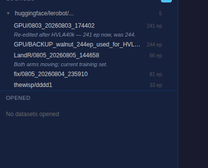
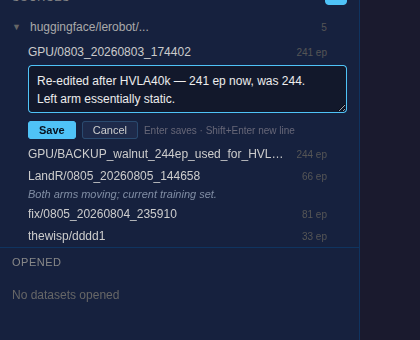
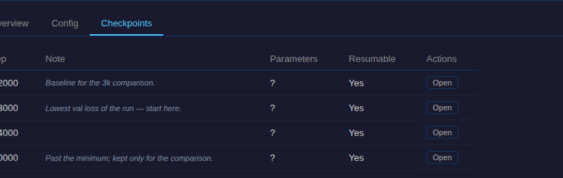

# Notes on datasets and models

Status: built. Store [`gui/notes.py`](../notes.py), API
[`gui/api/notes.py`](../api/notes.py), UI [`static/notes.js`](../static/notes.js),
tests [`tests/gui/test_notes.py`](../../../../tests/gui/test_notes.py).

## What it is

A free-text note on a dataset, a training run, or a checkpoint. Add, change,
remove, view. Nothing else.

## Granularity

Dataset, run, checkpoint. Not episodes.

The OpenArm2 handoff doc — the thing that motivated this — contains no
per-episode observation. Everything in it sits at one of those three levels
("left arm basically static", "no normalization floor", "30k stalls").

Episodes are also the one level where a note cannot be kept correct. Deleting an
episode renumbers every episode after it:

```python
# datasets/dataset_tools.py
episode_mapping = {old_idx: new_idx for new_idx, old_idx in enumerate(episodes_to_keep)}
```

There is no stable episode identity in the format, so a note keyed by index
silently reattaches to the wrong episode after any deletion — worse than no
note. Notes could be piped through that same mapping, but it appears at four
call sites and each is a chance to forget. Episodes already carry a
task/language string if per-episode text is ever needed.

## Storage

**One `NOTES.md` per dataset and per run.**

```text
<dataset>/NOTES.md      the note, verbatim

<run>/NOTES.md          the run note, then one section per checkpoint:

                          Normfloor + boundary fix. Val bottoms ~3k.

                          ## 003000
                          Lowest val loss — start here.

                          ## 010000
                          Past the minimum; kept for comparison.
```

Not one file per checkpoint: checkpoints get pruned and rotated, and a note
should outlive the thing it describes. One file per run is also the unit a human
would actually read.

Two costs, accepted: the heading convention means the file is not _purely_ free
text, and a checkpoint note does not travel if a single checkpoint directory is
copied out on its own.

A custom file rather than the artifact's `README.md`: the README is the Hugging
Face card, generated by `create_lerobot_dataset_card` / `generate_model_card` at
`push_to_hub` time. Writing notes there means teaching those generators to merge
instead of overwrite, or the first push wipes the note. `NOTES.md` still travels
— dataset pushes upload the folder wholesale, and the policy upload's
`allow_patterns` already includes `*.md`.

## UI

Data tab. The note is a dim second line under the row, truncated to one line.
No note, no line; the ✎ appears on hover.

```text
┌─ Sources ────────────────────────────────────┐
│ ▼ .../huggingface/lerobot              168   │
│    LandR/0805_20260805_144658        66 ep   │
│    ✎ both arms moving — current set          │
│    GPU/0803_20260803_174402         241 ep   │
│    ✎ re-edited after HVLA40k; left arm st…   │
│    fix/0805_20260804_235910          81 ep ✎ │
└──────────────────────────────────────────────┘
```

Click the note line, or the hover ✎, to edit in place:

```text
│    GPU/0803_20260803_174402         241 ep   │
│   ┌───────────────────────────────────────┐  │
│   │ re-edited after HVLA40k; left arm     │  │
│   │ static▌                               │  │
│   └───────────────────────────────────────┘  │
│    [Save] [Cancel]  Enter saves · Shift+     │
│                     Enter new line           │
```

Enter saves, because a note is a line or two and not an essay; Shift+Enter is
the escape hatch for the rare multi-line one. Buttons carry the same two
actions, so the interaction is discoverable without knowing the keys, and Esc
still cancels. Clicking away saves rather than discarding what was typed. The
box starts one line tall and grows with the text.

The line being edited is hidden while the editor is open, so the truncated
preview and the full text are never both on screen.

Rows that already have a note still reserve the ✎ slot: it sits before the meta
label in a flex row, so omitting it would knock every annotated row's episode
count or policy type out of line with its neighbours.





Model tab. Run note in the tree; checkpoint notes in the Checkpoints tab of the
detail panel that already exists.



```text
 sidebar                          detail panel
┌──────────────────────────┐  ┌─────────────────────────────────┐
│ ▼ .../lerobot/runs   67  │  │ hvla-LandR-66                   │
│   hvla-LandR-66    hvla  │  │ [Info] [Config] [Checkpoints]   │
│   ✎ normfloor + bound…   │  │                                 │
│   act-fix-81        act  │  │ Note                            │
│   ✎ sudden lateral ju…   │  │ ┌─────────────────────────────┐ │
│   hvla-0803        hvla  │  │ │ Normfloor + boundary fix.   │ │
│   act-old-33        act  │  │ │ Val bottoms ~3k — compare   │ │
└──────────────────────────┘  │ │ 2k/3k/4k vs 10k.            │ │
                              │ └─────────────────────────────┘ │
                              │ Checkpoints                     │
                              │  002000                       ✎ │
                              │  003000  lowest val — start     │
                              │  010000  past the minimum       │
                              └─────────────────────────────────┘
```

One interaction everywhere: click the note, type, Enter or click-away saves,
Shift+Enter starts a line, Esc cancels, empty deletes, hover ✎ adds. Notes are
fetched in batched requests per tree render and cached, so an unannotated tree
costs one call.

## Correctness

Three bugs found in review had one cause: the parser took the on-disk
checkpoint names as an input. That set could differ between a read and a write,
between the API and a direct caller, and between the file and the filesystem —
an empty placeholder `checkpoints/` dir shadowing the real one produced an empty
key set, and a pruned checkpoint dropped out of the set so its section merged
into the run's note and was destroyed by the next save.

The fix is structural rather than three patches:

**Parsing depends only on the bytes of the file.** A heading starts a section
when it _looks_ like a checkpoint (`003000`, `checkpoint-30000`) — a syntactic
test, no filesystem lookup. `read`, `write`, and `read_all` take no key set, and
the API no longer computes one. A prose heading (`## Background`) stays prose; a
pruned checkpoint keeps its section.

**Two invariants, checked rather than assumed.**

| Invariant                                                  | Enforced by                                                                                  |
| ---------------------------------------------------------- | -------------------------------------------------------------------------------------------- |
| Round-trip: `write(x, t)` then `read(x)` returns `t`       | `write` re-reads before returning and raises `NoteNotRepresentableError` if it does not hold |
| Non-interference: writing one note never changes another's | writes splice one line range; everything outside is preserved byte-for-byte                  |

Both are covered by parametrised tests over a corpus of bodies chosen to attack
the parser — prose headings, structural-looking text, whitespace edges,
non-ASCII. The one body a note cannot hold is a line that would parse as a
checkpoint heading; that is rejected with a 400 naming the offending line,
rather than stored as text that reads back as two notes.

## Not doing

Stars, tags, status flags, aliases, filters, an export, a separate page,
episode-level notes. Each was in an earlier draft; none of them is "a note".

## Adjacent, separate

Recording which dataset a run actually consumed (episode + frame count at train
start) is a provenance fix, not a note. Worth doing, tracked separately.
