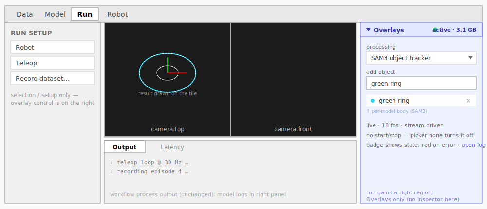
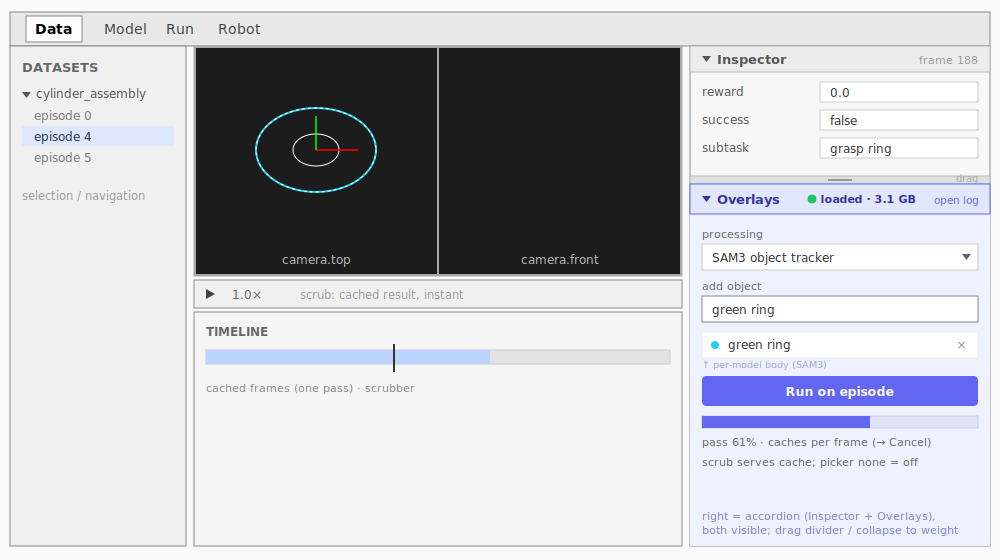

# Overlays — observation processing in the main view (working name)

**Status:** implemented — data + live (2026-06-26). Its own PR; `proto/gui-debug-vision` rebases on
top. Motivating findings: `src/lerobot/policies/debug_vision/JOURNAL.md`.

## What it is

A panel that runs **one processing step on the current observation** and surfaces its result in
the main view: `observation → result`. It is bound to the **observation** (multi-modal —
cameras, depth, later proprioception/tactile), not to the camera/image. Results are `spatial` (on a
tile) or `text` (a caption). A `spatial` result renders by its **data shape**: a **region** (mask →
fill + contour), a **dense field** (depth, attention → colormap/heatmap), or **sparse geometry**
(trajectory, keypoints → lines/points) — so attention is not a new kind, it renders like depth.

This PR ships **one** step — the SAM3 object tracker — as the representative overlay; the
framework is built to host more (depth, HVLA **S2** reasoning, …) as follow-ups.

## Where it lives

The GUI is a fixed-region layout (panels resize, they don't dock). The regions have roles:

- **Left** = selection / setup — the datasets tree (data), run params (run).
- **Center** = the content — camera tiles, URDF.
- **Right** = tools that operate on the current content — today the **Inspector** (per-frame
  feature values + RECAP labeling).
- **Bottom** = output / diagnostics (run terminals, latency) and the timeline (data).

Overlays is a **tool on the current observation**, so it belongs in the **right region**, as a
sibling of the Inspector. The right's meaning ("tools on the current frame") is consistent across
tabs; the left's is not (navigation vs setup). It also pairs naturally with the Inspector:
perception-assisted labeling — run a tracker, then edit the labels on the same frame.

## Layout

The right region becomes a **collapsible accordion** of stacked sections, each independently
collapsible with a draggable divider:

- **Data** → `[ Inspector ⌄ ][ Overlays ⌄ ]`. **Accordion, not tabs** — they are complements you
  glance between (run a tracker, edit the label), not alternatives, so both stay visible; drag the
  divider or collapse one to weight them. The Inspector is unchanged; it just becomes a section.
- **Run** → the same region with only the **Overlays** section (run has no per-frame feature
  editing). Run gains a right region it didn't have before; collapsed, it's a thin rail + badge.

No dockability needed: a fixed, resizable, collapsible region already covers "see both and weight
them yourself." Moving / floating / relocating panels is out of scope (§Non-goals). The collapsed
state is a rail carrying the **state badge**, so the panel costs almost nothing at rest.

**Run tab** — left setup, center viewer, the Overlays section in the new right region:



**Data tab** — the right region as an Inspector + Overlays accordion, both visible:



The result (masks, text) still renders on the **camera tiles** in the center; only the **control**
lives in the right panel.

## Shell and body

The panel splits into a model-agnostic **shell** and a per-model **body**, so a no-config step
(depth) and a complex one (SAM3) share one frame:

- **Shell** (identical for every model, both tabs): header (title · state badge · open-log), the
  **processing picker**, the **body slot**, and a mode-driven **action + status** row.
- **Body** (declared by the step, dropped into the slot): SAM3 → open-vocab **object rows**
  (`[+/- sign][name][colour palette][remove]`) + a **Background** colour + **camera toggles**;
  depth → empty; S2 → a prompt.

Each step declares three things: its **config** (the body — a schema for simple steps, a custom
component for complex ones like SAM3), its **result kind(s)** (`spatial` / `text` → how output
renders), and a **load-cost** hint (fast / slow → loading UX).

## Controls and state

**One active processing at a time, and no Start/Stop button.** Three independent layers:

- **Selection = the effect's on/off.** The picker includes **"none"**; selecting a model turns the
  effect on, "none" turns it off (and stops compute). That is the only on/off.
- **Collapse ≠ stop.** Collapsing the section hides the body (chrome only); the effect keeps
  running on the view, so the **collapsed rail still shows the badge**.
- **Load / VRAM = a layer below.** "none" stops the effect immediately, but the model may stay
  **warm**; actual unload is a separate lazy / auto optimization, not tied to the on/off.

**No buttons in either mode.** A selected model + a named object simply processes the observation:
live runs continuously on the stream; data infers the **landed frame on demand** as you scrub
(caching it, so re-visiting is instant) and follows frame _and_ episode changes automatically — no
"run" step, no pre-pass, no cancel. Result kinds are open (`spatial` / `text`); input is the current
frame (the live frame, or the scrubbed frame in data).

| per-mode | Live (teleop / policy / replay) | Data (recorded episode)                |
| -------- | ------------------------------- | -------------------------------------- |
| Driver   | continuous on the stream        | on-demand per landed frame → cache     |
| Scrub    | —                               | infers on landing; instant once cached |
| Action   | none (stream-driven)            | none (scrub-driven)                    |
| Status   | fps · util · VRAM               | cached count · util · VRAM             |

### Lifecycle states

Each model has its own lifecycle as an explicit state machine
(`policies/debug_vision/overlay_state.py`) — the single source of truth for the badge. The
standalone reports its phase (loading → active), the GUI layers the process-lifecycle states on
top, and **nothing assembles a state string by hand**; state changes only by firing an event, and
every transition is logged. The machine is pure, so the table is unit-tested in isolation.

| state      | meaning                                                                                                                                      |
| ---------- | -------------------------------------------------------------------------------------------------------------------------------------------- |
| `inactive` | no model loaded (requirement unmet, or stopped)                                                                                              |
| `loading`  | the model is warming. A **guard**, not a label: no inference / no serving and no second spawn until `active`.                                |
| `active`   | model loaded + running. fps / util read 0 when idle (no input frames) — **still active**, not a separate "waiting" state.                    |
| `stopping` | tearing down (subprocess terminating, shm + VRAM freed). A **guard**: a queued start _waits_ for it via the start/stop lock — never dropped. |
| `error`    | the subprocess died abnormally.                                                                                                              |

Transitions (`state --event--> state`):

```
inactive --START--> loading      loading  --LOADED--> active     loading  --STOP--> stopping
active   --STOP---> stopping      active   --CRASH--> error       loading  --CRASH-> error
stopping --STOPPED-> inactive     stopping --CRASH--> inactive    error --RESET--> inactive
error    --START--> loading       (restart straight from a prior error)
```

**Per-model.** The machine is per-instance, keyed by model, so switching A→B drives
`A: active→stopping→inactive` and `B: inactive→loading→active` as **independent** flows. Resources
stay one-at-a-time (a single standalone + the fixed `lerobot_overlay_*` shm), serialised by the
lock — A's teardown finishes before B's spawn, so their _states_ overlap but their _VRAM_ doesn't.
Running models concurrently (per-model shm) is the "stacking" non-goal below.

**Load timing is the implementation's.** `inactive → loading` fires when requirements are met;
_when_ exactly (eager on enable, lazy on first frame, keep-warm) is an internal optimisation the
user doesn't reason about.

## Architecture — observations in, results out (the IPC protocol)

An overlay is **one processing step on the current observation**: `observation → result`. The step
may be a heavy ML model (SAM3, depth, HVLA S2) **or plain CV** — the protocol
assumes nothing about its internals. Two shared-memory streams carry everything, named
`lerobot_<stream>_<block>`, each torn-read-protected by a sequence counter (`robots/obs_stream.py`,
`policies/hvla/ipc.py`).

### `lerobot_obs_*` — the observation (input)

The robot's post-processed observation: scalars, last action, one image block per camera
(`lerobot_obs_meta` / `_obs` / `_act` / `_img_<cam>`). **One writer, many read-only readers.**

- **Run** — the writer is the teleop / policy / record **subprocess** the GUI spawns with
  `LEROBOT_OBS_STREAM=1` (`gui/api/run.py`); an `ObservationStreamWriterStep` at the tail of its
  processor pipeline publishes each observation.
- **Data** — there is no robot, so the **GUI** is the writer: as the user scrubs it publishes the
  decoded frame (the one it already has for the tile) into the same blocks, same convention.
  Re-publishing the **same** frame (a paused playhead, or a status re-poll) is a no-op — it doesn't
  touch the stream, so pausing never re-runs inference or resets the tracker.
- **Readers** (read-only, lock-free, any process): the GUI's live display + URDF joint transform
  (`run.py`); the **overlay worker** (`debug_vision/standalone.py`). No reader writes here — the
  observation stays pristine.

> **Known limitation — run and data can't both own the stream.** `lerobot_obs_*` is a singleton
> (fixed shm names), so there is exactly one writer at a time: a run (teleop/policy/record) _or_ the
> data publisher, never both. The GUI arbitrates — the data overlay yields while a run is active, and
> starting a run tears the data publisher down — so a live-run overlay and a data-tab overlay can't be
> active simultaneously. This is pre-existing debt in the single-robot stream design; the proper fix
> (namespacing / multiplexing the stream so contexts coexist) is a follow-up — see `gui/TODO.md`.

### `lerobot_overlay_*` — the result (output)

The step's result is a **separate stream, not a modified observation** — the raw frame is never
touched, the overlay simply layers over it, and a reader can never corrupt the obs stream the
display + URDF viewer also read. The result declares a **kind** (`spatial` → a per-camera RGBA
layer; `text` → a caption):

| block                       | direction    | contents                                                                                            |
| --------------------------- | ------------ | --------------------------------------------------------------------------------------------------- |
| `lerobot_overlay_img_<cam>` | worker → GUI | RGBA layer — the rendered `spatial` result                                                          |
| `lerobot_overlay_meta`      | worker → GUI | cameras · `result_kind` · fps · vram · latency                                                      |
| `lerobot_overlay_status`    | worker → GUI | phase (loading / active) — drives the badge                                                         |
| `lerobot_overlay_control`   | GUI → worker | step config (objects, colours) · camera filter · stream `generation` (bumped on a new stream start) |

**The control channel is generic.** `lerobot_overlay_control` is a JSON object with exactly two
fields the worker owns — `generation` (the reset signal) and `cameras` (the active-camera filter,
which narrows both what the GUI publishes and what the worker infers, so disabling a camera cuts its
work) — plus an opaque `config` sub-object it hands straight to `step.set_control(config)` without
interpreting. Each step reads only its own `config` (SAM3 → `{objects, background}`; depth → `{}`; a
plain-CV step → `{low, high}`) and **declares that schema** (the step's `controls`, §Shell and body),
so the GUI builds the control UI and sends the values generically. Adding an overlay never touches
the transport or the worker — only the step's `set_control` and its declared schema.

### Reading the result back

The GUI attaches the result stream **read-only** (`SharedOverlayBuffer(create=False)`) and, per
camera, serves the **latest** RGBA the worker has written as PNG (cached by sequence so an unchanged
result isn't re-encoded). The **browser composites** it as a transparent layer over the camera tile;
a `text` result renders as a caption. **No frame matching** — the worker is slower than playback, so
its overlay naturally lags by a frame or two, exactly as the live overlay lags the live feed; when
the user pauses, the worker catches up (skip-to-latest) and the overlay settles on the held frame.
The step renders its own result; the GUI only transports + composites.

```
 PUBLISHER (one)            OBSERVATION  lerobot_obs_*          CONSUMERS (read-only, many)
 run : robot subprocess ─►  meta·obs·act·img/cam  ──┬──►  GUI live display
 data: GUI (on scrub)       (pristine — no reader   ├──►  URDF viewer   (in-process transform)
                             ever writes it)         └──►  overlay step (out-of-process worker)
                                                              │  observation → result
                                                              ▼
 browser composites ◄─ GUI serves latest PNG ◄──────── RESULT  lerobot_overlay_*
   ▲                                                   img/cam(RGBA) · meta(kind,fps) · status
   └─ GUI writes step config + stream generation ────► control   (GUI → worker)
```

### All steps run out-of-process

Every overlay step runs in the worker, out of process — there is no in-process special case. In
Python the real in-process cost is the **GIL**: a step running in a GUI thread contends for the
interpreter lock with everything else the GUI does (the event loop, serving frames), so it stutters
regardless of how cheap it is. A separate process has its own GIL, and the shared-memory hand-off
between them is lock-free `memcpy` — microseconds, and can be _faster_ than passing work between
threads. So out-of-process is both the isolated **and** the fast choice; the step's nature (heavy ML
or plain CV) changes nothing. (The URDF viewer's joint-angle transform runs in-process, but it's a
tiny non-overlay computation — a different feature, not an overlay step.)

And because the boundary is a shared-memory **contract** (`lerobot_obs_*` in, `lerobot_overlay_*`
out), not a Python API, the worker is not tied to Python: a hot step can be written in C++/Rust
behind the exact same protocol, with no change to the GUI.

### The worker loop & resetting on a new stream

The worker hosts one loaded step and reads the obs stream **skip-to-latest** (always the newest
frame; drop what it couldn't keep up with — never blocks). Beyond the frames it needs exactly one
bit: **is this a continuing stream, or the start of a new one?** A new stream — a scrub jump, an
episode switch, a playback wrap, or a teleop restart — is when a stateful step must **reset** its
per-camera memory (reseed the tracker) rather than propagate across the seam:

- **Run** — a teleop restart creates a fresh obs-stream segment; the worker detects it (inode change)
  and resets.
- **Data** — the GUI bumps a `generation` counter in the control block on each new start; the worker
  resets when it changes.

A stateless step (depth, a plain-CV filter) ignores all of this and just processes the latest frame.
Switching the step's **work** — scrub, episode, dataset — only changes what the GUI publishes (and
maybe bumps `generation`); the worker is otherwise unchanged. Only switching the **step** (different
model / weights) spins a new worker.

## Loading & performance

Models are heavy and some (HVLA **S2**) load slowly, so loading must be **low-friction** and
**bounded**. Explicit "Load" is friction; remove it.

**No Load step — load on use, adaptively:**

- **Load on first run/enable.** For the common few-second models this is transparent — a spinner.
- **Hide slow loads behind config time.** Each step carries a `load-cost` hint. For a slow model
  (S2), start loading **in the background the moment it's selected**, while you type the label — so
  by run time it's ready. (Debounced past a fly-by selection; cancel/swap on change.)
- **Keep warm** after load for an idle window, so re-runs are instant — the slow load happens
  _once_, not on every toggle.
- **Show the state** on the panel badge: `loading… ~30s`, `active · 3.1 GB`, red on error.

**VRAM vs compute** are independent costs — VRAM is held while _loaded_, compute is spent
per-frame while _running_:

| state            | VRAM | compute   |
| ---------------- | ---- | --------- |
| Off (unloaded)   | 0    | 0         |
| Loaded (idle)    | held | 0         |
| Active (running) | held | per-frame |

- **Data**: the worker infers the frame you land on (skip-to-latest), **reseeding on any
  discontinuity** (scrub jump / episode switch / playback wrap) so the track never carries across a
  seek. Compute is spent only on frames you land on; caching + prefetch (compute ahead over the
  bounded episode) are a planned optimisation layered on top — **correctness first**.
- **Run**: compute is event-driven — only on a **new live frame while a model is selected**. Stream
  stopped/paused → no compute; picker set to **none** → compute stops (effect off).
- **Effect-off ≠ unload.** Selecting "none" stops compute immediately, but the model may stay
  **warm** so switching back is instant. **Unload is a separate lazy layer** — auto after an idle
  window (data after the pass; run after none / idle), plus an optional manual "free VRAM." Lazy —
  never loads at GUI startup; **collapse never unloads** (it's chrome, not a control).

## How the SAM3 step works (tracking-by-detection)

The SAM3 step is **two-tier tracking-by-detection** (`sam3_track`), not a streaming concept model — that
distinction is why it stays within VRAM on an indefinite stream:

- **Tier 1 — detect → seed.** The image detector turns each text concept into one mask: the **largest
  instance** of that concept on the current frame (`max(masks, key=area)`). This seeds Tier 2, and re-seeds
  to recover an object the tracker has lost.
- **Tier 2 — track → propagate.** A geometric video tracker carries each seeded object frame-to-frame
  (cheap — no per-frame text). Every `FLUSH_EVERY` (150) frames the session is **rebuilt** from the current
  masks; rebuilding (never editing the memory bank in place) is what keeps GPU memory **flat** instead of
  growing without bound. It is _not_ the OOM-prone streaming concept model (`Sam3VideoModel`).

### Multi-object seeding

Seeding more than one object needs care because of a sharp edge in the SAM3 video API:
`process_new_mask_for_video_frame` **replaces** the session's "new input" set on each call instead of adding
to it. Seeding N objects one-at-a-time would leave only the **last** flagged as newly-conditioned; the
tracker then conditions only that object and treats the rest as already-tracked frames, looking up memory
that was never stored — `ValueError: maskmem_features ... cannot be empty`, which freezes the overlay (every
later frame throws). So the adapter **re-flags every seeded object** before running the tracker, so they all
get conditioned. Two narrower safety nets cover a genuinely degenerate single mask (both log the error):

- **Seed fallback:** if conditioning still fails, drop the smallest-area object and retry.
- **Track self-heal:** if a per-frame track step throws mid-stream, reset the session so the next frame
  re-seeds rather than erroring forever.

### What the mechanism implies for the controls

- **One instance per concept.** Tier 1 seeds the _largest_ instance, so a concept with several instances
  (multiple cubes on a plate) masks only the clearest one. Masking every instance is a tracked follow-up
  (`gui/TODO.md` → Overlays).
- **`−` carves a region out of the positives.** A negative concept is detected, then subtracted from any
  overlapping positive mask (and not drawn itself). Because the carve is in **mask space**, it works where
  the negative is _inside_ a positive's mask — a surface phenomenon like `cube − reflections` or
  `plate − glare`. It does **not** carve a _separate_ object (`plate − meat`): SAM3 masks objects tightly, so
  a meat cube on a plate is adjacent to the plate's mask, not inside it — there's nothing to subtract.
- **A concept must be named to run (current limitation).** SAM3 detects _named_ concepts, so the panel
  won't launch until at least one object is named — surfaced as a **red-bordered required field**, not a
  model-specific status (the badge stays generic: `off` → `connecting…` → `starting…` → fps). An earlier
  prototype detected all object-alike things with **no** prompt; here a named concept is
  required. Auto-detecting a generic default without naming (and making "concept required" a per-step
  capability flag, so a no-objects step like depth isn't gated on it) is a follow-up — `gui/TODO.md` →
  Overlays.

## Error handling & output

Output binds to the **overlay**, not the tab (run's old "Model Output" terminal was tab-specific;
data has no bottom panel and shouldn't grow one — its bottom is the timeline). Surfaced through
the Overlays panel, the same in both tabs:

- **Health badge** on the panel header — red on a thrown error / malfunction, so you always know
  if it broke.
- **Open log** → a dismissible, roomy viewer of the worker's persistent log. Verbose logs want
  width, so they pop out on demand instead of cramming the narrow panel.

This subsumes run's "Model Output" sub-terminal (run keeps its main Output for the workflow
process). It also separates the model's **text result** (an `overlay-text` on the view) from its
**logs** (this surface). An on-demand frame that fails surfaces the same way: badge red + that
frame's error. A tracker-level hiccup (e.g. SAM3 rejecting a degenerate seed mask) self-heals —
the bad object is dropped / the session re-seeds — and is logged, rather than wedging the stream.

**v1** = the badge + "open log" (the file already exists). A polished in-panel live console is a
fast-follow (§Non-goals).

## Platform support

The models are accelerator-bound and v1 assumes **NVIDIA / CUDA** (SAM3 on `cuda`, VRAM via
`torch.cuda`, the util % via `nvidia-smi pmon`). This is
broader than overlays — the GUI leans on CUDA in several places — but the panel is where users
pick + run models, so the contract for not silently breaking elsewhere lives here:

- **Device is chosen, not hardcoded** — a step runs on the best available backend (CUDA → Apple
  MPS → CPU) via one `pick_device()`; the SAM3 / transformers path runs (slower) on MPS / CPU.
- **Each step declares its accelerator requirement** — a step that genuinely needs CUDA declares
  `requires: cuda`; on an unsupported host the picker **disables it with a reason** ("needs an
  NVIDIA GPU"), it does not crash.
- **Metrics degrade, not error** — VRAM / util are best-effort and device-specific (`torch.cuda` /
  `torch.mps` / `nvidia-smi`); where a number isn't available (no `nvidia-smi` on a Mac) the badge
  shows `—` for it, not an error.
- **Failures surface, never crash** — a step that can't run on the host sets the health badge red
  and writes the reason to its log (the existing error path), so the user sees "requires CUDA on
  this host" instead of a stack trace.

(v1 is CUDA-only in practice; the work is mostly "declare the requirement + degrade the metric,"
not per-backend ports.)

## Component boundary

- **`OverlaysPanel`** (frontend) — the **shell**: a collapsible section in the right region
  (accordion with the Inspector in data; alone in run), hosting the picker, the **body slot**, the
  state badge, and the mode-driven action / status. One component, every mode.
- **Per-model body** — declared by the step, mounted in the slot (a config schema for simple steps,
  a custom component for complex ones like SAM3); empty for no-config steps (depth).
- **Per-mode driver** — the live loop (event-driven, gated on a selected model + new frame) vs
  data's pull-based on-demand (infer the landed frame, cache, follow scrub + episode).
- **Result renderer** — routes by kind: `text` → caption; `spatial` → tile overlay, sub-routed by
  shape (region → mask, field → colormap/heatmap, geometry → lines/points).
- Each step declares its **config** (body), **result kind(s)** + shape, **load-cost**, **source**
  (a model the panel loads, _or a tap into the policy already running_ — a live rollout publishes
  its internals to the overlay egress, surfaced without loading a second model), and its
  **accelerator requirement** (§Platform support — e.g. `requires: cuda` gates the step on
  unsupported hosts). Console output is captured to a persistent log; health feeds the badge.

## Non-goals (for now)

- **Dockability** (move / float / relocate panels) — the fixed, resizable, collapsible right-region
  accordion covers co-visibility; free-form docking is its own feature, not a rider on this.
- **A data-tab bottom output panel** — output binds to the overlay (badge + log viewer), not the
  tab; data's bottom is the timeline.
- **Polished in-panel live console** — v1 uses the badge + the log file.
- **Stacking / ordering** processing steps — needs its own paradigm (maybe visual programming).
- **Persisting results to the dataset** — a future sidecar store, not a base-schema change.
- **Multi-step / branching pipelines.**
- **Final naming** — "Overlays" is a working name (alternative: Processing / Processes /
  Processors, matching LeRobot's processor pipeline).

## Direction

Some steps become **processor steps** in LeRobot's observation/action pipeline, or components in
a perception → planning → control system, reused across debug / deploy / training (training data
must match inference processing). That wants reusable processing components and sidecar storage
for processed observations. The design keeps these open: reusable steps, open result kinds,
observation-bound, out-of-band persistence.

The first concrete cross-over is **policy internals as an overlay**: in a live rollout the running
policy is itself a source — attention (a `spatial` field), the predicted action chunk, value —
tapped from the instance already controlling the robot, not a second loaded model. Same egress
(`SharedOverlayBuffer`), producer-agnostic.

## Sequencing

1. This doc → its own PR.
2. Implement `OverlaysPanel` (right-region accordion section) + per-mode driver + lazy/adaptive
   loading; SAM3 tracker first, more to follow. **Done** — data (on-demand) + live, SAM3 shipped.
3. Rebase `proto/gui-debug-vision` on top.
