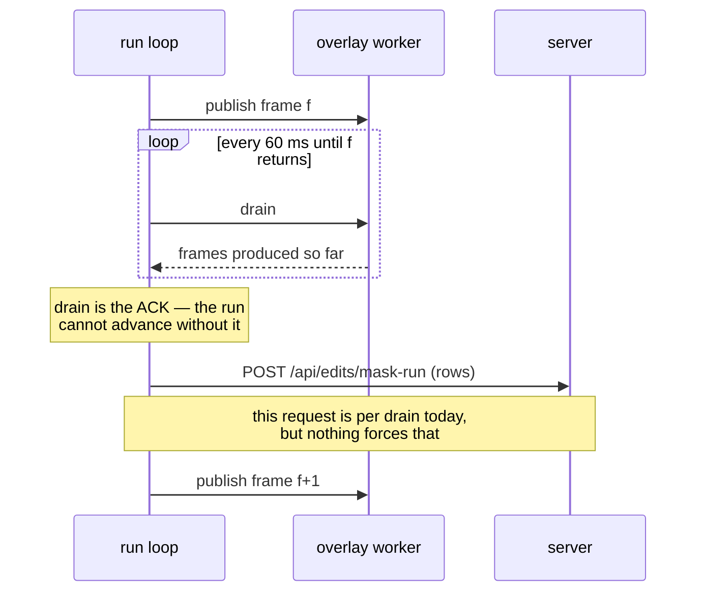

# Saved masks — visualization and editing

**Scope:** creating and editing the `masks.<camera>` column in place. The other way to use SAM3 on a
dataset — **"Process dataset…"**, which bakes treatments into a _new copy_ — is
[data_editing.md](data_editing.md). Format and programmatic CRUD: `datasets/mask_store.py`.
Live overlay worker and its lifecycle: [overlays.md](overlays.md).

> **This document describes the design, not the implementation.** It is what the feature is meant to
> be, and it is the reference the code is measured against — what exists at any moment belongs in the
> pull request that builds it.

> **"Process dataset…" is superseded by this design, not complemented by it.** The whole-dataset
> filler below runs the same settings under the write rule, in place, with no copy — which is what
> "Process dataset…" would be had it been written after the column existed. One whole-dataset button,
> not two. See _Apply to dataset_.

## The model

**Scope is positional, not declared.** No control says which scope it acts on; the scope _is_ the
thing you touched. Three surfaces, one scope each, and nothing appears in two of them:

| surface             | scope         | holds                                                |
| ------------------- | ------------- | ---------------------------------------------------- |
| **Inspector**       | the dataset   | the vocabulary and its treatments                    |
| **timeline tracks** | a frame range | what is stored: coverage, enable/disable, delete     |
| **Overlays panel**  | none          | the live query — prompts and preview, plus **Apply** |

There is deliberately **no saved-label panel**. Stored labels are already drawn on the tracks, and
their treatment is a dataset-wide property, so a third list would only duplicate one of the two.
That also means the segmenter's state is irrelevant to repair: the tracks are drawn from stored rows
whether or not a model is loaded, so deleting a bad detection never loads one.

| you did this                         | it wrote                      | scope                  |
| ------------------------------------ | ----------------------------- | ---------------------- |
| turned the overlay on and scrubbed   | nothing                       | none — preview only    |
| played with **Apply** on             | the frames that went past     | the frames you watched |
| clicked a segment of a label's bar   | that segment's flag, flipped  | segment × label        |
| pressed a segment's **×**            | that label, over that segment | segment × label        |
| pressed **Apply to dataset**         | every gap                     | dataset                |
| changed a treatment in the Inspector | the column's spec             | dataset                |

**Writes only ever add.** Nothing except **×** removes a mask. Masks are expensive to produce and
cheap to delete, so every writing mechanism fills gaps and leaves what is already there alone; if you
do not like what is stored, you delete it and then fill again.

## What a (frame, label) can be

Three states, and the whole design turns on them being distinguishable:

| state        | track     | training         | a write    |
| ------------ | --------- | ---------------- | ---------- |
| **detected** | solid bar | mask applied     | left alone |
| **disabled** | muted bar | mask **ignored** | left alone |
| **absent**   | nothing   | nothing          | filled     |

Disabled exists because _"this detection is wrong here"_ and _"nothing was ever found here"_ would
otherwise be the same thing in storage — and any gap-filling write would put the wrong detection
straight back. Disabling mutes a mask without deleting it: it stops affecting training and stays
protected from being refilled.

Deleting is the opposite: it returns the frame to **absent**, so a later write _will_ fill it. That
is the point of having both.

**A failed detection and an unattempted frame are the same state, and that has a
cost.** _Absent_ means "nothing is stored here", whether the segmenter looked and
found nothing or never looked at all. So every later pass re-searches every frame
where a requested label was not found — for as long as the label stays missing.

Measured on a 274-episode dataset segmented for one object: coverage came out at
94/184 frames on one camera and 65/135 on another, because the object is simply
not visible in every frame. Re-running the fill therefore skipped only 4 of the
first 63 episodes and re-segmented the rest, at full price. The whole-episode
skip below is correct and helps when a label really is on every frame; it does
not help on the common case.

Closing that would need a fourth state — _searched, not found_ — recorded per
(frame, label) so a pass can tell "I already looked" from "nobody has looked".
That is a storage change and is **not implemented**; what is written down here is
why a re-run is expensive, so the next person does not mistake it for a defect.

**Storage.** An entry carries an optional third element, the enabled flag: `[label_id, rle]` is
detected, `[label_id, rle, 0]` is disabled, no entry is absent. Inline rather than a parallel bitset
column, so the flag cannot desync from the mask it describes. `decode_frame` excludes disabled masks
by default, so the compositor honours this without asking, and `mask_store.set_label_enabled` and
`delete_label_range` apply either over a frame range. All of it lands in the format layer (#178);
what remains here is the UI.

## The write rule

One rule, used by **both** writing mechanisms. It decides per **(frame, label)**:

> A write may fill a (frame, label) only when that label is **absent** there. A detected mask and a
> disabled mask are both left alone.

Labels are independent: what happens to `apple` on a frame says nothing about `orange` on the same
frame.

Worked example — a range holds `apple`, `orange`, `bowl`, and you run settings for
`apple`, `banana` over it:

- `banana` is **appended** where it is detected — it was absent;
- `apple` is filled only on frames where it was **absent**; frames that already had it keep what they
  had, even if this run would have found something different;
- `orange` and `bowl` are **untouched** — this run never mentions them;
- any of these that are **disabled** stay disabled and stay out of training.

To replace an existing detection: **delete that label over that range, then fill again.** There is no
overwrite, and that is deliberate — a re-run silently replacing hours of segmentation is the failure
this avoids.

## The Inspector — three scopes, stacked

The Inspector gains a **dataset** panel above the existing **episode** and **selection** ones, so all
three scopes are visible at once and each is labelled. Treatments are its first tenant; it is
designed as a general home for dataset-wide settings rather than for this one case.

A dedicated dataset page, reached by clicking the dataset's name, was rejected: it hides settings
behind a navigation step nobody takes, and it puts dataset scope somewhere other than where episode
and frame scope already live. When the three panels do not fit, dividers, scrolling and collapsible
sections are the answer — the panel is a column of scopes, and columns scroll.

```
┌─ Inspector ─────────────────────────────────┐
│ DATASET                                     │
│  masks · 2 cameras                          │
│    ring         [∅][■][⚄][💧]      [✓] [✗]  │ ← in-place, on edit
│    cylinder     [∅][■][⚄][💧]               │   ■ = the tint swatch:
│    robot arm    [∅][■][⚄][💧]               │   it shows the colour
│    background   [∅][■][⚄][💧]               │   and opens the picker
│    ▸ 10 labels untreated  (NOT IMPLEMENTED) │
│                                             │
│    [ Fill gaps across all episodes… ]       │ ← acts on the dataset,
├─────────────────────────────────────────────┤   because it is in the
│ EPISODE 12 (1,777 frames)                   │   dataset panel
│  …                                          │
├─────────────────────────────────────────────┤
│ SELECTION — frames 412–900                  │
│  …                                          │
└─────────────────────────────────────────────┘
```

The section is headed `masks`, not `masks.<camera>`: the vocabulary and its treatments are shared by
every camera, so a section per column would ask the same question two or three times.

**Presentation: a flat exclusive control, one row per label.** Four things it has to do, of which
**two are built**:

|                                         |                                                                          |
| --------------------------------------- | ------------------------------------------------------------------------ |
| read one label's treatment              | **built.** the common question — "what happens to the ring?"             |
| set one label's treatment               | **built.** the common edit                                               |
| change one treatment across many labels | **NOT IMPLEMENTED.** "blur every arm" → "randomize every arm" is N edits |
| stay readable at 40 labels              | **NOT IMPLEMENTED.** the vocabulary grows and never shrinks              |

The row is a flat set of exclusive buttons, not a dropdown. That is not the middle form this section
originally proposed (rows with a `<select>`, plus multi-select), and the reason is `tint`: it carries
a **colour**, which a `<select>` can neither display nor pick. The tint button _is_ the swatch — it
shows the stored colour and opens the picker — so the control that reads the treatment is the same
control that edits it, at the cost of being wider than a dropdown.

That cost is what leaves the last two unmet, and they are the same problem seen twice: the panel
does not scale past a short vocabulary. Bulk change and the untreated-collapse below are the
remaining work; a multi-select over rows still fits this control, since selecting rows and clicking
one button is the same gesture at N rows that it is at one.

Labels with no treatment should be collapsed behind a count under any of them, since listing them is
listing absence. **NOT IMPLEMENTED.**

**Config edits commit in place.** Editing an item raises a save/cancel next to that item, not on the
timeline's bottom bar. The bottom bar belongs to frame data — a mask run is one grouped pending edit
over many frames — whereas a treatment is one metadata write at a different scope, and routing it
through a bar labelled for the timeline is what made the previous UI ambiguous.

Episode-scoped config commits the same way, in place. The rule is by scope, not by panel: config
commits next to itself, frame data goes to the timeline's bottom bar.

## Preview — no scope

The panel has two states, switched manually: **off**, which shows nothing at all, and a segmenter,
which previews it. Off does not list saved labels — the tracks already draw them and their treatments
live in the Inspector, so a list here would only mirror one of the two.

Turn on a segmenter and name objects. Masks follow the playhead: scrub, change episode, they re-seed
and keep up. Nothing is stored. The panel carries prompts and preview only; it has no treatment
controls, because a treatment is dataset-wide and this surface is not.

```
┌─ Overlays ──────────────────── off │ log ─┐
│ [ sam3_track                          ▾]  │
│  ●  [ yellow ball        ]                │  ← no treatment controls:
│  ●  [ white tray         ]                │    those are dataset-wide,
│  ●  [ blue socket        ]  ← new         │    and live in the Inspector
│  [ + object ]                             │
│                                           │
│  ☐ Apply — write masks while playing      │
└───────────────────────────────────────────┘
```

Two things this panel deliberately does not carry. **Per-object treatment controls**: a treatment is
dataset-wide and this surface is not, so a treatment control here would make one panel act at two
scopes at once. And **a list of saved labels** in the off state: the tracks draw their coverage and
the Inspector holds their treatment, so such a list duplicates both.

**It opens seeded with the stored vocabulary.** Turning the segmenter on pre-fills a row per stored
label, so the default action is "carry on with what this dataset already tracks" rather than "start
from nothing". That is safe to do by default precisely because of the write rule: re-running the
stored labels cannot overwrite what is already there, so seeding is idempotent. You add prompts for
new objects on top.

**A label may be asked for in more than one way.** A prompt is a query; a label is an identity that
rows index by position. Sharpening a query must not disturb the vocabulary, so a row expands to hold
several prompts whose detections all land under its one label — `yellow ball` stays one label, one
track and one treatment, however many ways you had to ask for it. The format keeps the two separate
already, storing prompts against the name rather than as the name.

Preview is **asynchronous**: it infers the frame you land on and skips frames to hold 1× playback, so
it is not a promise about what will be stored. What it tells you is whether the _settings_ are right.

## Apply — the frames you watch

Tick **Apply** and play. Playback becomes **lock-step**: the playhead advances only once the current
frame's masks are computed and queued, and it never drops a frame to keep up. That is the difference
from preview, which skips freely — a run that dropped frames would leave gaps the operator watched go
past and believes are filled. Measured at ~10 fps for two cameras — about **0.3×** at 30 fps, ~3 min for a
1,777-frame episode. The slowness is the feature: it is the preview loop with frame-skipping removed,
so what you watch is what lands.

```
        ┌──────────── playing with Apply on ────────────┐
tracks  │ yellow ball  ████████████░░░░░░░░░░░░░░░░░░░  │
        │ white tray   ██████████████████░░░░░░░░░░░░░  │
        └──────────────▲────────────────────────────────┘
                    playhead — filled to the left, untouched to the right

  [ ⏸ ]  0.3×   frame 412 / 1440        ● 412 frames edited
                                        [ Cancel ]  [ Save ]
```

It follows the write rule, so replaying a stretch with new settings **adds** — it does not repair by
replacement. Repair is delete, then play again.

**Grouping.** A run is **one** pending edit, extended as it goes, not one per frame — a 1,440-frame
episode would otherwise produce 1,440 entries in a queue meant for human-sized changes. Cancel
discards the run whole; Save commits it.

**Flushes per frame today. The per-frame _drain_ is forced; the per-frame _request_ is not.**

Two separate things happen each tick, and this section originally conflated them — as did the first
attempt to correct it:



The **drain** must be per frame: lock-step means the playhead advances only once frame _f_ has come
back, and draining is how the run observes that. Buffering it would need a second acknowledgement
channel or would give up lock-step, which is the property the mode exists for.

The **request** is a separate choice. Rows could accumulate across drains and post once a second —
the original rule — while the drain keeps running per frame. It is not implemented that way, and the
cost of not doing it is bounded rather than absent: the write rule runs client-side first, so a
drain with nothing writable sends **no request at all**, and a re-run over covered ground is silent.
What remains is one request per frame that actually produces a mask, which at ~10 fps is ~10
requests a second against a local server.

**Known limitation, not a settled design.** If that request rate matters, batching the POST while
keeping the drain per frame is the change — no new channel and no loss of lock-step.

Two things it has to get right, and both are easy to get wrong under batching:

- **The boundary.** The last partial batch must be flushed when the run stops — whether it ended,
  was paused, or was cancelled after frames were already computed. A batch dropped at the boundary
  loses work that the playhead has already passed, which is invisible: the track shows the frames as
  absent, exactly as if they had never been segmented.
- **Skipping what is not being overwritten.** A batch carries only the (frame, label) pairs the write
  rule actually fills. Sending frames whose labels were already detected or disabled would make the
  request grow with the episode's existing coverage rather than with what this run produced, and
  would put the write rule's decision on the server for data the client already knows it must not
  touch.

## The tracks — where stored masks are edited

Select a span, then act on one label's bar. The affordances are on the bar itself, so the target is
never ambiguous, and the selection gesture and the edit gesture are in the same place.

**The unit of action is a _segment_:** the part of one label's bar that lies inside the selection
_and_ is a single continuous run of one state. A bar can therefore offer several independent targets
inside one selection, and each is acted on separately.

```
                    ├─────────── selected: frames 412–900 ──────────┤
tracks  yellow ball  ███████████│▒▒▒▒▒▒▒▒▒▒▒│░░░░░│███████████████████
                     └ segment ─┘└ segment ─┘  ▲   └─ outside the selection,
                       detected     disabled   │      not a target
                                               └─ absent: nothing to act on

        white tray   ████████████████[×]███████████████████████████████
                                      ▲ hovering reveals × on the segment
                                        under the cursor, where the cursor is

   █ detected   ▒ disabled   ░ absent
```

**How the three states are drawn**, which is a specification rather than a
detail because the bar is also the control — a state you cannot tell apart is a
control you cannot aim:

| state    | drawn as                             | why                                                                          |
| -------- | ------------------------------------ | ---------------------------------------------------------------------------- |
| detected | **filled** bar in the label's colour | it reaches training                                                          |
| disabled | **hollow** bar — outline, no fill    | stored but withheld; still the label's colour, so the object is identifiable |
| absent   | the faint rail only                  | nothing is stored; the lane exists so an object never found reads as empty   |

Filled versus hollow, **not** a dimmer fill, a texture or a hatch. A lane is a
few pixels tall, and at that size an opacity step or a pattern is not a
difference anyone can see — the first implementation used a hatch at half
opacity and read as identical to detected. The outline keeps its weight
independent of the lane's height.

**Clicking a segment toggles it.** A detected segment becomes disabled; a disabled one becomes
detected. Because a segment is by definition all one state, there is never a mixed selection to
resolve and never a question about which direction a click means — the segment you clicked answers
both. Absent stretches are not segments and take no click: producing a mask needs the model loaded
and a segmentation pass, so nothing here can conjure one.

**Hovering reveals a red × on the segment under the cursor**, positioned where the cursor is rather
than at any fixed place on the row. A row with three segments has three separate ×'s, one per
segment, never one for the whole label. Pressing it deletes that segment: those frames return to
**absent**, so a later write may fill them.

No confirmation dialog. The edit is pending until saved, so discarding is the undo — and a dialog
would ask for certainty that only applying the change can produce.

Disabling is not destructive: the mask stays, drawn muted, protected from every write, and excluded
from training. Deleting returns the frame to absent so a later write may fill it. That is the point
of having both.

### Range edits are frame edits

Every one of these is an edit to frame data, so it joins the same pending queue as an
apply-while-playing run and commits through the timeline's **bottom bar**, not in place. That is the
line: frame data goes to the bottom bar, dataset config commits next to itself in the Inspector.

**Edits merge at their boundaries.** Toggling three adjacent segments must not become three entries,
and a run over 500 frames must not become 500 — the queue is meant for human-sized changes a person
can read back before saving. Adjacent or overlapping edits to the same (label, camera) coalesce into
one span as they are made.

## When a label becomes real

The three surfaces hold three different things, and it matters when a prompt in one becomes a label
in the others.

|                                     |                                                                                                        |
| ----------------------------------- | ------------------------------------------------------------------------------------------------------ |
| a prompt typed in the panel         | nothing is stored; it is a query                                                                       |
| **Apply** ticked                    | still nothing — ticking is not a write                                                                 |
| the run's **first flush** lands     | the label is appended to every mask column, its track appears, and the Inspector lists it as untreated |
| the run is cancelled before a flush | nothing was declared; the vocabulary is untouched                                                      |

**Declared on first write, not on tick.** The vocabulary is positional and can never shrink — a name
can be retired but its slot is permanent — so a label declared when you _tick_ Apply would outlive a
run you immediately cancelled, and there would be no way to take it back. Waiting for the first
flush costs at most a second (see the flush rate) and makes the vocabulary a record of what was
actually segmented.

**One id per name.** Nothing stops two object rows carrying the same text — the panel is free text
with an "+ Add object" button — and a positional vocabulary cannot hold a name twice: measured, the
encoder binds the name to the LAST id, so the earlier slot becomes unreachable by name while any row
already written against it keeps pointing there, and every by-name reader collapses the pair and
reports one.

Two layers, deliberately not one. The **writer** collapses repeats, first occurrence winning, so an
id already in use never moves and a person who typed a name twice is not shown an error for
something harmless. The **format** refuses one outright, because being forgiving about what somebody
typed is a property of the UI path and not of storage: if only the writer guarded it, every future
caller would re-inherit the hole. `feature_spec` raises rather than deduping — it constructs the id
space, and quietly returning a shorter list than it was handed would desync any mapping the caller
derived from the list it passed — while `append_labels` dedupes, since "ensure these labels exist"
is already idempotent for names that are present.

**The declaration is a metadata write, the rows are not.** Appending the label happens as the flush
stages, so the new lane appears and fills while the run is still going; the rows it fills stay
pending until Save. That split is deliberate — a track that only appeared after Save would leave the
operator watching an episode play with nothing to show for it.

The client holds the schema it read when the dataset was opened, so it has to be told: a label a run
created and the client never learned about is invisible for the rest of the session while its masks
are staged, which reads as the run having done nothing at all.

A new label arrives **untreated**. Treatment is a separate, dataset-scoped decision made in the
Inspector; a segmenter has no opinion about what should happen to the pixels it found. So the effect
of a new object on training is nothing until you give it one, which is the safe default — an object
that appears and silently starts altering frames would be a surprise on the training path.

## Apply to dataset — the filler

**Run a segmentation over every episode, writing only where a label is missing.** Same run as
apply-while-playing, minus watching, plus every episode.

It lives in the **Inspector's dataset panel**, so the positional rule holds with no label: you
pressed a button in the dataset panel, so it acts on the dataset.

Two inputs, and only two: **which labels to look for**, and **what to ask the segmenter for each** —
picked in the dialog below. Everything else about the dataset is either untouched or protected.

Per-frame enable/disable is _not_ an input, which answers the obvious question about a label whose
state varies within an episode. There is nothing to choose between: the write rule fills **absent**
and leaves **detected** and **disabled** exactly as they are. A label disabled on frames 100–200,
detected on 300–400 and absent on 500–600 comes out disabled, detected, and filled — in that order.

### The first pass, before there is a column

A dataset carries no `masks.<camera>` column until one is adopted, and that is
the state every dataset starts in. Both writing mechanisms need the column, so
the filler is also the way it comes into being: with nothing stored and an object
named in the panel, the dataset panel offers **Segment across all episodes…**
rather than _Fill gaps_ — there are no gaps yet, there is no column — and the
endpoint's adopt handshake makes the schema change on confirmation.

The label set comes from the panel in that state, because the vocabulary that
would supply the menu does not exist yet, and those labels are ticked: the
operator has just typed them.

Apply-while-playing does **not** adopt. A run against a dataset with no column is
refused, and the refusal stops the run and says so — it cannot store a frame, and
a run that plays on regardless spends minutes of segmentation to write nothing.

### You choose what it runs

**The label set is picked in the dialog, not inherited from the vocabulary.** The vocabulary is the
accumulated union of everything ever segmented anywhere in the dataset, so it answers "what has been
seen", not "what should be looked for everywhere". An episode containing a `blue towel` that appears
nowhere else puts that label in the vocabulary; running it over 274 episodes would spend hours
looking for something that is not there and return false positives where it half-matches.

So the vocabulary supplies the **menu**, not the selection. Each label you tick brings its stored
prompt with it, and the model and resolution default to what the column was last written with.

```
┌─ Fill gaps across 274 episodes ──────────────────┐
│ Segment for:                                     │
│   ☑ ring            "ring"                       │
│   ☑ cylinder        "cylinder"                   │
│   ☑ robot arm       "robotic arm, gripper"       │
│   ☐ blue towel      "blue towel"    seen in 1 ep │
│   ☐ operator hand   "hand"          seen in 3 ep │
│                                                  │
│   model [ sam3_track ▾]   resolution [ 672 ▾]    │
│                                                  │
│ Fills only where a ticked label is ABSENT.       │
│ Detected and disabled masks are left untouched.  │
│ 47,803 frames × 2 cameras · estimated ~8 h.      │
│                      [ Cancel ]  [ Run ]         │
└──────────────────────────────────────────────────┘
```

Showing how many episodes already carry each label is what makes the choice obvious: a label found
in one episode out of 274 is almost certainly local to it, and a label found in most of them is the
one you are trying to complete.

Ticks default to the live panel's objects when a segmenter is on — that is the intent you have just
been previewing — and to nothing when it is off. Never to the whole vocabulary, which is the case
this section exists to prevent.

It differs from apply-while-playing in scope, and in whether you are watching — not in what it is
allowed to do. Both obey the same write rule.

This is the whole-dataset path, and the only one. Baking treatments into a copy of the dataset — one
copy per variant, with no record of what produced it — is exactly what storing a recipe exists to
end, so there is no second whole-dataset mechanism that does that.

## Constraints

What every operation is defined to do at its edges. Written down because most of these are
answerable from the format and the write rule, and an unstated answer is one each implementer
guesses at differently.

### Cameras

Each camera has its own `masks.<camera>` column and its own rows. What it does **not** have is its
own vocabulary: the label list, treatments and background are dataset-level and identical in every
column (below). So cameras differ in what was _detected_, never in what is _declared_.

|                       |                                                                            |
| --------------------- | -------------------------------------------------------------------------- |
| a run writes to       | the **selected cameras only** — the panel defaults to one                  |
| unselected cameras    | untouched. Their gaps are **not** filled; a run is not a dataset-wide pass |
| label ids             | the same in every column, because all are appended to in the same order    |
| a label's declaration | dataset-wide — every mask column declares every label                      |
| a label's coverage    | per camera. Declared everywhere, detected only where a pass looked         |

**Worked example.** Three cameras, each with `["Apple", "Orange"]`. You run the segmenter with the
prompt `Apple`, with only `left_wrist` selected:

- `top` and `right_wrist` — **untouched entirely.** Not re-segmented, and their `Apple` gaps are not
  filled. The run's scope is the cameras you picked, exactly as its frame scope is the frames you
  watched.
- `left_wrist` — `Apple` is written **only where it was absent**; frames that already had it keep
  what they had, whether detected or disabled. `Orange` is untouched, because this run never
  mentioned it.
- No vocabulary changes anywhere: `Apple` was already declared in all three.

Had the prompt been `Banana`, all three columns would **declare** it and only `left_wrist` would get
rows for it. The vocabularies stay identical; the coverage does not.

### One vocabulary for the dataset, mirrored into every column

A label names a physical **object**, and the same object seen from three cameras is one label. So the
vocabulary, the treatments and the background are dataset-level facts, and every operation on them
reaches every mask column:

| operation      | scope                | why                                                                                        |
| -------------- | -------------------- | ------------------------------------------------------------------------------------------ |
| append a label | **all columns**      | a name declared on one camera only can never be renamed or treated by name on the others   |
| rename         | **all columns**      | otherwise one object is `apple` in two views and `fruit` in a third                        |
| retire         | **all columns**      | otherwise it stays live where it was not selected                                          |
| treatment      | **all columns**      | blurring the arm in one view and tinting it in another describes nothing a model can learn |
| write rows     | **selected cameras** | a label is _declared_ everywhere and _detected_ where you looked                           |

Declaring a label on a camera that never saw it costs one string and no rows — absent is the absence
of an entry. In exchange the vocabularies cannot drift, and because every column is appended to in
the same order **a label id means the same thing in all of them**.

The Inspector therefore shows one treatment list for the dataset, keyed by name, annotating a name
only some cameras carry — not a section per camera.

**Why mirrored rather than stored once.** `info.json` has nowhere to put a dataset-level section:
`DatasetInfo` is a closed dataclass whose `from_dict` drops keys it does not declare and whose
`to_dict` never writes them back, so a top-level `mask_vocabulary` would load with a warning and be
deleted by the next metadata write — silently, since every row decodes right up until the labels are
gone. Only `features[…]` is free-form. Hoisting it means adding a field to a core upstream type for
something only mask datasets use, so the invariant is enforced in code instead: `vocabulary_of`
refuses a dataset whose columns disagree, and `unify_vocabulary` repairs one written before this
held.

### Range operations

The unit is a **segment**: the part of one label's bar inside the selection that is a single
continuous run of one state. A selection can contain several segments of the same label, and each is
an independent target.

| you clicked         | on a segment that is | it does                                    |
| ------------------- | -------------------- | ------------------------------------------ |
| the bar             | detected             | disables exactly that segment              |
| the bar             | disabled             | re-enables exactly that segment            |
| the segment's **×** | either               | deletes it — those frames return to absent |
| anywhere            | absent               | nothing; absent is not a segment           |

There is no tri-state and no majority rule, because a segment is all one state by construction. And
nothing can enable a mask that does not exist: producing one needs the model loaded and a
segmentation pass, which a click cannot do.

Each `×` sits on its own segment, under the cursor, so a bar with three segments offers three
independent deletions rather than one control for the whole label.

Every one of these edits is frame data. They join the timeline's pending queue and commit through
its bottom bar, coalescing with adjacent edits to the same (label, camera) so a long stretch of work
does not arrive as hundreds of separate entries.

### Gestures

Established timeline behaviour, unchanged: **click seeks, drag selects a range.** A click therefore
never acts without a selection, which removes the question of what it would mean.

A bar's click must not fall through to the timeline's seek handler. That handler already returns
early for `trim-handle`; a lane bar takes the same path.

### Overlay states

| state       | panel shows                                              | tile shows                                        |
| ----------- | -------------------------------------------------------- | ------------------------------------------------- |
| off         | a description of what the overlay does, and nothing else | the frame as stored — composited from saved masks |
| a segmenter | prompts and preview controls                             | live masks following the playhead                 |

**Off is about the panel, not the picture.** The tile still shows what the dataset actually is, which
is the composite: treatments applied from the stored recipe. Turning the segmenter off stops the
_preview_, not the data. Showing raw frames there would make a masked dataset look unmasked whenever
nothing was being previewed, which is the same class of error as reading a masked dataset as
unmasked on the training path.

Off deliberately shows **no list of saved labels**. With treatment moved to the Inspector and
coverage drawn on the tracks, such a list would be redundant with both.

### Density

One lane per label per camera is the level of detail the operation needs — you cannot judge a per
camera detection without seeing each camera — so there is no reduction to make. It is absorbed by the
divider and scrollbar the timeline already has, and by collapsible groups later.

## Alternatives, and why they are not this

Kept because a rejected approach is the part of a design most likely to be re-proposed.

**Per-frame treatment.** Would turn changing "blur every robot arm" to "randomize every robot arm" —
one dropdown — into a bulk edit needing its own search-and-replace UI and a rewrite of every frame's
row. The one case pulling the other way, an object that is the target early and a distractor later,
is better served by two labels, which costs nothing.

**A recipe as a first-class object**, reusable across datasets. Reuse here is coincidental rather
than a general-purpose use case, and an abstraction needs the latter. Copy/paste on the Inspector
section, with serialization behind it later, is the same convenience at a fraction of the weight.

**A dataset-level `mask_vocabulary` section in `info.json`.** Normalized, and unavailable:
`DatasetInfo` is a closed dataclass whose `from_dict` drops undeclared keys and whose `to_dict` never
writes them back, so the section would be deleted by the next metadata write — silently, since every
row decodes right up until the labels are gone. Mirroring into each column is the same guarantee in
the only region the file format leaves open.

**A saved-label panel beside the live one.** Two lists indexing one vocabulary, which is the same
defect as two Save buttons at different scopes: the operator must know which list acts, and the two
can disagree. The tracks already draw coverage and the Inspector already holds treatment.

**A treatment control on the label row in the Overlays panel.** Appealing, and it lies about scope: a
dataset-wide control on a per-label row inside a frame-scoped panel reads as frame-scoped, which is
what made per-frame treatment feel implied in the first place.

**A dedicated dataset page** behind the dataset's name. Hides settings behind a navigation step
nobody takes, and puts dataset scope somewhere other than where episode and frame scope already live.

**A tri-state toggle over a selection.** Acting on a _segment_ — one continuous run of one state —
means the thing clicked is never mixed, so neither a tri-state nor a majority rule is needed.

**Fewer track lanes.** Judging a per-camera detection requires seeing every camera, so one lane per
label per camera is the detail the task needs. Divider, scroll and collapsible groups absorb it.
