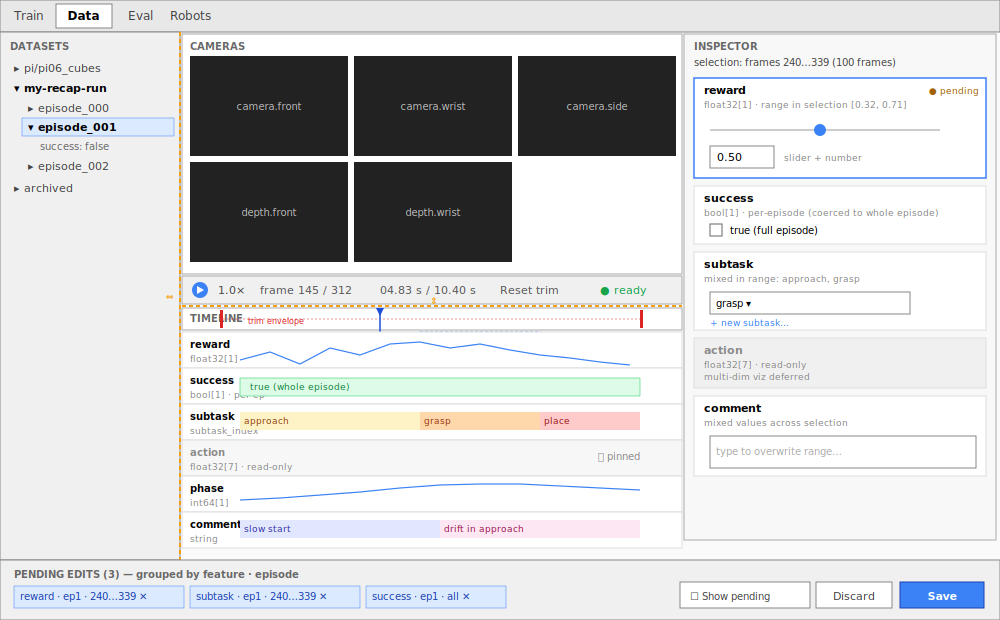

# Feature Editing Design

Per-frame feature view + edit in the Data tab. A schema-driven way to display and edit any per-frame feature (`reward`, `success`, `subtask`, …) without leaving the GUI. V1 is one primitive — drag-select a range, edit values in the Inspector — built so feature-specific tooling (curve editors, segment-brushes) layers on top later.



---

## Context

Motivated by RECAP-style labeling ([π\*0.6](https://www.pi.website/blog/pistar06)): per-frame `reward`, dense per-frame `subtask` language, per-episode `success` — relabeled iteratively. The GUI has no view/edit for these today.

### LeRobot format primer

- **Schema is per-dataset, values are per-frame.** `info.json` declares one `features` dict; every frame in every episode shares it. Adding or removing a feature is a structural change: the data parquet shards (`data/chunk-*/file-*.parquet`) get rewritten with the new column set, and per-feature `stats/<feature>/*` columns in `meta/episodes/*.parquet` are added or dropped. Videos are untouched unless the feature being added/removed is itself `image` or `video`. Per-frame value edits never touch any of this — they overwrite cells in the existing data shards.
- **Adding a feature, properly.** Two paths: declare it in the `features` dict at `LeRobotDataset.create(...)` time, or call [`modify_features(add_features=...)`](https://github.com/TheWisp/lerobot/blob/gui/feature-editing-design/src/lerobot/datasets/dataset_tools.py) on an existing dataset. There's no in-place "just edit `info.json` and append" path — the shards must agree with the schema, and stats need to be computed.
- **`task` is fully first-class.** Auto-deduped at write ([dataset_metadata.py:373](https://github.com/TheWisp/lerobot/blob/gui/feature-editing-design/src/lerobot/datasets/dataset_metadata.py#L373)) — strings in `meta/tasks.parquet`, frames carry `task_index`.
- **`subtask` is officially supported on the read side.** Same dedup pattern (`meta/subtasks.parquet` + per-frame `subtask_index`, decoded by `dataset[i]`); see the [official subtask guide](https://huggingface.co/docs/lerobot/dataset_subtask). What's missing is an `add_frame(subtask=...)` writer; today subtasks are written via the [lerobot-annotate Space](https://huggingface.co/spaces/lerobot/annotate). V1 treats `subtask_index` as a normal per-frame `int64` feature and updates `meta/subtasks.parquet` on Save when new strings appear.
- **Per-frame features are extensible; per-episode features are not.** The per-frame `features` dict can hold any user-defined column. But `meta/episodes/*.parquet` has a hardcoded schema (episode_index, length, tasks list, file pointers, stats) — there's no `episode_features` slot in `info.json`. So per-episode logical fields like `success` live as per-frame `bool[1]` columns broadcast across the episode.

---

## What's preserved from the existing GUI

Unchanged: the global tab bar, the dataset-tree sidebar, the camera grid, the existing `controls-bar` (Play / speed dropdown / frame info / time info / Reset-trim / status), the timeline scrubber + playhead, the trim handles, and the bottom edits-bar (Discard / Save). This design slots **per-feature timeline rows** under the existing scrubber, adds the **right-hand Inspector**, and reshapes the edits-bar from flat chips into a grouped/expandable list with a "Show pending edits" toggle.

---

## Editing model

**Selection is a vertical slice — a frame range, not a feature.** Drag on any row produces `{ episodeIndex, frameFrom, frameTo }`; the band extends through all feature rows. Inspector then shows per-feature edit cards scoped to that range.

**Origin-row focus**: when the user drags on a specific row, the Inspector auto-scrolls that feature's card into view and gives it the focus ring. With ~10–15 cards in the column, this skips the hunt and lets the user start typing immediately.

In V1 the only on-row primitive is **drag to select a range**.

### Selection semantics

- **Half-open** `[from, to)` — matches LeRobot's `dataset_from_index`/`dataset_to_index` (where `to - from == length`). Single-frame = `[N, N+1)`. Empty `[N, N)` = no selection.
- **Independent of playback.** Scrubber tracks playhead; selection is a persistent ROI for editing.
- **No multi-range selection.** Holding shift to select non-contiguous frame ranges (e.g. 120–129 ∪ 200–211) isn't supported in V1.
- **Trim ≠ selection.** Trim adjusts only the outer envelope `[trim_from, trim_to)` (V1 doesn't support internal cuts — that would force episode splits + metadata/hash rewrites). Trim handles live on the time axis; gestures don't conflict.

### Boundary visualization — frame cells, not ticks

Each frame N occupies cell `[N, N+1)` on the timeline. Selection handles sit on cell _boundaries_, not on cells — same as DaVinci Resolve, Premiere, Audacity, Aegisub.

```
│ 119 │ 120 │ 121 │ 122 │ 123 │ 124 │ 125 │ 126 │ 127 │ 128 │ 129 │ 130 │
      ╞═══════════════════════════════════════════════════════════╡
      ↑                                                           ↑
      from = 120                                                  to = 130
```

Coverage = cells `from`..`to-1`, exactly `to - from` cells. Human label: "frames N…M (K frames)" with M = `to-1`. Click snaps to cell boundaries; drag uses `from = min(a,b)`, `to = max(a,b) + 1`.

All user-facing copy (chip text, confirmation dialogs, hover tooltips, history JSON labels) uses the inclusive form via a single shared formatting helper. Internal storage and APIs use the exclusive form. Pinned to one helper to prevent drift.

### Per-episode broadcast features

Some logical per-episode fields (`success` being the canonical example) live as per-frame `bool[1]` columns broadcast across the entire episode, because `meta/episodes/*.parquet` has no `episode_features` slot (see format primer). Editing a sub-range would silently break the broadcast invariant and leave half the episode disagreeing with the other half.

V1 detects these features by a `per_episode: true` hint — declared either at feature-creation time or inferred when every frame in an episode currently shares one value — and **coerces edits to the whole episode**. When the user drag-selects `[120, 130)` on a `per_episode` row, the Inspector card shows the range as `[0, episode_length)` with a small note ("`success` is per-episode — edit applies to the full episode"). The selection band on the row visually expands to fill the episode while the card is focused.

Inference fallback: if no hint is declared, treat any feature where `nunique(values_in_episode) == 1` for every episode in the dataset as per-episode for editing purposes. Cheap to compute from existing stats. A `display_hint`-style declaration in `info.json` is the proper fix and is already a follow-up.

### Overlapping staged edits

Two staged edits on the same `(feature, episode_index)` with overlapping frame ranges trigger a confirmation modal at stage time:

> **Overlapping edit**
> You already have a staged edit on `reward` covering frames 100…149. The new edit covers frames 120…180. Accepting will replace values in the overlap (120…149) with the new edit's value.
>
> [ Cancel ] &nbsp; [ Accept ]

Cancel discards the new edit. Accept resolves last-write-wins: the new edit is staged, and the older edit's range is **clipped** to the non-overlapping portion (here: 100…119). If the older edit is fully contained in the new one, it's removed entirely. Both edits remain visible as separate chips in the edits bar after clipping; the user can still discard either independently.

Resolution happens at stage time, not Save time, so the edits bar always shows a non-overlapping picture of what will be written. The Save pipeline can therefore assume no overlapping edits per `(feature, episode_index)` as an invariant.

---

## V1 edit affordances per type

| Feature                                           | Row display                               | Inspector widget                                                                                                                                                                                                                                                                                            |
| ------------------------------------------------- | ----------------------------------------- | ----------------------------------------------------------------------------------------------------------------------------------------------------------------------------------------------------------------------------------------------------------------------------------------------------------- |
| `bool[1]`                                         | on/off band                               | **checkbox** (project convention — not toggle); indeterminate state when range has mixed values                                                                                                                                                                                                             |
| per-episode `bool[1]` (e.g. `success`)            | on/off band, full-episode                 | checkbox; edit coerced to full episode with note                                                                                                                                                                                                                                                            |
| numeric scalar (e.g. `float32[1]`, `int64[1]`)    | line                                      | **slider + number input** (slider range from per-feature stats min/max; number input wins for out-of-range; free-form input only when stats absent or degenerate)                                                                                                                                           |
| `string`                                          | colored stripe + text labels              | single-line input or textarea; uniform value across the selected range                                                                                                                                                                                                                                      |
| `subtask_index` (with `meta/subtasks.parquet`)    | colored stripe (decoded `subtask` string) | dropdown over existing subtask strings + "+ new subtask…" — staged edit stores the **string**, not an index. On Save: dedup against `meta/subtasks.parquet`, append any new strings, assign indices, then write `subtask_index` cells. Two concurrent Saves adding the same new string converge to one row. |
| numeric vector, small (e.g. `float32[N]`, N ≤ ~8) | mini multi-line                           | row of N inputs                                                                                                                                                                                                                                                                                             |
| numeric vector, large (e.g. `float32[N]`, N > ~8) | line plot                                 | "Edit as JSON…" textarea                                                                                                                                                                                                                                                                                    |
| `action`, `observation.*` (any dtype)             | hidden by default in V1; pin to show      | **read-only** — recorded data, multi-dim viz design deferred (see Follow-ups)                                                                                                                                                                                                                               |
| `image`, `video`, 2D+                             | not on timeline                           | **read-only**                                                                                                                                                                                                                                                                                               |
| `DEFAULT_FEATURES`                                | hidden by default                         | **read-only always**                                                                                                                                                                                                                                                                                        |

---

## Inspector behavior

Schema-driven by `(dtype, shape)`. Always visible when a dataset is open.

- **Empty state** (no selection): compact dataset summary.
- **In-selection state**: scrollable feature-card column scoped to `[from, to)`. Origin-row card auto-focused. Per card: name + dtype, summary of values in the range (min/max for scalars, unique values for strings, "uniform/mixed" for bools), edit widget or read-only badge.
- **Edits stage automatically** as the user changes a card. No per-card Apply. Text inputs stage on blur (or 300 ms debounce); checkboxes/sliders/dropdowns stage on commit. The card shows `● pending`; a chip appears in the edits bar; bottom **Save** is the single confirmation, **Discard** drops everything.

### Schema discoverability

Schema is read-only and surfaces in two always-on places once a dataset is open:

- **Inline on each timeline row** — name + dtype label at the row's left edge gives an at-a-glance overview.
- **Inspector cards on selection** — full per-feature detail (dtype, shape, range stats, edit widget).

There's no separate schema modal. The dataset row in the sidebar is not itself a selectable / inspectable target today, so a "right-click → Info…" gesture would target a thing with no other selection semantics. If "peek schema before opening" ever becomes a real need (e.g. browsing 50 datasets in a folder), the right answer is search/filter, not a schema viewer.

---

## Edit application pipeline

Staging extends `PendingEdit` ([state.py](https://github.com/TheWisp/lerobot/blob/gui/feature-editing-design/src/lerobot/gui/state.py)) with `edit_type: "feature_set"`, params `{ feature, episode_index, frame_from, frame_to, value }`. Persists to `.lerobot_gui_edits.json`. Discard / Save / per-chip removal work for free.

**Apply strategy: in-place parquet rewrite.** Considered alternatives — `modify_features` re-encode (correct but re-encodes videos on every Save, unusable for the iterative RECAP-style workflow that motivates this design) and sidecar JSON overlay (cheap and reversible but invisible to training, so a non-starter as the only mechanism). In-place rewrite of affected `data/chunk-*/file-*.parquet` is the only option that's both fast and visible to downstream training. Doesn't touch videos or `info.json`. Strategy is local to `_apply_feature_set_edits()` in [edits.py](https://github.com/TheWisp/lerobot/blob/gui/feature-editing-design/src/lerobot/gui/api/edits.py); staging + UI remain strategy-agnostic in case it ever needs to change.

### Save sequence

A Save may touch multiple parquet shards (different chunks, possibly different episodes) and `meta/subtasks.parquet`. The sequence:

1. **Resolve string-keyed feature edits to indices.** For `subtask_index` (and any future string-deduped feature), look up each staged string in `meta/subtasks.parquet`; append new strings and assign indices; rewrite the affected rows of `meta/subtasks.parquet`. Staged edits in-memory now reference resolved `int64` indices for the subsequent shard rewrite.
2. **Group remaining staged edits by target shard.** For each shard, compute the row updates locally. Staging guarantees no overlapping edits per `(feature, episode_index)`, so this is straightforward.
3. **Write pre-edit snapshot.** Before any rewrite, capture the current values of every cell about to be overwritten — plus prior `meta/subtasks.parquet` contents where mutated — into `.lerobot_gui_edits_history/<timestamp>.json`. Same shape as the staging file, inverted. This is the revert-last-Save trapdoor; per-Save cost is one small JSON file.
4. **Write all new shards to `.tmp` siblings.** Do all the expensive work — parquet rewriting — before any rename. A crash here leaves only orphan `.tmp` files, which a startup sweep cleans up.
5. **Rename each `.tmp` over its target in sequence.** Per-file atomic via POSIX rename. Cross-file is _not_ atomic — a crash mid-rename can leave a partially-applied Save — but the window is the duration of N renames, and all I/O before that point has already succeeded.
6. **Recompute stats scoped to the edit.** Only the edited feature(s), only the touched episodes — `meta/episodes/<...>.parquet` rows for those `episode_index` values, `stats/<feature>/*` columns for those features. Not the whole dataset, not all features. [compute_stats.py](https://github.com/TheWisp/lerobot/blob/gui/feature-editing-design/src/lerobot/datasets/compute_stats.py) supports scoped recomputation.
7. **Call `dataset.finalize()`** as required by the [v3 docs](https://huggingface.co/docs/lerobot/lerobot-dataset-v3#always-call-finalize-before-pushing). For a values-only edit this should be effectively a no-op; verify during implementation that finalize() doesn't trigger work scoped to schema changes (video re-encode, `info.json` rewrite).

Stronger cross-file atomicity is out of scope for V1 — a manifest-based "save in progress" marker with resume-on-open is a follow-up if the partial-Save window proves to be a real problem in practice.

### Concurrency assumption

V1 assumes no concurrent reader of the dataset during Save. On Linux, renaming a parquet file out from under an mmap'd reader is benign; on Windows it fails outright; in either case a training job mid-Save sees torn state across shards. Surfaced in the Save confirmation dialog and in user docs: **pause training jobs before Saving feature edits.**

### Revert last Save

Each Save writes `.lerobot_gui_edits_history/<timestamp>.json` containing the pre-edit values for every cell it overwrote, plus any mutated `meta/subtasks.parquet` rows. A "Revert last Save" action replays this file as a fresh staged edit, which the user then Saves to commit the revert through the same pipeline. Single-step undo across Saves without building a real history system. Files in `.lerobot_gui_edits_history/` accumulate over time; surface a "clear history" affordance and document the directory location so users can prune or back up.

### Safety rails

- Validate every staged edit against schema (dtype + shape) via [`validate_feature_dtype_and_shape`](https://github.com/TheWisp/lerobot/blob/gui/feature-editing-design/src/lerobot/datasets/feature_utils.py).
- Block edits on read-only features (`DEFAULT_FEATURES`, `action`, `observation.*`, image/video).
- Confirmation dialog if a single Save touches > 10 000 frames. (With Revert-last-Save available, this threshold is informational rather than scary; tune upward if it fires too often in practice.)
- **No edit-edit dependencies in V1.** All editable V1 features are independent primitives. When derived features arrive (e.g. RECAP `reward = f(success, step_count)`), they'll be read-only with a "Recompute from inputs" button — dependencies declared at the feature-definition level, never between staged edits.

---

## Default visibility & scrolling

Heuristic without a format change:

- **Hidden by default**: `image`/`video`, `DEFAULT_FEATURES`, `task_index` (replaced by `task` string), and `action` / `observation.*` (multi-dim numeric vectors — read-only in V1, viz design deferred).
- **Visible by default**: everything else — `reward`, `success`, `subtask`, scalar custom features, short-string custom features.
- **Pin / hide** any feature individually; preference persisted in localStorage.

A `display_hint` in `info.json` for finer control is a follow-up.

---

## V1 design decisions

| Concern                        | Decision                                                                                        | Reason                                                                               |
| ------------------------------ | ----------------------------------------------------------------------------------------------- | ------------------------------------------------------------------------------------ |
| Selection model                | Vertical slice through all rows                                                                 | Frames are tuples; one mental model; faster multi-feature labeling                   |
| Per-episode broadcast features | Edits coerced to whole episode                                                                  | Sub-range edit silently breaks the broadcast invariant                               |
| Trim semantics                 | Outer-bounds-only; handles on time axis                                                         | Internal cuts force episode splits + metadata rewrites (out of scope)                |
| Camera / playback              | Selection independent of playback                                                               | Don't conflate "where I'm looking" with "what I'm editing"                           |
| Apply strategy                 | In-place parquet rewrite                                                                        | Only option that is both fast and visible to training                                |
| Cross-file atomicity           | Per-file atomic only; all `.tmp` writes precede any rename                                      | Stronger guarantees need a manifest-based protocol; window is small in practice      |
| Subtask index assignment       | Resolved at Save, not stage                                                                     | Avoids cross-session index collisions; concurrent new-string Saves converge          |
| Overlapping edits              | Warn + accept = last-write-wins with clipping of prior edit                                     | Explicit user choice; edits bar always reflects what will be written                 |
| Undo across Saves              | Pre-edit snapshot JSON → "Revert last Save" replay                                              | Single-step undo without a real history system                                       |
| Boundary semantics             | Half-open `[from, to)`, cells (not ticks)                                                       | Matches LeRobot's `dataset_from_index`/`dataset_to_index` and every pro video editor |
| Edit application               | Direct staging on card change/blur; bottom Save commits                                         | Matches Figma/Photoshop; bottom Save is the single confirmation                      |
| Layout customization           | Two mouse-draggable resize boundaries (vertical, horizontal); positions persist in localStorage | Reuses existing `sidebar-resize-handle` pattern; everything else deferred            |

---

## Implementation phases

### Phase A — Read-only foundation

- **A1.** Schema in `DatasetInfo`. Backend: extend `DatasetInfo` ([api/datasets.py](https://github.com/TheWisp/lerobot/blob/gui/feature-editing-design/src/lerobot/gui/api/datasets.py)) so the existing dataset-open response includes the full features dict (dtype, shape, names) — currently only feature names are returned. No new endpoint, no modal.
- **A2.** Per-frame feature values. Backend: `GET /api/datasets/{id}/episodes/{ep}/frames/{frame}/features` (skip `image`/`video`); optionally piggyback on the playback WS `seek` ([playback.py](https://github.com/TheWisp/lerobot/blob/gui/feature-editing-design/src/lerobot/gui/api/playback.py)). Frontend: schema-driven renderer registry by `(dtype, ndim)`.
- **A3.** Episode feature-series + timeline rows. Backend: `GET /api/datasets/{id}/episodes/{ep}/feature-series?features=…` → `{name: [...], ...}`; cache. Client requests visible/pinned features only, never `*`. Frontend: stacked rows; trim envelope tinted through all rows; outside-trim dimmed; pin/unpin per row.

### Phase B — Editing

- **B1.** Vertical-slice selection. Drag on any row → `{ episodeIndex, frameFrom, frameTo }`; vertical band; origin row remembered; Esc clears.
- **B2.** Inspector in-selection state. Scrollable card column; widgets per type; auto-staging with `● pending` indicator. Per-episode broadcast features coerce range to full episode.
- **B3.** Stage `feature_set` edits. Extend `PendingEdit` ([state.py](https://github.com/TheWisp/lerobot/blob/gui/feature-editing-design/src/lerobot/gui/state.py)). New `POST /api/edits/feature-set`; existing `DELETE /api/edits/{idx}` works. Group-by-`(feature, episode)` rendering.
- **B4.** Overlapping-edit detection + warning modal at stage time; clip-or-remove prior edit on accept.
- **B5.** "Show pending edits" toggle on the timeline.
- **B6.** Validation + safety rails (schema check, read-only block, > 10k-frame confirmation).
- **B7.** Apply pipeline — `_apply_feature_set_edits()` in [edits.py](https://github.com/TheWisp/lerobot/blob/gui/feature-editing-design/src/lerobot/gui/api/edits.py) implementing the full Save sequence: subtask index resolution → grouped shard rewrites → pre-edit snapshot to `.lerobot_gui_edits_history/` → tmp-write → rename → scoped stats recompute → `dataset.finalize()`. Startup sweep cleans orphan `.tmp` files.
- **B8.** Revert last Save. Reads most recent `.lerobot_gui_edits_history/<timestamp>.json`, replays as a fresh staged edit set; user reviews and Saves through the normal pipeline.

### Phase C — Layout

- **C1.** Two mouse-draggable resize boundaries (vertical + horizontal). Reuse `sidebar-resize-handle`. Persist in localStorage.

---

## V1 scope

**In:** schema in row labels + Inspector cards · always-visible Inspector · 1D feature rows with scroll + pin/unpin · trim handles on time axis with envelope through all rows · vertical-slice selection · per-episode broadcast feature detection with whole-episode coercion · auto-staging Inspector cards · range value edits for `bool` / numeric scalar / numeric vector / strings · `subtask_index` dropdown with strings staged and indices resolved at Save · overlapping-edit warning with last-write-wins clipping · grouped expandable edits bar · "Show pending edits" toggle · two resize handles · in-place parquet rewrite Save pipeline with pre-edit snapshot and Revert-last-Save · `action` / `observation.*` / image / video / `DEFAULT_FEATURES` are read-only.

**Out (Follow-ups):** in-place segment manipulation · row context menus · multi-range selection · loop-on-selection · full undo/redo across Saves (V1 has single-step revert only) · schema mutations (add/remove/rename) · derived/computed features · curve editor · **multi-dim numeric vector visualization** (`action`, `observation.*`) — design between stacked-rows / overlaid-curves / collapsed-expandable, deferred · URDF / 3D trajectory views · stats viewer (P1/P2) · first-class per-episode features (format extension) · `add_frame(subtask=...)` writer · `display_hint` in `info.json` · episode-list shortcuts (success column, inline `task` edit) · cross-file atomic Save (manifest + resume-on-open) · keyboard-only frame-range entry (alternative to drag-select).

---

## Critical files

**Backend** ([api/datasets.py](https://github.com/TheWisp/lerobot/blob/gui/feature-editing-design/src/lerobot/gui/api/datasets.py), [api/playback.py](https://github.com/TheWisp/lerobot/blob/gui/feature-editing-design/src/lerobot/gui/api/playback.py), [api/edits.py](https://github.com/TheWisp/lerobot/blob/gui/feature-editing-design/src/lerobot/gui/api/edits.py), [state.py](https://github.com/TheWisp/lerobot/blob/gui/feature-editing-design/src/lerobot/gui/state.py), [api/models.py](https://github.com/TheWisp/lerobot/blob/gui/feature-editing-design/src/lerobot/gui/api/models.py)) — new endpoints + extended `PendingEdit` + `_apply_feature_set_edits()` implementing the full Save sequence + startup sweep for orphan `.tmp` files + Revert-last-Save replay.

**New on-disk artifacts**:

- `.lerobot_gui_edits.json` — staged-edits persistence (existing, extended schema).
- `.lerobot_gui_edits_history/<timestamp>.json` — pre-edit snapshots for Revert-last-Save.

**Frontend** ([static/index.html](https://github.com/TheWisp/lerobot/blob/gui/feature-editing-design/src/lerobot/gui/static/index.html), [static/app.js](https://github.com/TheWisp/lerobot/blob/gui/feature-editing-design/src/lerobot/gui/static/app.js), [static/style.css](https://github.com/TheWisp/lerobot/blob/gui/feature-editing-design/src/lerobot/gui/static/style.css)) — Inspector, feature rows, selection, overlapping-edit modal, resize handles, range-format helper used by every chip/dialog/tooltip.

**Reused helpers**: [feature_utils.py](https://github.com/TheWisp/lerobot/blob/gui/feature-editing-design/src/lerobot/datasets/feature_utils.py) `validate_feature_dtype_and_shape`; [compute_stats.py](https://github.com/TheWisp/lerobot/blob/gui/feature-editing-design/src/lerobot/datasets/compute_stats.py) for scoped stats recomputation on Save.

**Tests**: extend [tests/gui/test_state.py](https://github.com/TheWisp/lerobot/blob/gui/feature-editing-design/src/tests/gui/test_state.py); new `tests/gui/test_feature_endpoints.py`, `tests/gui/test_feature_edits.py`, `tests/gui/test_overlapping_edits.py`, `tests/gui/test_revert_last_save.py`.

---

## Verification

`uv run pytest tests/gui -svv` after each phase. Schema validation rejects type-mismatched edits. Range semantics: staging `[120, 130)` writes 10 frames; UI shows "frames 120…129". Overlapping-edit modal fires and clips correctly. Per-episode broadcast features coerce to full episode. Revert-last-Save restores prior cell values.

Manual: open a dataset with `reward` → drag-select on a row → edit cards (slider, text, checkbox) → confirm chips appear and timeline preview toggles correctly → Save → reload → values persist → Revert last Save → reload → original values restored.
