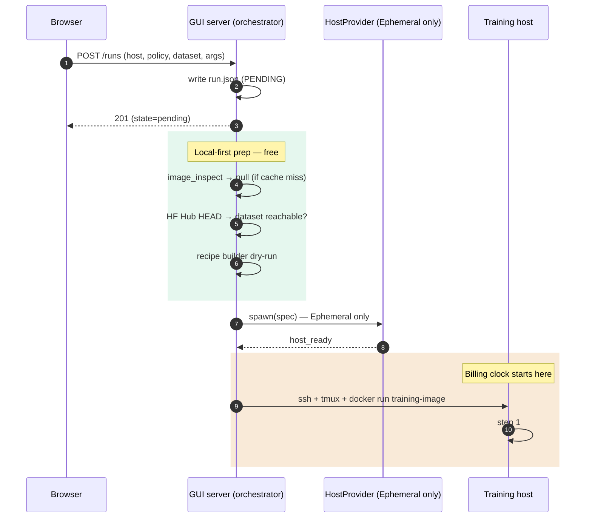
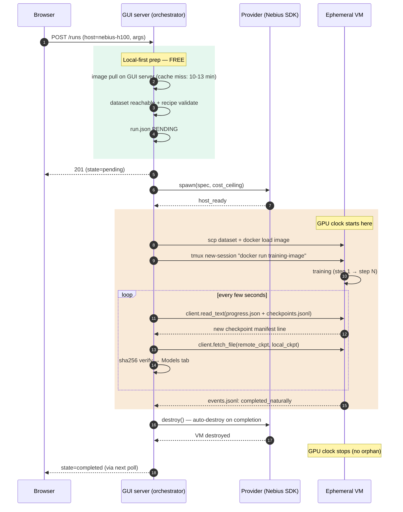
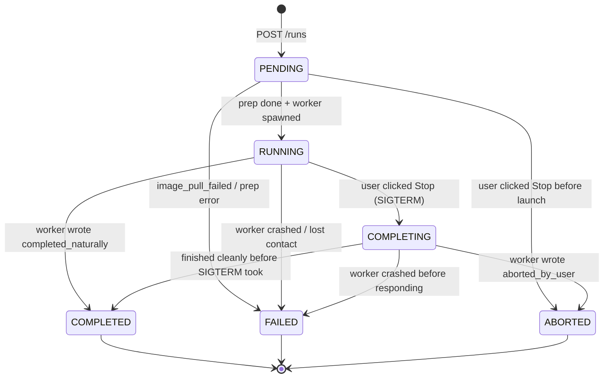

# Model training — architecture

End-to-end design for taking a user from "I want to train a policy" to "trained model in the Models tab", driven from the LeRobot GUI. Scope: one architecture that works identically on a workstation GPU, a user-added SSH-reachable host, and an ephemeral cloud VM.

---

## Modes

| Mode                                         | Who it's for                                                                                                                                        | Lifecycle                                                                       |
| -------------------------------------------- | --------------------------------------------------------------------------------------------------------------------------------------------------- | ------------------------------------------------------------------------------- |
| **Workstation** (auto-registered Persistent) | Developer with a GPU on the same machine that runs the GUI server.                                                                                  | User-managed. GUI auto-detects on first start; registered as "This server".     |
| **User-added Persistent host**               | Developer with a remote SSH-reachable box — lab server, university cluster, leased VM. They paste an SSH command into the GUI dialog.               | User-managed — the GUI never creates or destroys the VM.                        |
| **Ephemeral cloud host**                     | Developer who wants on-demand cloud GPUs without touching the vendor console. Configures a host profile with GPU class, region hint, and spend cap. | Provider-managed — GUI spawns the VM on training start, destroys on completion. |

"Persistent" vs "Ephemeral" is about lifecycle ownership, orthogonal to spot/preemptible pricing. Trained models land in the existing **Models tab** in all three modes, from which the user publishes to HF Hub (today) or other destinations (later).

The three modes share the same shape — what swaps is _where_ the training host runs and _how_ the GUI server talks to it:

```
                              ┌──────────────────────┐
                              │ External: HF Hub …   │ ← push from GUI server only
                              └──────────▲───────────┘
                                         │ HTTPS (GUI-server's HF auth)
                                         │
   ┌──────────┐   HTTP   ┌────────────────┴───────────────┐
   │ Browser  ├─────────►│   GUI server (orchestrator)    │
   └──────────┘          │  · run registry                │
                         │  · model storage               │
                         │  · per-request vendor token    │
                         └──┬─────────────────┬───────────┘
                            │                 │
        Workstation ───────►│                 │◄──── User-added SSH  /  Ephemeral
        (SubprocessClient)  │                 │      (SshClient: ssh + tmux + scp)
                            ▼                 ▼
                       ┌──────────┐      ┌──────────────────────┐
                       │ Local    │      │ Remote host          │
                       │ docker   │      │ (user-managed or     │
                       │ daemon   │      │  vendor-spawned VM)  │
                       └────┬─────┘      └────────┬─────────────┘
                            │                     │
                            ▼                     ▼
                         docker run training-image (same image, every mode)
```

The orchestrator-on-GUI-server is the constant. The host moves; the transport adapts.

---

## Architecture

### Unified execution: training always runs in the image

Every real training run is `docker run … ghcr.io/thewisp/lerobot-training:<tag> <entrypoint> …`, on every host mode. The host Python that drives the GUI is _not_ the Python that runs the trainer. Same code path on workstation, lab box, and Nebius pod; the only thing the transport layer swaps is where the `docker` command executes.

This is the forcing function: "works on my workstation" cannot silently diverge from "works on Nebius" because they're running the same image bit-for-bit. Optimisations that skip bytes-on-the-wire (mount the HF dataset cache instead of staging files; mount the checkpoint dir instead of SCPing back) are fine — but the runtime environment is identical to a remote pod.

### Local-first preparation: do everything that doesn't need the GPU before opening a pod

The billing clock starts when the provider returns "VM ready." Anything the orchestrator can do on the GUI server's box first is free. Concrete prep, in order, before the orchestrator calls `provider.spawn(...)`:

1. **Image readiness.** Pull / build the training image on the GUI server's box. Cache hit: no-op. Cache miss: pay the 10–13 min `docker pull` on a non-billable machine. Transfer to the VM happens via `docker save | ssh … docker load`, a regional registry mirror, or a pre-baked VM template — _after_ the workstation pull, never in parallel with idle GPU time on the pod.
2. **Dataset reachability.** HEAD-request the HF Hub repo so a typo doesn't surface inside the pod after 20 minutes of provisioning.
3. **Recipe validation.** Dry-run the recipe builder: would `lerobot-train` accept this argv? Catch unknown flags + missing required fields locally — not after the VM has been billing for a minute.
4. **Run artefacts staged.** Allocate `run_id`, create the run dir, write `run.json` as PENDING. The GUI shows the row immediately; prep failures land as FAILED without ever touching a billable host.

Workstation hosts see this as better UX (no blind window). Ephemeral hosts see it as money — the difference between "GPU idle for 10 minutes during pull" and "GPU starts training within seconds of becoming reachable."

Click-Start-to-step-1, with the billing-clock boundary made explicit:



### Components

```
  Browser
    │ HTTP/WS
    ▼
  GUI server  ──HTTPS──►  External destinations (HF Hub, …)
    │ SSH or subprocess
    ▼
  Training host
```

- **Browser** — holds short-lived tokens in localStorage (paste in v1; helper-minted in v2) and forwards them per-request.
- **GUI server** — orchestrates training and owns model storage. Auto-detects a local GPU at startup, holds host profiles + run state + the canonical checkpoint store. Never holds long-lived credentials.
- **Training host** — where the container runs. Writes checkpoints to local disk; never talks to external destinations.
- **External destinations** — HF Hub today; S3/GCS/NAS later. Pushed from the GUI server only, never from the training host.

### Host setup UX

Three flows for the three modes. Workstation auto-registers (no UI needed beyond a status line). Both other modes are reached from the same `+ Add host` button.

**Workstation.** First GUI launch: detect a local GPU (`nvidia-smi`), register `this-server` with `SubprocessTransport`. The Training section in the sidebar shows:

```
TRAINING                                   [ + ]
─────────────────────────────────────────
This server — NVIDIA GeForce RTX 5090 · 31.8 GB
```

**Add an SSH host.** Click `+` → pick "User-added SSH host" → paste the SSH command. The dialog probes the host on click of `Test` before saving — catches missing docker / wrong user / no nvidia-container-toolkit before the user discovers it mid-run.

```
┌─ Add a training host ────────────────────────────────────────────┐
│                                                                  │
│  ◉ User-added SSH host                                           │
│  ○ Ephemeral cloud                                               │
│                                                                  │
│  ── Connection ──                                                │
│  SSH command  [ ssh -i ~/.ssh/lab user@lab-gpu1.example.com   ]  │
│  Display name [ Lab GPU 1                                     ]  │
│                                                                  │
│  ── Probe (runs when you click Test) ──                          │
│  ✓ ssh handshake reachable                                       │
│  ✓ docker installed, user in docker group                        │
│  ✓ nvidia-container-toolkit present                              │
│  ✓ GPU(s) visible: NVIDIA A100 80GB                              │
│                                                                  │
│              [ Test ]    [ Cancel ]    [ Save ]                  │
└──────────────────────────────────────────────────────────────────┘
```

Saved hosts are persisted to `~/.config/lerobot/training_hosts.json` (alongside the existing robot / teleop profiles) and appear in the Host dropdown of the Start-a-run form. No image transfer happens at this step — that's deferred to the first run on the host.

**Add an Ephemeral cloud host.** Same `+ Add host` button → pick "Ephemeral cloud" → provider + spawn spec + cost ceiling. No image transfer, no spawn yet — this is just saving a _profile_; the VM is created when the user starts a run targeting this host.

```
┌─ Add a training host ────────────────────────────────────────────┐
│                                                                  │
│  ○ User-added SSH host                                           │
│  ◉ Ephemeral cloud                                               │
│                                                                  │
│  Provider     [ Nebius ▾ ]                                       │
│   ⚠ The GUI server needs the vendor extra installed:             │
│      uv sync --extra nebius                                      │
│   ⓘ Vendor IAM token: paste in Settings (refresh every ~12h)     │
│                                                                  │
│  ── Spawn spec ──                                                │
│  GPU class    [ H100 80GB ▾ ]      GPU count [ 1 ]               │
│  Region hint  [ eu-north1 ▾ ]      Preemptible ☑                 │
│  Boot disk    [ 100 ] GiB           (warns above 256 GiB)        │
│                                                                  │
│  ── Cost guard ──                                                │
│  Cost ceiling [ $5.00 ] / hour   (spawn refuses above this)      │
│                                                                  │
│  Display name [ Nebius H100 (eu-north)                        ]  │
│  Pricing reference: <link to vendor's price page>                │
│                                                                  │
│                  [ Cancel ]              [ Save ]                │
└──────────────────────────────────────────────────────────────────┘
```

The full Ephemeral run lifecycle, with billing-clock annotations:



The green band is free; the orange band is paid. Local-first prep keeps the paid band as short as possible — the only thing happening on the billed VM is what genuinely needs the GPU.

### Run model: a flat history, not a recipes-as-templates layer

A **run** is one execution: pick policy + dataset + hyperparameters + host, click Start, an immutable record is created. There is no separate "saved recipe" entity. To re-run with the same settings, the user clones an existing run into a pre-filled form (right-click → "Run with same config"), edits any field, and submits — a new run with its own id is created. Each run's detail view shows the exact args dict that was submitted, so read-then-clone is one glance.

This keeps the data model small (one entity), keeps the UX direct (no "create a recipe, then create a run from it" indirection), and makes housekeeping obvious (delete a run from history; the trained model in the Models tab is unaffected unless the user separately deletes that).

The start form — same shape for every host mode, dropdowns swap by host:

```
┌─ Model tab ──────────────────────────────────────────────────────────┐
│  ┌─ SOURCES ──── + ─┐   ┌─ Start a training run ──────────────────┐  │
│  │ ▾ lerobot/runs/  │   │  Host      [ This server ▾ ]            │  │
│  │   ⊢ act-pusht    │   │            (or Lab GPU 1, Nebius H100…) │  │
│  │   ⊢ diff-pusht   │   │                                         │  │
│  │ ▸ outputs/…      │   │  Dataset   [ lerobot/pusht ▾ ]          │  │
│  └──────────────────┘   │                                         │  │
│                         │  Policy    [ ACT (Action Chunking) ▾ ]  │  │
│  ┌─ TRAINING ─── + ─┐   │            (auto-discovered from        │  │
│  │ This server —    │   │             PreTrainedConfig)           │  │
│  │  RTX 5090 31.8 GB│   │                                         │  │
│  │                  │   │  ── Policy hyperparameters ──           │  │
│  │ ▸ act-pusht      │   │   chunk_size [100]  n_action_steps [100]│  │
│  │   completed      │   │   use_vae ☑                             │  │
│  │ ▸ hvla-cra       │   │   (every scalar field auto-rendered)    │  │
│  │   completed      │   │                                         │  │
│  │ ▸ diff-pusht     │   │  ── Training ──                         │  │
│  │   failed         │   │   steps [1000] batch_size [8]           │  │
│  │ ▸ (right-click → │   │   save_freq [500]                       │  │
│  │   Run with same  │   │                                         │  │
│  │   config)        │   │  Run label [ optional — auto if blank ] │  │
│  └──────────────────┘   │                  [ Start training ]     │  │
│                         └─────────────────────────────────────────┘  │
└──────────────────────────────────────────────────────────────────────┘
```

Run state machine — the same five states regardless of host mode:



Transitions are gated server-side (you cannot go `RUNNING → PENDING`), so a stale duplicate request cannot re-run a finished run. The orchestrator's image-prep daemon thread (see Threading) drives `PENDING → RUNNING`; everything else is event-driven from the worker.

### HostProvider — vendor adapter for VM lifecycle

One implementation per vendor. Surface:

- **spawn** — provision a VM matching the spec, attach disk, allocate public IP, wait until reachable.
- **destroy** — idempotently destroy the VM, attached boot disk, public IP. Skips any standalone persistent volume.
- **verify_destroyed** — query the vendor to confirm no billable resource identifying this handle remains.

Spawn spec (vendor-neutral): GPU class, GPU count (v1: 1), preemptibility, boot disk size, container image, region hint, cost ceiling above which spawn refuses. Host handle: provider id, vendor's resource id, transport, optional persistent volume id, region.

Deliberately omitted: start/stop (a stopped VM still bills its disk; every off-switch is destroy), SSH command execution + log tailing (vendor-agnostic; live in the transport above), auth flow (per-request token injection — see Authentication), cost reporting (vendor pricing pages link out from the host config UI).

The Persistent provider is degenerate: `spawn` raises (host already exists), `destroy` is a no-op. The auto-registered workstation host has subprocess transport; user-added Persistent hosts and Ephemeral hosts have SSH transport.

### TransportClient — one seam for every host operation

The orchestrator drives the host through a single Protocol — `TransportClient` — that covers launch / poll / stop and every file / image operation:

```
launch(cmd, env, workdir, log_path) → session_id      stop(session_id, force=False)
is_alive(session_id)                                   read_log(session_id, n_bytes)

read_text(path)              list_dir(path)            append_text(path, text)
read_tail(path, n_bytes)     sha256_of(path)           fetch_file(src, dst)

image_inspect(tag)           image_pull(tag)           image_size(tag)
```

Two implementations: `SubprocessClient` (workstation — `Path.read_text()` / `subprocess.run(["docker", ...])`) and `SshClient` (remote — `subprocess.run(["ssh", host, "cat", path])` / `subprocess.run(["ssh", host, "docker", ...])` / `scp`). The orchestrator never branches on transport type — it asks the client to do something on the host, and the client knows whether that's a local file read or an `ssh cat`.

This means the bind-mount benefit on the workstation (zero-cost checkpoint read) is preserved as an implementation detail of `SubprocessClient.read_text`; the SSH path doesn't see it. When SSH lands, no orchestrator code changes — every operation routes through the existing client surface.

```
                            ┌──────────────────────────────┐
                            │ Orchestrator                 │
                            │  (no transport-specific      │
                            │   branches anywhere)         │
                            └────────────────┬─────────────┘
                                             │
                              client.launch / read_text /
                              list_dir / sha256_of /
                              append_text / image_pull / ...
                                             │
                            ┌────────────────▼─────────────┐
                            │   TransportClient (Protocol) │
                            └────────┬────────────────┬────┘
                                     │                │
                          implements │                │ implements
                                     ▼                ▼
                       ┌────────────────────┐  ┌─────────────────────┐
                       │ SubprocessClient   │  │ SshClient           │
                       │  Path.read_text()  │  │  ssh host cat …     │
                       │  subprocess.run    │  │  ssh host ls …      │
                       │  → local docker    │  │  scp / ssh docker … │
                       └────────────────────┘  └─────────────────────┘
                             (workstation)         (Persistent + Ephemeral)
```

### Policies — registry-driven, not hand-curated

The GUI's policy picker is generated at request time from `PreTrainedConfig.get_known_choices()`. Each entry is introspected via `dataclasses.fields()`; the form renders the scalar fields (int / float / bool / str / Literal). Adding a new draccus-registered policy upstream surfaces in the picker with no GUI code edit.

Trainers that aren't draccus-based (one today: HVLA flow_matching) splice in via a small manually-registered table — recipe marker + entrypoint + field-to-flag map. Until they migrate to a dataclass-based config, this is the only hand-curation that survives.

The Models tab uses the same trust model in reverse: it reads `pretrained_model/config.json{"type": "..."}` from a checkpoint and surfaces it — no allowlist.

### Checkpoints

The training process writes periodic checkpoints to the host's local disk **and** appends a line to a `checkpoints.jsonl` manifest after each one is fully written (atomic append). The manifest is the signal — the GUI server's poll loop sees new entries and brings the named files back. Each manifest line includes the file's `sha256`; the GUI server verifies after pull. A mismatch surfaces in the UI with a retry option (catches partial writes, network corruption).

Cadence is set by the training recipe (`save_steps` or equivalent); the GUI does not impose one. Tighter for preemptible hosts, looser for on-demand.

How "bringing the files back" works, per transport:

- **Subprocess transport** (workstation): files are already on the GUI server's disk via the bind-mount. No copy. The manifest still drives Models-tab indexing.
- **SSH transport** (Persistent / Ephemeral): the GUI server SCPs the named files back. The host's local copy is left in place — for Ephemeral hosts it's discarded with the VM.

Pull-flow timeline (single new checkpoint):

```
Worker (training process)            Orchestrator (GUI server poll loop)
─────────────────────────            ───────────────────────────────────
write checkpoint files
append {step, path, sha256}
    to checkpoints.jsonl
       │
       │  ─── (worker continues training; orchestrator polls every few seconds) ───
       │
       │                          client.read_text(checkpoints.jsonl)
       │                              → see new manifest entry
       │                          client.fetch_file(remote, local)   ← only op that moves bytes
       │                          client.sha256_of(local) == manifest sha?
       │                              ✓ → drop into Models tab
       │                              ✗ → events.jsonl + UI "retry" button
```

The pull is the only step that moves bytes for SSH transports; everything else (manifest read, sha256, append) is small SSH calls. The manifest is the contract.

**Consequences:**

- **Training pods receive zero external credentials.** No HF token, no vendor cloud token. Dataset is pre-staged by the GUI server; the pod runs `HF_HUB_OFFLINE=1` against local files. Pod compromise leaks nothing externally exploitable.
- **Pod egress cost is identical.** Bytes leave the pod's network either way; they go to the GUI server instead of an external store. One credential boundary, not N.
- **The Models tab is the canonical surface.** A pulled checkpoint appears there before any external upload. External publication is a separate user-initiated Models-tab action (auto-push per run is a future enhancement).

The pull-based design trades GUI-server bandwidth for credential simplicity. At 10+ concurrent runs with very large models, a push-to-shared-store model would be the right rethink — but that day is far off.

**Dataset staging.** GUI server ensures the dataset is in its own HF cache, then makes that cache available inside the container with `HF_HUB_OFFLINE=1`. SSH transport: SCP the dataset to the pod under `/data/<dataset_id>/` first, then mount. Subprocess transport: mount the cache directly. The training script's view is identical in both cases.

**Resume from checkpoint.** Pick a checkpoint in the Models tab → pick a host → GUI server pushes the chosen checkpoint to the host's local disk (SCP for SSH, file copy for subprocess), then launches with `--resume_from_checkpoint <path>`. The resumed-from checkpoint is recorded in the new run's metadata so lineage is queryable.

### Polling, logs, and signals

Training launches detached on the host: `tmux` for SSH transport, managed subprocess for subprocess transport. The GUI server never holds an open pipe to training. Polling reads three log surfaces via `TransportClient`, identical across both transports:

- **progress.json** — atomically-rewritten snapshot (loss, step, ETA, GPU util)
- **events.jsonl** — append-only audit log of state transitions
- **stderr.log** — byte-offset incremental tail

The run detail view is the user's window into all three:

```
┌─ Model tab — detail ─────────────────────────────────────────────────┐
│  screenshot-act-pusht           ┌ completed ┐  [ Run with same cfg ] │
│  lerobot/pusht · this-server · 1c50d1db3                             │
│                                                                      │
│  ✓ Image: pulled in 10m 54s · 4.68 GB · ghcr.io/.../e6bf147          │
│                                                                      │
│  ┌────────┬────────┬─────────┬─────────────┐                         │
│  │  Step  │  Loss  │ Elapsed │ Checkpoints │                         │
│  │ 10/10  │   —    │   29s   │      2      │                         │
│  └────────┴────────┴─────────┴─────────────┘                         │
│  ████████████████████████████████████████████ 100%                   │
│                                                                      │
│  CHECKPOINTS                                                         │
│   step  5   output/checkpoints/000005/pretrained_model/...   cba5…   │
│   step 10   output/checkpoints/000010/pretrained_model/...   033a…   │
│                                                                      │
│  LOG TAIL                                                            │
│   INFO: Starting training from step 0 to 10...                       │
│   INFO: step 10/10 | loss: 0.34 | lr: 1e-5                           │
│                                                                      │
│  CONFIGURATION                                                       │
│   Recipe: lerobot-train       Image: ghcr.io/.../e6bf147             │
│   dataset.repo_id: lerobot/pusht                                     │
│   policy.type: act     policy.chunk_size: 100   policy.use_vae: true │
│   ...                                                                │
└──────────────────────────────────────────────────────────────────────┘
```

The image banner mirrors the `image_*` events from `events.jsonl` — cache hit / pulling for N seconds / pulled in N seconds + size / pull failed with error. The Configuration card replays the run's args dict so "what was this trained with?" is a glance, not an archaeology dig through stderr.

Liveness comes from two independent signals: a process probe (`pgrep` over SSH; `subprocess.poll()` for subprocess) and progress freshness (the `progress.json` timestamp must advance within a rolling window). A run is unhealthy when the process is dead OR the progress timestamp is stale.

Why not Wandb-style HTTP heartbeats from the training script? Those require the pod to reach the GUI server — often blocked by NAT/firewall. Our setup is the inverse (GUI server reaches the pod), so we use the channel we already have.

**Completion signal.** The worker writes a final `events.jsonl` line before exiting — `completed_naturally{exit_code,final_step}`, `aborted_by_user{final_step}`, or `crashed{exit_code,error}`. The GUI reads this — not "process is gone" — as canonical, so the UI labels outcomes correctly and Ephemeral destroy proceeds with the right framing.

**Connection resilience.** The poll scheduler uses exponential backoff (5/10/20/40/60 s, ~5 min before give-up). Transient errors retry; permanent errors (auth, bad host key) give up immediately. Transitions surface as events and a connection-quality indicator.

**Recovery from preemption.** Periodic checkpointing to host disk + async background pull. The SIGTERM→SIGKILL grace window is too short for big models to flush on signal; the most recently pulled checkpoint is what survives. Users choosing preemptible hosts should pick a tighter `save_steps`.

**User-initiated stop.** SIGTERM the training process → worker writes its final events line → host destroyed (Ephemeral) or freed (Persistent). The most recent checkpoint is the saved model; no special save-and-stop handshake.

**Auto-destroy.** On completion, the GUI calls `provider.destroy()` with the most recently cached vendor token. If the token expired and no user is connected, the run is marked "awaiting destroy" and destroyed next session. Backstop: spawn configures a vendor-side scheduled delete (24 h default, extended on healthy progress) so a VM eventually dies even if the GUI server permanently disappears.

### Session survival

What survives what, by deployment:

| Event                                    | LAN deployment (GUI server on its own box)                                                     | Workstation deployment (GUI server is the user's laptop)                                                       |
| ---------------------------------------- | ---------------------------------------------------------------------------------------------- | -------------------------------------------------------------------------------------------------------------- |
| User closes browser                      | Non-event. GUI keeps polling + pulling. On reopen the frontend reads current state.            | Non-event by itself.                                                                                           |
| Laptop sleeps                            | Non-event (different machine).                                                                 | GUI suspends with laptop; polling stops. Training survives or not depending on OS sleep — outside our control. |
| GUI server restarts                      | Polling pauses; on restart, reads persisted run state + resumes. Tmux-based training survives. | Same.                                                                                                          |
| Training host loses contact (preemption) | Detected by the poll scheduler; UI marks run unhealthy.                                        | Same.                                                                                                          |

### Concurrency — defenses against accidental dup-starts

Layered:

- **Idempotency key on Start.** Browser generates a UUID; backend treats it as a unique key. A duplicate request with the same key returns the existing run id. Survives double-clicks + network retries.
- **Per-host single-active-run lock.** Each host carries an atomic active-run pointer. Start against a busy host is refused. v1's one-GPU-per-host model = one slot.
- **Server-side state machine.** Run state transitions are gated (no `running → queued`), so a stale duplicate cannot accidentally re-run.
- **Session naming on the pod.** Tmux session name embeds the run id; a racing second `tmux new-session` fails rather than launching a parallel process.
- **On-pod lock file** as a final assertion (run id + spawning GUI-server identifier). Catches the rare case where the server-side lock was lost mid-spawn.

Multiple trainings on the same Persistent host = register it twice as separate logical hosts ("lab-server / gpu0", "lab-server / gpu1"), each pinned to one GPU. v1 doesn't surface this; v2 multi-GPU adds the slot abstraction.

### Threading model

The orchestrator is otherwise stateless; it grows exactly one background thread per active run, for the prep-and-launch phase only. `Orchestrator.start()` writes `run.json` as PENDING and returns immediately; a daemon thread then runs image-inspect → image-pull (long, on cache miss) → worker spawn → advance to RUNNING. Without this, the POST request would block for 10+ minutes during a cold image pull and the browser would time out before the run row even appears in the sidebar.

The thread emits `image_cache_hit` / `image_pull_started` / `image_pulled` / `image_pull_failed` events into `events.jsonl` so the frontend's existing poll renders visible status during the wait.

Beyond that one thread, the orchestrator is sync. FastAPI's own thread pool handles concurrent HTTP requests. SSH-induced latency in `poll()` (4 reads × ~30 ms) can be parallelised with `concurrent.futures.ThreadPoolExecutor` inside that one method when measurement shows it matters — no async colouring of the codebase needed.

### Authentication

v1 scope is narrow: the only new credential the GUI server takes per-user is the **vendor IAM token for Ephemeral mode**. HF auth is inherited from the existing GUI unchanged; the training pod sees no credentials at all.

**v1 paste-token model.** The user runs `nebius iam get-access-token --duration=12h` (or equivalent) on their laptop, pastes the token into Settings. Browser stores it in localStorage, sends it in a vendor-specific header (`X-Nebius-Authorization`) per request. The GUI server reads the header per request, uses the token in scope, discards. No persistence. Workstation users can bypass the paste via a "use my local CLI auth" toggle that has the vendor SDK read its default profile.

**Shared-LAN case**: each user pastes their own token. Backend never sees another user's.

**HF in v1 — unchanged.** The GUI server already reads `~/.cache/huggingface/token` for its existing Hub features; the training pipeline reuses this for cache-side dataset access. The training pod itself receives no HF token. The LAN-deployment shared-HF-identity limitation present in today's GUI is inherited — same as today.

**v2: credential helper + per-user HF auth.** A small loopback daemon on each user's laptop mints vendor tokens on demand (eliminating the daily re-paste), and a per-user HF auth flow replaces the inherited workstation-mode assumption. Architecture doesn't change for vendor auth; request shape stays the same.

**Security properties.** Vendor cloud credentials never persisted by the backend. Per-user vendor isolation in LAN. Compromised backend worst case: short-lived (≤12 h) vendor tokens for currently-connected users. Pod compromise: zero external credentials to leak.

### Cost discipline

Two billing mechanics to defend against on Ephemeral mode:

- **Disks bill from creation to deletion, regardless of VM state.** A stopped VM stops compute; the attached disk continues at $/GiB/month. A large disk left running can cost more than the GPU did.
- **GPUs bill from "VM ready" regardless of GPU utilisation.** A pod waiting on `docker pull` is racking up the GPU-hour rate. On the reference workstation a cold image pull measured 10–13 min — $5–15 of A100-grade time wasted if it happens on the pod.

Four structural defenses baked into Ephemeral mode:

1. **Inline-managed boot disk only.** Disk lifecycle cascades with the VM; no standalone disks unless the user opts in.
2. **Disk-size warning.** Many vendor web forms default to enormous boot disks (1 TB+); the GUI warns above 256 GiB. Most LeRobot training fits in <100 GB.
3. **Local-first preparation.** All non-GPU work happens on the GUI server's box _before_ spawning the pod — see Local-first preparation above.
4. **Auto-destroy on completion + backstop scheduled-delete.** See Polling, logs, and signals.

For Persistent hosts the GUI cannot enforce these — the user owns the VM. Rule of thumb: for occasional training, delete VM + disk between sessions.

### Robustness (v2 enhancement)

The GUI server is the checkpoint store; if its disk fills, pulls would fail. v1 relies on the user provisioning enough disk for their typical run × retention count. v2 should add a pre-flight check, during-run back-pressure (tighten retention to keep only the latest checkpoint when free disk drops below a threshold; do NOT destroy the Ephemeral host — data preservation > tidy cleanup), and a worst-case alert. The manifest + pull mechanism makes adding back-pressure later a local change, not a refactor.

### Dependencies — three places, three rules

**1. User's laptop: vendor CLI** (out-of-band install, one-time per vendor). The v1 paste flow asks the user to run `<vendor> iam get-access-token`. The v2 helper shells out to the same CLI to mint tokens. Missing CLI → clear "install `<vendor>`" message; other vendors keep working.

**2. GUI server: vendor Python SDKs as LeRobot optional extras.**

```
uv sync --extra nebius
```

Same pattern LeRobot already uses for hardware (`lerobot[aloha]`, `lerobot[feetech]`). At startup the GUI does a soft import; installed providers are enabled, missing ones disabled in the UI with a clear message. Other providers stay usable. Provider impl uses the SDK with the per-request bearer token; the SDK doesn't manage its own auth state. Fallback for vendors without a usable SDK: direct REST via `httpx` — same effort either way.

**3. Training image: vendor-neutral, runs on every host.** CUDA base + Python + LeRobot training stack + `huggingface_hub`. **No** vendor CLIs or SDKs (no Nebius, no RunPod, no AWS, no GCP). Same image runs on a workstation, a lab box, or any vendor's VM. No `tmux` or `sshd` either — those live on the host (the SSH transport uses host-side tmux to keep `docker run` detached, then SSHes back in for short-lived reads of the mounted log files). The container receives no external credentials; dataset cache + checkpoint dir + run dir are mounted in, worker runs `HF_HUB_OFFLINE=1`.

---

## What we don't try to do

- **Pod provisioning outside the HostProvider protocol.** Ephemeral mode goes through a vetted vendor SDK with spend cap + destroy-verification. The GUI does NOT embed vendor consoles or manage payment methods.
- **Multi-GPU / multi-node training.** Out of scope for v1. `gpu_count` is in the schema so the UI can grow into it later.
- **Browser-coupled providers** (Colab, Kaggle interactive). They kill on user-side idle regardless of GPU activity.
- **In-GUI credential entry.** No "paste your API key" forms. Vendor tokens come from the user's local CLI state.
- **Concrete cost predictions.** No "this run will cost $X" claims. Vendor pricing changes too often to be accurate.
- **Direct pod-to-external-store uploads.** Pod uploads only to the GUI server. External destinations are pushed from the GUI server — one credential boundary, not N.

---

## Future enhancements

- **Per-user HF auth in the GUI server** (v1 inherits the shared workstation-mode identity).
- **Credential helper** on each user's laptop — eliminates manual token paste, replaces v2 HF paste with auto-mint.
- **Auto-discovery of the user's machine** as a candidate Persistent host (depends on the helper).
- **Multi-GPU support** — `gpu_count` schema field already present; needs the slot abstraction.
- **Auto-push on completion** — Models tab gets a "publish on completion" toggle per run/recipe.
- **Native experiment-tracking surfaces** — v1 relies on the recipe's own W&B/TensorBoard; v2 could surface loss curves natively or deep-link.
- **Additional Models-tab push destinations** — S3, GCS, vendor object stores, NAS over rsync.
- **GUI-server disk pre-flight + adaptive retention** (see Robustness).
