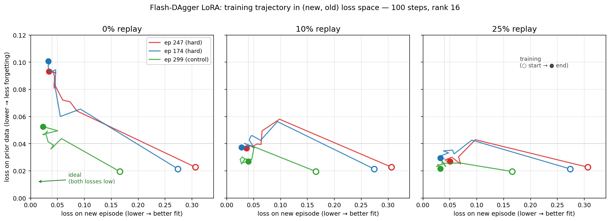
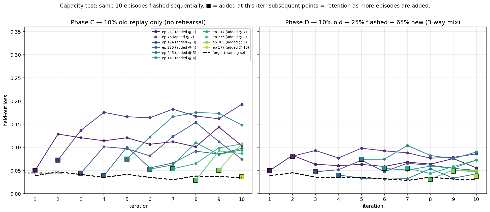
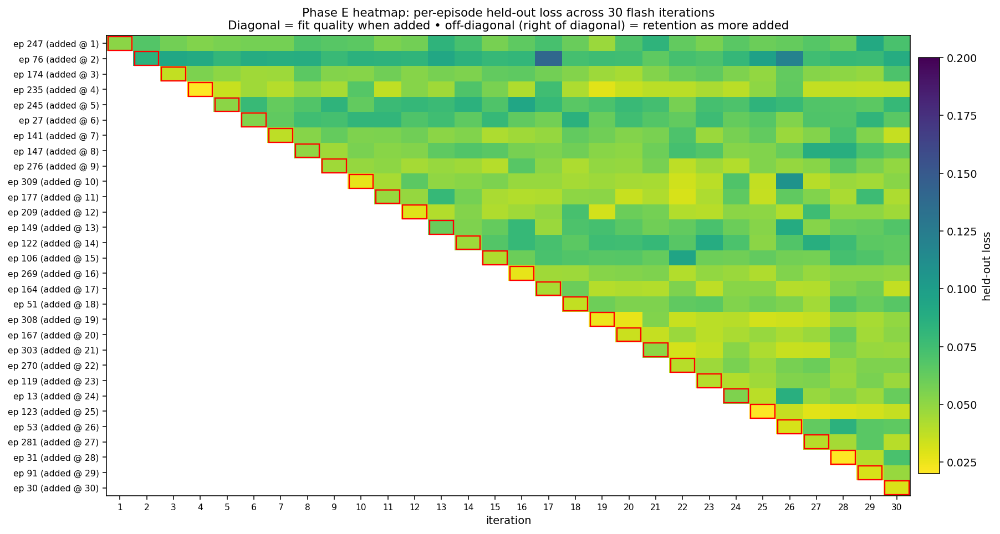
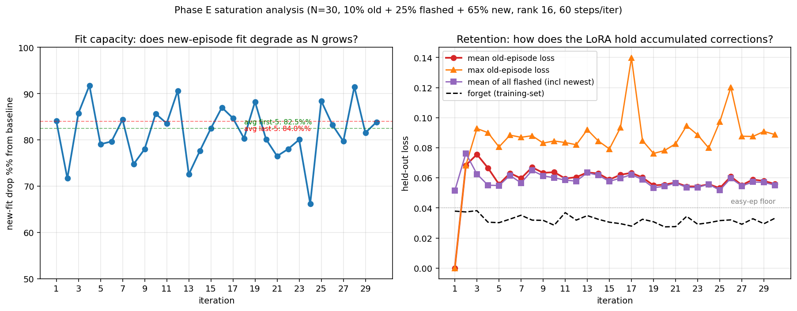
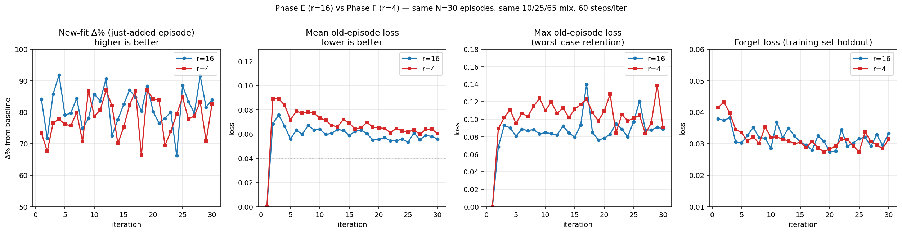

# Flash-DAgger with LoRA on HVLA

**One-line idea:** when an operator demos a correction during deployment, attach a small (1.7M-param, 1.75% of model) LoRA adapter to the frozen S1 decoder, train ~100 steps on a mix of fresh demo + prior data, hot-swap into the policy. **Replay percentage is the single knob** that trades fit speed against forgetting.

## Why this works architecturally

- **Frozen backbone + LoRA on decoder** — DINOv2 + obs encoder stay untouched (already adapted by pretraining). Only attention Q/K/V/O + FFN of the 6 decoder layers carry learnable rank-16 deltas.
- **Action-chunking amplifies signal** — one demo frame yields supervision over 50 actions, so 200–400 fresh frames are enough to fit cleanly.
- **Frozen base = built-in safety** — the LoRA can be discarded or merged at any time. Prior knowledge never overwritten.

## What we measured (offline, eval set, 3 hand-curated hard episodes)

100 LoRA steps per config, rank 16, lr 2e-4, mixed batches at varying replay %:



**How to read:** each curve is one episode's training trajectory. ○ = baseline (step 0), ● = step 100. x-axis is loss on the new episode (the correction); y-axis is loss on prior data (forgetting). The bottom-left corner is the goal — both losses low. With **0% replay**, trajectories shoot up (forgetting climbs fast). With **25% replay**, they hug the floor — fit lands without breaking the rest.

| replay % (per batch from prior data) | fit drop on new episode | drift on prior data | net effect |
|---|---|---|---|
| **0%** | **−87%** (best fit) | **+283%** (catastrophic) | model masters new case, breaks old |
| **5%** | −85% | +89% | most of the safety, near-full fit |
| **10%** | **−85%** | **+58%** | balanced — fit ≈ forget loss |
| **25%** | −84% | **+22%** (safest) | fit barely weaker, forgetting nearly gone |

(Each cell is mean across the 3 episodes; ranges in [phase_b/summary.csv](phase_b/summary.csv).)

## Absolute scale (so % numbers don't mislead)

```
Phase A loss landscape across 323 eval episodes:
  easy episodes        ~0.030–0.040
  median               ~0.127
  hard tail (picks)    0.27–0.43
  worst (demo errors)  0.46–1.16
```

After 10% replay flash on ep 247: **fit_val 0.306 → 0.037**, **forget 0.023 → 0.037**. The episode moved from "tail" to "easy"; prior data went from "excellent" to "easy." Both fine.

## Recommended operator UX

| Phase | replay % | rationale |
|---|---|---|
| **Inner flash cycle** (per intervention) | 10% | fastest fit + balanced safety; held-out fit-val ≈ prior-val loss |
| **Consolidation** (commit LoRA → merged base) | 25% | minimize drift before shipping new base; only ~5% slower fit |
| **Skip entirely** | 0% | +300% drift on prior data is unacceptable |

**Stopping signal for the operator:** fit-val MSE plateaus at the demo-noise floor (~0.03–0.04 in our setup). Track prior-val MSE in parallel as a tripwire — if it drifts >50% above baseline, raise replay % or stop.

## Cost of one flash cycle

| Setup | wall time per 100 steps |
|---|---|
| Live operator demo (frames already in RAM) on 5090 | **~30–60 s** |
| Same on cloud H100 | **~15–25 s** |
| This offline experiment (pyav video decode bottleneck) | ~11 min |

Compute is cheap (~$0.50–1 on cloud H100 per cycle, pennies on local 5090). The data-pipeline matters more than hardware tier.

## Phase C / D — capacity test (10 episodes flashed sequentially)

Same LoRA carried across iterations. Phase C uses only 10% old-data replay (no rehearsal of past corrections). Phase D adds a third pool: previously-flashed episodes get rehearsed in every batch.



| iter | trained ep | new fit Δ | old_avg | old_worst | forget Δ |
|---|---|---|---|---|---|
| 1 | 247 | −85% | — | — | +86% |
| 2 | 76 | −76% | 0.129 | 0.129 | +127% |
| 3 | 174 | −83% | 0.129 | 0.137 | +100% |
| 4 | 235 | −85% | 0.130 | 0.176 | +70% |
| 5 | 245 | −70% | 0.121 | 0.166 | +101% |
| 6 | 141 | −78% | 0.106 | 0.164 | +69% |
| 7 | 147 | −76% | 0.119 | 0.182 | +46% |
| 8 | 276 | **−88%** | 0.123 | 0.175 | +83% |
| 9 | 309 | −71% | 0.119 | 0.174 | +80% |
| 10 | 177 | −84% | 0.113 | 0.193 | +63% |

**Findings:**

1. **LoRA capacity does NOT saturate at 10 episodes.** New-episode fit stays in −70 to −88% range across all 10 iterations. Rank-16 has plenty of room for at least 10 distinct corrections in this setup.
2. **Old episodes drift but settle at an equilibrium ~0.11–0.13 (vs ~0.27 baseline).** They never fall back to baseline-bad — the LoRA partially generalizes across corrections — but they also never stay at peak fit (~0.04–0.05) without rehearsal.
3. **Old_worst climbs to 0.19** by iter 10 (~ep 247, the oldest never-rehearsed correction). One specific episode can drift much further than the average suggests.
4. **Forget-on-training-data behaves well** (+46–127% range). The 10% training-set replay protects the broad task; what it doesn't protect is *previously-flashed eval episodes*.

**The retention gap:** with peak fit at ~0.05 and unrehearsed equilibrium at ~0.12, **prior corrections lose about 60% of their value** when the next correction is flashed without rehearsing them. Operator pays this in degraded performance on previously-corrected cases.

**Phase D ratio:** 10% old (training-set replay) + 25% flashed (uniform across all previously-flashed eval episodes) + 65% new (current episode's training portion).

**Side-by-side numbers:**

| iter | trained_ep | new_fit (C / D) | old_avg (C / D) | old_worst (C / D) | forget (C / D) |
|---|---|---|---|---|---|
| 1 | 247 | 0.050 / 0.050 | — | — | 0.039 / 0.039 |
| 2 | 76 | 0.072 / 0.081 | 0.129 / **0.083** | 0.129 / **0.083** | 0.047 / 0.045 |
| 3 | 174 | 0.044 / 0.047 | 0.129 / **0.078** | 0.137 / **0.093** | 0.041 / 0.036 |
| 4 | 235 | 0.039 / 0.040 | 0.130 / **0.063** | 0.176 / **0.077** | 0.035 / 0.035 |
| 5 | 245 | 0.074 / 0.074 | 0.121 / **0.067** | 0.166 / **0.098** | 0.042 / 0.035 |
| 6 | 141 | 0.053 / 0.054 | 0.106 / **0.061** | 0.164 / **0.092** | 0.035 / 0.032 |
| 7 | 147 | 0.054 / 0.055 | 0.119 / **0.068** | 0.182 / **0.104** | 0.030 / **0.028** |
| 8 | 276 | 0.029 / 0.031 | 0.123 / **0.063** | 0.175 / **0.082** | 0.038 / 0.035 |
| 9 | 309 | 0.051 / 0.049 | 0.119 / **0.060** | 0.174 / **0.078** | 0.037 / 0.031 |
| 10 | 177 | 0.036 / 0.038 | 0.113 / **0.063** | 0.193 / **0.090** | 0.034 / **0.030** |

**Findings:**

1. **Three-way mix roughly halves old_avg and old_worst across all iterations** without changing new fit. The "−60% retention loss" from Phase C drops to **−25–30% retention loss** in Phase D — past corrections sit near their peak-fit value instead of drifting back toward "median difficulty."
2. **New-fit penalty is statistically zero.** Final-iter Δ between C and D is within ±2 percentage points across all 10 episodes. The 25% rehearsal slot is "free" capacity — it doesn't slow the fit on the new episode in any measurable way.
3. **Forget-on-training-data also improves slightly** (Phase D averages ~10–30 percentage points lower drift than C). Sampling diverse rehearsal subjects acts as a second-order regularizer.
4. **At iter 10 with 9 episodes in the flashed pool**, each prior episode contributes ~2.8% of each batch (~2 samples per batch of 64). That's enough to keep its loss within ~2× of peak fit. Per-episode rehearsal density goes down as more episodes accumulate, but the cumulative protection is strong enough to hold.
5. **LoRA r=16 still does not saturate at 10 episodes with rehearsal.** Same conclusion as Phase C: there's substantial unused capacity. Pushing N further is the next experiment.

## Phase E — capacity stress test (N=30, three-way mix)

Ran Phase D's recipe (10% old + 25% flashed + 65% new) on 30 sequential episodes (filtered: rank ≥ 6 from Phase A, frames in [150, 500]). Total ~7,000 fresh frames ≈ 3.9 minutes of teleop at 30 Hz.





| metric | first-5 iters | last-5 iters | slope |
|---|---|---|---|
| new-fit Δ% | 82.5% | **84.0%** | +1.5 pp (slight *improvement*) |
| mean old-ep loss | 0.056 (@iter 5) | 0.056 (@iter 30) | flat |
| max old-ep loss | 0.080 | 0.089 | +0.01 |
| forget (training-set) | 0.038 (@iter 1) | 0.033 (@iter 30) | −0.005 (improving) |

**Headline:** **rank-16 LoRA with three-way mix shows no saturation through 30 episodes / ~4 min of demo data.** Fit quality holds, mean retention holds, even max-old-loss stays bounded.

**Operational implications:**
- One LoRA adapter is plenty for ~30+ flash corrections within a session — no need to merge/reset mid-session.
- Storage and sync cost is **constant** in the number of corrections (LoRA delta ~2.4 MB regardless of N).
- The capacity ceiling is **above 30** — to find it, we'd need to push to N=60 or N=100.

**Open question on demo-data scaling:** the 30 episodes here are ~200 frames each (short demos). A complementary test would use *longer* demos (e.g. 5 episodes × 1500 frames) to measure capacity per *frame* rather than per *episode*. Both axes matter for operator UX.

## Phase F — rank=4 saturation test

Same setup as Phase E but rank=4 (0.43M trainable, 4× smaller than r=16).



| metric (last-5 iters avg) | r=16 | r=4 | gap |
|---|---|---|---|
| new-fit Δ% | **84.0%** | 78.6% | +5.4 pp r=16 better |
| mean old loss | **0.058** | 0.062 | +8% r=4 worse |
| max old loss (peak) | 0.140 | 0.138 | tied |
| forget loss | 0.031 | 0.031 | tied |

**Key result:** r=4 *doesn't catastrophically saturate at N=30.* It just operates at a small consistent quality discount (~5–8%). No cliff, no breakdown. Both ranks hit identical peak old-loss (~0.14) and identical forget loss — the structural failure modes are interference-bounded, not capacity-bounded.

**Practical implication:** there's a real Pareto curve.
- r=16 is the recommended default — best fit + retention at no wall-time cost
- r=4 is viable as a low-storage / low-sync alternative — 0.8 MB sync delta vs 3.3 MB, with a 5% fit penalty
- r=8 (untested) likely sits between, may be the sweet spot for sync-constrained deployments

The bench already showed wall time is flat across r=4/8/16/32/64. So **rank choice is governed by quality and sync size, not compute.** If sync is the binding constraint (e.g., low-bandwidth tether), drop to r=4. Otherwise stay at r=16.

## What's still TODO

1. **Verify on the robot** — held-out MSE is a proxy; real test is whether the rolled-out policy succeeds.
2. **Disaster-aware demo filtering** — Phase A's loss-only ranking mixes "model genuinely struggles" with "demo is incoherent." A model-prediction-vs-demo cosine score should automate the visual filtering we did by hand.
3. **Streaming flash architecture** — async actor/learner with weight hot-swap at chunk boundaries; LoRA delta is ~2.4 MB so cloud sync is sub-second.
4. **Per-correction LoRA stack vs continuous adapter** — keep N adapters and dispatch, or merge eagerly. Tradeoff: rollback granularity vs storage.
5. **Push N further (≥60)** — Phase E shows no saturation at N=30. The actual ceiling is unknown; needs N=60 or N=100 to find. (Wall time: ~2.5 hr at N=60, ~5 hr at N=100.)
6. **Demo-length scaling** — Phase E used short demos (~200 frames each). Test 5 episodes × ~1500 frames to measure capacity per *frame* rather than per *episode*; the operator UX depends on both axes.
7. **Sweep flashed-% ratios** — try 15% and 35% to bracket the 25% point. Phase E suggests 25% is plenty even at N=30; the lower bound where retention breaks is interesting.
8. **Recency-weighted rehearsal** — Phase D/E weight all flashed episodes equally; weighting recent ones higher (or harder ones more, by current loss) might further compress retention or extend the capacity ceiling.
