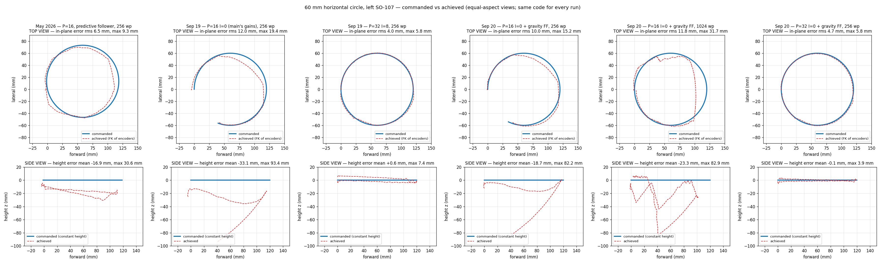
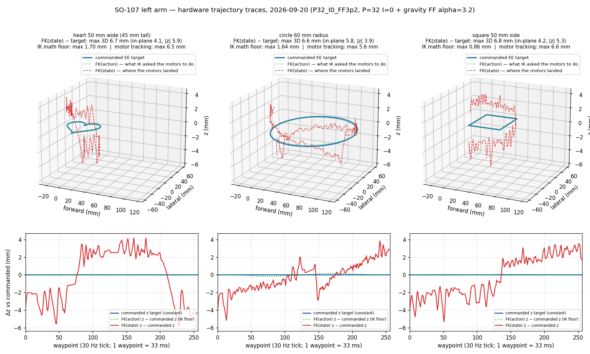
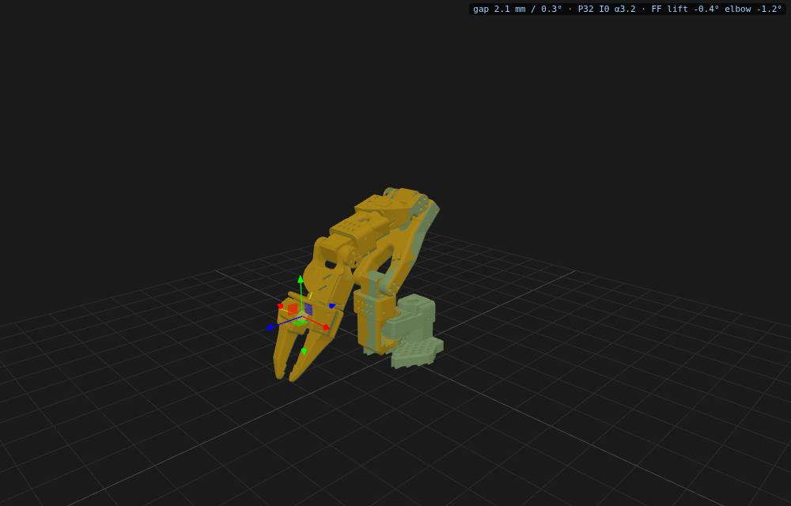

# Gravity sag on the SO-107, and what removes it

The arm settles below where it is told to be, more the further it reaches. First seen in
May 2026 on the Cartesian teleop bench (a horizontal circle drooped 17 mm on average); it
is why FK-based control on this arm never landed where the model said.

Everything below is measured with the encoders only: FK of the present joints against FK of
the commanded joints, on the left arm of the white pair, 2026-09-19/20. No camera, so link
flexure or slack between the encoder and the fingertip is not in these numbers.

## Where it comes from

The STS3215's onboard loop is position-only: goal in, torque proportional to error out
(the follower halves Feetech's factory P to 16 for leader teleop, and leaves I at 0). A
steady gravity load therefore leaves a steady error, `droop = -alpha * tau_g`, with
`alpha` the servo's compliance at the gains in use. At the follower's defaults:

| reach from base                                 | 165 mm  | 195   | 225   | 255   |
| ----------------------------------------------- | ------- | ----- | ----- | ----- |
| tip drop, gripper down (`so107_gravity_sag.py`) | −1.5 mm | −12.4 | −14.5 | −16.9 |

Raised posture, 226→286 mm reach: −8 → −23 mm, and the elbow stopped 13.6° short of a
commanded start pose — the "never gets there" regime is P-limited, not torque-limited (at
P=32 the same move lands within 0.7°). In joint space the whole effect is 1–4° on the
shoulder-lift and elbow.

Fitting the measured droop at 30 static stations against pinocchio's gravity term on this
URDF gives **one compliance for every loaded joint at P=32: ≈3.2° per N·m** (lift 3.1,
elbow 3.2, wrist 3.4), roughly double at P=16. That is the feed-forward gain. The model
explains the mean droop; the remaining ±1° station-to-station scatter is stiction
hysteresis (the same pose reads +0.2° arriving one way and +3.9° the other), which no
function of pose can cancel.

## What removes it

`goal = q_desired + alpha * tau_g(q_desired)` — the position-mode "virtual displacement"
every gravity scheme on these servos uses (phospho ships it to float a leader arm; here it
is applied to the _desired_ pose to hold a trajectory). It lives in the follower
(`gravity_ff_alpha`, `gravity_ff_arm` in the SO follower config) so teleop, record, replay
and the jog all get it, computed by `GravityFeedForward` from the vendored URDF. Servo gains
are follower config fields too (`p_coefficient`, `i_coefficient`, `d_coefficient`), with the
old defaults unchanged.

60 mm horizontal circle at constant commanded height, May protocol
(`so107_cartesian_shapes.py`, 256 waypoints at 30 Hz):

| configuration                        | in-plane rms / max | height mean / max                                       |
| ------------------------------------ | ------------------ | ------------------------------------------------------- |
| May 2026, P=16, predictive follower  | 6.5 / 9.3 mm       | −16.9 / 30.6 mm                                         |
| P=16 I=0 (follower defaults)         | 12.0 / 19.4        | −33.1 / 93.4, lift stalled at waypoint 207              |
| P=16 + feed-forward (α=6)            | 10.0 / 15.2        | −18.7 / 82.2, stalled at 211                            |
| P=32 I=8                             | 4.0 / 5.8          | +0.6 / 7.4 (integrator windup drift on the return half) |
| **P=32 + feed-forward (α=3.2), I=0** | **4.7 / 5.8**      | **−0.1 / 3.9**                                          |





Two facts the table encodes:

- Feed-forward at P=16 does not work: the joint is too soft to track the circle's upward
  lift swing (stalls 35° behind) and, run four times slower, creeps into stiction instead
  (−23 mm). A few degrees of goal lead cannot substitute for stiffness. It does hold the
  gentler heart (max 9 mm vs 37).
- At P=32 the feed-forward alone gives the flat result without the integrator's ripple and
  windup: the residual is a ±2–3 mm band that flips sign with the direction of travel — the
  stiction hysteresis — plus ~1 mm of stream ripple, nothing accumulating.

## Seeing it: the jog panel

Servo tab → _Jog_: connect one arm (server-owned, bus only), drag the gizmo on the gripper
tip in the URDF tile (T translate, R rotate). The yellow robot is the encoders; the cyan
ghost is the commanded pose and fades in with the gap (invisible under 2 mm, solid at
20 mm); the red arrow is the gap at true length. With P=32 and α=3.2 the ghost stays
invisible through lifts, reaches and ±30° pitches (gap 0.8–3.8 mm on the 2026-09-20 API
run); with the defaults it appears as soon as the arm leaves its fold.



## Not in this change

- Untested under leader teleop: P=32 was halved to 16 for a reason ("shakiness"); whether
  the feed-forward makes P=32 acceptable there is a rig test to run.
- Encoder-side only; a camera check of the fingertip is the remaining independent proof.
- The URDF masses are set by link role from the SO-101 description (the export carried
  uniform-density placeholders); `alpha` absorbs the overall scale, but per-link ratios are
  borrowed, not measured.
- Compliance / hand-guiding needs the torque-level version (PWM mode); this is position
  accuracy only.

## Reproduce

```bash
# stations along a radial line + circle, encoders vs command (start pose must be forward of the fold)
PYTHONPATH=src python benchmarks/so107_gravity_sag.py --start-joints -45 74 -41
PYTHONPATH=src python benchmarks/so107_gravity_sag.py --p 32 --ff-alpha 3.2

# the May protocol at any gains; then the comparison figure
PYTHONPATH=src python benchmarks/so107_cartesian_shapes.py --tag baseline
PYTHONPATH=src python benchmarks/so107_cartesian_shapes.py --p 32 --ff-alpha 3.2 --tag P32_FF
git show feat/quest-vr-teleop:src/lerobot/teleoperators/quest_vr/docs/hardware/run.npz > /tmp/may.npz
PYTHONPATH=src python benchmarks/so107_cartesian_shapes.py --planview outputs/gravity_sag/shapes_* --old-npz /tmp/may.npz
```
